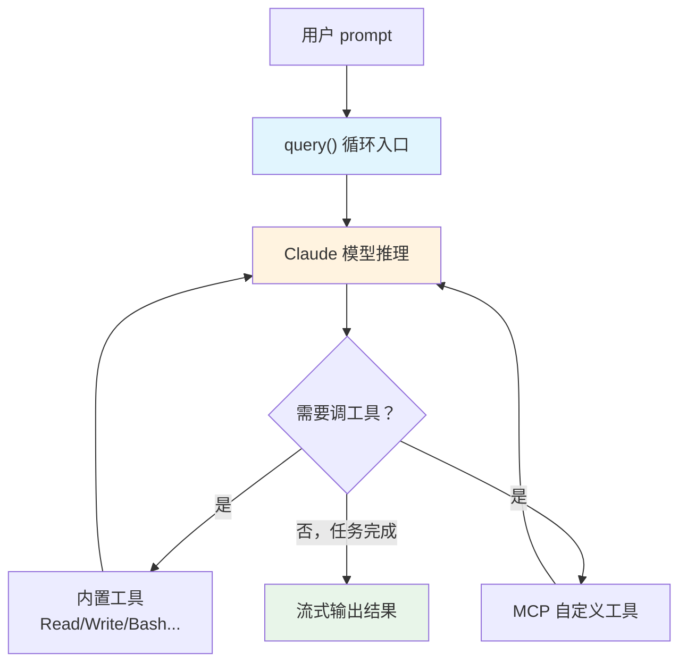

# Claude Agent SDK（Anthropic）

## 基础概念

Claude Agent SDK 是 Anthropic 官方推出的 **Agent 编排框架（Agent Orchestration Framework）**，用来在 Claude 模型之上构建自主智能体（Autonomous Agent）。简单说：你给 Claude 一句话任务，SDK 自动驱动一个"推理 → 调用工具 → 拿到结果 → 继续推理"的循环，直到任务完成。

和直接调 Anthropic Messages API 相比，SDK 帮你做了三件事：**把工具执行的循环自动跑起来**（不用自己写 while 循环拼消息）、**自带一批常用工具**（文件读写、命令执行、网络搜索，开箱即用）、**原生支持 MCP 协议扩展自定义工具**（进程内注册，不用启外部进程）。

> **命名变更提示**：早期版本叫 "Claude Code SDK"，`ClaudeCodeOptions` 等类名在 0.1.0 版本后统一重命名为 `ClaudeAgentOptions`。如果你看到旧教程用 `ClaudeCodeOptions`，对应的就是现在的 `ClaudeAgentOptions`。

### 核心要素

| 要素 | 作用 |
|------|------|
| **query() 循环** | SDK 的主入口，异步生成器驱动"推理 → 工具调用 → 结果回传"的闭环，直到模型自行结束 |
| **内置工具集** | 预集成 8 个通用工具（Read/Write/Edit/Bash/Glob/Grep/WebSearch/WebFetch），无需配置 |
| **MCP 自定义工具** | 通过 `@tool` 装饰器 + `create_sdk_mcp_server()` 在进程内注册业务工具，扩展 Agent 能力 |

### query() 循环

`query()` 是 Claude Agent SDK 的核心入口函数。它返回一个**异步生成器（async generator）**，你用 `async for` 逐条接收 Agent 执行过程中产出的消息。这些消息包括 Claude 的推理文本、工具调用请求、工具执行结果和最终回答。

整个循环的内部逻辑：
1. 把用户 prompt 发给 Claude 模型
2. Claude 返回内容 —— 如果包含 `tool_use` 类型的块，SDK 自动执行对应工具
3. 工具执行结果以 `tool_result` 格式回传给 Claude
4. Claude 基于工具结果继续推理，重复步骤 2-3
5. 直到 Claude 返回 `stop_reason: end_turn`（不再调用工具），循环结束

```python
import anyio
from claude_agent_sdk import query, ClaudeAgentOptions, AssistantMessage, TextBlock, ToolUseBlock

async def main():
    async for message in query(
        prompt="读取当前目录下的 README.md 并总结内容",
        options=ClaudeAgentOptions(allowed_tools=["Read"]),
    ):
        if isinstance(message, AssistantMessage):
            for block in message.content:
                if isinstance(block, TextBlock):
                    print(block.text)
                elif isinstance(block, ToolUseBlock):
                    print(f"调用工具: {block.name}({block.input})")

anyio.run(main)
```

### 内置工具集

SDK 预集成了 8 个通用工具，覆盖文件操作、命令执行和网络能力：

| 工具 | 功能 |
|------|------|
| **Read** | 读取文件内容 |
| **Write** | 创建或覆盖文件 |
| **Edit** | 基于查找-替换的精确修改 |
| **Bash** | 执行 shell 命令 |
| **Glob** | 按通配符模式查找文件 |
| **Grep** | 正则表达式搜索文件内容 |
| **WebSearch** | 网络搜索 |
| **WebFetch** | 获取网页内容并转为 Markdown |

通过 `ClaudeAgentOptions` 的 `allowed_tools` 参数控制哪些工具可用，SDK 自动向 Claude 暴露工具定义，不需要手写 JSON Schema。

### MCP 自定义工具

当内置工具不够用时，用 `@tool` 装饰器定义业务工具，再通过 `create_sdk_mcp_server()` 注册为进程内 MCP 服务。MCP 工具的命名格式是 `mcp__{服务名}__{工具名}`。

```python
from claude_agent_sdk import tool, create_sdk_mcp_server

@tool("get_weather", "查询城市天气", {"city": str, "date": str})
async def get_weather(args):
    return {"content": [{"type": "text", "text": f"{args['city']} {args['date']}：晴，25°C"}]}

server = create_sdk_mcp_server(name="my-tools", version="1.0.0", tools=[get_weather])
# 在 options 中配置：allowed_tools=["mcp__my-tools__get_weather"]
```

### 核心要素关系图



`query()` 启动循环 → Claude 推理决策 → 需要信息就调工具 → 工具结果回传 → Claude 继续推理 → 循环直到完成。

## 基础用法

安装（需要 Python 3.10+）：

```bash
pip install claude-agent-sdk
```

> **前置条件**：需要在 [Anthropic Console](https://console.anthropic.com/account/keys) 获取 API Key，设置环境变量 `ANTHROPIC_API_KEY`。SDK 安装时会自动捆绑 Claude Code CLI。

最小可运行示例（基于 claude-agent-sdk==0.1.50 验证，截至 2026-03）：

```python
import anyio
from claude_agent_sdk import query, ClaudeAgentOptions, AssistantMessage, ResultMessage
from claude_agent_sdk import TextBlock, ToolUseBlock

async def main():
    print("Agent 启动，开始处理任务...")
    print("-" * 50)

    async for message in query(
        prompt="在当前目录创建一个 hello.txt，内容写 'Hello from Claude Agent SDK'",
        options=ClaudeAgentOptions(
            allowed_tools=["Write"],   # 只开放 Write 工具
            max_turns=3,               # 限制最大轮次，防止无限循环
        ),
    ):
        if isinstance(message, AssistantMessage):
            for block in message.content:
                if isinstance(block, TextBlock):
                    print(f"[思考] {block.text}")
                elif isinstance(block, ToolUseBlock):
                    print(f"[工具] {block.name} -> {block.input}")
        elif isinstance(message, ResultMessage):
            print(f"[完成] 任务结束")

    print("-" * 50)
    print("Agent 退出")

if __name__ == "__main__":
    anyio.run(main)
```

预期输出：

```text
Agent 启动，开始处理任务...
--------------------------------------------------
[思考] 我来创建这个文件。
[工具] Write -> {'file_path': 'hello.txt', 'content': 'Hello from Claude Agent SDK'}
[思考] 文件 hello.txt 已创建完成。
[完成] 任务结束
--------------------------------------------------
Agent 退出
```

`ClaudeSDKClient` 适合需要多轮交互的场景（query 适合一次性任务）：

```python
import anyio
from claude_agent_sdk import ClaudeSDKClient, ClaudeAgentOptions

async def main():
    options = ClaudeAgentOptions(allowed_tools=["Read", "Bash"])

    async with ClaudeSDKClient(options=options) as client:
        # 第一轮：读取文件
        await client.query("读取当前目录的 README.md")
        async for msg in client.receive_response():
            print(msg)

        # 第二轮：基于上轮上下文继续操作
        await client.query("用一句话总结刚才读到的内容")
        async for msg in client.receive_response():
            print(msg)

anyio.run(main)
```

## 同类工具对比

| 维度 | Claude Agent SDK | OpenAI Agents SDK | Google ADK |
|------|-----------------|-------------------|-----------|
| 核心定位 | Claude 模型专用编排框架，内置工具 + 流式循环 | 轻量级多代理框架，Handoff + Guardrails | Google 生态集成，多 Agent 编排 + 云端部署 |
| 语言支持 | Python, TypeScript | Python, TypeScript | Python, Node.js |
| 内置工具 | 丰富（8 个：文件/命令/搜索） | 需自定义 | 部分（搜索、代码执行） |
| 多 Agent 协作 | 通过工具组合实现 | 原生 Handoff 机制 | 原生编排（Sequential/Parallel/Loop） |
| 扩展机制 | MCP 协议（进程内 + 外部进程） | 自定义 Tool 函数 | Google Cloud 服务集成 |
| 学习曲线 | 低（API 简洁，核心就一个 query 函数） | 低（文档齐全） | 中（需了解 Google Cloud 生态） |

核心区别：

- **Claude Agent SDK**：解决「一个 Agent 怎么自主完成任务」—— 模型绑定 Claude，强项是内置工具丰富、开箱即用
- **OpenAI Agents SDK**：解决「多个 Agent 怎么协作」—— 原生 Handoff 路由机制，适合需要精细分工的多代理场景
- **Google ADK**：解决「企业级 Agent 怎么部署」—— 深度绑定 Google Cloud 生态，适合大规模云端部署

## 常见误区

| 误区 | 准确理解 |
|------|----------|
| Claude Agent SDK 可以接别家的模型 | 不行。SDK 的工具定义和消息格式绑定 Anthropic API，只能搭配 Claude 模型使用。工具函数本身可以调外部服务，但推理引擎只能是 Claude |
| Agent 循环会无限跑下去 | 不会。Claude 在判断任务完成后会返回 `stop_reason: end_turn` 停止循环。同时可通过 `max_turns` 参数设置硬性上限 |
| 所有工具都要自己写 JSON Schema | 内置工具无需配置；MCP 自定义工具通过 `@tool` 装饰器自动生成 Schema。只有直接调 Messages API 才需要手写 |

## 优劣势分析

| 优势 | 劣势 |
|------|------|
| 内置 8 个常用工具，文件操作 + 命令执行 + 网络搜索开箱即用 | 绑定 Claude 模型，不支持其他 LLM |
| API 极简，核心就一个 `query()` 函数，学习成本低 | 多 Agent 协作能力偏弱，没有原生 Handoff 机制 |
| MCP 协议支持进程内自定义工具，扩展方便 | 仍处于 Alpha 阶段（0.1.x），API 可能有 breaking change |
| 流式输出原生支持，可实时观察 Agent 推理过程 | 依赖 Claude Code CLI，安装体积较大 |

## 思考题

<details>
<summary>初级：query() 函数和直接调 Anthropic Messages API 有什么区别？</summary>

**参考答案：**

Messages API 是「消息级别」的调用 —— 发一条请求，拿一条响应，如果响应里包含工具调用，你得自己执行工具、拼消息、再发请求，手动实现循环。

`query()` 是「任务级别」的调用 —— 你给一句话任务，SDK 自动跑"推理 → 工具调用 → 结果回传 → 继续推理"的循环，直到任务完成。内置工具的执行、消息历史的维护、错误的重试全部自动处理。

简而言之：API 是零件，SDK 是组装好的机器。

</details>

<details>
<summary>中级：如何用 MCP 自定义工具扩展 Claude Agent SDK 的能力？</summary>

**参考答案：**

三步完成：
1. 用 `@tool` 装饰器定义工具函数，指定名称、描述和参数类型
2. 用 `create_sdk_mcp_server()` 创建进程内 MCP 服务，注册工具列表
3. 在 `ClaudeAgentOptions` 中通过 `mcp_servers` 关联服务，通过 `allowed_tools` 授权工具（格式：`mcp__{服务名}__{工具名}`）

MCP 工具在进程内运行，不需要启动外部进程。Claude 在推理时可以像使用内置工具一样调用自定义工具。

</details>

<details>
<summary>中级：在生产环境中使用 Claude Agent SDK，需要注意哪些关键问题？</summary>

**参考答案：**

四个关键点：
1. **轮次限制**：通过 `max_turns` 设置硬性上限，防止模型陷入无效循环消耗 token
2. **工具权限最小化**：`allowed_tools` 只开放任务必需的工具，生产环境慎用 Bash（可执行任意命令）
3. **上下文窗口管理**：长对话需要定期压缩历史消息，避免 token 超限。混合策略（核心上下文常驻 + 工作上下文定期压缩）效果最好
4. **成本监控**：记录每次调用的 token 用量和工具调用次数，模型分级策略（简单任务用 Haiku，复杂任务用 Sonnet/Opus）可显著降低成本

</details>

## 参考资料

1. GitHub 仓库（Python）：https://github.com/anthropics/claude-agent-sdk-python
2. GitHub 仓库（TypeScript）：https://github.com/anthropics/claude-agent-sdk-typescript
3. PyPI 包页面：https://pypi.org/project/claude-agent-sdk/（最新版本 0.1.50，2026-03-20 发布）
4. Anthropic Tool Use 文档：https://docs.anthropic.com/en/docs/build-with-claude/tool-use/overview
5. Building Effective Agents — Anthropic 官方博客：https://www.anthropic.com/engineering/building-effective-agents
