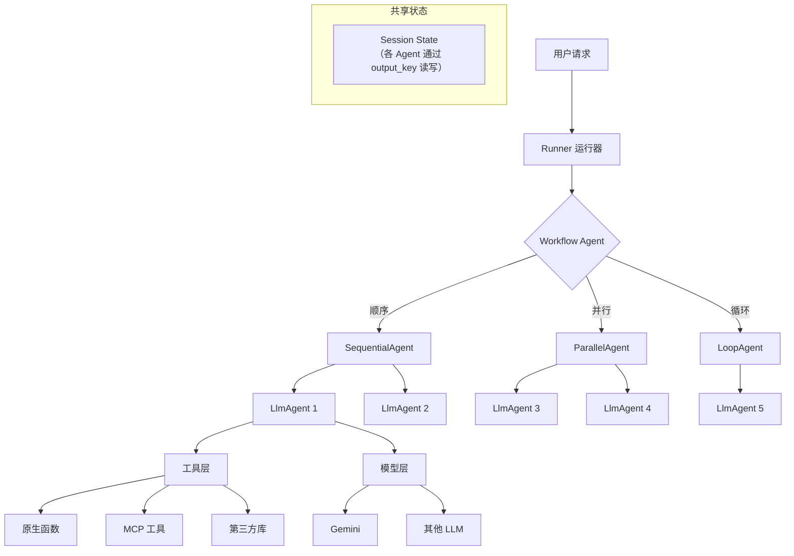

# Google ADK（Agent Development Kit）

## 基础概念

Google ADK 是 Google 在 2025 年 4 月 Cloud Next 大会上开源的 **Agent 开发套件（Agent Development Kit）**，用代码优先（Code-first）的方式构建、评估和部署 AI Agent（智能体）。简单说：你用普通 Python 类和函数定义 Agent 的行为和工具，ADK 负责编排执行、状态管理和部署上线。

与 LangChain 等框架的区别在于：ADK 从设计之初就把**多 Agent 编排**作为一等公民——内置了顺序执行、并行执行、循环控制三种工作流 Agent（Workflow Agent），不用手写调度逻辑。同时它是模型无关（Model-agnostic）的，虽然对 Gemini 做了优化，但也能接其他 LLM。

### 核心要素

| 要素 | 作用 |
|------|------|
| **LlmAgent（LLM 智能体）** | 核心构建单元，封装一个 LLM + 工具集 + 系统指令，是所有 Agent 的基础 |
| **Workflow Agent（工作流智能体）** | 编排多个子 Agent 的执行顺序，包含 Sequential / Parallel / Loop 三种模式 |
| **Tool（工具）** | 普通 Python 函数即可作为工具，ADK 自动解析函数签名和 docstring |
| **Runner（运行器）** | 负责实际执行 Agent，管理会话（Session）和状态，是 Agent 的"启动器" |

### LlmAgent（LLM 智能体）

LlmAgent 是 ADK 中最核心的组件。一个 LlmAgent 封装了三样东西：(1) 一个 LLM 后端（如 `gemini-2.5-flash`），负责推理和决策；(2) 一组工具函数，赋予 Agent 操作外部系统的能力；(3) 一段系统指令（instruction），定义 Agent 的角色和行为规则。

```python
from google.adk.agents import LlmAgent

# 定义工具：普通 Python 函数，ADK 通过 docstring 自动识别参数
def get_weather(city: str) -> str:
    """查询指定城市的天气

    Args:
        city: 城市名称
    """
    return f"{city}：晴，25°C"

# 创建 Agent
weather_agent = LlmAgent(
    name="weather_agent",
    model="gemini-2.5-flash",
    instruction="你是天气查询助手，使用 get_weather 工具回答用户的天气问题。",
    tools=[get_weather],
)
```

### Workflow Agent（工作流智能体）

ADK 提供三种预定义的工作流 Agent，用于编排多个子 Agent 的执行方式。这些工作流 Agent 本身不调用 LLM，只负责调度，因此执行逻辑是确定性的。

- **SequentialAgent（顺序执行）**：子 Agent 按列表顺序依次运行，前一个的输出通过 `output_key` 写入共享状态，后一个可以读取
- **ParallelAgent（并行执行）**：所有子 Agent 同时启动，适合互不依赖的并行任务
- **LoopAgent（循环执行）**：子 Agent 反复执行，直到调用 `exit_loop` 工具或达到最大迭代次数

```python
from google.adk.agents import SequentialAgent, LlmAgent

# 分析 Agent：负责分析用户需求
analyzer = LlmAgent(
    name="analyzer",
    model="gemini-2.5-flash",
    instruction="分析用户输入，提取核心需求。",
    output_key="analysis_result"
)

# 执行 Agent：基于分析结果执行任务
executor = LlmAgent(
    name="executor",
    model="gemini-2.5-flash",
    instruction="根据 {analysis_result} 执行具体任务，给出最终结果。",
)

# 顺序流水线：先分析后执行
pipeline = SequentialAgent(
    name="pipeline",
    description="先分析需求，再执行任务",
    sub_agents=[analyzer, executor]
)
```

### Tool（工具）

ADK 的工具系统支持多个层次：

- **原生函数工具**：任何带类型注解和 docstring 的 Python 函数都能直接作为工具
- **MCP 工具**：支持 Model Context Protocol（模型上下文协议），可接入标准化的外部工具服务
- **第三方库工具**：兼容 LangChain、LlamaIndex 等框架的工具
- **内置工具**：ADK 自带 Google Search、代码执行、`exit_loop`（退出循环）等预构建工具

### 核心要素关系图



Runner 接收用户请求后，将其分发给 Agent 或 Workflow Agent。Workflow Agent 按照编排规则调度子 Agent，子 Agent 调用 LLM 进行推理并通过工具与外部系统交互，所有 Agent 通过 Session State（会话状态）共享数据。

## 基础用法

安装：

```bash
pip install google-adk
```

需要一个 Gemini API Key，在 [Google AI Studio](https://aistudio.google.com/app/apikey) 免费获取，然后设置环境变量：

```bash
export GOOGLE_API_KEY="你的API密钥"
```

最小可运行示例（基于 google-adk==1.0.0 验证，截至 2026-03）：

```python
import asyncio
from google.adk.agents import LlmAgent
from google.adk.runners import InMemoryRunner

# 1. 定义工具
def add(a: int, b: int) -> dict:
    """计算两个整数的和

    Args:
        a: 第一个整数
        b: 第二个整数
    """
    return {"result": a + b}

# 2. 定义 Agent
math_agent = LlmAgent(
    name="math_agent",
    model="gemini-2.5-flash",
    instruction="你是数学计算助手，使用 add 工具回答加法问题。",
    tools=[add],
)

# 3. 通过 InMemoryRunner 运行
async def main():
    runner = InMemoryRunner(agent=math_agent)
    events = await runner.run_debug("请计算 15 加 27")
    # run_debug 会自动打印 Agent 的回复

asyncio.run(main())
```

预期输出：

```text
[math_agent] 15 加 27 的结果是 42。
```

也可以用 ADK 自带的 CLI 工具快速运行和调试：

```bash
# 在包含 agent.py 的目录下运行
adk run math_agent

# 启动带 Web UI 的调试界面
adk web
```

## 同类工具对比

| 维度 | Google ADK | OpenAI Agents SDK | Claude Agent SDK |
|------|-----------|-------------------|-----------------|
| 核心定位 | 代码优先的多 Agent 编排框架 | OpenAI 原生 Agent 框架 | Anthropic 官方 Agent SDK |
| 多 Agent 编排 | 原生内置 Sequential/Parallel/Loop | 需手动编排 Handoff 逻辑 | 编排能力相对基础 |
| 模型兼容性 | 模型无关，Gemini 优先 | 主要针对 GPT 系列 | 深度集成 Claude |
| 语言支持 | Python / TypeScript / Go / Java | Python / JavaScript | Python / TypeScript |
| 部署方式 | Vertex AI / Cloud Run / 本地 | OpenAI 平台 | Anthropic API |

核心区别：

- **Google ADK**：编排能力最强，内置三种工作流 Agent，适合需要精确控制多 Agent 协作流程的场景
- **OpenAI Agents SDK**：API 简洁，与 OpenAI 生态深度集成，适合已在 GPT 生态中的团队
- **Claude Agent SDK**：文档清晰，迭代快速，适合重视推理质量和安全性的应用

## 常见误区

| 误区 | 准确理解 |
|------|----------|
| ADK 只能用 Gemini 模型 | ADK 是模型无关的，通过 LiteLLM 等适配层可以接入 OpenAI、Claude、开源模型等 |
| 工具函数越多越好，全部塞给 Agent | 工具过多会增加 LLM 的选择困难，应遵循最小必要原则，每个 Agent 只配与其职责相关的工具 |
| Workflow Agent 内部也用 LLM 做决策 | Sequential / Parallel / Loop Agent 本身不调用 LLM，只做确定性调度。如果需要 LLM 做动态路由，应该用 LlmAgent 的 sub_agents 转交机制 |

## 优劣势分析

| 优势 | 劣势 |
|------|------|
| 内置三种工作流 Agent，多 Agent 编排开箱即用 | 2025 年 4 月才发布，社区生态和教程资源尚在积累中 |
| 四种语言 SDK（Python/TS/Go/Java），覆盖主流技术栈 | 对非 Gemini 模型的支持需要额外配置 LiteLLM 适配层 |
| 与 Vertex AI 深度集成，一键部署到 Google Cloud | Vertex AI 部署依赖 Google Cloud 账号，有一定云平台绑定 |
| 工具定义极简，普通函数 + docstring 即可 | 文档以英文为主，中文资料尚不完善 |

## 思考题

<details>
<summary>初级：ADK 中 LlmAgent 和 Workflow Agent 的区别是什么？为什么要分开？</summary>

**参考答案：**

LlmAgent 封装了 LLM + 工具 + 指令，负责实际的推理和工具调用；Workflow Agent（Sequential / Parallel / Loop）不调用 LLM，只负责按规则调度子 Agent 的执行顺序。

分开的原因是关注点分离：LlmAgent 关心"做什么"，Workflow Agent 关心"怎么组织"。这样每个 Agent 保持单一职责，便于测试和复用。

</details>

<details>
<summary>中级：如何用 LoopAgent 实现"写作-审核"循环，直到审核通过或达到 3 次上限？</summary>

**参考答案：**

1. 创建一个 writer（LlmAgent），负责生成或修改文稿，输出到 `output_key="draft"`
2. 创建一个 reviewer（LlmAgent），读取 `{draft}` 进行审核。审核通过时调用 ADK 内置的 `exit_loop` 工具退出循环，不通过则将反馈写入 `output_key="feedback"`
3. 用 `LoopAgent(sub_agents=[writer, reviewer], max_iterations=3)` 包装，循环体每次先写后审，最多执行 3 轮

关键点：退出条件由 reviewer 通过调用 `exit_loop` 工具主动触发，而非在外部硬编码判断逻辑。

</details>

<details>
<summary>中级：ADK 声称"模型无关"，实际使用非 Gemini 模型时需要注意什么？</summary>

**参考答案：**

ADK 通过 LiteLLM 适配层支持非 Gemini 模型，使用时需注意：

1. 额外安装 `litellm` 包并配置对应模型的 API Key（如 `OPENAI_API_KEY`）
2. 模型名称需使用 LiteLLM 的格式前缀（如 `openai/gpt-4o`、`anthropic/claude-sonnet-4`）
3. 部分 ADK 高级功能（如 Google Search 内置工具、Vertex AI 一键部署）是 Gemini 专属的，切换模型后不可用
4. 不同模型对 Function Calling（函数调用）的支持程度不同，工具调用的可靠性可能有差异

</details>

## 参考资料

1. 官方文档：https://google.github.io/adk-docs/
2. GitHub 仓库（Python SDK）：https://github.com/google/adk-python
3. ADK 中文文档：https://adk.wiki/
4. Google Cloud 文档：https://cloud.google.com/products/agent-development-kit
5. Google Developers Blog - Introducing ADK：https://developers.googleblog.com/en/agent-development-kit-easy-to-build-multi-agent-applications/
