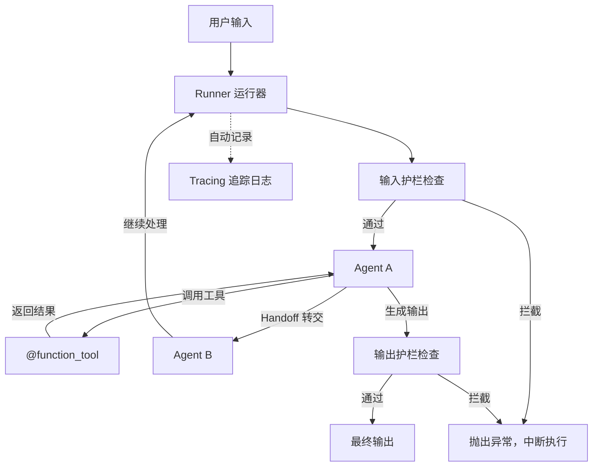

# OpenAI Agents SDK

## 基础概念

OpenAI Agents SDK 是 OpenAI 官方开源的**轻量级多 Agent 编排框架**，2025 年 3 月发布，是此前实验性项目 Swarm 的生产级升级版。它的核心思路是：把 Agent 应用拆成几个简单原语——Agent（代理）、Handoff（转交）、Guardrail（护栏）、Tracing（追踪），开发者像搭积木一样组合它们就能构建多代理系统。

与 LangGraph 这类图编排框架不同，OpenAI Agents SDK 不需要你画有向图、定义状态机。你只需要定义几个 Agent，指定谁能把任务转交给谁，框架的 Runner（运行器）会自动管理整个执行流程——包括调用 LLM、执行工具、处理转交、检查护栏。这种设计让上手门槛极低，同时仍然支持复杂的多 Agent 协作场景。

### 核心要素

| 要素 | 作用 |
|------|------|
| **Agent（代理）** | 一个带指令、工具、转交目标的 LLM 包装器，是最小执行单元 |
| **Handoff（转交）** | Agent 之间的任务委托机制，转交时对话历史自动传递给目标 Agent |
| **Runner（运行器）** | 驱动整个执行循环的引擎，负责调度 Agent、执行工具、处理转交 |
| **Guardrail（护栏）** | 在输入/输出层面对 Agent 行为进行约束检查的安全机制 |
| **Tracing（追踪）** | 自动记录执行过程中所有关键事件，支持调试和可视化 |

### Agent（代理）

Agent 是整个框架的核心单元。创建一个 Agent 需要指定三样东西：`name`（名字）、`instructions`（系统指令，告诉它扮演什么角色）、`model`（使用哪个模型）。可选地，还可以挂载工具（tools）和转交目标（handoffs）。

工具用 `@function_tool` 装饰器定义，函数的类型注解会自动转换成 JSON Schema 传给模型：

```python
# 伪代码：仅展示 Agent 与工具的定义结构
from agents import Agent, function_tool

@function_tool
def query_order(order_id: str) -> str:
    """根据订单号查询订单状态"""
    return f"订单 {order_id} 状态：已发货"

agent = Agent(
    name="客服助手",
    instructions="你是一个电商客服，帮用户查询订单。",
    tools=[query_order],
    model="gpt-4o",
)
```

### Handoff（转交）

Handoff 是 OpenAI Agents SDK 最有特色的设计。当一个 Agent 判断当前问题不在自己的能力范围内时，它可以把整个对话连同上下文一起「转交」给另一个更专业的 Agent。被转交的 Agent 完全接管后续对话，而不是像工具调用那样只返回一个结果。

打个比方：工具调用像你打电话给同事问一个数据然后挂了，Handoff 像你把客户电话直接转给同事让他接着聊。

```python
# 伪代码：仅展示 Handoff 的声明关系
from agents import Agent

退款专员 = Agent(
    name="退款专员",
    instructions="你专门处理退款申请。核实订单信息后办理退款。",
)

客服前台 = Agent(
    name="客服前台",
    instructions="你是一线客服。简单问题自己回答，退款问题转给退款专员。",
    handoffs=[退款专员],  # 声明可以转交给谁
)
```

### Runner（运行器）

Runner 是整个框架的调度中心。你把初始 Agent 和用户消息交给 Runner，它负责驱动整个执行循环：调用 LLM → 判断是否需要调用工具或转交 → 执行工具/转交 → 再次调用 LLM → 直到产生最终输出。

Runner 提供三种运行方式：`Runner.run()`（异步）、`Runner.run_sync()`（同步）、`Runner.run_streamed()`（流式）。

### Guardrail（护栏）

护栏是对 Agent 行为进行约束的安全机制。通过装饰器 `@input_guardrail` 和 `@output_guardrail` 定义，分别在 Agent 接收输入前和产生输出后触发检查。如果检查不通过（tripwire 触发），Runner 会抛出异常，中断执行。

### 核心要素关系图



## 基础用法

安装依赖（Python 3.9+）：

```bash
pip install openai-agents
```

需要 OpenAI API Key，在 https://platform.openai.com/api-keys 获取，设置环境变量：

```bash
export OPENAI_API_KEY="sk-你的密钥"
```

需要 API Key 和联网环境的最小示例（已参考官方文档核对，截至 2026-03）：

```python
import asyncio
from agents import Agent, Runner, function_tool

# 1. 定义工具
@function_tool
def add(a: int, b: int) -> int:
    """将两个整数相加"""
    return a + b

# 2. 创建 Agent
math_agent = Agent(
    name="数学助手",
    instructions="你是一个数学助手，用工具帮用户做计算。",
    tools=[add],
    model="gpt-4o",
)

# 3. 用 Runner 驱动执行
async def main():
    result = await Runner.run(math_agent, "请计算 15 + 27")
    print(result.final_output)

if __name__ == "__main__":
    asyncio.run(main())
```

预期行为：

```text
应返回包含 42 的答案。
```

同步写法（不想写 async 的场景）：

```python
from agents import Agent, Runner

agent = Agent(name="助手", instructions="简洁回答问题。", model="gpt-4o")
result = Runner.run_sync(agent, "Python 之父是谁？")
print(result.final_output)
```

带 Handoff 的多 Agent 示例：

```python
import asyncio
from agents import Agent, Runner

# 定义两个专业 Agent
billing_agent = Agent(
    name="账单专员",
    instructions="你专门处理账单和付款问题。",
)
tech_agent = Agent(
    name="技术支持",
    instructions="你专门处理技术故障和配置问题。",
)

# 路由 Agent：根据问题类型转交
triage_agent = Agent(
    name="前台客服",
    instructions=(
        "你是一线客服。根据用户问题类型分流：\n"
        "- 账单/付款问题 → 转给账单专员\n"
        "- 技术/故障问题 → 转给技术支持\n"
        "- 其他问题自己回答"
    ),
    handoffs=[billing_agent, tech_agent],
)

async def main():
    result = await Runner.run(triage_agent, "我的服务器报 502 错误怎么办？")
    print(result.final_output)
    print(f"回答来自：{result.last_agent.name}")

if __name__ == "__main__":
    asyncio.run(main())
```

## 同类工具对比

| 维度 | OpenAI Agents SDK | LangGraph | Google ADK |
|------|------------------|-----------|------------|
| 核心定位 | 轻量级多 Agent 编排，强调原语简洁 | 图编排框架，状态机式流程控制 | 模块化 Agent 框架，深度集成 Google Cloud |
| 编程范式 | Agent + Handoff + Runner 自动调度 | 有向图 + 共享状态 + 条件边 | Agent + Tool + Session，支持 A2A 协议 |
| 多 Agent 协作 | 原生 Handoff，对话历史自动传递 | 通过图的节点和条件边编排 | 原生支持，通过 A2A 协议和多代理编排 |
| 安全护栏 | 内置 input/output/tool 三层护栏 | 需自行在节点中实现 | 多层级护栏，支持 Gemini as Judge |
| 执行追踪 | 内置 Tracing，自动记录全流程 | 依赖 LangSmith 外部服务 | 内置 Agent Logging |
| 学习曲线 | 低，三个概念就能上手 | 中等，需理解状态机和有向图 | 中等，文档较丰富 |

核心区别：

- **OpenAI Agents SDK**：解决「多个 Agent 怎么协作」的问题——谁负责什么、什么时候转交、转交时带什么上下文
- **LangGraph**：解决「流程怎么走」的问题——步骤之间的分支、循环、中断恢复
- **Google ADK**：解决「在 Google 生态里怎么构建 Agent」的问题——深度集成 Vertex AI 和 Cloud 服务

## 常见误区

| 误区 | 准确理解 |
|------|----------|
| Handoff 和工具调用是一回事 | 工具调用是 Agent 自己「打电话问个数据」，结果返回给自己；Handoff 是「把客户电话转给同事」，目标 Agent 完全接管后续对话 |
| 所有 Agent 都应该配一堆工具 | Agent 的工具越少，决策越清晰，幻觉越少。每个 Agent 只配它职责范围内需要的工具 |
| Agents SDK 只能用 OpenAI 的模型 | 框架支持任何兼容 OpenAI Chat Completions API 的模型，包括通过 `OpenAIChatCompletionsModel` 接入本地模型 |

## 优劣势分析

| 优势 | 劣势 |
|------|------|
| 原语极简（Agent + Handoff + Runner），上手快 | 流程控制能力不如 LangGraph（无显式分支、循环） |
| Handoff 机制设计精巧，多 Agent 协作开箱即用 | 强依赖 OpenAI API 格式，接入非 OpenAI 模型需适配 |
| 内置 Tracing，执行过程完全可追踪 | 生态成熟度不如 LangChain 家族（插件、集成较少） |
| 护栏系统完整（输入/输出/工具三层） | 框架较新（2025.3 发布），社区最佳实践仍在积累 |

## 思考题

<details>
<summary>初级：Handoff 和工具调用的本质区别是什么？各适合什么场景？</summary>

**参考答案：**

工具调用是 Agent 执行一个函数并拿回结果，控制权始终在调用方 Agent 手里。Handoff 是把整个对话的控制权转移给另一个 Agent，对话历史一并传递，原 Agent 退出。

工具调用适合：查数据库、调 API、做计算等「获取信息」的操作。Handoff 适合：问题需要不同领域专家处理的「任务分流」场景，比如客服系统里前台把退款问题转给退款专员。

</details>

<details>
<summary>中级：如何用 Guardrail 拦截包含敏感信息的用户输入？请描述实现思路。</summary>

**参考答案：**

用 `@input_guardrail` 装饰器定义一个检查函数。函数接收 `RunContextWrapper`、`Agent` 和输入内容，检查输入中是否包含敏感关键词（如"密码""信用卡号"），如果命中则返回 `GuardrailFunctionOutput(tripwire_triggered=True)`。Runner 执行时会先跑所有输入护栏，一旦 tripwire 触发就抛出 `InputGuardrailTripwireTriggered` 异常，阻止请求继续传递给 Agent。

</details>

<details>
<summary>中级：在多 Agent 系统中，如何避免 Handoff 形成死循环（A 转给 B，B 又转回 A）？</summary>

**参考答案：**

三种策略：

1. **单向拓扑**：Handoff 关系设计成有向无环图（DAG），例如前台 → 专员 → 主管，禁止反向转交。
2. **Runner 的 max_turns 参数**：设置最大执行轮次上限（如 `Runner.run(agent, msg, max_turns=10)`），超过就强制停止。
3. **指令约束**：在 Agent 的 instructions 中明确写「不要把问题转回给 XX Agent」，利用 LLM 的指令遵循能力避免循环。

生产环境建议三种策略叠加使用，max_turns 作为兜底保护。

</details>

## 参考资料

1. 官方文档：https://openai.github.io/openai-agents-python/
2. GitHub 仓库：https://github.com/openai/openai-agents-python
3. 快速开始指南：https://openai.github.io/openai-agents-python/quickstart/
4. Handoffs 文档：https://openai.github.io/openai-agents-python/handoffs/
5. Guardrails 文档：https://openai.github.io/openai-agents-python/guardrails/
6. Tracing 文档：https://openai.github.io/openai-agents-python/tracing/
