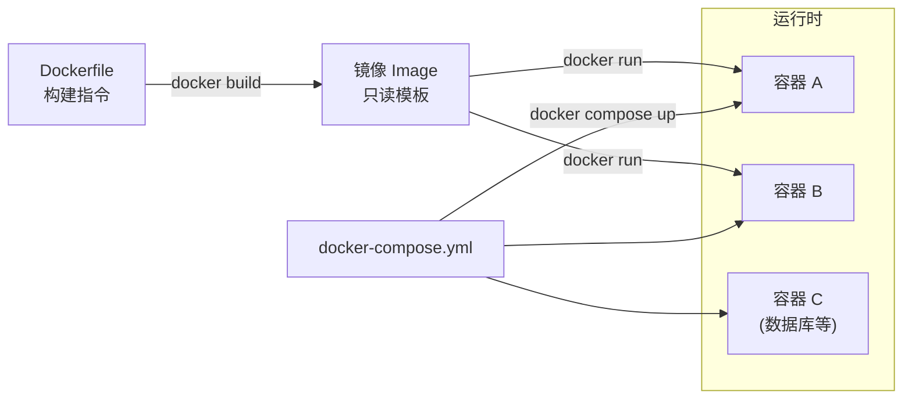

# Docker（容器化平台）

## 基础概念

Docker 是一个**容器化平台（Containerization Platform）**，核心能力是把应用代码、依赖库、运行环境打包成一个标准化的「容器」，让这个容器在任何装了 Docker 的机器上都能一模一样地运行。

用大白话说：你在自己电脑上写好代码、配好环境，打包成一个 Docker 镜像（Image，可以理解为「安装包」），然后把这个镜像发给同事或者丢到服务器上，对方直接启动就能跑，不用再折腾「装依赖、改配置、对版本」。对 AI Agent 开发来说，Docker 解决的就是「我这里能跑，你那里跑不了」的经典问题。

### 核心要素

| 要素 | 作用 |
|------|------|
| **镜像（Image）** | 只读的打包模板，包含代码 + 依赖 + 环境，是创建容器的「蓝图」 |
| **容器（Container）** | 镜像的运行实例，拥有独立的文件系统、网络和进程空间 |
| **Dockerfile** | 文本配置文件，用一行行指令描述「怎么一步步构建镜像」 |
| **Docker Compose** | 多容器编排工具，用一个 YAML 文件定义和管理多个相互关联的服务 |

### 镜像（Image）

镜像是一个只读的模板，包含应用运行所需的所有东西：源代码、依赖库、运行时、环境变量。镜像采用**分层设计（Layered Design）**，每个 Dockerfile 指令会创建一个新的层（Layer，可以理解为「一层叠一层的透明薄膜」），修改代码时只需重建变化的那一层，其余层复用缓存。

类比：镜像 = 类（class），容器 = 对象（instance）。一个镜像可以同时启动多个相互隔离的容器。

### 容器（Container）

容器是镜像的运行实例。启动容器时，Docker 会在镜像的只读层上面加一个**可写层（Writable Layer）**，应用在容器内的所有文件修改只影响这个可写层，不会改动镜像本身。容器启动通常不到 1 秒，因为它不像虚拟机（VM，Virtual Machine）那样需要启动整个操作系统，而是直接共享宿主机的 Linux 内核。

### Dockerfile

Dockerfile 是一个纯文本文件，用声明式指令描述如何逐步构建镜像。常用指令：

- `FROM`：指定基础镜像（必须是第一行）
- `WORKDIR`：设置工作目录
- `COPY`：从本地复制文件到镜像内
- `RUN`：在构建时执行命令（如安装依赖）
- `CMD`：容器启动时的默认命令

### Docker Compose

Docker Compose 用一个 `docker-compose.yml` 文件定义多个服务（如应用 + 数据库 + 缓存），一条命令 `docker compose up` 就能把所有服务一起启动。在开发和测试阶段非常好用。

### 核心要素关系图



Dockerfile 定义「怎么打包」，镜像是打包结果，容器是镜像跑起来的实例。Docker Compose 在此基础上管理多个容器的协同启动。

## 基础用法

安装（Docker Engine 27.x，截至 2026-03 为当前稳定版本）：

```bash
# macOS / Windows：下载 Docker Desktop
# https://www.docker.com/products/docker-desktop/

# Linux（Ubuntu/Debian）一键安装：
curl -fsSL https://get.docker.com -o get-docker.sh
sudo sh get-docker.sh
sudo usermod -aG docker $USER   # 让当前用户免 sudo 使用 docker

# 验证安装
docker --version
# Docker version 27.x.x, build xxx
```

最小可运行示例（基于 Docker Engine 27.x 验证，截至 2026-03）：

```bash
# 1. 创建项目目录
mkdir -p docker-hello && cd docker-hello

# 2. 创建一个简单的 Python 脚本
cat > app.py << 'EOF'
print("Hello from Docker!")
print("如果你看到这行，说明容器运行成功。")
EOF

# 3. 创建 Dockerfile
cat > Dockerfile << 'EOF'
FROM python:3.11-slim
WORKDIR /app
COPY app.py .
CMD ["python", "app.py"]
EOF

# 4. 构建镜像（-t 给镜像起名字和标签）
docker build -t hello-docker:v1 .

# 5. 运行容器
docker run --rm hello-docker:v1
```

预期输出：

```text
Hello from Docker!
如果你看到这行，说明容器运行成功。
```

常用命令速查：

```bash
docker ps                    # 查看正在运行的容器
docker ps -a                 # 查看所有容器（包括已停止的）
docker images                # 查看本地所有镜像
docker logs <容器名>          # 查看容器日志
docker exec -it <容器名> bash # 进入容器内部调试
docker stop <容器名>          # 停止容器
docker rm <容器名>            # 删除容器
docker rmi <镜像名>           # 删除镜像
```

Docker Compose 多服务编排示例：

```yaml
# docker-compose.yml
# 一条命令启动 Web 应用 + Redis 缓存
services:
  web:
    build: .
    ports:
      - "8000:8000"
    depends_on:
      - redis
  redis:
    image: redis:7-alpine
    ports:
      - "6379:6379"
```

```bash
# 启动所有服务
docker compose up -d

# 查看服务状态
docker compose ps

# 停止并清理
docker compose down
```

## 同类工具对比

| 维度 | Docker | Podman | 虚拟机（VM） |
|------|--------|--------|-------------|
| 核心定位 | 容器化平台，镜像打包 + 容器运行 | Docker 的无守护进程替代品 | 完整的操作系统级虚拟化 |
| 启动速度 | 秒级（共享宿主机内核） | 秒级（同 Docker） | 分钟级（需启动整个 OS） |
| 资源占用 | 低（MB 级） | 低（同 Docker） | 高（GB 级，每个 VM 一套 OS） |
| 隔离性 | 进程级隔离（共享内核） | 进程级 + 无守护进程更安全 | 内核级隔离（独立 OS） |
| 生态成熟度 | 极高，文档丰富，社区庞大 | 快速增长，Red Hat 主导 | 成熟（VMware、VirtualBox 等） |

核心区别：

- **Docker**：最主流的容器化方案，生态最完整，适合绝大多数 AI Agent 开发和部署场景
- **Podman**：Docker 的替代品，命令兼容，无需后台守护进程（Daemon），安全性更高
- **虚拟机**：隔离最彻底但资源开销大，适合需要运行不同操作系统的场景

## 常见误区

| 误区 | 准确理解 |
|------|----------|
| Docker 就是轻量级虚拟机 | 容器和虚拟机是不同技术。容器共享宿主机内核，虚拟机有独立 OS。容器隔离性弱于虚拟机，但启动快、资源省 |
| 用了 Docker 就完全不用操心环境差异 | Docker 保证容器内部环境一致，但宿主机的内核版本、GPU 驱动、网络配置仍可能影响运行结果 |
| 容器停了数据就没了 | 容器停止后数据还在，只有执行 `docker rm` 删除容器时可写层才会丢失。持久化数据应使用数据卷（Volume） |
| Docker Compose 可以直接用于生产环境 | Docker Compose 只支持单机编排，没有自动故障转移和滚动更新。生产环境建议使用 Kubernetes |

## 优劣势分析

| 优势 | 劣势 |
|------|------|
| 环境一致性：开发、测试、生产用同一个镜像 | Linux 内核依赖：macOS/Windows 需通过虚拟化层运行 |
| 启动快、资源省：秒级启动，MB 级内存占用 | 隔离性不如虚拟机：共享内核意味着安全边界较弱 |
| 生态成熟：Docker Hub 上数百万个现成镜像可用 | 持久化存储需额外管理：数据卷的备份和迁移需要规划 |
| 一键编排：Docker Compose 让多服务本地开发非常方便 | GUI 应用不友好：主要面向后端/服务端应用 |

## 思考题

<details>
<summary>初级：镜像和容器是什么关系？为什么同一个镜像可以启动多个容器？</summary>

**参考答案：**

镜像是只读模板，容器是镜像的运行实例。启动容器时，Docker 在镜像的只读层上方添加一个独立的可写层，每个容器都有自己的可写层，互不干扰。所以同一个镜像可以同时运行多个容器，就像一个类可以创建多个对象。

</details>

<details>
<summary>中级：Dockerfile 中 RUN、CMD、ENTRYPOINT 有什么区别？</summary>

**参考答案：**

- **RUN**：在构建镜像时执行命令，执行结果保存到新的镜像层中（如安装依赖）
- **CMD**：定义容器启动时的默认命令，可被 `docker run` 后面的参数覆盖
- **ENTRYPOINT**：定义容器的主程序入口，和 CMD 配合时，CMD 的内容作为参数传给 ENTRYPOINT

例如：`ENTRYPOINT ["python"]` + `CMD ["app.py"]` 等效于执行 `python app.py`，但用户可以通过 `docker run myimage test.py` 将 `app.py` 替换为 `test.py`。

</details>

<details>
<summary>中级：为什么推荐用多阶段构建（Multi-stage Build）？它的原理是什么？</summary>

**参考答案：**

多阶段构建在一个 Dockerfile 中定义多个 `FROM` 阶段：第一阶段安装编译工具和构建依赖，第二阶段只从第一阶段复制编译好的产物（如虚拟环境、二进制文件），不携带编译工具。这样最终镜像只包含运行所需的最小内容，体积可以从 1GB+ 缩减到 200MB 以下。原理就是 `COPY --from=builder` 指令可以跨阶段复制文件。

</details>

## 参考资料

1. 官方文档：https://docs.docker.com/
2. Docker Hub（镜像仓库）：https://hub.docker.com/
3. Dockerfile 参考手册：https://docs.docker.com/reference/dockerfile/
4. Docker Compose 文档：https://docs.docker.com/compose/
