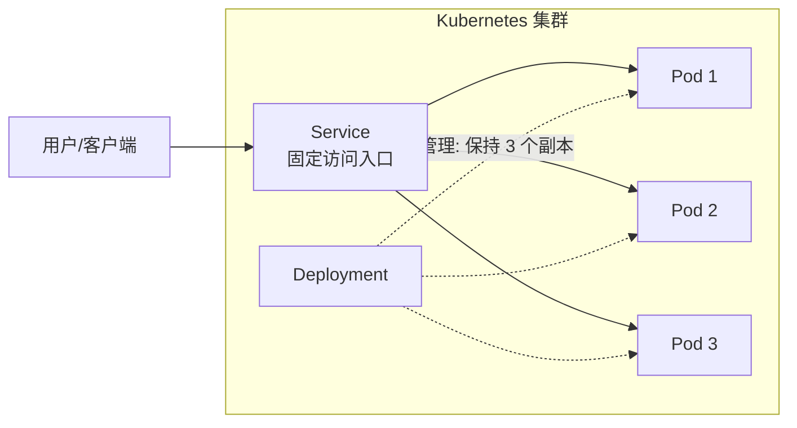

# Kubernetes（容器编排平台）

## 基础概念

Kubernetes（简称 K8s，因为 k 和 s 之间有 8 个字母）是 Google 开源的**容器编排平台（Container Orchestration Platform）**，用来自动化管理大量容器的部署、扩缩容和运维。简单说：你把应用打包成容器镜像（Image），告诉 Kubernetes「我要跑 3 份这个应用」，它就会自动帮你启动、监控、故障恢复、负载均衡。

对于 Agent 应用开发者，Kubernetes 的价值在于：当你的 Agent 服务需要**高可用**（挂了自动重启）、**弹性伸缩**（流量大时自动扩容）、**滚动更新**（上线新版本不中断服务）时，Kubernetes 提供了生产级的基础设施，让你不用自己写这些运维逻辑。

### 核心要素

| 要素 | 作用 |
|------|------|
| **Pod（容器组）** | K8s 最小部署单元，包含一个或多个容器，共享网络和存储 |
| **Deployment（部署控制器）** | 声明「我要几个 Pod、用什么镜像」，K8s 自动维持这个状态 |
| **Service（服务）** | 给一组 Pod 提供固定的访问入口，自动做负载均衡（Load Balancing，把请求均匀分到多个 Pod） |

### Pod（容器组）

Pod 是 Kubernetes 的最小可部署单元。一个 Pod 通常只跑一个容器（你的应用），但也可以包含「边车容器（Sidecar）」来做日志收集、监控等辅助工作。同一个 Pod 内的所有容器共享网络命名空间（Network Namespace），可以通过 `localhost` 互相通信。

把 Pod 理解成一个「逻辑主机」：里面的容器就像同一台机器上的不同进程。

### Deployment（部署控制器）

Deployment 是最常用的控制器（Controller），用声明式（Declarative）的方式管理 Pod。你只需要描述期望状态——「我要 3 个副本（Replica），用 v1.0 镜像」——Kubernetes 会持续监控并确保实际状态和期望一致。如果某个 Pod 崩溃了，Deployment 会自动创建新的来补上。

### Service（服务）

Pod 的 IP 地址会随着重启而变化，不能直接拿来做服务入口。Service 解决这个问题：它提供一个固定的 IP 和 DNS 名称，自动将请求转发到后面的健康 Pod。即使 Pod 被删除重建，客户端通过 Service 访问始终不受影响。

### 核心要素关系图



三者的关系：Deployment 负责「创建和维护 Pod」，Service 负责「暴露 Pod 给外部访问」，Pod 是「实际运行应用的地方」。

## 基础用法

安装（本地开发环境）：

```bash
# 方式 1：安装 Minikube（本地单节点集群，推荐初学者）
# macOS
brew install minikube

# Windows (使用 winget)
winget install Kubernetes.minikube

# Linux
curl -LO https://storage.googleapis.com/minikube/releases/latest/minikube-linux-amd64
sudo install minikube-linux-amd64 /usr/local/bin/minikube

# 方式 2：Docker Desktop 内置 Kubernetes
# 打开 Docker Desktop → Settings → Kubernetes → 勾选 Enable Kubernetes

# 安装 kubectl（与 K8s 集群交互的命令行工具）
# macOS
brew install kubectl
# Windows
winget install Kubernetes.kubectl

# 启动本地集群（Minikube 方式）
minikube start

# 验证集群连接
kubectl cluster-info
kubectl get nodes
```

最小可运行示例（基于 Kubernetes v1.35 / minikube v1.38 验证，截至 2026-03）：

```bash
# 第一步：创建 Deployment 配置文件
cat > hello-agent.yaml << 'EOF'
apiVersion: apps/v1
kind: Deployment
metadata:
  name: hello-agent
spec:
  replicas: 3                      # 运行 3 个副本
  selector:
    matchLabels:
      app: hello-agent
  template:
    metadata:
      labels:
        app: hello-agent
    spec:
      containers:
      - name: web
        image: nginx:1.27-alpine   # 用 nginx 做演示
        ports:
        - containerPort: 80
        resources:
          requests:                 # 最低资源保障
            memory: "64Mi"
            cpu: "50m"
          limits:                   # 资源上限
            memory: "128Mi"
            cpu: "100m"
---
apiVersion: v1
kind: Service
metadata:
  name: hello-agent-svc
spec:
  type: NodePort                   # 通过节点端口对外暴露
  selector:
    app: hello-agent
  ports:
  - port: 80
    targetPort: 80
EOF

# 第二步：部署到集群
kubectl apply -f hello-agent.yaml

# 第三步：查看运行状态
kubectl get deployments
kubectl get pods
kubectl get services

# 第四步：访问服务（Minikube 环境）
minikube service hello-agent-svc --url

# 第五步：扩容到 5 个副本
kubectl scale deployment hello-agent --replicas=5
kubectl get pods    # 观察新 Pod 创建过程

# 第六步：清理资源
# kubectl delete -f hello-agent.yaml
```

预期输出：

```text
$ kubectl get deployments
NAME          READY   UP-TO-DATE   AVAILABLE   AGE
hello-agent   3/3     3            3           30s

$ kubectl get pods
NAME                           READY   STATUS    RESTARTS   AGE
hello-agent-5d7b8f6c4a-abc12   1/1     Running   0          30s
hello-agent-5d7b8f6c4a-def34   1/1     Running   0          30s
hello-agent-5d7b8f6c4a-ghi56   1/1     Running   0          30s

$ kubectl get services
NAME              TYPE       CLUSTER-IP      EXTERNAL-IP   PORT(S)        AGE
hello-agent-svc   NodePort   10.96.145.200   <none>        80:31234/TCP   25s
```

## 同类工具对比

| 维度 | Kubernetes | Docker Compose | Nomad |
|------|-----------|---------------|-------|
| 核心定位 | 生产级容器编排平台 | 单机多容器组合工具 | 通用工作负载调度器 |
| 适合规模 | 中大型，数十到数千节点 | 单机或小型开发环境 | 中型，多数据中心 |
| 学习曲线 | 陡峭，概念多 | 平缓，一个 YAML 搞定 | 中等 |
| 自动扩缩容 | 原生 HPA/VPA 支持 | 不支持 | 支持，需额外配置 |
| 社区生态 | 极大，云原生事实标准（CNCF） | Docker 官方，使用广泛 | HashiCorp 生态 |

核心区别：

- **Kubernetes**：解决「大规模容器怎么管」的问题——自动调度、故障恢复、弹性伸缩、滚动更新
- **Docker Compose**：解决「本地开发怎么一键启多个容器」的问题——简单直接，但不具备集群能力
- **Nomad**：解决「不只是容器，还有虚拟机和传统应用也要统一编排」的问题——灵活性强，但生态小于 K8s

## 常见误区

| 误区 | 准确理解 |
|------|----------|
| Pod 就是容器 | Pod 是容器的「包装层」，一个 Pod 可以包含多个容器。Pod 内容器共享网络，可通过 localhost 通信 |
| 部署到 K8s 就自动高可用了 | 高可用需要你主动配置：多副本、健康检查（Health Check）、Pod 反亲和性（Anti-Affinity）。K8s 只提供机制，你得正确使用 |
| 小项目也该用 Kubernetes | 单机跑几个容器用 Docker Compose 足够。K8s 的价值在多节点、需要弹性伸缩的场景才能体现，小项目反而增加运维负担 |

## 优劣势分析

| 优势 | 劣势 |
|------|------|
| 自动故障恢复：Pod 崩溃秒级重启，节点宕机自动迁移 | 学习曲线陡峭，概念多（Pod/Service/Ingress/ConfigMap 等） |
| 原生弹性伸缩：HPA 根据 CPU/内存/自定义指标自动扩缩容 | 集群本身需要运维，Control Plane（控制平面）也会出问题 |
| 声明式管理：YAML 定义期望状态，可版本控制、可审计 | 资源开销大：etcd、API Server 等组件本身占用内存和 CPU |
| 生态极其丰富：Helm、ArgoCD、Prometheus 等工具无缝集成 | YAML 配置繁琐，简单应用也需要写大量配置文件 |

## 思考题

<details>
<summary>初级：Pod、Deployment、Service 三者分别负责什么？为什么需要三层抽象？</summary>

**参考答案：**

- Pod：运行容器的最小单元，提供容器运行环境（网络、存储）
- Deployment：管理 Pod 的生命周期——创建几个、用什么镜像、怎么更新。没有 Deployment，Pod 崩溃后没人负责重建
- Service：给一组 Pod 提供固定访问入口。没有 Service，Pod IP 随重启变化，客户端无法稳定连接

三层抽象各司其职：Pod 管「怎么跑」，Deployment 管「跑几个」，Service 管「怎么访问」。

</details>

<details>
<summary>中级：Kubernetes 如何实现「滚动更新不中断服务」？</summary>

**参考答案：**

滚动更新（Rolling Update）的流程：

1. Deployment 创建一个新版本的 Pod（比如 v2）
2. 等新 Pod 通过 readinessProbe（就绪探针）后，Service 开始向新 Pod 分发流量
3. 同时终止一个旧版本 Pod（v1）
4. 重复上述过程，直到所有旧 Pod 被替换为新 Pod

关键配置：`maxSurge`（最多同时多出几个新 Pod）和 `maxUnavailable`（最多允许几个 Pod 不可用）。设置 `maxUnavailable: 0` 可以确保更新过程中始终有足够的 Pod 处理请求。

</details>

<details>
<summary>中级：在 Agent 应用中，什么时候应该用 Kubernetes 而不是 Docker Compose？</summary>

**参考答案：**

满足以下任一条件时，应考虑 Kubernetes：

- 需要多节点部署（单机无法满足计算或内存需求）
- 需要自动故障恢复（Pod 崩溃自动重启、节点宕机自动迁移）
- 需要弹性伸缩（流量高峰自动扩容、低谷自动缩容以节省成本）
- 需要灰度发布/金丝雀发布（逐步切流量到新版本）
- 团队规模较大，需要通过 Namespace 做资源隔离和权限管理

如果只是本地开发、单机部署、团队人数少，Docker Compose 更简单高效。

</details>

## 参考资料

1. 官方文档：https://kubernetes.io/zh-cn/docs/home/
2. GitHub 仓库：https://github.com/kubernetes/kubernetes
3. Minikube 快速入门：https://minikube.sigs.k8s.io/docs/start/
4. kubectl 命令参考：https://kubernetes.io/docs/reference/kubectl/
5. CNCF 云原生全景图：https://landscape.cncf.io/
