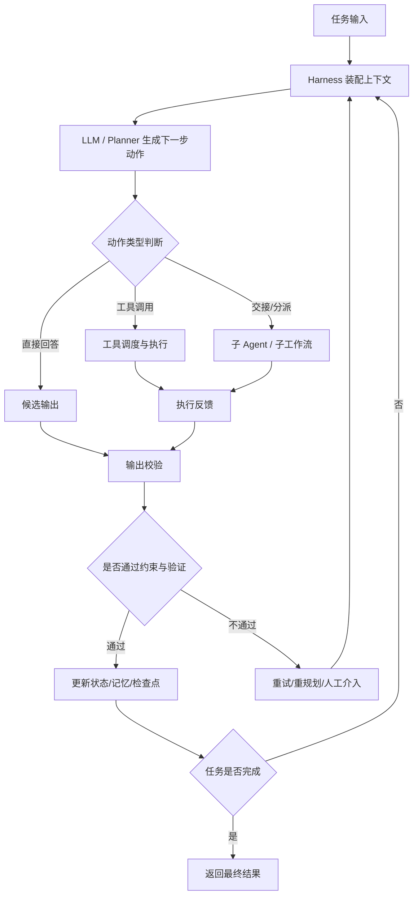

# Agent Harness（Agent 脚手架 / 运行时控制层）

## 概念解释

Agent Harness（Agent 脚手架 / 运行时控制层）不是某一个固定产品名，而是一类工程化系统层。它包在模型和业务任务之间，负责把“会回答问题的模型”变成“能持续执行任务的 Agent”。如果把大模型看成推理引擎，那么 Harness 更像是它的运行时外壳：接收任务、组织上下文、暴露工具、管理状态、限制权限、校验结果，并在出错时决定是重试、回滚、求助人类，还是交给别的子 Agent。

它之所以出现，是因为真实 Agent 系统的难点往往不在“模型这一次能不能答对”，而在“它能不能连续几十步都不跑偏”。一旦任务拉长，系统就会遇到上下文膨胀、工具误用、状态丢失、权限越界、错误累积、结果无法验证等问题。单靠提示词或单个框架 API，很难把这些问题一起兜住。

因此，Agent Harness 的核心价值不是替代模型，也不是替代 Agent Framework（Agent 开发框架），而是提供一层运行时控制与工程约束。它把规划、执行、验证、纠偏、持久化、审计这些能力串成闭环，让 Agent 从“能跑 demo”变成“能在生产环境里持续跑任务”的系统。

## 关键结构

| 结构 | 作用 | 说明 |
|------|------|------|
| 任务入口与上下文装配 | 把用户目标翻译成可执行任务 | 负责指令、状态、记忆、工具说明、环境信息的组装与裁剪 |
| 执行编排与工具调度 | 让 Agent 能分步骤推进任务 | 决定调用哪个工具、是否切分子任务、是否交接给子 Agent |
| 状态、记忆与检查点 | 保持长任务连续性 | 保存中间结果、线程状态、检查点，支持恢复与回放 |
| 约束与反馈回路 | 防止系统持续跑偏 | 包含权限控制、输入输出校验、测试验证、重试、人工审批 |

### 结构 1：任务入口与上下文装配

Harness 的第一件事不是“让模型开始想”，而是先把任务包装成适合运行的上下文。这里通常会做三件事：

- 解释任务目标和边界，告诉 Agent 成功标准是什么
- 把必要的记忆、状态、检索结果、工具定义装进当前上下文
- 控制上下文预算，避免把无关信息一股脑塞给模型

这一步决定了 Agent 是“拿着完整说明书上手”，还是“带着一堆噪声边走边猜”。

### 结构 2：执行编排与工具调度

模型本身只能生成下一步文本，但 Agent 系统需要决定“下一步动作”。Harness 会把文本决策翻译成具体执行：调用工具、写文件、读取网页、发起检索、交给其他 Agent、或者结束任务。

如果任务较长，Harness 往往还会维护一个显式执行循环，例如“计划 → 执行 → 观察 → 再计划”。这也是它和普通聊天调用最本质的区别：它不是一次回答，而是一条持续推进的任务链。

### 结构 3：状态、记忆与检查点

长任务必须能“记得住自己做到哪了”。Harness 通常会把当前线程状态、历史消息、工具结果、文件变更、任务计划、审批结论等信息持久化。这样当进程中断、工具失败、人工接管或者任务需要隔天继续时，系统仍然可以从最近的可恢复点继续。

这部分能力和 LangGraph 一类框架中的 state / checkpoint 很接近，但 Harness 的关注点更宽，不只保存状态，还要决定哪些状态该保留、怎样交接、哪些结果需要暴露给下游环节。

### 结构 4：约束与反馈回路

Harness 的核心不是“放权”，而是“可控地放权”。因此它通常包含：

- 权限边界：哪些工具能用、哪些目录能写、哪些操作要审批
- Guardrails（护栏）：输入输出校验、敏感操作拦截、格式验证
- 验证器：测试、规则检查、评估器、reranker、策略校验
- 纠偏机制：重试、回滚、重新规划、升级给人类或子 Agent

这意味着 Agent 不只是“做事”，还要被持续检查“做得对不对”。

## 核心原理

### 原理说明

Agent Harness 的工作逻辑可以理解成一个“受控自治循环”：

1. **接收目标**：系统收到用户任务或上游调度任务。
2. **装配上下文**：Harness 收集当前指令、状态、记忆、工具说明、环境信息，并裁剪成当前可用上下文。
3. **生成动作候选**：模型基于上下文决定下一步，是回答、调用工具、交接给子 Agent，还是更新计划。
4. **执行动作**：Harness 负责真正触发工具或工作流节点，而不是让模型凭空假装已经执行。
5. **采集反馈**：工具结果、测试结果、检索结果、异常信息被送回运行时。
6. **验证与约束**：Harness 判断本轮结果是否通过校验，是否超权限、是否触发护栏、是否需要审批。
7. **更新状态**：把新的中间结果、检查点、执行日志写入状态系统。
8. **决定下一步**：继续执行、重试、改计划、切换 Agent、请求人工确认，或返回最终答案。

这套机制之所以有效，是因为它把“推理”和“控制”拆开了：模型负责提出下一步，Harness 负责把这一步落到真实世界里，并判断是否继续放行。只有这样，Agent 才不会因为一次错误的工具调用或者一次错误的上下文选择而一路失控。

### Mermaid 图解



图中的关键点有三个：

- **B 节点**不是一次性准备动作，而是每一轮都可能重新装配上下文。
- **I → J** 体现了 Harness 的本质：先看结果，再决定是否放行，而不是默认模型说什么都算数。
- **K → M → B** 说明 Agent Harness 天然适合长任务，它依赖持续状态更新，而不是单轮对话记忆。

### 运行示例

下面用伪代码展示 Harness 的最小闭环。它不是某个框架的完整实现，但能表达运行时控制层的核心职责。

```python
from dataclasses import dataclass, field
from typing import Any

@dataclass
class AgentState:
    """Agent 运行时状态。"""
    goal: str
    history: list[str] = field(default_factory=list)
    checkpoints: list[dict[str, Any]] = field(default_factory=list)
    done: bool = False


def plan_next_action(state: AgentState) -> dict[str, Any]:
    """用模型或规则决定下一步动作。"""
    if not state.history:
        return {"type": "tool", "name": "search_docs", "args": {"query": state.goal}}
    return {"type": "answer", "content": "基于检索结果整理最终回答"}


def run_tool(name: str, args: dict[str, Any]) -> str:
    """真正执行工具。"""
    if name == "search_docs":
        return f"检索完成：{args['query']} 的 3 条相关资料"
    raise ValueError(f"未知工具：{name}")


def validate_step(result: str) -> bool:
    """最小验证器：这里只演示运行时会做校验。"""
    return bool(result and result.strip())


def save_checkpoint(state: AgentState) -> None:
    """保存检查点，便于中断恢复。"""
    state.checkpoints.append(
        {
            "history": list(state.history),
            "done": state.done,
        }
    )


def run_harness(goal: str) -> AgentState:
    """最小 Harness 循环。"""
    state = AgentState(goal=goal)

    while not state.done:
        action = plan_next_action(state)

        if action["type"] == "tool":
            tool_result = run_tool(action["name"], action["args"])
            if not validate_step(tool_result):
                state.history.append("工具结果校验失败，进入重试/纠偏")
                continue
            state.history.append(tool_result)
            save_checkpoint(state)

        elif action["type"] == "answer":
            if not validate_step(action["content"]):
                state.history.append("输出为空，拒绝结束")
                continue
            state.history.append(action["content"])
            state.done = True
            save_checkpoint(state)

    return state
```

这段代码对应四个关键机制：`plan_next_action` 表示决策层，`run_tool` 表示执行层，`validate_step` 表示反馈约束，`save_checkpoint` 表示持久化恢复。真实系统会把这里的函数替换成 LLM、工具平台、权限系统、状态存储、评测器和人工审批节点。

## 易混概念辨析

| 概念 | 与 Agent Harness 的区别 | 更适合关注的重点 |
|------|-------------------------|------------------|
| Agent Framework（Agent 开发框架） | Framework 主要提供组件、接口和编程模型；Harness 更强调运行时控制、约束和交付闭环 | 看它如何定义节点、工具、状态、编排 API |
| Context Engineering（上下文工程） | 上下文工程是 Harness 的一部分，解决“给模型喂什么”；Harness 还要解决执行、验证、恢复、权限等问题 | 看上下文如何筛选、压缩、检索和注入 |
| Guardrails（护栏） | Guardrails 主要负责限制与校验；Harness 还包括调度、状态、记忆、检查点、交接等完整控制面 | 看它如何拦截风险输入输出 |
| Agent Runtime（Agent 运行时） | 两者高度重叠；Runtime 偏执行环境这一层，Harness 常额外强调工程化控制和可运营性 | 看它是否支持恢复、审计、反馈闭环 |

核心区别：

- **Agent Harness**：关注“怎样让一个 Agent 系统持续、可靠、可控地跑任务”。
- **Agent Framework**：关注“开发者怎样更方便地把 Agent 代码搭起来”。
- **Context Engineering**：关注“当前轮应该给模型哪些信息”。
- **Guardrails**：关注“哪些输入输出不能放行”。

## 适用边界与局限

### 适用场景

1. **长时任务 Agent**：如代码修改、研究分析、工单处理、复杂表单流转。这类任务步骤多、外部依赖多，没有 Harness 很容易中途失忆或跑偏。
2. **多工具、多系统集成场景**：当 Agent 需要访问搜索、数据库、文件系统、浏览器、内部 API 时，Harness 负责统一调度、审计和权限边界。
3. **需要恢复与追踪的生产系统**：一旦任务执行可能持续数分钟到数小时，或者需要人工审批和事后复盘，就需要检查点、日志和可回放能力。
4. **多 Agent 协作系统**：当系统要在主 Agent、子 Agent、评估器之间切换时，Harness 可以承担交接、状态封装和结果归并。

### 不适合的场景

1. **单轮问答或固定流程脚本**：如果任务就是一次提问、一次回答，或者步骤完全固定，使用完整 Harness 会明显过度设计。
2. **对延迟极度敏感的简单请求**：Harness 引入状态管理、校验、日志和恢复机制，通常会增加系统复杂度和响应时延。
3. **没有外部动作的纯内容生成**：如果系统既不需要工具、也不需要恢复、也没有高风险输出，那么轻量工作流通常更合适。

### 局限性

1. **工程成本高**：Harness 不是一个提示词技巧，而是一整套运行时设计。状态存储、工具契约、审批流、日志、验证器都需要额外建设。
2. **不会自动提高模型智力**：它能减少失控、提高稳定性，但不能把弱模型变成强模型。底层推理能力仍受模型本身限制。
3. **控制越多，系统越复杂**：加入过多护栏、检查点、评测器后，系统可能变慢、变贵，也更难调试。Harness 的目标不是无限加层，而是找到最小可控闭环。
4. **验证链路本身也会出错**：测试、规则、评估器、reranker 都可能误判，因此 Harness 并不是“绝对正确层”，而是“降低失控概率的系统层”。

## 常见误区

| 常见误区 | 正确理解 |
|----------|----------|
| Agent Harness 就是某一个新框架或某个产品名 | 它更像一类工程角色或系统层，不同团队会用不同框架和工具来实现 |
| 只要用了 Agent Framework，就等于有了 Harness | 框架提供开发积木，不等于已经具备恢复、权限、验证、审计、纠偏等完整运行时控制 |
| Harness 的目的就是限制模型 | 限制只是其中一部分，它更重要的职责是调度、反馈、恢复和交接，让自治变成可控自治 |
| Harness 可以替代评测和人工监督 | 它能承载评测和审批节点，但不能免除评测体系建设，也不能消除高风险场景下的人类责任 |

## 思考题

<details>
<summary>初级：为什么说 Agent Harness 解决的不是“模型会不会回答”，而是“系统能不能持续执行任务”？</summary>

**参考答案：**

因为在真实 Agent 系统里，问题往往出在多步执行链路：上下文会膨胀、工具可能误用、任务会中断、错误会累积、结果还需要验证。模型单轮答得好，不代表它能稳定跑完整个任务。Harness 负责把这些运行时问题兜起来。

</details>

<details>
<summary>中级：Agent Harness 和 Agent Framework 的边界应该怎么划分？</summary>

**参考答案：**

Framework 更像开发框架，重点是提供节点、工具、状态、工作流等抽象，帮助开发者搭建 Agent。Harness 更像运行时控制层，重点是把上下文装配、工具调度、检查点、权限、护栏、验证、重试、人工审批串成闭环。一个系统可以基于某个 Framework 来实现自己的 Harness。

</details>

<details>
<summary>中级/进阶：如果你要为“自动修复代码并提交补丁”的 Agent 设计 Harness，哪三类控制点最不能省略？为什么？</summary>

**参考答案：**

至少不能省略三类控制点：第一，**权限与审批**，因为写文件、执行命令、提交补丁都属于高影响动作；第二，**状态与检查点**，因为代码任务通常较长，失败后需要恢复和复盘；第三，**验证与反馈回路**，因为必须依赖测试、lint、diff 检查等外部反馈判断补丁是否真的可用，否则 Agent 很容易“看起来修好了，实际没修”。

</details>

## 参考资料

1. Anthropic, Building effective agents：https://www.anthropic.com/research/building-effective-agents
2. Anthropic Engineering, Contextual Retrieval：https://www.anthropic.com/engineering/contextual-retrieval
3. OpenAI Agents SDK 官方文档：https://openai.github.io/openai-agents-python/
4. OpenAI Agents Python GitHub 仓库：https://github.com/openai/openai-agents-python
5. LangGraph 官方文档 - Persistence：https://docs.langchain.com/oss/python/langgraph/persistence
6. LangGraph 官方文档 - Interrupts（Human-in-the-loop）：https://docs.langchain.com/oss/python/langgraph/interrupts
