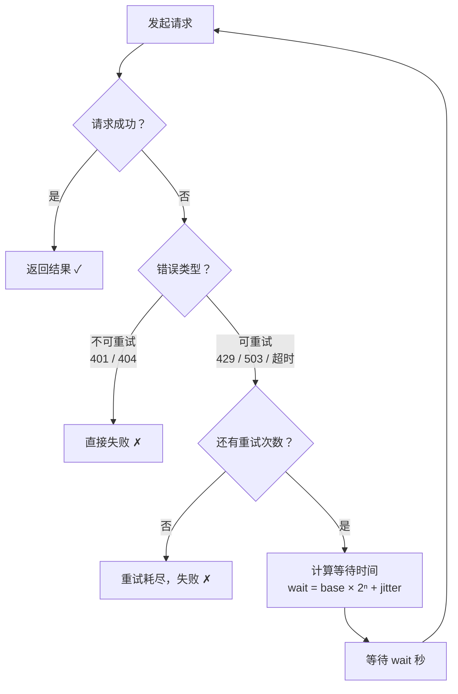

# Agent Retry（重试机制）

## 概念解释

重试机制（Retry）是指当 Agent 调用外部服务（LLM API、数据库、搜索引擎等）失败时，系统不立即放弃，而是**按照预设策略自动重新尝试**的容错手段。可以类比为"打电话没人接，等一会儿再打一次"。

Agent 系统大量依赖网络调用，而网络本身就不稳定——API 服务器可能短暂过载、网络可能抖动、请求可能被限流（Rate Limit，速率限制）。据 OpenAI 官方文档记录，429 Too Many Requests（请求过多）是生产环境中最常遇到的 API 错误码。如果每次遇到这类**临时性故障**就直接报错，用户体验和任务成功率都会大打折扣。

重试机制与传统的"出错就抛异常"做法的核心区别在于：它能自动区分"临时故障"和"永久错误"，只对有恢复可能的故障进行重试，并通过逐渐加长等待时间来避免给已经不堪重负的服务器雪上加霜。

## 关键结构

| 结构 | 作用 | 说明 |
|------|------|------|
| 错误分类 | 判断是否值得重试 | 区分可重试错误（429、503、超时）和不可重试错误（401、404） |
| 退避策略 | 控制重试间隔 | 决定每次重试之间等待多久，常用指数退避 |
| 重试上限 | 防止无限循环 | 设定最大重试次数（通常 3-5 次）和最大等待时间 |
| Jitter（随机抖动） | 打散重试时间 | 加入随机偏移，防止多个客户端同时重试造成二次拥堵 |

### 结构 1：错误分类

并非所有错误都值得重试。错误分类是重试机制的第一道关卡：

- **可重试错误**：HTTP 429（限流）、503（服务暂时不可用）、`ConnectionError`（连接失败）、`TimeoutError`（超时）。这些属于临时性故障，等一会儿可能就好了。
- **不可重试错误**：HTTP 401（认证失败）、400（参数错误）、404（资源不存在）。这些是永久性问题，重试多少次结果都一样。

AWS 的重试最佳实践明确指出：只对网络抖动、超时、限流（HTTP 429 带 Retry-After 头）和临时过载（HTTP 503）进行重试。

### 结构 2：退避策略

退避策略决定两次重试之间等待多长时间。常见的策略有三种：

- **固定延迟**：每次等 1 秒。简单，但所有客户端会在同一时刻重试，造成"雷鸣羊群"（Thundering Herd，多个请求同时涌入）。
- **线性退避**：第 1 次等 1 秒、第 2 次等 2 秒、第 3 次等 3 秒。增长太慢，对严重故障恢复效果有限。
- **指数退避**（Exponential Backoff）：第 1 次等 1 秒、第 2 次等 2 秒、第 3 次等 4 秒。增长够快，给服务端充分恢复时间，是**业界标准做法**。

### 结构 3：重试上限

没有上限的重试等于无限循环。AWS 推荐的参数范围：

- 最大重试次数：3-5 次（含首次请求）
- 单次最大等待时间上限（Cap）：10-30 秒
- 总重试时间预算（Deadline）：10-60 秒

### 结构 4：Jitter（随机抖动）

即使使用了指数退避，如果 100 个客户端在同一时刻失败，它们的重试时间仍然会"对齐"。Jitter 通过给等待时间加上一个随机偏移量来打散重试时间点。AWS 在其 Builder's Library 中将 Full Jitter（完全随机化）列为推荐的默认策略。

## 核心原理

### 原理说明

指数退避 + Jitter 的计算过程：

1. **首次请求失败** -> 判断错误类型，如果是可重试错误，进入重试流程
2. **计算等待时间**：`wait = min(base * 2^n, max_delay) + random(0, jitter)`，其中 `n` 是当前重试次数
3. **等待后重试** -> 如果成功，返回结果；如果失败，`n + 1` 后重复步骤 2
4. **达到上限** -> 返回错误或执行降级方案（Fallback，备选方案）

以初始延迟 1 秒、退避因子 2、最大延迟 30 秒为例：

| 重试次数 | 基础延迟 | 加 Jitter 后（示意） |
|---------|---------|---------------------|
| 第 1 次 | 1 秒 | 0.8 ~ 1.2 秒 |
| 第 2 次 | 2 秒 | 1.6 ~ 2.4 秒 |
| 第 3 次 | 4 秒 | 3.2 ~ 4.8 秒 |
| 第 4 次 | 8 秒 | 6.4 ~ 9.6 秒 |
| 第 5 次 | 16 秒 | 12.8 ~ 19.2 秒 |

### Mermaid 图解



图中的核心分叉点在"错误类型"判断处：不可重试错误直接跳出循环，可重试错误才进入退避等待。每次重试前都会检查剩余次数，防止无限循环。

### 运行示例

```python
import time
import random
from functools import wraps

def retry(max_attempts=3, base_delay=1.0, backoff_factor=2.0, max_delay=30.0,
          retryable_errors=(ConnectionError, TimeoutError)):
    """带指数退避和 Jitter 的重试装饰器"""
    def decorator(func):
        @wraps(func)
        def wrapper(*args, **kwargs):
            delay = base_delay
            for attempt in range(max_attempts):
                try:
                    return func(*args, **kwargs)
                except retryable_errors as e:
                    if attempt == max_attempts - 1:
                        raise  # 最后一次失败，抛出异常
                    # 指数退避 + Jitter
                    wait = min(delay, max_delay) + random.uniform(0, delay * 0.1)
                    print(f"第 {attempt+1} 次失败: {e}，等待 {wait:.1f}s 后重试")
                    time.sleep(wait)
                    delay *= backoff_factor
        return wrapper
    return decorator

# 使用示例
@retry(max_attempts=3, base_delay=1.0)
def call_api(prompt):
    """模拟可能失败的 API 调用"""
    if random.random() < 0.5:
        raise ConnectionError("服务暂时不可用")
    return f"回复: {prompt}"
```

装饰器内部用 `delay *= backoff_factor` 实现指数增长，`random.uniform(0, delay * 0.1)` 加入 Jitter。`max_delay` 防止等待时间无限增长。实际生产中通常使用 tenacity 库（`pip install tenacity`）而非手写，它提供了 `wait_exponential_jitter` 等现成策略。

## 易混概念辨析

| 概念 | 与重试机制的区别 | 更适合关注的重点 |
|------|-----------------|-----------------|
| 熔断器（Circuit Breaker） | 重试是"失败后再试"，熔断器是"故障太多就别试了" | 防止对已崩溃的服务持续发送请求 |
| 超时控制（Timeout） | 超时控制的是"单次请求最多等多久"，重试控制的是"失败后要不要再来" | 单次请求的时间边界 |
| 降级（Fallback） | 降级是"正路不通走备路"，重试是"正路堵了等一等再走" | 提供替代方案保证基本可用 |
| 幂等性（Idempotency） | 幂等性不是容错机制，但它是重试安全执行的前提 | 确保同一操作重复执行不会产生副作用 |

核心区别：

- **重试机制**：关注"失败后按策略自动重新执行"
- **熔断器**：关注"失败率过高时主动停止请求，保护系统不被拖垮"。二者经常配合使用——先重试，重试太多次就熔断
- **降级**：关注"主服务不可用时提供替代方案"。常作为重试耗尽后的兜底策略

## 适用边界与局限

### 适用场景

1. **LLM API 调用**：OpenAI、Claude 等 API 经常返回 429 限流错误，使用指数退避重试是官方推荐的标准处理方式
2. **网络不稳定环境**：Agent 调用搜索引擎、网页抓取等场景，网络抖动和超时很常见，重试能显著提高成功率
3. **多步骤工作流的中间环节**：数据采集流水线中某一步失败，只需重试该步骤，不必从头开始

### 不适合的场景

1. **非幂等操作**：支付扣款、库存扣减等操作重试会导致重复执行。如果必须重试，需要配合幂等键（Idempotency Key）去重
2. **永久性错误**：认证失败（401）、参数错误（400）不会因为重试而变好，应直接报错修复代码
3. **实时性要求极高的场景**：3 次指数退避重试可能累计耗时 7 秒以上，对毫秒级响应的实时系统不可接受

### 局限性

1. **增加响应延迟**：重试本质上是用时间换成功率，3 次重试 + 指数退避可能让响应时间从 1 秒变成 8 秒
2. **可能掩盖根本问题**：如果 90% 的请求都靠重试才成功，说明系统有根本性缺陷，不应靠重试掩盖
3. **配置不当会适得其反**：重试次数过多、延迟过短会形成"重试风暴"（Retry Storm），加剧服务端压力

## 常见误区

| 常见误区 | 正确理解 |
|----------|----------|
| 所有错误都应该重试 | 只有临时性错误（429、503、超时）值得重试，永久性错误（401、404）重试无意义 |
| 失败后立即重试效果最好 | 立即重试可能给已过载的服务雪上加霜，必须使用退避延迟。AWS 和 OpenAI 均推荐指数退避 + Jitter |
| 重试次数越多越可靠 | 过多重试会大幅增加延迟并浪费资源，3-5 次是业界推荐值。超过上限应走降级方案 |
| 只要加了重试就万事大吉 | 重试只解决临时故障，不能替代容量规划、服务监控和根因修复 |

## 思考题

<details>
<summary>初级：为什么重试前要区分错误类型？如果对 401 错误也进行重试会怎样？</summary>

**参考答案：**

401 是认证失败，属于永久性错误，不会因为重试而变好。对它重试只会白白浪费时间（假设 3 次重试 + 指数退避 = 7 秒），还会给服务器增加无意义的请求负担。正确做法是立即失败并提示用户检查 API Key。

</details>

<details>
<summary>中级：指数退避为什么要加 Jitter？不加会怎样？</summary>

**参考答案：**

不加 Jitter 时，所有在同一时刻失败的客户端会按相同的退避时间表重试（比如都在第 1 秒、第 3 秒、第 7 秒重试），形成周期性的请求洪峰，即"雷鸣羊群"效应。加 Jitter 后，每个客户端的重试时间被随机打散，服务器收到的请求从"脉冲式"变为"均匀分布式"，大幅降低二次过载风险。AWS Builder's Library 对此有详细分析。

</details>

<details>
<summary>中级/进阶：一个 Agent 需要调用支付 API 完成转账，遇到超时后应该如何处理？直接重试安全吗？</summary>

**参考答案：**

不安全。支付转账是非幂等操作，直接重试可能导致重复扣款。正确做法是：(1) 为每笔交易生成唯一的幂等键（Idempotency Key），随请求发送给支付 API；(2) 支付 API 服务端根据幂等键判断是否为重复请求，如果是则直接返回上次的结果而不重复执行；(3) 在客户端，超时后先查询交易状态，确认未成功后再携带相同幂等键重试。Stripe 等支付平台的 API 原生支持幂等键机制。

</details>

## 参考资料

1. AWS Builder's Library - Timeouts, retries and backoff with jitter：https://aws.amazon.com/builders-library/timeouts-retries-and-backoff-with-jitter/
2. OpenAI Help Center - How can I solve 429 Too Many Requests errors：https://help.openai.com/en/articles/5955604-how-can-i-solve-429-too-many-requests-errors
3. OpenAI Cookbook - How to handle rate limits：https://cookbook.openai.com/examples/how_to_handle_rate_limits
4. Tenacity（Python 重试库）官方文档：https://tenacity.readthedocs.io/
5. AWS Prescriptive Guidance - Retry with backoff pattern：https://docs.aws.amazon.com/prescriptive-guidance/latest/cloud-design-patterns/retry-backoff.html
