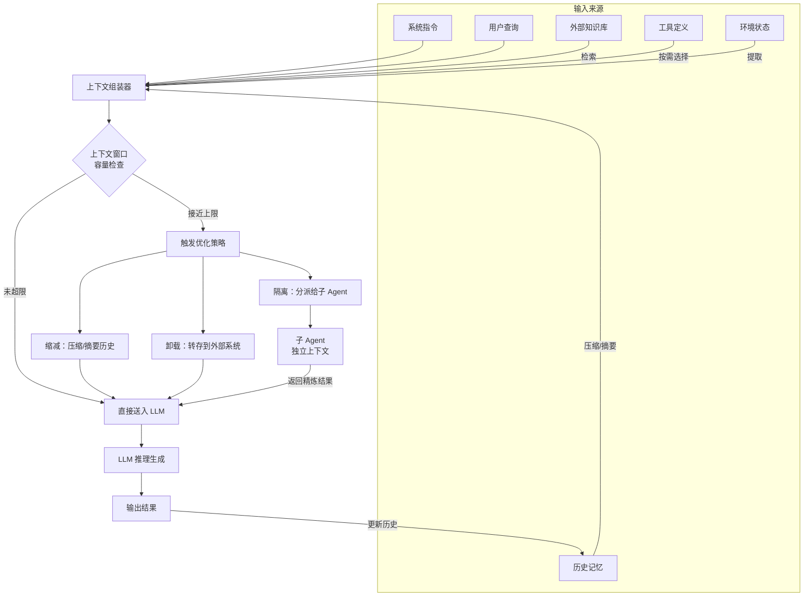

# 上下文工程（Context Engineering）

## 概念解释

上下文工程（Context Engineering）是一种系统化地设计、组装和管理输入给大语言模型（LLM）的全部信息的方法。它的核心目标只有一个：**在正确的时间，以正确的格式，把正确的信息递给模型**。

为什么需要它？因为 LLM 本身是"无状态"的——它每次生成回答时，只能看到你这一次请求中传给它的所有内容，也就是所谓的上下文窗口（Context Window）。这个窗口有大小限制，而且塞得越满、模型越难找到关键信息。早期开发者主要关注"怎么写好一句提示词"（即 Prompt Engineering），但随着 Agent 应用越来越复杂，单靠写好提示词已经远远不够了——你还得管理对话历史、工具定义、检索结果、外部数据等大量动态信息。

Andrej Karpathy（前 OpenAI 研究员）对此有一个广泛传播的比喻：**LLM 是 CPU，上下文窗口就是 RAM，上下文工程就是操作系统的内存管理器**。就像操作系统要决定哪些数据留在内存、哪些换出到硬盘一样，上下文工程要决定哪些信息放进上下文窗口、哪些存到外部、哪些压缩成摘要。

这个概念在 2025 年由 Shopify CEO Tobi Lutke 和 Andrej Karpathy 的推文引发行业关注，随后 Anthropic、Manus、LangChain 等团队都发表了系统性的实践总结。

## 关键结构

上下文工程处理的"上下文"，并不只是用户输入的一句话。它由多个组成部分动态组装而成：

| 组成部分 | 说明 | 举例 |
|----------|------|------|
| 系统指令（Instructions） | 告诉模型"你是谁、该怎么做"的固定指令 | 系统提示词、角色设定、输出格式要求 |
| 用户查询（Query） | 当前这一轮用户的输入 | "帮我分析这段代码的性能问题" |
| 知识（Knowledge） | 从外部检索到的参考资料 | RAG 检索的文档片段、数据库查询结果 |
| 工具定义（Tools） | 模型可以调用的工具的名称和参数说明 | 函数签名、API 描述 |
| 记忆（Memory） | 历史对话或跨会话的持久化记录 | 之前的对话摘要、用户偏好 |
| 状态（State） | 当前环境的实时信息 | 当前时间、任务进度、文件系统状态 |

可以用一个公式来理解：

```
上下文 = 组装(指令, 知识, 工具, 记忆, 状态, 查询)
```

上下文工程就是设计和优化这些组件的组装方式，使模型在给定任务上的表现最大化。

### 组成部分之间的关系

这些部分并不是简单堆砌的。系统指令通常是固定的，占用固定的 token 预算；用户查询每轮变化；知识和状态需要按需动态加载；记忆需要压缩和筛选；工具定义需要根据任务类型选择性暴露。上下文工程的核心挑战就在于：**在有限的窗口里，为这些组件分配合理的空间**。

## 核心原理

### 原理说明

上下文工程的核心原则是：**寻找能最大化期望结果的最小高信号 token 集合**。

为什么不是"越多越好"？因为存在两个关键约束：

1. **窗口大小有限**：即使是支持百万 token 的模型，物理限制始终存在
2. **上下文腐化（Context Rot）**：Anthropic 的研究表明，随着上下文中 token 数量增加，模型准确回忆信息的能力会下降。Transformer 架构中每个 token 需要关注所有其他 token（产生 n² 级别的配对关系），上下文越长，注意力越分散

因此，上下文应被视为**收益递减的有限资源**——不是塞得越满越好，而是要精准投放。

业界主流实践（综合 Anthropic、Manus、Phil Schmid 等团队的总结）将上下文管理归纳为四种核心策略：

**策略一：上下文缩减（Context Reduction）**
压缩历史内容，防止窗口膨胀。具体分两个层次：
- 压缩（Compaction）：可逆操作，去除冗余信息（如清除已执行工具调用的完整返回值，只保留关键结果）
- 摘要（Summarization）：有损操作，用 LLM 对历史进行总结

优先级顺序：**原始内容 > 压缩 > 摘要**，只有压缩无法腾出足够空间时才使用摘要。

**策略二：上下文卸载（Context Offloading）**
将信息转移到上下文窗口之外的外部系统存储。例如，Agent 生成了大量代码文件后，聊天历史中只保留文件路径引用（如 `输出已保存到 /src/main.py`），文件本身存储在文件系统中，需要时通过工具重新读取。

**策略三：上下文检索（Context Retrieval）**
不预加载所有数据，而是维护轻量级标识符（文件路径、查询语句、链接等），运行时按需动态加载。Claude Code 就采用这种方式：用 grep、glob 等命令即时检索文件内容，而不是把整个代码库塞进上下文。

**策略四：上下文隔离（Context Isolation）**
将不同任务或不同 Agent 的上下文分开，避免相互污染。核心理念借用了并发编程的原则："通过通信来共享内存，而非通过共享内存来通信"。具体做法是为子 Agent 创建独立的上下文窗口，只传递必要的指令和结果摘要。

### Mermaid 图解



图中展示了上下文工程的完整工作流程：

- 左侧是六种信息来源，它们需要被组装成一个统一的上下文
- 中间的组装器负责筛选、格式化和排列这些信息
- 容量检查环节决定是否需要触发优化策略
- 三种优化策略（缩减、卸载、隔离）分别对应不同的处理方式
- 子 Agent 处理后只返回精炼结果，大幅减少主上下文的占用

### 运行示例

以下伪代码展示上下文组装的核心逻辑，不依赖特定框架：

```python
from dataclasses import dataclass

@dataclass
class ContextBudget:
    """上下文预算管理"""
    max_tokens: int        # 模型窗口上限
    reserved_for_output: int  # 为输出预留的空间

    @property
    def available(self) -> int:
        return self.max_tokens - self.reserved_for_output

def assemble_context(
    system_prompt: str,
    query: str,
    tools: list[dict],
    memory: list[dict],
    knowledge: list[str],
    budget: ContextBudget
) -> list[dict]:
    """
    上下文组装的核心逻辑：按优先级分配 token 预算。
    优先级：系统指令 > 用户查询 > 工具定义 > 检索知识 > 历史记忆
    """
    context = []
    used_tokens = 0

    # 第一优先级：系统指令（永远保留）
    context.append({"role": "system", "content": system_prompt})
    used_tokens += count_tokens(system_prompt)

    # 第二优先级：当前查询（永远保留）
    context.append({"role": "user", "content": query})
    used_tokens += count_tokens(query)

    # 第三优先级：工具定义（按任务相关性筛选）
    relevant_tools = select_relevant_tools(tools, query)
    used_tokens += count_tokens(str(relevant_tools))

    # 第四优先级：检索知识（按相关性排序，贪心填充）
    for doc in sorted(knowledge, key=lambda d: relevance_score(d, query), reverse=True):
        doc_tokens = count_tokens(doc)
        if used_tokens + doc_tokens > budget.available * 0.8:
            break  # 留 20% 给历史记忆
        context.append({"role": "system", "content": f"[参考资料] {doc}"})
        used_tokens += doc_tokens

    # 第五优先级：历史记忆（最近的优先，超限则压缩）
    remaining = budget.available - used_tokens
    compressed_memory = fit_memory(memory, remaining)
    context.extend(compressed_memory)

    return context

def fit_memory(memory: list[dict], token_limit: int) -> list[dict]:
    """将历史记忆压缩到指定 token 预算内"""
    total = sum(count_tokens(m["content"]) for m in memory)
    if total <= token_limit:
        return memory  # 不需要压缩

    # 策略：保留最近 N 条 + 将更早的压缩为摘要
    recent = memory[-3:]  # 保留最近 3 条
    older = memory[:-3]
    summary = summarize(older)  # 用 LLM 生成摘要
    return [{"role": "system", "content": f"[历史摘要] {summary}"}] + recent
```

上述代码对应"关键结构"中的组装逻辑和"核心原理"中的预算分配机制。其中 `count_tokens`、`relevance_score`、`summarize`、`select_relevant_tools` 为需要自行实现的辅助函数，此处省略以突出核心逻辑。

## 易混概念辨析

| 概念 | 与上下文工程的区别 | 更适合关注的重点 |
|------|-------------------|-----------------|
| Prompt Engineering（提示词工程） | 只关注"怎么写好一句指令"，是上下文工程的子集 | 单次交互中指令的措辞和格式优化 |
| RAG（检索增强生成） | 是上下文工程的一种具体实现手段，只负责"从外部检索知识" | 外部知识的索引、检索和注入 |
| MCP（Model Context Protocol） | 是上下文传递的标准化协议，解决"怎么把上下文传给模型" | 工具和数据源的接入标准化 |
| Memory（记忆机制） | 是上下文工程管理的对象之一，专注于跨会话的信息持久化 | 长期记忆的存储、检索和遗忘策略 |

核心区别：

- **上下文工程**：关注整个信息流的生命周期——从哪获取、怎么筛选、如何压缩、何时注入、怎么隔离
- **Prompt Engineering**：只关注指令编写这一个环节，是上下文工程的起点而非全部
- **RAG**：只负责"检索知识"这一种信息来源，上下文工程还要管理工具、记忆、状态等其他来源
- **MCP**：解决的是"接口标准化"问题，上下文工程解决的是"信息管理策略"问题

## 适用边界与局限

### 适用场景

1. **长时间运行的 Agent**：Agent 执行多步骤任务（如自动编程、数据分析），对话历史快速增长，必须主动管理上下文才能持续运行
2. **多工具 Agent 系统**：Agent 集成了大量工具，需要根据当前任务动态选择暴露哪些工具定义，而不是全部塞进上下文
3. **多 Agent 协作架构**：多个 Agent 共同完成任务，每个 Agent 只需要与自己职责相关的信息，上下文隔离可以避免相互干扰
4. **RAG 系统的精细化管理**：检索返回大量候选文档时，需要排序和筛选后再注入上下文

### 不适合的场景

1. **简单的单轮问答**：如果只是一问一答（如翻译一句话、解释一个词），上下文管理开销大于收益
2. **上下文窗口远未用满**：如果总 token 消耗远低于模型窗口上限（如只用了 5%），花精力优化上下文没有意义

### 局限性

1. **压缩必然有信息损失**：无论摘要算法多好，有损压缩都会丢失部分细节。对于要求严格审计追溯的场景（如法律、医疗），需要在外部保留完整记录
2. **额外的计算成本**：摘要生成需要额外的 LLM 调用，相似度计算需要 Embedding 模型调用，这些都是额外开销。对于短对话或低频交互，开销可能不划算
3. **优化策略需要调参**：压缩阈值、保留条数、优先级权重等参数需要针对具体场景调优，没有通用最优解

## 常见误区

| 常见误区 | 正确理解 |
|----------|----------|
| "上下文窗口越大，就不需要上下文工程了" | 窗口再大也存在上下文腐化问题。研究表明模型在超长上下文中回忆信息的准确率会显著下降，更大的窗口反而更需要精细管理 |
| "上下文工程就是高级版的 Prompt Engineering" | Prompt Engineering 只关注指令编写，上下文工程还包括检索策略、记忆管理、压缩算法、隔离架构等系统级设计 |
| "把所有信息都塞进上下文最安全" | 大量无关信息会分散模型注意力，反而降低回答质量。精选高相关信息比全量输入效果更好 |
| "删除历史消息就会丢失重要信息" | 通过摘要保留关键决策和结论，信息的核心语义得以保留。盲目截断才会丢失信息，智能压缩不会 |

## 思考题

<details>
<summary>初级：上下文工程和 Prompt Engineering 的核心区别是什么？</summary>

**参考答案：**

Prompt Engineering 专注于优化"指令本身的措辞和格式"——即怎么问好一个问题。上下文工程的范围更大，它关注的是送入模型的**全部信息**的管理：不仅包括指令，还包括对话历史如何压缩、外部知识如何检索和筛选、工具定义如何按需暴露、多个 Agent 之间如何隔离上下文等。可以说 Prompt Engineering 是上下文工程的一个子集。

</details>

<details>
<summary>中级：一个 Agent 的上下文使用率达到 80%，此时有三种选择：(A) 删除最早的 5 条消息、(B) 用 LLM 对历史生成摘要、(C) 先清除已完成的工具调用返回值。哪个应该最先执行？为什么？</summary>

**参考答案：**

应该最先执行 (C)。根据"原始内容 > 压缩 > 摘要"的优先级原则：清除已完成工具调用的完整返回值属于压缩操作（可逆、无损），只去除冗余数据而不丢失核心信息。(A) 是盲目截断，会丢失可能重要的早期上下文。(B) 是有损操作，应该在压缩不够用时才使用。最佳实践是先做无损压缩（清除冗余），不够再做有损摘要，最后才考虑直接删除。

</details>

<details>
<summary>中级/进阶：在一个多 Agent 协作系统中，主 Agent 协调三个子 Agent（代码生成、测试、部署）。如果让三个子 Agent 共享同一个上下文窗口，会出现什么问题？如何用上下文隔离策略解决？</summary>

**参考答案：**

共享上下文的问题：(1) 代码生成产生的大量代码片段会占用测试和部署 Agent 的上下文空间；(2) 不同 Agent 关注的信息类型完全不同，无关信息会干扰彼此的推理；(3) 任何一个 Agent 的历史膨胀都会挤压其他 Agent 的可用空间。

隔离策略：为每个子 Agent 创建独立的上下文窗口。主 Agent 只向子 Agent 传递该任务所需的最小信息（如代码 Agent 只收到需求描述，测试 Agent 只收到代码文件路径和测试要求）。子 Agent 完成后只返回精炼的结果摘要（通常 1000-2000 tokens），而非完整的推理过程。这样每个 Agent 都能在干净的上下文中专注工作。

</details>

## 参考资料

1. Anthropic. "Effective context engineering for AI agents." https://www.anthropic.com/engineering/effective-context-engineering-for-ai-agents
2. Phil Schmid. "Context Engineering for AI Agents: Part 2."（综合 Manus Peak Ji 等团队实践） https://www.philschmid.de/context-engineering-part-2
3. LlamaIndex. "Context Engineering Guide: Techniques for AI Agents." https://www.llamaindex.ai/blog/context-engineering-what-it-is-and-techniques-to-consider
4. Weaviate. "Context Engineering - LLM Memory and Retrieval for AI Agents." https://weaviate.io/blog/context-engineering
5. 16x Engineer. "LLM Context Management: How to Improve Performance and Lower Costs." https://eval.16x.engineer/blog/llm-context-management-guide

---
