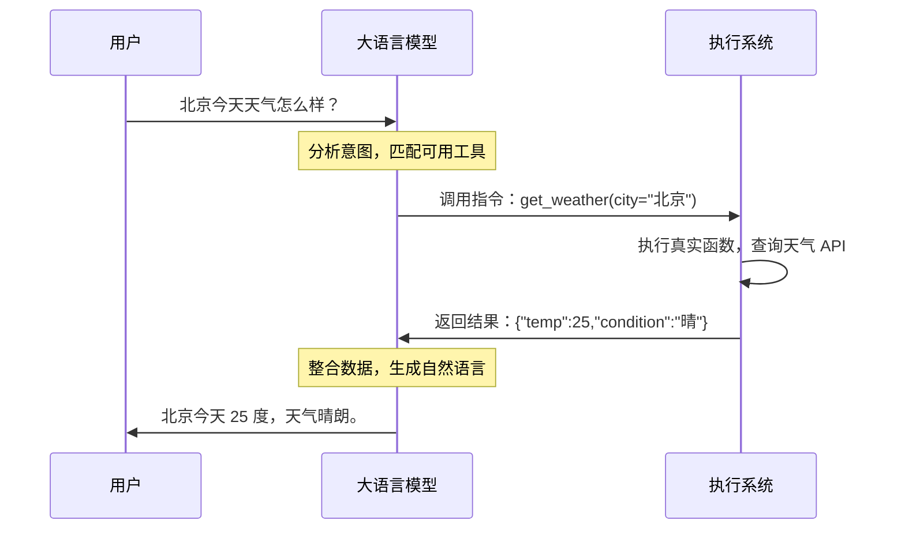

# Function Calling（函数调用）

## 概念解释

Function Calling（函数调用）是一种让大语言模型（LLM）在对话过程中**以结构化格式输出函数调用指令**，从而驱动外部系统执行真实操作的机制。

默认情况下，大语言模型只能输出文本。用户问"北京今天天气怎么样"，模型只能根据训练数据编造一个答案，无法真正查询实时天气。模型可以告诉你怎么查天气、怎么发邮件、怎么查数据库，但它自己做不了这些事。

Function Calling 在"会说"和"会做"之间加了一层桥梁：当模型判断当前问题需要借助外部能力时，它不再只输出自然语言，而是输出一段结构化的调用指令（函数名 + 参数的 JSON），由外部系统去执行真实函数，再把结果返回给模型组织成最终回答。

它和传统 API 调用的根本差异在于：传统 API 调用是程序员在代码里写死"调什么、传什么"，而 Function Calling 是模型根据用户意图**自主判断**要不要调、调哪个、传什么参数。这种"模型决策 + 系统执行"的分工，是 Function Calling 区别于普通编程调用的核心特征。

> 需要注意的是，"Function Calling"和"Tool Calling（工具调用）"在当前行业语境下基本等价。OpenAI 早期使用 `functions` 参数，后来统一改为 `tools` 参数；Anthropic 从一开始就称为"Tool Use"。两个术语指的是同一种机制。

## 关键结构

Function Calling 的核心是一条完整的**调用链**，由 5 个环节组成。每个环节都不可省略，前一步的输出就是后一步的输入。

1. **意图识别**：模型判断用户请求是否需要调用外部函数。
   输入是用户的自然语言请求，输出是一个决策：直接回答，还是借助外部工具。判断依据来自模型对请求的理解和可用工具的 Schema（工具定义描述）。如果这一步判断错了，后面整条链路都会偏。

2. **指令生成**：模型把调用意图转化为结构化指令。
   模型输出的不再是自然语言，而是包含函数名和参数的 JSON 数据。例如 `{"function": "get_weather", "parameters": {"city": "北京"}}`。这一步把"用户想做什么"翻译成"系统可执行什么"。

3. **系统执行**：外部系统根据指令找到真实函数并执行。
   模型本身不运行代码，不访问数据库，不调用 API。真正执行的是外部系统：它根据函数名找到对应实现，校验参数后执行真实逻辑。

4. **结果回传**：系统把执行结果返回给模型。
   函数执行后的结果通常是结构化数据（JSON、状态码等），系统将其以约定格式送回模型。

5. **结果整合**：模型把结构化数据组织成用户能理解的回答。
   例如把 `{"temp": 25, "condition": "晴"}` 整理成"北京今天 25 度，天气晴朗"。

## 核心原理

### 原理说明

Function Calling 的运转依赖三个角色的协作：

- **工具定义（Tool Schema）**：开发者预先编写的 JSON 描述，告诉模型有哪些函数可用、每个函数做什么、需要哪些参数。模型完全依赖 Schema 来理解工具的用途，Schema 写得模糊，模型就容易误判。
- **模型（LLM）**：负责分析用户意图、决定是否调用工具、选择调用哪个函数、生成参数。模型只输出调用指令，不执行任何代码。
- **执行系统**：负责接收模型生成的调用指令，校验参数，调用真实函数，返回结果。

整个过程可以分为两种情况：

**情况一：不需要调用函数。** 模型判断自身知识足以回答，直接输出文本。

**情况二：需要调用函数。** 模型输出结构化调用指令 -> 系统执行 -> 结果回传 -> 模型整合输出。如果一次调用不够，模型可以发起多次调用（串行或并行），形成多轮循环。

各家 LLM 的 API 格式略有差异，但机制一致：

| 平台 | 工具定义字段 | 调用响应格式 | 结果回传字段 |
|------|------------|------------|------------|
| OpenAI | `tools` 参数，内含 `function.parameters` | `tool_calls` 数组 | `role: "tool"` |
| Anthropic | `tools` 参数，内含 `input_schema` | `tool_use` 内容块 | `tool_result` 内容块 |
| Google Gemini | `tools` 参数，内含 `functionDeclarations` | `functionCall` 部分 | `functionResponse` 部分 |

### Mermaid 图解



图中的关键分工：模型只在左侧"思考和生成指令"，真正的函数执行发生在右侧的"执行系统"。模型和执行系统之间通过结构化 JSON 交互，而不是自由文本。

### 运行示例

```python
# 最小示例：展示 Function Calling 的核心调用链
# 无需第三方库，纯 Python 演示核心机制

def get_weather(city: str) -> dict:
    """模拟天气查询函数"""
    data = {
        "北京": {"temp": 25, "condition": "晴"},
        "上海": {"temp": 22, "condition": "多云"},
    }
    return data.get(city, {"temp": "未知", "condition": "暂无数据"})


# 函数映射：把函数名对应到真实实现
function_map = {"get_weather": get_weather}


def fake_model_decision(user_input: str) -> dict:
    """模拟模型的决策输出（实际使用时由 LLM API 返回）"""
    return {"function": "get_weather", "parameters": {"city": "北京"}}


def run(user_input: str) -> str:
    """完整调用链：意图识别 → 指令生成 → 执行 → 结果整合"""
    # 模型生成调用指令
    tool_call = fake_model_decision(user_input)

    # 系统执行真实函数
    func = function_map[tool_call["function"]]
    result = func(**tool_call["parameters"])

    # 整合结果（实际由模型完成）
    return f"{tool_call['parameters']['city']}今天 {result['temp']} 度，天气{result['condition']}。"


print(run("北京今天天气怎么样？"))
# 输出：北京今天 25 度，天气晴。
```

- `fake_model_decision()` 模拟模型的决策和指令生成环节。
- `function_map` 维护函数名到真实实现的映射。
- `func(**tool_call["parameters"])` 是系统执行真实函数的环节。
- 最后的字符串拼接模拟模型整合结果的环节。

示例省略了真实模型调用、参数校验和错误处理，只保留调用链的最小骨架。

## 易混概念辨析

| 概念 | 与 Function Calling 的区别 | 更适合关注的重点 |
|------|---------------------------|------------------|
| Tool Use（工具使用） | 更宽泛的上层概念，Function Calling 是其中一种标准化实现方式 | 工具使用的整体策略和架构设计 |
| MCP（Model Context Protocol，模型上下文协议） | 一种工具注册、发现和连接的标准化协议，不是单次调用机制 | 工具如何跨平台互通和动态发现 |
| 普通 API 调用 | 程序员在代码里写死调用逻辑，不经过模型决策 | 确定性的系统间集成 |
| Agent（智能体） | 具备规划、记忆、工具使用等综合能力的完整系统 | 自主任务分解和多步骤执行 |

核心区别：

- **Function Calling**：聚焦于单次"模型决策 + 系统执行"的调用机制
- **Tool Use**：泛指模型使用外部工具的能力，Function Calling 是其实现手段之一
- **MCP**：解决的是"工具怎么注册和发现"的问题，Function Calling 解决的是"单次调用怎么发生"
- **Agent**：Function Calling 是 Agent 的核心能力之一，但 Agent 还包含规划、记忆等更多能力

## 适用边界与局限

### 适用场景

1. **实时数据查询**：天气、股价、库存等需要最新数据的场景，模型无法靠训练数据回答，必须调用外部数据源
2. **业务系统操作**：查订单、发邮件、创建工单、操作数据库等需要连接外部系统的任务
3. **精确计算**：数学运算、数据统计等模型容易出错的场景，通过调用代码解释器或计算引擎获得精确结果

### 不适合的场景

1. **纯知识问答**：模型自身知识足以回答时，引入 Function Calling 会增加不必要的延迟和成本
2. **不可逆的高风险操作**：转账、删除数据等操作，模型可能选错函数或填错参数，必须额外加入人工确认或安全审批机制

### 局限性

1. **决策不保证正确**：模型可能选错函数、生成错误参数、遗漏必填字段，系统必须做参数校验和边界控制
2. **高度依赖 Schema 质量**：Schema 描述模糊或有歧义时，模型的调用准确率会明显下降。OpenAI 官方建议工具描述要"极其全面和精确"
3. **成本和延迟叠加**：每次函数调用至少需要一次额外的 API 请求。多步骤任务可能产生多轮调用，延迟和费用都会累积

## 常见误区

| 常见误区 | 正确理解 |
|----------|----------|
| 模型自己执行了函数代码 | 模型只输出调用指令（JSON），真正执行代码的是外部系统 |
| 有了 Function Calling 模型就不会出错 | 模型仍然可能选错函数、填错参数，系统端仍需参数验证和错误处理 |
| Function Calling 等于 Agent | 它只是 Agent 的核心能力之一，完整 Agent 还需要规划、记忆、多步推理等 |
| Schema 写好后就不用改了 | 好的 Schema 需要根据实际调用效果反复迭代，OpenAI 推荐使用 `strict: true` 模式保证参数符合定义 |

## 思考题

<details>
<summary>初级：Function Calling 中，模型和执行系统各自负责什么？</summary>

**参考答案：**

模型负责：分析用户意图、判断是否需要调用函数、选择调用哪个函数、生成参数。

执行系统负责：接收调用指令、校验参数、调用真实函数、返回执行结果。

模型不执行代码，系统不做意图判断，两者各司其职。

</details>

<details>
<summary>中级：为什么 Schema 质量会直接影响 Function Calling 的效果？</summary>

**参考答案：**

模型不知道函数在现实中到底做什么，它完全依赖 Schema 中的描述来理解工具的用途和使用场景。

Schema 写得模糊时，模型可能：把不该调用的请求误判为需要调用；选错函数；参数填写不完整或类型不对。

Schema 的本质作用不只是"声明参数格式"，更是帮助模型理解"这个工具什么时候该用、怎么用"。OpenAI 和 Anthropic 都推荐在描述中尽量详尽地说明函数的功能、参数含义和适用边界。

</details>

<details>
<summary>中级/进阶：一个电商客服 Agent 需要调用"查询订单"和"申请退款"两个函数，Function Calling 在这个场景中可能遇到什么风险？你会怎么处理？</summary>

**参考答案：**

主要风险：

- 模型可能在用户只想查订单时误触发退款操作
- 模型可能生成错误的订单号或退款金额
- 退款是不可逆操作，一旦执行就无法撤回

处理方式：

- 在"申请退款"函数的 Schema 中明确标注适用条件，与"查询订单"拉开描述距离
- 对退款类高风险操作增加人工确认环节，不允许模型直接执行
- 系统端对参数做严格校验（订单号是否存在、退款金额是否合理）
- 记录完整的调用日志，便于事后审计

</details>

## 参考资料

1. OpenAI Function Calling 官方文档：https://platform.openai.com/docs/guides/function-calling
2. Anthropic Tool Use 官方文档：https://platform.claude.com/docs/en/agents-and-tools/tool-use/overview
3. Martin Fowler - Function calling using LLMs：https://martinfowler.com/articles/function-call-LLM.html
4. Prompt Engineering Guide - Function Calling with LLMs：https://www.promptingguide.ai/applications/function_calling

---
