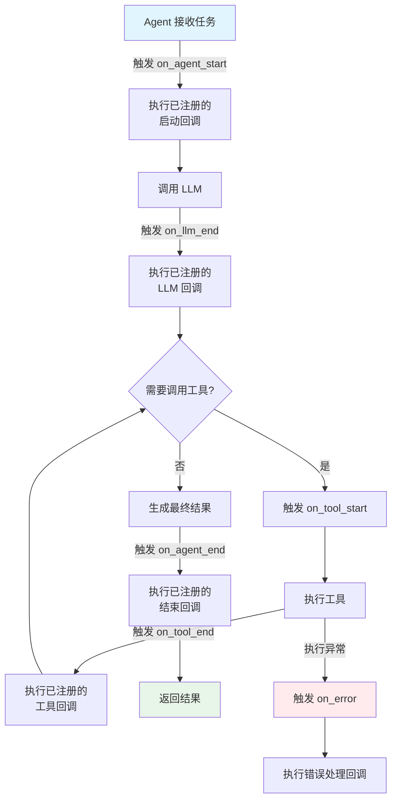

# Hooks（钩子机制）

## 概念解释

Hooks（钩子）是一种在程序执行流程的关键节点上预埋"触发点"的扩展机制。当程序运行到这些节点时，会自动调用开发者事先注册的回调函数（Callback，即"事件发生时自动执行的函数"），从而在不修改核心代码的前提下，插入日志记录、权限校验、性能监控等额外逻辑。

在 Agent 应用中，一次完整的执行涉及多个阶段：接收指令、调用 LLM、使用工具、返回结果。每个阶段的前后都可以设置 Hook。开发者只需要"把自己的函数挂上去"，Agent 运行到该阶段时就会自动执行这些函数。这种做法的好处是：核心执行流程保持干净，扩展功能随时可插拔。

打个比方：Agent 的执行流程像一条流水线，Hooks 就是在流水线的固定工位上加装的"传感器"。传感器不影响流水线本身的运转，但能实时采集数据、发出警报。你可以随时加装或拆除传感器，而不需要改造流水线本身。

## 关键结构

| 结构 | 作用 | 说明 |
|------|------|------|
| 事件类型（Event Type） | 定义"什么时候触发" | 如 `on_agent_start`、`on_tool_end`、`on_error` |
| 回调函数（Callback） | 定义"触发时做什么" | 开发者编写的具体逻辑函数 |
| 注册表（Registry） | 管理"谁在哪里触发" | 维护事件类型与回调函数的映射关系 |
| 事件上下文（Context） | 传递"当前发生了什么" | 包含时间戳、Agent ID、输入输出等信息 |

### 结构 1：事件类型

事件类型定义了 Agent 生命周期（Lifecycle，即从启动到结束的完整过程）中所有可以"挂钩子"的时刻。常见的事件类型包括：

- **Agent 开始 / 结束**：Agent 接到任务开始执行，以及最终返回结果
- **LLM 调用前 / 后**：大语言模型推理的前后
- **工具调用前 / 后**：Agent 调用外部工具（如搜索、计算器）的前后
- **错误发生时**：执行过程中出现异常
- **Handoff（交接）时**：一个 Agent 将控制权移交给另一个 Agent

### 结构 2：回调函数

回调函数是开发者编写的具体逻辑。一个回调函数通常只做一件事，例如"记录日志"或"检查权限"。多个回调可以注册到同一个事件上，按顺序依次执行。

### 结构 3：注册表

注册表是一个中央管理器，本质上是一个字典：key 是事件类型，value 是回调函数列表。当事件触发时，注册表取出对应的回调列表，逐个执行。

### 结构 4：事件上下文

事件上下文是回调函数的"信息来源"。它把当前发生的事情打包成一个对象传给回调函数，包含时间戳、Agent 标识、输入参数、输出结果等，让回调函数能根据实际情况做出判断。

## 核心原理

### 原理说明

Hooks 的核心机制是**事件驱动 + 回调注册**，工作步骤如下：

1. **预定义事件**：框架在 Agent 执行流程的关键节点预埋事件触发点（如"工具调用前""LLM 返回后"）
2. **注册回调**：开发者在应用启动时，将自己编写的回调函数注册到感兴趣的事件上
3. **触发执行**：Agent 运行到某个节点时，框架检查该节点是否有已注册的回调，如果有，就按注册顺序依次执行
4. **错误隔离**：某个回调执行失败不会阻止其他回调或 Agent 主流程的继续执行

这种机制能解决"横切关注点"（Cross-Cutting Concerns，指日志、权限、监控等散布在各处但与核心业务无关的逻辑）问题。无需将这些逻辑硬编码到 Agent 核心代码中，从而保持核心代码的简洁和可维护性。

### Mermaid 图解



图中展示了 Agent 从接收任务到返回结果的完整生命周期。每个蓝色标注的"触发"步骤都是一个 Hook 事件点，开发者可以在这些点上挂载自己的回调函数。工具调用可能多次循环，每次都会触发对应的 Hook。

### 运行示例

以下是一个最小化的 Hooks 机制演示，展示"注册 + 触发"的核心逻辑：

```python
from typing import Callable

# 定义一个最简单的钩子注册表
class HookRegistry:
    """钩子注册表：事件名 -> 回调函数列表"""
    def __init__(self):
        self._hooks: dict[str, list[Callable]] = {}

    def on(self, event: str, callback: Callable):
        """注册回调到指定事件"""
        self._hooks.setdefault(event, []).append(callback)

    def emit(self, event: str, **context):
        """触发事件，执行所有已注册的回调"""
        for cb in self._hooks.get(event, []):
            try:
                cb(**context)
            except Exception as e:
                print(f"回调执行失败: {e}")  # 错误隔离

# --- 使用示例 ---
registry = HookRegistry()

# 注册两个回调到 "on_tool_start" 事件
registry.on("on_tool_start", lambda tool_name, **_: print(f"[日志] 即将调用工具: {tool_name}"))
registry.on("on_tool_start", lambda tool_name, **_: print(f"[权限] 工具 {tool_name} 权限校验通过"))

# 模拟 Agent 调用工具时触发事件
registry.emit("on_tool_start", tool_name="web_search")
# 输出:
# [日志] 即将调用工具: web_search
# [权限] 工具 web_search 权限校验通过
```

`HookRegistry` 用字典管理事件与回调的映射。`on()` 负责注册，`emit()` 负责触发。`try-except` 保证单个回调失败不影响其他回调。

## 易混概念辨析

| 概念 | 与 Hooks 的区别 | 更适合关注的重点 |
|------|-----------------|------------------|
| Webhook | 基于 HTTP 的跨服务通知机制，涉及网络请求 | 服务间的异步事件通知（如 GitHub 推送通知） |
| Middleware（中间件） | 处理请求/响应管道中的全局逻辑，按链式顺序执行 | Web 请求的全局预处理（如认证、跨域） |
| Observer Pattern（观察者模式） | Hooks 的底层设计模式之一，强调一对多的依赖关系 | 理解 Hooks 的设计思想和实现原理 |
| Plugin（插件） | 更重量级的扩展机制，通常包含完整功能模块 | 需要添加完整功能（如新工具、新能力）时 |

核心区别：

- **Hooks**：进程内的轻量级事件回调，关注的是"在执行流程的某个时刻插入逻辑"
- **Webhook**：跨服务的 HTTP 回调通知，关注的是"服务 A 发生事件后通知服务 B"
- **Middleware**：请求管道中的链式处理，每个中间件可以修改请求或响应
- **Observer Pattern**：Hooks 底层使用的设计模式，Hooks 是该模式在 Agent 框架中的具体应用

## 适用边界与局限

### 适用场景

1. **日志与可观测性**：在 Agent 执行的各个阶段收集日志、追踪链路、监控耗时，无需修改 Agent 核心代码
2. **权限与安全校验**：在工具调用前检查用户权限，拒绝未授权的危险操作（如删除数据库）
3. **性能监控与优化**：统计工具调用次数和耗时，识别性能瓶颈
4. **错误处理与恢复**：统一捕获异常并执行重试、降级等策略

### 不适合的场景

1. **需要修改 Agent 核心推理逻辑**：Hooks 只能在固定节点上"观察"或做轻量处理，不适合改写 Agent 的决策过程
2. **跨服务通信**：进程内的 Hooks 不能替代消息队列或 Webhook 来实现分布式系统间的事件传递

### 局限性

1. **隐性控制流**：回调的执行顺序和触发时机不在主流程代码中显式体现，阅读代码时需要额外追踪才能理解完整流程
2. **调试复杂度**：多个回调注册到同一事件时，排查问题需要逐个确认是哪个回调导致的异常
3. **性能开销**：每次事件触发都要遍历回调列表，如果回调过多或回调本身耗时较长，会增加整体延迟

## 常见误区

| 常见误区 | 正确理解 |
|----------|----------|
| "Hooks 就是在代码里加 print 语句打日志" | Hooks 是一套完整的事件驱动扩展机制，日志只是其中一个应用场景。它还能做权限校验、性能监控、错误恢复等 |
| "每个事件都应该注册回调" | 只在需要的事件上注册回调。无用的回调会增加复杂度和性能开销 |
| "Hooks 和 Webhook 是同一个东西" | Hooks 是进程内的函数回调；Webhook 是基于 HTTP 的跨服务通知，两者作用域完全不同 |
| "回调函数可以随意修改 Agent 的执行状态" | 回调函数主要用于"观察"和"轻量处理"。如果回调随意修改状态，会导致执行流程不可预测、调试困难 |

## 思考题

<details>
<summary>初级：Hooks 和直接在代码里写 if-else 做日志记录相比，核心优势是什么？</summary>

**参考答案：**

核心优势是**解耦**。Hooks 将日志等扩展逻辑与 Agent 核心代码分离，核心代码不需要知道有多少个回调、它们做什么。新增或移除功能只需注册或注销回调，无需修改核心代码，符合开闭原则（对扩展开放，对修改关闭）。

</details>

<details>
<summary>中级：如果一个 Agent 框架只提供了 on_agent_start 和 on_agent_end 两个 Hook 事件，这对实际使用有什么限制？</summary>

**参考答案：**

只有 Agent 级别的开始/结束事件，无法对中间过程做精细控制。例如：无法在工具调用前做权限校验（需要 on_tool_start）、无法监控单次 LLM 调用的耗时（需要 on_llm_start/on_llm_end）、无法在 Agent 间 Handoff 时做记录。粒度越粗，可观测性和可控性越低。

</details>

<details>
<summary>中级/进阶：在生产环境中，某个日志回调因为网络异常导致写入远程日志服务失败，这会影响 Agent 的正常执行吗？应该如何设计来避免这个问题？</summary>

**参考答案：**

如果 Hooks 系统实现了错误隔离（即 try-except 包裹每个回调的执行），那么单个回调的失败不会阻断 Agent 主流程和其他回调的执行。为进一步降低影响，可以将耗时的远程写入操作放入异步队列（如 asyncio.create_task 或后台线程），使回调本身快速返回，避免阻塞 Agent 执行。

</details>

## 参考资料

1. OpenAI Agents SDK - Lifecycle Hooks 文档：[https://openai.github.io/openai-agents-python/agents/](https://openai.github.io/openai-agents-python/agents/)
2. LangChain Callbacks 官方文档：[https://python.langchain.com/api_reference/core/callbacks.html](https://python.langchain.com/api_reference/core/callbacks.html)
3. 设计模式经典著作 - Observer Pattern：Gamma, E. 等 (1994). *Design Patterns: Elements of Reusable Object-Oriented Software*. [https://en.wikipedia.org/wiki/Observer_pattern](https://en.wikipedia.org/wiki/Observer_pattern)
4. Python asyncio 事件与回调：[https://docs.python.org/3/library/asyncio.html](https://docs.python.org/3/library/asyncio.html)
