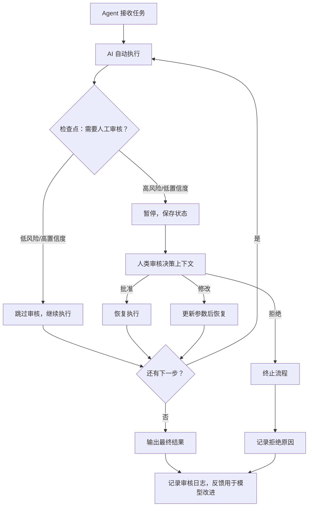

# Human-in-the-Loop（人机协同）

## 概念解释

Human-in-the-Loop（缩写 HITL，中文常译作"人在环路"或"人机协同"）是一种让人类参与到 AI 自动化流程中的协作模式。它的核心思路是：AI 负责跑大部分流程，但在关键决策点暂停下来，等人类审核、确认或修改后再继续。

为什么需要 HITL？因为 AI Agent 有两个天然矛盾：**自主性**带来了智能行为和效率，但软件交付需要**确定性**和安全性。AI 可能产生幻觉（Hallucination，即编造不存在的信息）、误判风险、执行危险操作。在金融转账、医疗诊断、代码部署这类高风险场景中，让 AI 全自动运行是不可接受的。HITL 通过在关键节点插入人类判断，在"AI 的速度"和"人类的可靠性"之间找到平衡点。

与完全人工或完全自动的方式相比，HITL 是一种折中策略：低风险操作由 AI 自动处理（速度快、成本低），高风险操作由人类把关（安全可控）。据 Gartner 统计，超过 60% 的企业级 AI 项目已经集成了某种形式的 HITL 机制。

## 关键结构

HITL 系统由三个核心组件构成，缺一不可：

| 结构 | 作用 | 说明 |
|------|------|------|
| 检查点（Checkpoint） | 标记"在哪里暂停" | 预先定义好需要人工介入的决策节点 |
| 审核反馈（Approval） | 决定"怎么处理" | 人类给出批准、拒绝或修改的指令 |
| 反馈循环（Feedback Loop） | 实现"越用越好" | 人类的修正数据反哺模型改进 |

### 结构 1：检查点（Checkpoint）

检查点是 HITL 系统的"红绿灯"。它标记了流程中需要暂停等待人类审核的位置。设置检查点需要权衡三个因素：

- **风险等级**：操作出错的后果有多严重（转账 100 万 vs 发一条通知）
- **AI 置信度**：模型对自己的判断有多大把握（置信度低则应暂停）
- **审核成本**：人类审核这个操作需要多少时间和专业知识

一个好的检查点：大额转账审批（高风险、审核成本合理）。一个坏的检查点：每条社交媒体评论是否含敏感词（低风险、审核量巨大）。

### 结构 2：审核反馈（Approval）

当流程在检查点暂停后，人类有三种选择：

- **批准（Approve）**：认可 AI 的方案，流程继续执行
- **拒绝（Reject）**：否决 AI 的方案，流程终止或回退
- **修改后批准（Modify）**：调整 AI 方案中的参数或内容后再继续

这三种操作都会被记录，作为后续模型优化的数据来源。

### 结构 3：反馈循环（Feedback Loop）

人类每次做的修正都携带了宝贵的信息——AI 在哪里出错了、应该怎么改。这些反馈可以用来：

1. 微调模型参数，降低同类错误
2. 调整检查点策略（哪些操作可以放宽为自动执行，哪些需要增加审核）
3. 积累高质量标注数据，用于下一轮模型训练

## 核心原理

### 原理说明

HITL 的运行机制可以拆解为四步：

1. **AI 处理**：Agent 接收任务，自动执行分析、推理、生成等操作
2. **检查点判断**：系统根据预设规则判断当前步骤是否需要人工审核。判断依据通常是操作类型（如删除数据库、大额支付）或 AI 置信度（低于阈值就暂停）
3. **人类审核**：流程暂停，将 AI 的决策上下文（分析过程、置信度、备选方案）展示给人类。人类做出批准、拒绝或修改的决定
4. **恢复执行**：根据人类的反馈继续或终止流程，同时记录本次审核结果

在 Agent 框架中，这个机制通过**状态持久化**（Persistence）实现：流程暂停时，当前状态被保存到存储层（如数据库）；人类审核后，系统从保存的状态恢复执行。这使得"暂停等人类"可以持续几秒到几天，不会丢失上下文。

### Mermaid 图解



图中的关键路径有两条：左侧是低风险操作的"快速通道"（自动跳过审核），右侧是高风险操作的"审核通道"（暂停 → 人类审核 → 恢复）。底部的"记录审核日志"节点是反馈循环的起点，所有审核记录最终都用于改进系统。

### 运行示例

以下伪代码展示 HITL 检查点的核心机制。实际框架（如 LangGraph）的 API 不同，但逻辑结构一致。

```python
from typing import Any

# --- HITL 核心逻辑的最小示意 ---

def hitl_checkpoint(action: str, context: dict) -> str:
    """
    检查点函数：判断是否需要人工审核，并等待人类反馈。

    Args:
        action: 当前要执行的操作名称
        context: AI 的决策上下文（分析结果、置信度等）
    Returns:
        人类的审核结果："approve" / "reject" / "modify"
    """
    # 高风险操作列表（实际项目中从配置读取）
    high_risk_actions = ["delete_database", "transfer_money", "deploy_to_prod"]

    if action not in high_risk_actions:
        return "approve"  # 低风险操作自动放行

    # 暂停流程，展示上下文给人类
    print(f"[HITL] 操作 '{action}' 需要人工审核")
    print(f"[HITL] 决策上下文: {context}")

    # 等待人类输入（实际项目中对接审批系统 / Web UI / 聊天界面）
    decision = input("请输入审核结果 (approve/reject/modify): ")
    return decision


# 使用示例
result = hitl_checkpoint(
    action="transfer_money",
    context={"amount": 500000, "recipient": "供应商A", "ai_confidence": 0.72}
)
# 输出: [HITL] 操作 'transfer_money' 需要人工审核
# 输出: [HITL] 决策上下文: {'amount': 500000, ...}
# 人类输入 approve 后，流程继续
```

上述代码只表达"检查点判断 + 暂停等待 + 获取反馈"的核心逻辑，省略了状态持久化和反馈记录部分。

**主流框架中的 HITL 实现方式（对照参考）：**

| 框架 | HITL 机制 | 核心 API |
|------|----------|---------|
| LangGraph | 通过 `interrupt()` 函数暂停节点执行，配合 Checkpointer 持久化状态 | `interrupt()`, `Command(resume=...)` |
| AutoGen | 内置 `UserProxyAgent` 作为人类代理参与团队协作 | `UserProxyAgent(input_func=input)` |
| CrewAI | 在 Task 级别设置 `human_input=True` 触发人工确认 | `Task(human_input=True)` |

## 易混概念辨析

| 概念 | 与 HITL 的区别 | 更适合关注的重点 |
|------|---------------|-----------------|
| Human-on-the-Loop（HOTL，人在环上） | 人类不逐项审批，而是监控整体运行状态，只在异常时介入 | 监控仪表盘、告警规则设计 |
| Human-out-of-the-Loop（HOOTL，人不在环内） | 完全自主运行，人类不参与决策过程 | 模型鲁棒性、自动回滚机制 |
| Guardrails（护栏机制） | 通过规则或模型自动拦截不安全输出，不需要人类实时参与 | 输入/输出过滤规则、安全分类器 |

核心区别：

- **HITL**：人类直接参与每个关键决策，是"逐件审核"模式
- **HOTL**：人类只看大盘和异常报告，是"巡视监控"模式，介入频率低得多
- **Guardrails**：是自动化的安全机制，不涉及人类实时判断，更像"自动刹车"

这三者可以组合使用。例如一个 Agent 系统可以同时部署 Guardrails（自动拦截明显违规）+ HITL（高风险操作人工审批）+ HOTL（运维团队监控整体健康度）。

## 适用边界与局限

### 适用场景

1. **高风险决策**：金融转账审批、医疗诊断确认、法律文书审核——错误代价大，必须有人把关
2. **AI 置信度不稳定**：模型对某些输入判断模糊（如边界案例），检查点可以按置信度阈值自动触发
3. **合规与审计要求**：金融、医疗、政府等行业有法规要求关键决策必须留有人工审批记录
4. **Agent 执行不可逆操作**：删除数据库、发送批量邮件、部署代码到生产环境——执行后无法撤销的操作

### 不适合的场景

1. **毫秒级响应要求**：实时推荐、高频交易等场景无法承受人工审核的延迟（通常秒级到小时级）
2. **海量低风险操作**：每天数百万条内容审核，若每条都走人工审核则成本不可承受，应改用自动化 Guardrails + 抽样人工审核

### 局限性

1. **人类成为瓶颈**：如果审核队列积压，整个流程会被人工环节卡住。需要合理设计检查点数量和审核人员配比
2. **人类偏见引入**：不同审核员对同一案例可能做出不同决策，导致一致性问题。可通过标准化审核指南和多人交叉审核缓解
3. **检查点过多反而降低安全性**：当审核员面对过多低价值审批请求时，容易产生"审批疲劳"，机械性地全部批准，反而丧失了审核的意义

## 常见误区

| 常见误区 | 正确理解 |
|----------|----------|
| HITL 就是让人类做所有决策 | HITL 是 AI 和人类的协作，AI 处理大量常规操作，人类只在关键节点介入。目标是让人类做更少但更有价值的判断 |
| 每个步骤都该加检查点 | 检查点只应设在高风险、高影响的操作上。过多检查点会导致效率暴跌和审批疲劳 |
| 有了 HITL 就不需要 Guardrails | HITL 处理的是需要人类判断的复杂决策，Guardrails 处理的是可以自动判定的安全规则。两者互补，不替代 |

## 思考题

<details>
<summary>初级：HITL 系统中，"检查点"的作用是什么？设置检查点需要考虑哪些因素？</summary>

**参考答案：**

检查点是 HITL 流程中预设的暂停位置，用于标记需要人工审核的决策节点。设置检查点需要考虑三个因素：风险等级（操作出错后果的严重程度）、AI 置信度（模型对当前判断的确信程度）、审核成本（人工审核所需的时间和专业知识）。

</details>

<details>
<summary>中级：一个电商平台的退货审批系统，哪些环节适合设为 HITL 检查点，哪些不适合？</summary>

**参考答案：**

适合设检查点的环节：大额退款审批（如金额超过 5000 元）、异常退货模式检测（如同一用户短期内频繁退货）、高价值商品退货（如电子产品、奢侈品）。不适合设检查点的环节：常规小额退货（自动处理即可）、退货物流跟踪更新（纯信息记录、无决策风险）。核心判断标准是：操作是否涉及资金风险或欺诈可能，以及人工审核是否能在合理成本内提升决策质量。

</details>

<details>
<summary>中级/进阶：如果一个 HITL 系统的审核员开始对 90% 的请求都直接点"批准"，这说明什么问题？该如何改进？</summary>

**参考答案：**

这是典型的"审批疲劳"（Approval Fatigue）信号，说明检查点设置过多或过于宽泛，大量低风险请求被提交给人工审核。改进方向：(1) 分析被批准的请求特征，将其中风险确实很低的类别改为自动放行；(2) 提高触发检查点的阈值（如把触发金额从 1000 元提高到 5000 元）；(3) 引入分级审核机制，低风险案例由 AI 自动处理或抽样审核，只把真正需要判断的案例提交给人类。目标是让人类审核的每一次介入都有实际价值。

</details>

## 参考资料

1. LangGraph 官方文档 - Human-in-the-Loop 概念说明：https://langchain-ai.github.io/langgraph/concepts/human_in_the_loop/
2. AutoGen 官方文档 - Human-in-the-Loop 教程：https://microsoft.github.io/autogen/stable/user-guide/agentchat-user-guide/tutorial/human-in-the-loop.html
3. Amershi, S., Cakmak, M., Knox, W. B., & Kulesza, T. (2014). "Power to the People: The Role of Humans in Interactive Machine Learning." *AI Magazine*, 35(4), 105-120. https://doi.org/10.1609/aimag.v35i4.2513
4. Takerngsaksiri, W., et al. (2024). "Human-In-the-Loop Software Development Agents." *arXiv preprint arXiv:2411.12924*. https://arxiv.org/abs/2411.12924
