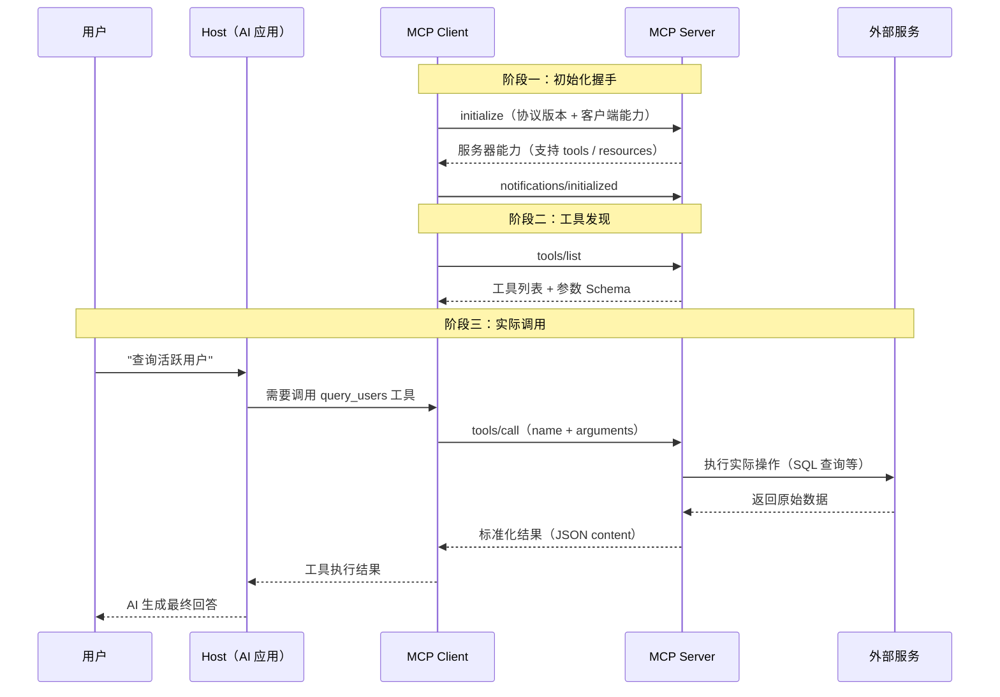

# MCP（Model Context Protocol）

## 概念解释

MCP（Model Context Protocol，模型上下文协议）是 Anthropic 于 2024 年 11 月开源的一套标准化协议，定义了 AI 应用与外部系统（数据库、API、文件系统等）之间的通信规范。官方用了一个直观的类比：MCP 就像 AI 应用的 USB-C 接口——正如 USB-C 让各种设备通过同一种接口互联，MCP 让各种 AI 应用通过同一种协议访问外部工具。

MCP 出现之前，AI 应用与外部工具的连接存在严重的碎片化问题。每接入一个新工具就要写一套专用的集成代码，不同 AI 应用（Claude Desktop、Cursor、VS Code 等）之间的集成代码无法复用，形成了 M x N 的组合爆炸。MCP 在中间引入一个标准协议层，把问题简化为 M + N：AI 应用只需实现 MCP Client，工具只需实现 MCP Server，双方通过协议对接。

截至 2025 年，MCP 已获得广泛生态支持。除 Anthropic 自家的 Claude Desktop 和 Claude Code 外，OpenAI 的 ChatGPT、微软的 VS Code / GitHub Copilot、Cursor、Windsurf 等主流 AI 应用和开发工具都已支持 MCP，微软还与 Anthropic 合作开发了官方 C# SDK。

## 关键结构

MCP 的核心结构可以从两个维度理解：**参与者**（谁在通信）和**原语**（通信什么内容）。

| 结构 | 作用 | 说明 |
|------|------|------|
| Host（宿主） | 运行 AI 的应用程序 | 如 Claude Desktop、VS Code、Cursor 等，负责管理多个 Client |
| Client（客户端） | 维护与单个 Server 的连接 | 由 Host 创建，每个 Client 与一个 Server 保持一对一连接 |
| Server（服务器） | 提供工具、数据、提示词模板 | 连接实际的外部系统（数据库、API 等），通过三大原语暴露能力 |
| Tools（工具） | 可执行的函数 | AI 可调用的操作，如查询数据库、发送消息、读写文件 |
| Resources（资源） | 可读取的数据 | 提供上下文信息，如文件内容、数据库记录、API 响应 |
| Prompts（提示词模板） | 可复用的交互模板 | 预定义的提示词结构，如系统提示词、Few-shot 示例模板 |

### 结构 1：三种参与者——Host、Client、Server

Host 是用户直接使用的 AI 应用（如 Claude Desktop）。当 Host 需要连接一个外部工具时，它会创建一个 MCP Client 实例来维护这个连接。一个 Host 可以同时创建多个 Client，分别连接不同的 MCP Server。

MCP Server 是实际提供能力的程序。它可以运行在本地（通过 Stdio 传输，如文件系统 Server），也可以运行在远程（通过 Streamable HTTP 传输，如 Sentry Server）。Server 不直接与用户交互，而是通过 Client 间接服务于 Host。

这里容易混淆的一点：Host 和 Client 是不同的角色。Host 是整个 AI 应用，Client 只是 Host 内部维护连接的一个组件。一个 Host 内部通常有多个 Client。

### 结构 2：三大原语——Tools、Resources、Prompts

原语（Primitives）是 MCP 中定义"Server 能提供什么"的核心机制：

- **Tools（工具）**：可执行的函数。AI 模型可以决定调用哪个 Tool、传什么参数，Server 执行后返回结果。例如：执行数据库查询、调用外部 API、操作文件系统。这是 MCP 中使用最多的原语。

- **Resources（资源）**：只读的数据源。Client 可以列出 Server 提供的资源列表，然后读取某个资源的内容。例如：获取文件内容、读取数据库表的 Schema（表结构）、获取配置信息。Resources 通过 URI 标识，如 `file:///logs/app.log`。

- **Prompts（提示词模板）**：预定义的交互模板。Server 可以暴露一组提示词模板，供 Client 在与 LLM 交互时使用。例如：数据库查询的 Few-shot 示例、代码审查的系统提示词。

三大原语都支持动态发现：Client 先通过 `*/list` 方法获取可用列表，再通过 `*/get` 或 `tools/call` 实际使用。

## 核心原理

### 原理说明

MCP 在技术上分为两层：

**数据层（Data Layer）**：基于 JSON-RPC 2.0 协议，定义消息格式和语义。包括：
- 生命周期管理（Lifecycle）：连接初始化、能力协商（Capability Negotiation，客户端和服务器互相声明支持哪些功能）、连接终止
- 原语交互：Tools / Resources / Prompts 的发现与调用
- 通知机制（Notifications）：Server 可以主动通知 Client 能力变更（如新增了工具），无需 Client 轮询

**传输层（Transport Layer）**：负责消息的实际传输，支持两种机制：
- **Stdio 传输**：通过标准输入/输出流通信，适合本地进程间通信，零网络开销
- **Streamable HTTP 传输**：通过 HTTP POST 发送请求，支持 Server-Sent Events（SSE，服务器推送事件）流式响应，适合远程 Server

一次完整的 MCP 交互流程如下：

1. **初始化握手**：Client 发送 `initialize` 请求，声明自己支持的协议版本和能力；Server 返回自己支持的能力（如 tools、resources）
2. **能力发现**：Client 调用 `tools/list` 等方法，获取 Server 提供的工具列表及参数 Schema（参数结构定义）
3. **工具调用**：AI 模型根据用户意图选择合适的工具，Client 发送 `tools/call` 请求，Server 执行并返回结果
4. **实时通知**：当 Server 的可用工具发生变化时，主动发送 `notifications/tools/list_changed` 通知 Client 刷新

### Mermaid 图解



图解说明：
- Host 与 Client 是同一进程内的不同角色，Host 管理全局，Client 负责单个连接
- 初始化阶段的能力协商决定了后续能使用哪些原语
- `tools/call` 是最常用的交互方法，Server 内部再去调用实际的外部服务
- 所有消息均使用 JSON-RPC 2.0 格式，请求带 `id` 字段，通知不带

### 运行示例

以下使用 MCP 官方 Python SDK（`mcp` 包）展示一个最小可运行的工具注册示例：

```python
# 基于 mcp Python SDK（截至 2026-03）
# 安装：pip install mcp
try:
    from mcp.server.fastmcp import FastMCP
except ModuleNotFoundError:
    # 兜底占位：便于文档检查器在未安装第三方依赖时直跑本示例
    class FastMCP:
        def __init__(self, name: str):
            self.name = name

        def tool(self):
            def decorator(func):
                return func

            return decorator

        def run(self, transport=None):
            raise RuntimeError("请先安装 mcp 包后再启动 MCP Server")

# 创建 MCP Server 实例
mcp = FastMCP("demo-server")

@mcp.tool()
def add(a: int, b: int) -> int:
    """两数相加"""
    return a + b

@mcp.tool()
def get_greeting(name: str) -> str:
    """生成问候语"""
    return f"你好，{name}！"

if __name__ == "__main__":
    # 文档检查器会直接执行代码块；这里先验证工具函数本身可运行。
    print(add(2, 3))
    print(get_greeting("MCP"))
    # 真正接入 Claude Desktop、Cursor 等 Host 时，再调用：
    # mcp.run()  或  mcp.run(transport="streamable-http")
```

`@mcp.tool()` 装饰器会把普通 Python 函数注册为 MCP 工具。上面的代码块为了保证文档检查时可直接运行，没有直接启动长驻的 Server 进程；在真实部署时，再根据接入方式调用 `mcp.run()` 或 `mcp.run(transport="streamable-http")` 即可。

## 易混概念辨析

| 概念 | 与 MCP 的区别 | 更适合关注的重点 |
|------|--------------|-----------------|
| Function Calling（函数调用） | 是 LLM 厂商提供的模型能力，让模型输出结构化的函数调用意图；MCP 是外部协议，定义工具如何被发现和执行 | 模型如何决定调用哪个函数、传什么参数 |
| LangChain Tools | 是框架内的工具抽象，工具定义绑定在 LangChain 生态内；MCP 是跨框架、跨应用的开放标准 | 特定框架内的工具编排与链式调用 |
| OpenAPI / REST API | 是通用的 Web API 规范；MCP 专门为 AI 应用设计，包含能力协商、动态发现、提示词模板等 AI 专属功能 | Web 服务的接口描述与调用 |

核心区别：

- **MCP**：解决"AI 应用如何以标准化方式连接任意外部工具"，是协议层
- **Function Calling**：解决"模型如何表达调用工具的意图"，是模型能力层。MCP 和 Function Calling 是互补关系——模型通过 Function Calling 决定要调什么，通过 MCP 实际去调
- **LangChain Tools**：解决"在某个框架内如何定义和编排工具"，是框架层。MCP Server 可以被任何兼容的 AI 应用使用，不绑定特定框架

## 适用边界与局限

### 适用场景

1. **AI 应用需要接入多个外部工具**：当一个 AI 助手需要同时连接数据库、文件系统、第三方 API 等多个工具时，MCP 避免了为每个工具单独写集成代码
2. **多个 AI 应用共享同一套工具**：企业内部的数据库 MCP Server 可以同时被 Claude Desktop、Cursor、VS Code 等不同应用使用，一次开发、多处复用
3. **需要动态发现和管理工具**：MCP 的能力协商和通知机制支持工具的动态增减，适合工具集经常变化的场景

### 不适合的场景

1. **极低延迟的实时系统**：MCP 多了一层协议封装和 JSON 序列化，对于毫秒级延迟要求的交易系统等场景，额外开销可能不可接受
2. **只有单一工具的简单集成**：如果 AI 应用只需调用一个固定 API，直接调用比引入 MCP 更简单

### 局限性

1. **协议仍在快速演进**：MCP 规范版本迭代较快（如从 SSE 传输升级为 Streamable HTTP），早期实现可能面临兼容性问题
2. **Server 生态覆盖不完整**：并非所有工具都有现成的 MCP Server，冷门工具可能需要自行开发适配器
3. **调试复杂度增加**：Host → Client → Server → 外部服务的多层架构，在排查问题时需要跟踪多个环节（官方提供了 MCP Inspector 工具辅助调试）

## 常见误区

| 常见误区 | 正确理解 |
|----------|----------|
| MCP 会让 AI 模型更聪明 | MCP 只提供工具访问通道，不改变模型本身的推理能力。模型的能力取决于训练，MCP 只是让模型能"伸手"拿到外部数据 |
| MCP 会替代现有 API | MCP 不替代任何工具的原生 API。MCP Server 内部仍然调用工具的原生 API，MCP 只是在上层提供统一的协议适配 |
| MCP Client 就是 AI 应用本身 | Client 是 Host 内部的一个连接组件。一个 Host（AI 应用）内部可以有多个 Client，分别连接不同的 Server |
| MCP 是 Anthropic 的私有协议 | MCP 是开源的开放标准（MIT 协议），OpenAI、微软等公司都已支持，不绑定 Anthropic |

## 思考题

<details>
<summary>初级：MCP 中 Host、Client、Server 分别承担什么角色？为什么要区分 Host 和 Client？</summary>

**参考答案：**

Host 是用户使用的 AI 应用程序（如 Claude Desktop），负责管理所有连接；Client 是 Host 内部维护与单个 Server 连接的组件，每个 Client 对应一个 Server；Server 是提供工具、资源和提示词模板的程序。

区分 Host 和 Client 的原因：一个 AI 应用通常需要同时连接多个 Server（如同时连接数据库 Server 和文件系统 Server），每个连接由独立的 Client 实例维护，Host 负责统一管理这些 Client。

</details>

<details>
<summary>中级：MCP 的三大原语（Tools、Resources、Prompts）各自适合什么场景？如果要为一个数据库开发 MCP Server，应该如何分配这三种原语？</summary>

**参考答案：**

- Tools 适合需要执行操作的场景（如执行 SQL 查询、插入数据）
- Resources 适合提供只读数据的场景（如暴露数据库的表结构 Schema、连接信息）
- Prompts 适合提供预定义交互模板的场景（如 SQL 查询的 Few-shot 示例）

数据库 MCP Server 的分配方案：
- Tools：`query`（执行 SQL 查询）、`insert`（插入数据）
- Resources：`schema://tables`（所有表的结构信息）、`schema://tables/{name}`（指定表的列定义）
- Prompts：`sql-assistant`（包含表结构上下文和 SQL 编写示例的提示词模板）

</details>

<details>
<summary>中级/进阶：在没有 MCP 的情况下，让三个 AI 应用分别接入五个外部工具需要多少套集成代码？引入 MCP 后呢？这种简化的代价是什么？</summary>

**参考答案：**

没有 MCP：需要 3 x 5 = 15 套集成代码，每个 AI 应用为每个工具单独开发适配。

引入 MCP 后：需要 3 + 5 = 8 套代码——3 个 AI 应用各实现 MCP Client，5 个工具各实现 MCP Server。

代价包括：(1) 多一层协议封装带来的性能开销（JSON-RPC 序列化、网络传输）；(2) 调试链路变长，问题定位更复杂；(3) 需要所有参与方都支持 MCP 协议，对于不支持 MCP 的工具仍需自行开发 Server。本质上是用统一标准换取规模化效率，在工具数量少时优势不明显，工具数量多时优势显著。

</details>

## 参考资料

1. Anthropic. "Introducing the Model Context Protocol." https://www.anthropic.com/news/model-context-protocol
2. MCP 官方文档. "Introduction - What is the Model Context Protocol." https://modelcontextprotocol.io/introduction
3. MCP 官方文档. "Architecture Overview." https://modelcontextprotocol.io/docs/concepts/architecture
4. MCP 协议规范. https://modelcontextprotocol.io/specification/latest
5. JSON-RPC 2.0 规范. https://www.jsonrpc.org/specification

---
