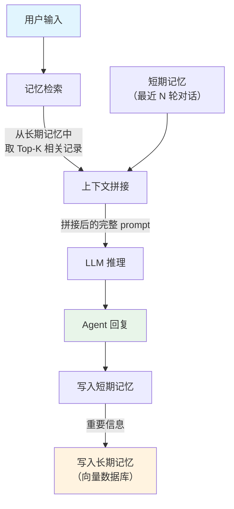

# Memory（Agent 记忆机制）

## 概念解释

Memory（记忆机制）是让 AI Agent 能够存储、管理和检索历史信息的系统。它的作用类似于人脑的记忆：既能记住刚才聊了什么，也能回忆起几天前学到的知识。

LLM 本身是无状态的——每次调用都是一次全新的推理，它不会记得上一轮对话的内容。如果你问它"我刚才说的名字是什么"，它只会一脸茫然。Memory 机制就是为了弥补这个缺陷：通过在 LLM 外部维护一套信息存储和检索系统，让 Agent "看起来"拥有了记忆能力。

与传统数据库存储不同，Agent Memory 的核心挑战不在于"存什么"，而在于"什么时候存、存多少、怎么取"。因为 LLM 的上下文窗口（Context Window，即单次推理能处理的最大文本长度）是有限的，不可能把所有历史信息都塞进去。Memory 机制需要在有限的上下文空间里，挑选出当前最相关的信息传递给 LLM。

## 关键结构

| 结构 | 作用 | 典型实现方式 |
|------|------|-------------|
| 短期记忆（Short-term Memory） | 维护当前会话的最近对话内容 | 消息列表、滑动窗口 |
| 长期记忆（Long-term Memory） | 跨会话持久化存储重要信息 | 向量数据库、键值存储 |
| 工作记忆（Working Memory） | 当前推理步骤中实际使用的上下文 | 拼接后传入 LLM 的 prompt |

### 结构 1：短期记忆（Short-term Memory）

短期记忆保存的是当前对话中的最近几轮消息。它的容量有限，通常只保留最近 5-20 轮对话。

短期记忆最常见的管理策略有三种：

- **全量缓冲（Buffer）**：保留所有消息，直到超出上下文窗口再截断。简单但粗暴。
- **滑动窗口（Window）**：只保留最近 K 轮对话，旧消息自动丢弃。省空间但会丢失早期信息。
- **摘要压缩（Summary）**：用 LLM 对旧消息生成摘要，用摘要替代原始消息。节省 token 但会损失细节。

### 结构 2：长期记忆（Long-term Memory）

长期记忆是跨会话的知识库。当用户下次再来对话时，Agent 可以从长期记忆中检索出相关的历史信息。

长期记忆通常存放在向量数据库（Vector Database）中，通过 Embedding（向量化，即把文本转换成一组数字表示其语义）和相似度搜索来检索。这种方式的好处是支持语义级别的模糊匹配——即使用户换了说法，只要意思相近就能命中。

### 结构 3：工作记忆（Working Memory）

工作记忆不是一个独立的存储组件，而是指每次 LLM 推理时实际输入的那段上下文。它由短期记忆的最近消息 + 从长期记忆中检索到的相关信息 + 用户当前输入拼接而成。

工作记忆的大小受限于 LLM 的上下文窗口。如何在有限空间里合理分配给"历史对话"和"检索结果"，是 Memory 系统设计的核心决策点。

## 核心原理

### 原理说明

Agent Memory 的工作机制可以拆成四个步骤：

1. **用户输入到达**：Agent 收到新的用户消息。
2. **记忆检索**：根据用户输入的语义，从长期记忆中检索相关的历史信息（Top-K 条最相似的记录）。
3. **上下文拼接**：把检索到的长期记忆 + 短期记忆中的最近对话 + 用户新输入，按顺序拼接成完整的 prompt，交给 LLM 推理。
4. **记忆更新**：LLM 回复后，把本轮的用户输入和 Agent 回复写入短期记忆；如果包含重要信息（如用户偏好、关键决策），同时写入长期记忆。

这个过程的关键在于第 2 步和第 4 步：检索的质量决定了 Agent 能否"想起"正确的信息；存储的策略决定了长期记忆会不会被无用信息淹没。

### Mermaid 图解



图解要点：

- 长期记忆的检索和短期记忆的读取是并行发生的，最终汇合到"上下文拼接"节点。
- 写入长期记忆是有条件的，不是每轮对话都会触发——只有被判定为"重要"的信息才会持久化。
- 整个流程形成一个循环：每次对话都会更新记忆，下次对话时又会检索这些记忆。

### 运行示例

```python
# 最小示例：演示短期记忆的滑动窗口机制
# 不依赖外部库，纯 Python 实现

from collections import deque

class SimpleMemory:
    """最简短期记忆：固定容量的消息队列"""

    def __init__(self, max_messages: int = 6):
        # deque 设置 maxlen 后，超出容量自动丢弃最旧的消息
        self.messages = deque(maxlen=max_messages)

    def add(self, role: str, content: str):
        """添加一条消息"""
        self.messages.append({"role": role, "content": content})

    def get_prompt_messages(self) -> list:
        """返回可直接传给 LLM 的消息列表"""
        return list(self.messages)

# --- 演示 ---
memory = SimpleMemory(max_messages=4)  # 只保留最近 4 条

memory.add("user", "我叫张三")
memory.add("assistant", "你好，张三！")
memory.add("user", "我喜欢 Python")
memory.add("assistant", "Python 是个好选择。")

# 此时已满 4 条，再加一条会挤掉最早的
memory.add("user", "帮我推荐一本书")

print(memory.get_prompt_messages())
# 输出：最早的 "我叫张三" 已被丢弃
# [{'role': 'assistant', 'content': '你好，张三！'},
#  {'role': 'user', 'content': '我喜欢 Python'},
#  {'role': 'assistant', 'content': 'Python 是个好选择。'},
#  {'role': 'user', 'content': '帮我推荐一本书'}]
```

上面的代码对应短期记忆的滑动窗口策略。`deque(maxlen=N)` 在容量满时自动淘汰最旧的消息，这正是"先进先出（FIFO）"的行为。实际框架（如 LangChain 的 `ConversationBufferWindowMemory`）在此基础上增加了角色标签、token 计数、摘要压缩等功能。

## 易混概念辨析

| 概念 | 与 Memory 的区别 | 更适合关注的重点 |
|------|------------------|------------------|
| RAG（检索增强生成） | RAG 从外部知识库检索信息辅助回答；Memory 从历史交互记录中检索 | RAG 关注"外部知识补充"，Memory 关注"历史交互回忆" |
| Context Engineering（上下文工程） | Context Engineering 是设计 prompt 结构的方法论；Memory 是其中的数据来源之一 | Context Engineering 关注"如何组织 prompt"，Memory 关注"历史信息的存取" |
| 向量数据库 | 向量数据库是一种存储工具；Memory 是一种系统设计，向量数据库只是实现长期记忆的手段之一 | 向量数据库关注"存储与检索性能"，Memory 关注"信息生命周期管理" |

核心区别：

- **Memory**：解决的是"Agent 如何记住过去"的问题，核心是信息的存储、检索和遗忘策略
- **RAG**：解决的是"Agent 如何获取它不知道的知识"的问题，检索对象是外部文档而非历史对话
- **Context Engineering**：解决的是"如何把各种信息有效组织进 prompt"的问题，Memory 只是它的输入源之一

## 适用边界与局限

### 适用场景

1. **多轮对话系统**：用户与 Agent 进行连续的多轮交流，Agent 需要理解上下文才能给出连贯的回答。典型场景如客服机器人、个人助手。
2. **个性化服务**：Agent 需要记住用户的偏好、历史行为和个人信息，在后续交互中提供定制化响应。典型场景如学习助手、推荐系统。
3. **长期任务跟踪**：Agent 执行跨多个会话的复杂任务，需要记录任务进度、中间结果和已做的决策。典型场景如项目管理 Agent、研究助手。

### 不适合的场景

1. **一次性问答**：如果用户只是问一个独立问题（如"北京今天天气怎样"），不需要记忆历史，Memory 机制只会增加不必要的开销。
2. **强实时性场景**：每次推理前都要做向量检索会增加延迟。对响应时间要求极高（如毫秒级交易系统）的场景，额外的检索开销可能不可接受。

### 局限性

1. **检索质量依赖 Embedding 模型**：如果 Embedding 模型对特定领域的文本理解不好，检索出来的记忆可能不相关，反而会干扰 LLM 的判断。
2. **记忆污染问题**：错误信息一旦被写入长期记忆，会在后续多次检索中被反复引用，形成"记忆幻觉"。目前缺乏成熟的记忆纠错机制。
3. **隐私与安全风险**：长期记忆中存储了用户的个人信息和对话历史，如果数据库泄露或被恶意访问，后果严重。需要配合加密存储和访问控制。
4. **存储成本持续增长**：如果没有有效的遗忘策略（Forgetting Policy），长期记忆会无限膨胀，导致存储成本上升和检索效率下降。

## 常见误区

| 常见误区 | 正确理解 |
|----------|----------|
| Memory 就是把所有聊天记录都存起来 | Memory 需要选择性存储。无差别保存所有消息会浪费存储空间，还会在检索时引入噪声。好的 Memory 系统会通过重要性评估来决定哪些信息值得长期保留 |
| 短期记忆容量越大越好 | 短期记忆过大会占满 LLM 的上下文窗口，留给推理和检索结果的空间就不够了。实践中需要根据任务类型找到平衡点 |
| LLM 上下文窗口足够大就不需要 Memory | 即使上下文窗口有 128K 甚至 1M tokens，也无法覆盖跨会话的信息。而且把大量历史消息全塞进 prompt 会显著增加推理成本和延迟 |
| Memory 和 RAG 是同一回事 | Memory 检索的是 Agent 自身的历史交互记录（"我和你之前聊过什么"），RAG 检索的是外部知识库（"世界上有哪些相关知识"），两者的数据来源和目的不同 |

## 思考题

<details>
<summary>初级：短期记忆的滑动窗口策略为什么不能直接设成"保留全部历史消息"？</summary>

**参考答案：**

两个原因：一是 LLM 的上下文窗口有长度限制，全部历史消息可能超出窗口大小；二是即使窗口够大，过多的历史消息会增加推理的 token 消耗（成本和延迟都会上升），而且大量无关信息反而会干扰 LLM 的注意力，导致回答质量下降。

</details>

<details>
<summary>中级：如果一个 Agent 同时需要 Memory 和 RAG，两者检索回来的信息应该如何排列在 prompt 中？</summary>

**参考答案：**

一般的做法是：系统指令在最前，然后是 RAG 检索到的外部知识（作为参考背景），接着是从长期记忆检索到的历史交互信息，再是短期记忆中的最近对话，最后是用户的当前输入。这样排列的逻辑是：外部知识提供事实基础，历史记忆提供个性化上下文，最近对话提供即时语境，用户输入是当前需要回答的问题。具体顺序可以根据任务调整，但核心原则是"越相关的信息离用户输入越近"。

</details>

<details>
<summary>中级/进阶：MemGPT 论文提出用"虚拟上下文管理"来解决上下文窗口限制，这个思路和传统的滑动窗口 + 向量检索方案有什么本质区别？</summary>

**参考答案：**

传统方案靠固定规则管理记忆（如窗口大小、检索 Top-K），记忆的调度策略是预先设定好的。MemGPT 的核心创新是让 LLM 自己决定何时把信息在不同存储层级之间搬移——类似操作系统的虚拟内存让进程以为自己拥有无限内存，MemGPT 让 LLM 以为自己拥有无限上下文。本质区别在于：传统方案的记忆管理是外部固定策略驱动的，MemGPT 的记忆管理是 LLM 自主决策驱动的。这种方式更灵活，但也更难调试和预测行为。

</details>

## 参考资料

1. Packer, C., Wooders, S., Lin, K., Fang, V., Patil, S. G., Stoica, I., & Gonzalez, J. E. (2023). "MemGPT: Towards LLMs as Operating Systems." arXiv:2310.08560. https://arxiv.org/abs/2310.08560
2. LangChain Memory 模块迁移指南（从旧版 Memory 迁移到 LangGraph 状态管理）. https://python.langchain.com/docs/versions/migrating_memory/
3. LangGraph 记忆管理文档（Checkpointers 与持久化状态）. https://langchain-ai.github.io/langgraph/concepts/memory/
4. ChromaDB 官方文档. https://docs.trychroma.com/

---
