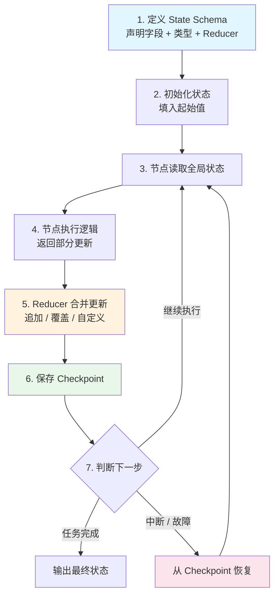

# State Management（Agent 状态管理）

## 概念解释

State Management（状态管理）是指在 Agent 工作流中，对所有节点共享的数据进行统一定义、读写和持久化的机制。简单来说，它就是 Agent 的"共享记事本"——每个处理步骤都可以往上面读信息、写信息，而不用关心信息是谁写的、存在哪里。

为什么需要状态管理？因为 LLM 本身是无状态的（Stateless）——每次 API 调用之间不会自动保留任何信息。如果你要构建一个多步骤的 Agent（比如先搜索、再分析、最后生成报告），就必须有一个地方记录"搜到了什么"、"分析到哪一步了"、"最终结论是什么"。没有状态管理，每一步都像失忆了一样，无法衔接。

在传统编程中，开发者通常用全局变量或者函数参数传递来解决这个问题。但全局变量容易混乱、难以调试；参数传递在流程复杂时会变得冗长且脆弱。现代 Agent 框架（如 LangGraph）采用的方案是：先定义一个结构化的状态模式（State Schema），所有节点统一读写这个结构，框架自动负责合并更新和持久化存储。这样既保证了信息流的有序性，又支持了中断恢复、状态回溯等高级能力。

## 关键结构

| 结构 | 作用 | 说明 |
|------|------|------|
| State Schema（状态模式） | 定义状态的数据结构 | 声明有哪些字段、什么类型、如何合并 |
| Reducer（合并策略） | 控制状态更新的方式 | 决定多个节点写同一字段时是"追加"还是"覆盖" |
| Checkpoint（检查点） | 保存状态快照 | 支持中断恢复、历史回溯、故障容错 |

### 结构 1：State Schema（状态模式）

State Schema 是状态管理的"蓝图"。它用 Python 的 `TypedDict` 或 Pydantic Model 来定义，明确列出所有字段的名称、类型和合并规则。

一个典型的 Schema 包含：
- **字段名和类型**：比如 `messages: List[str]` 表示对话历史是字符串列表
- **Reducer 注解**：用 `Annotated` 标注哪些字段需要"追加"而非"覆盖"
- **可选字段**：某些字段初始可以为空，用 `Optional` 标记

Schema 的质量直接影响整个工作流的可维护性。好的 Schema 应该字段精简、覆盖完整、合并策略明确。

### 结构 2：Reducer（合并策略）

Reducer 回答的是一个关键问题：**当两个节点都往同一个字段写数据时，怎么办？**

- **追加策略**（`operator.add`）：新数据拼接到旧数据后面。适用于对话历史、执行日志等需要累积的字段。
- **覆盖策略**（默认）：新数据直接替换旧数据。适用于"当前状态"、"最终答案"等只关心最新值的字段。
- **自定义策略**：开发者可以定义任意合并函数，比如对字典字段做深度合并。

最常见的错误是：对话历史字段忘了加 `operator.add`，导致后一个节点的消息把前一个节点的消息覆盖掉了。

### 结构 3：Checkpoint（检查点）

Checkpoint 是状态在某一时刻的完整快照。它的作用类似于游戏的"存档"功能：

- **中断恢复**：长任务运行到一半中断了，可以从最近的 Checkpoint 继续
- **历史回溯**：可以查看工作流在每一步的状态，定位问题
- **分支探索**：从某个 Checkpoint 出发，尝试不同的执行路径

Checkpoint 的存储后端有多种选择：
- `MemorySaver`：存在内存中，开发测试用
- `SqliteSaver` / `PostgresSaver`：存在数据库中，生产环境用

## 核心原理

### 原理说明

Agent 状态管理的核心运转机制可以用一个循环来概括：

1. **定义**：工作流启动前，开发者用 Schema 声明状态结构（有哪些字段、合并规则是什么）
2. **初始化**：创建初始状态实例，填入起始值（用户输入、任务描述等）
3. **读取**：当前节点接收完整的全局状态作为输入
4. **更新**：节点执行完毕后，返回一个部分更新字典（只包含它修改的字段）
5. **合并**：框架根据每个字段的 Reducer 规则，将更新合并到全局状态
6. **持久化**：合并完成后，自动保存一个 Checkpoint
7. **流转**：根据条件判断，将更新后的状态传给下一个节点，回到步骤 3

关键设计决策：节点不直接修改全局状态对象，而是返回"我想改什么"的描述。框架负责合并，这保证了状态更新的原子性（Atomicity，即要么全部成功，要么全部回滚）和一致性。

### Mermaid 图解



图解要点：
- 步骤 3 → 4 → 5 → 6 → 7 构成核心循环，每个节点执行一轮
- Reducer 合并（步骤 5）是状态管理的核心机制，决定了"追加"还是"覆盖"
- Checkpoint（步骤 6）使得系统具备"韧性"——中断后可以从存档恢复
- 节点永远读取合并后的最新状态，不会看到不一致的中间态

### 运行示例

```python
from typing import TypedDict, List, Annotated
import operator

# ---- 1. 定义状态模式 ----
class AgentState(TypedDict):
    """Agent 工作流的状态结构"""
    messages: Annotated[List[str], operator.add]  # 对话历史，多节点追加
    current_task: str                              # 当前任务，覆盖更新
    result: str                                    # 最终结果，覆盖更新

# ---- 2. 定义节点函数（每个节点返回部分更新） ----
def search_node(state: AgentState) -> dict:
    """搜索节点：读取任务，返回搜索结果"""
    task = state["current_task"]
    return {
        "messages": [f"已搜索：{task}"],  # 追加到 messages 列表
    }

def answer_node(state: AgentState) -> dict:
    """回答节点：基于历史消息生成答案"""
    history = state["messages"]
    return {
        "messages": [f"基于 {len(history)} 条记录生成答案"],
        "result": "这是最终答案",  # 覆盖 result 字段
    }

# ---- 3. 构建工作流图 ----
# 基于 langgraph==0.4.x 验证（截至 2026-03）
from langgraph.graph import StateGraph, END

graph = StateGraph(AgentState)
graph.add_node("search", search_node)
graph.add_node("answer", answer_node)
graph.set_entry_point("search")
graph.add_edge("search", "answer")
graph.add_edge("answer", END)

app = graph.compile()

# ---- 4. 运行 ----
result = app.invoke({
    "messages": [],
    "current_task": "什么是状态管理",
    "result": ""
})
print(result["messages"])
# 输出: ["已搜索：什么是状态管理", "基于 1 条记录生成答案"]
# messages 是追加的，两个节点的消息都保留了
```

上述代码对应三个关键结构：`AgentState` 是 Schema，`Annotated[..., operator.add]` 是 Reducer，`graph.compile()` 后框架自动管理状态流转。`search_node` 和 `answer_node` 都只返回部分更新，框架负责合并。

## 易混概念辨析

| 概念 | 与 State Management 的区别 | 更适合关注的重点 |
|------|---------------------------|------------------|
| Memory（记忆） | Memory 侧重于"跨会话的长期记忆"（如用户偏好），State Management 侧重于"单次工作流内的即时状态" | Memory 关注持久化记忆的存储和检索 |
| Context（上下文） | Context 通常指送给 LLM 的输入窗口内容，State 是框架层面管理的全量数据 | Context 关注"哪些信息塞进 Prompt" |
| Session（会话） | Session 是一次用户交互的容器，State 是这个容器里流动的数据 | Session 关注"谁在和谁对话" |

核心区别：

- **State Management**：关注的是"工作流运行时，各节点之间如何共享和更新数据"
- **Memory**：关注的是"跨多次会话，Agent 如何记住和利用历史信息"
- **Context**：关注的是"给 LLM 的一次调用中，Prompt 里装了什么内容"

一个简单的类比：State 是"当前这局游戏的存档"，Memory 是"玩家的历史战绩"，Context 是"当前屏幕上显示的信息"。

## 适用边界与局限

### 适用场景

1. **多步骤工作流**：报告生成、数据分析等流水线任务，各步骤的中间结果需要逐步累积，最终汇总。状态管理让每一步都能访问前序步骤的成果。
2. **多轮对话 Agent**：客服机器人、编程助手等场景，需要记住完整的对话历史和用户意图。状态中的 `messages` 列表随对话增长。
3. **多 Agent 协作**：多个 Agent 共同完成一个任务时，共享状态充当"通信黑板"，每个 Agent 读取他人的贡献并添加自己的输出。
4. **需要中断恢复的长任务**：数据处理、批量操作等容易被中断的任务，Checkpoint 机制保证进度不丢失。

### 不适合的场景

1. **单次 LLM 调用**：如果你只是调用一次 API 拿结果，不需要状态管理，这是过度设计。
2. **极高频状态更新**：每毫秒更新数百次状态的实时系统，Reducer 合并和 Checkpoint 序列化的开销可能成为瓶颈。

### 局限性

1. **Schema 变更的兼容性**：一旦修改了 State Schema（新增或删除字段），旧的 Checkpoint 可能无法加载。生产环境需要额外编写状态迁移逻辑。
2. **存储后端依赖**：使用数据库做 Checkpoint 存储时，数据库的可用性直接影响工作流的可靠性。
3. **学习门槛**：Schema、Reducer、条件边等概念对新手有一定学习成本，简单任务用起来反而比直接写函数更复杂。

## 常见误区

| 常见误区 | 正确理解 |
|----------|----------|
| State 可以是任意 Python 对象 | State 必须是 `TypedDict` 或 Pydantic Model 等可序列化结构，框架需要对它做类型检查和序列化存储 |
| 节点可以直接修改传入的 state 对象 | 节点只能返回部分更新字典，框架负责合并。直接修改会破坏一致性和 Checkpoint 机制 |
| 所有列表字段都应该用 `operator.add` | 只有需要多节点累积贡献的字段才用追加策略，配置项列表等应该用覆盖策略，否则会产生重复数据 |
| Checkpoint 默认自动启用 | 必须在 `compile()` 时显式传入 `checkpointer` 参数，否则状态只在内存中，进程重启即丢失 |

## 思考题

<details>
<summary>初级：为什么 LangGraph 中对话历史字段要用 Annotated[List, operator.add] 而不是普通的 List？</summary>

**参考答案：**

普通的 `List` 字段在状态更新时会被直接覆盖——后一个节点返回的列表会替换掉前一个节点的列表。而 `Annotated[List, operator.add]` 告诉框架使用追加策略，后一个节点返回的列表会被拼接到原列表末尾。对话历史需要保留所有消息，因此必须用追加策略。

</details>

<details>
<summary>中级：如果一个 Agent 工作流运行了一半出现了异常，状态管理如何帮助恢复？</summary>

**参考答案：**

每个节点执行完毕后，框架会自动保存一个 Checkpoint（前提是配置了 checkpointer）。当异常发生时，系统可以从最近一次成功的 Checkpoint 加载状态，跳过已完成的节点，直接从失败点重新执行。这需要：(1) 使用持久化存储后端（如 SQLite/Postgres）而非内存存储；(2) 在调用时指定 `thread_id` 以定位到正确的执行线程。

</details>

<details>
<summary>中级/进阶：假设你要设计一个"搜索→分析→生成报告"的 Agent，其中分析节点可能判断"信息不够"需要重新搜索。请描述 State Schema 应该包含哪些字段，以及条件边的判断逻辑。</summary>

**参考答案：**

State Schema 至少需要：`messages`（追加策略，记录对话历史）、`search_results`（覆盖策略，最新搜索结果）、`analysis`（覆盖策略，分析结论）、`retry_count`（覆盖策略，当前重试次数）、`report`（覆盖策略，最终报告）。条件边逻辑：分析节点执行后，检查 `analysis` 中是否标记了"信息不足"，如果是且 `retry_count < 3`，则回到搜索节点（同时递增 `retry_count`）；否则进入报告生成节点。这里 `retry_count` 用于防止无限循环。

</details>

## 参考资料

1. LangGraph 官方文档 - State Management：https://langchain-ai.github.io/langgraph/concepts/low_level/#state
2. LangGraph 官方文档 - Persistence（检查点持久化）：https://langchain-ai.github.io/langgraph/concepts/persistence/
3. LangGraph GitHub 仓库：https://github.com/langchain-ai/langgraph
4. Lilian Weng, "LLM Powered Autonomous Agents"（2023）：https://lilianweng.github.io/posts/2023-06-23-agent/
