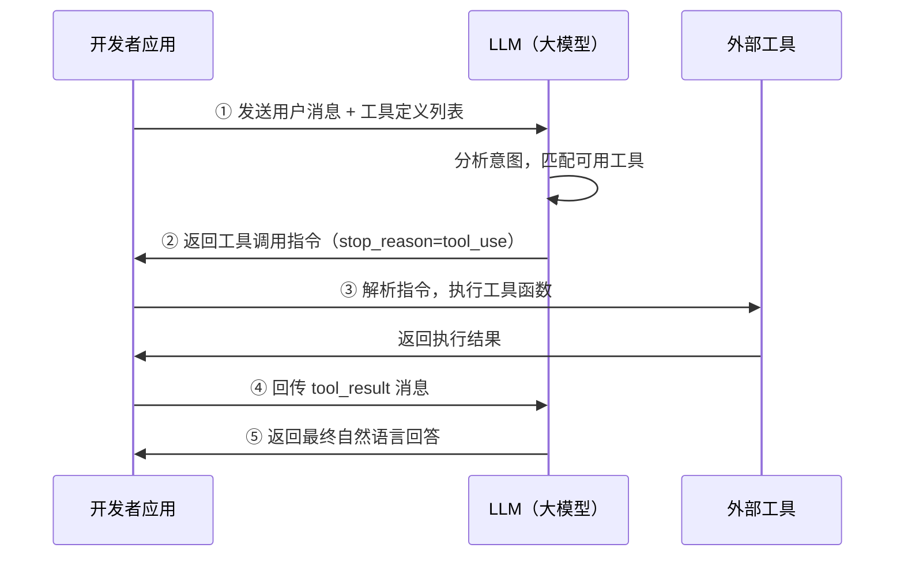

# Tool Use（工具使用）

## 概念解释

Tool Use（工具使用）是指大语言模型（LLM, Large Language Model）在对话过程中，自主判断是否需要借助外部工具来完成任务，并生成结构化的调用指令，由应用层执行后将结果回传给模型的一整套交互机制。

LLM 的训练数据有截止日期，无法获取实时信息；它做"概率预测下一个 token（词元）"而非真正的数学运算，计算结果不可靠；它也无法主动操作数据库、发邮件或读写文件。Tool Use 的出现就是为了解决这三个根本性限制——不让 LLM 什么都自己干，而是让它当"调度员"，把具体工作分配给专业工具执行。

与传统的 API 调用不同，Tool Use 的核心特点在于**由模型自主决策**：开发者只需告诉模型"有哪些工具可用、每个工具做什么"，模型会根据用户的自然语言请求，自行判断该不该调用工具、调用哪个、传什么参数。这种"理解意图 + 选择工具 + 生成参数"的能力，是 Agent（智能体）能够真正"做事"的基础。

## 关键结构

Tool Use 的运转依赖四个核心要素，缺一不可：

| 结构 | 作用 | 说明 |
|------|------|------|
| 工具定义（Tool Definition） | 告诉模型有什么工具可用 | 包含名称、功能描述、参数格式 |
| 意图识别（Intent Recognition） | 模型判断是否需要调用工具 | 基于用户请求和工具描述进行匹配 |
| 参数生成（Parameter Generation） | 模型输出结构化调用指令 | 通常为 JSON 格式，包含函数名和参数值 |
| 结果回传（Result Return） | 工具执行结果返回给模型 | 模型据此生成最终的自然语言回答 |

### 结构 1：工具定义

工具定义是整个机制的起点。开发者用 JSON Schema（JSON 模式）格式描述每个工具的名称、功能和参数结构，这段描述会随 API 请求发送给模型。模型不会看到工具的源代码，它完全依赖这份描述来理解工具能做什么、什么时候该用。

以 Anthropic Claude API 为例，一个工具定义的基本结构是：

```
工具名称（name）: "get_weather"
功能描述（description）: "获取指定城市的当前天气"
参数模式（input_schema）:
  - location（字符串，必填）: 城市名称
  - unit（字符串，可选）: 温度单位
```

工具描述的质量直接影响模型的调用准确率。描述不仅要说明"能做什么"，还应说明"什么时候该用"。

### 结构 2：意图识别

模型收到用户请求后，会将请求内容与所有可用工具的描述进行比对，判断是自己直接回答，还是调用某个工具。比如用户问"什么是机器学习"，模型直接回答；用户问"北京今天几度"，模型识别出需要调用天气工具。

### 结构 3：参数生成

模型决定调用工具后，从用户的自然语言中提取出工具所需的参数，并按照 JSON 格式输出。比如用户说"上海明天天气"，模型生成 `{"location": "上海"}`。这一步的难点在于用户表达的多样性——"魔都天气"、"明天出门要带伞吗"都需要被正确解析。

### 结构 4：结果回传

应用层执行完工具函数后，将返回的原始数据（如 `{"temperature": 22, "condition": "晴"}`）以特定消息格式发回给模型。模型将这些数据转化为用户能理解的自然语言回答，如"上海明天 22 度，晴天"。

## 核心原理

### 原理说明

Tool Use 的核心是一个"请求 - 调用 - 回传"的消息循环。整个过程中，模型只负责**决策和语言处理**，不执行任何实际操作；应用层只负责**执行工具函数**，不做意图判断。两者分工明确。

完整流程分为四步：

1. **开发者定义工具并发送请求**：将工具描述（JSON Schema）和用户消息一起通过 API 发给模型。
2. **模型决定是否调用工具**：模型分析用户意图，如果需要外部信息，返回一个包含工具名和参数的结构化指令（而非文本回答），同时 API 返回的 stop_reason（停止原因）为 `tool_use`。
3. **应用层执行工具并回传结果**：开发者代码解析模型返回的指令，调用对应函数，将执行结果以 `tool_result`（工具结果）消息格式发回给模型。
4. **模型生成最终回答**：模型结合工具返回的数据，生成面向用户的自然语言回答。

如果一次请求需要多条信息（比如同时查北京和上海的天气），模型可以在单次响应中发起多个工具调用（Parallel Tool Calls，并行工具调用），应用层逐一执行后统一回传。

### Mermaid 图解



图中的关键流转：模型在第 ② 步不是返回文字回答，而是返回一个结构化的工具调用指令——这是 Tool Use 和普通对话的核心区别。第 ③ 步的工具执行完全发生在开发者侧，模型无法直接访问任何外部系统。

### 运行示例

以下伪代码展示 Tool Use 的核心消息结构（基于 Anthropic Claude API 格式）：

```python
# 伪代码：展示 Tool Use 的消息交互结构
# 基于 anthropic Python SDK 格式（截至 2026-03）

# ① 开发者定义工具
tools = [{
    "name": "get_weather",
    "description": "获取指定城市的当前天气",
    "input_schema": {
        "type": "object",
        "properties": {
            "location": {"type": "string", "description": "城市名称"}
        },
        "required": ["location"]
    }
}]

# ② 模型返回工具调用指令（而非文字）
# response.stop_reason == "tool_use"
# response.content 包含:
#   {"type": "tool_use", "name": "get_weather", "input": {"location": "北京"}}

# ③ 开发者执行工具，拿到结果
result = get_weather(location="北京")  # {"temperature": 22, "condition": "晴"}

# ④ 将结果以 tool_result 格式回传给模型
messages.append({
    "role": "user",
    "content": [{"type": "tool_result", "tool_use_id": "xxx", "content": '{"temperature":22}'}]
})

# ⑤ 模型收到结果后生成最终回答
# "北京今天 22 度，晴天，适合出行。"
```

伪代码对应前述四步流程的消息结构。实际开发中需补充 API 客户端初始化、错误处理和多轮对话管理，此处省略以聚焦核心机制。

## 易混概念辨析

| 概念 | 与 Tool Use 的区别 | 更适合关注的重点 |
|------|---------------------|------------------|
| Function Calling（函数调用） | 是 Tool Use 的具体实现方式之一，最初由 OpenAI 在 2023 年 6 月提出 | 某个模型 API 的调用规范和参数格式 |
| MCP（Model Context Protocol，模型上下文协议） | 是工具侧的标准化协议，解决"工具如何被发现和接入"的问题 | 跨应用的工具复用和即插即用 |
| Agent（智能体） | Tool Use 是 Agent 的核心能力之一，Agent 还包含规划、记忆等能力 | 自主任务分解、多步推理、完整任务闭环 |

核心区别：

- **Tool Use**：关注"模型如何判断、调用和使用外部工具"这一基础机制
- **Function Calling**：是 Tool Use 在特定 API 中的技术实现，OpenAI 最初用 `functions` 参数，后来升级为 `tools` 参数；Anthropic 从一开始就使用 `tools` 参数
- **MCP**：由 Anthropic 于 2024 年 11 月开源发布，解决的是工具生态的标准化问题——让同一个工具服务器可以被不同 AI 应用复用，类似 USB 接口的统一标准

## 适用边界与局限

### 适用场景

1. **需要实时信息的请求**：天气查询、新闻检索、股价行情等——LLM 训练数据有截止日期，无法回答"当前"相关的问题
2. **需要精确计算的任务**：数学运算、数据统计、单位转换等——交给计算器或代码解释器，比 LLM 的概率推测可靠得多
3. **需要操作外部系统的场景**：发邮件、写数据库、管理日程、操作文件系统等——LLM 本身无法与外部系统交互

### 不适合的场景

1. **纯知识问答**：用户问"什么是机器学习"，模型自身知识足以回答，调用工具反而增加延迟和成本
2. **对延迟极度敏感的场景**：每次工具调用至少增加一轮网络往返，如果要求毫秒级响应，Tool Use 的多轮交互会成为瓶颈

### 局限性

1. **工具描述质量决定上限**：模型选工具完全依赖描述文本，描述模糊或有误导性会直接导致选错工具、传错参数，这是实践中最常见的故障来源
2. **参数生成不是 100% 准确**：模型可能漏掉必填字段、生成格式错误的值，生产环境中必须加入参数校验和错误处理
3. **多轮交互增加成本**：一次工具调用至少需要两轮 API 交互（发指令 + 回传结果），Token（词元）消耗和延迟会随工具调用次数线性增长
4. **安全风险**：工具可能执行删除文件、修改数据库等不可逆操作，缺乏权限管控时模型的误判可能造成严重后果

## 常见误区

| 常见误区 | 正确理解 |
|----------|----------|
| "Tool Use 是让 LLM 执行代码" | LLM 只负责**决定**调用什么工具并生成参数，实际执行在应用层。模型本身不运行任何代码 |
| "工具注册得越多越好" | 工具过多会导致模型选择困难，参数生成错误率上升。实践建议按场景精选 5-20 个工具 |
| "Function Calling 和 Tool Use 是不同的东西" | Function Calling 是 Tool Use 的一种实现方式。OpenAI 最初用 `functions` 参数命名，后来统一为 `tools`，本质是同一机制 |
| "工具描述随便写几个字就行" | 工具描述是模型选择和使用工具的**唯一依据**。好的描述应包含功能说明、使用时机和参数约束 |

## 思考题

<details>
<summary>初级：Tool Use 的核心流程分为哪几步？模型和应用层各自负责什么？</summary>

**参考答案：**

四步流程：① 开发者发送工具定义和用户消息 ② 模型返回工具调用指令 ③ 应用层执行工具并回传结果 ④ 模型生成最终回答。模型负责意图识别、工具选择和参数生成（决策层），应用层负责实际执行工具函数（执行层）。模型不直接运行任何代码。

</details>

<details>
<summary>中级：为什么说"工具描述的质量直接决定 Tool Use 的效果"？如果一个工具描述写成"天气工具"，会出什么问题？</summary>

**参考答案：**

模型完全通过工具描述来理解工具的功能和使用时机。描述为"天气工具"缺少三个关键信息：(1) 具体能做什么（查当前天气？查预报？查历史？）；(2) 什么时候该用（用户问温度时？问穿衣建议时？）；(3) 参数含义（city 还是 location？支持哪些地区？）。模型可能在不该调用时调用它，或者生成错误的参数格式。好的描述应写成："获取指定城市的当前天气信息，当用户询问某个城市当前的温度、天气状况时使用"。

</details>

<details>
<summary>中级/进阶：一个客服系统同时注册了 50 个工具，用户反馈"经常调错工具"。你会如何优化？</summary>

**参考答案：**

三个优化方向：(1) 减少同时可用的工具数量——按对话场景动态加载相关工具子集，比如用户聊订单时只挂载订单相关的 5-8 个工具；(2) 优化工具描述——确保每个工具的描述明确说明功能边界和使用条件，避免功能重叠导致模型混淆；(3) 引入工具路由层——先用一个轻量模型或规则引擎对用户意图做粗分类，再将对应的工具子集传给主模型。

</details>

## 参考资料

1. Anthropic, 2025. "Tool use with Claude." Anthropic Documentation. https://docs.anthropic.com/en/docs/build-with-claude/tool-use/overview
2. Anthropic, 2024. "Model Context Protocol." https://modelcontextprotocol.io/
3. Schick T. et al., 2023. "Toolformer: Language Models Can Teach Themselves to Use Tools." arXiv:2302.04761. https://arxiv.org/abs/2302.04761
4. Qin Y. et al., 2023. "Tool Learning with Foundation Models." arXiv:2304.08354. https://arxiv.org/abs/2304.08354

---
