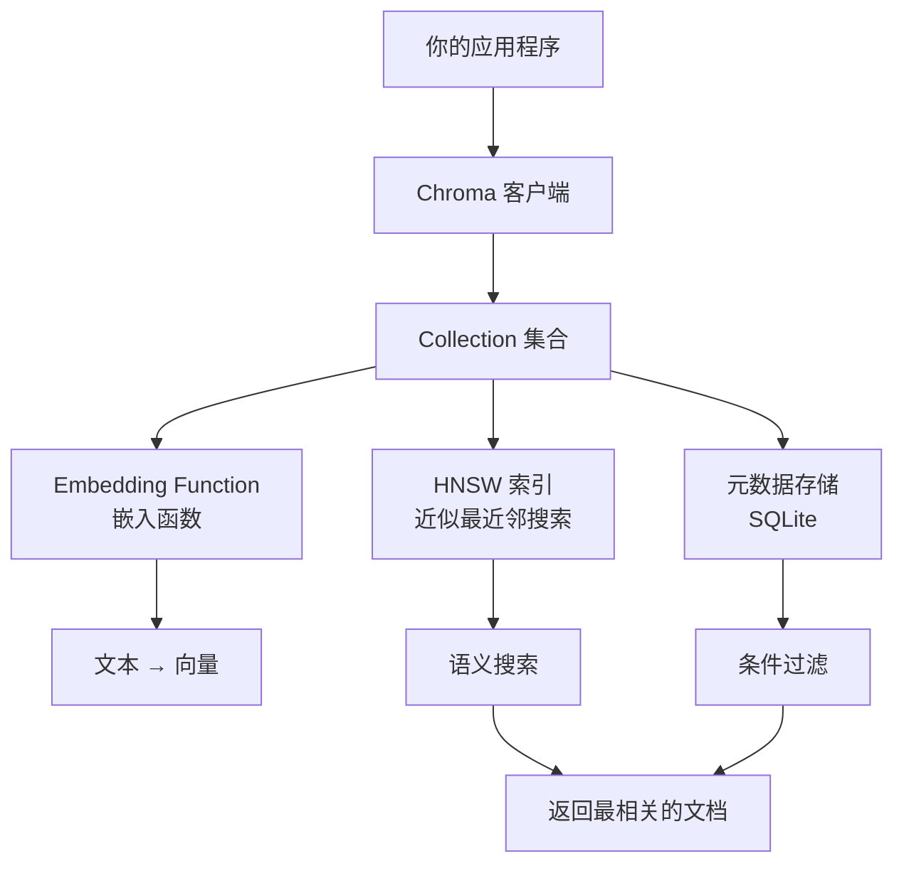

# Chroma（向量数据库）

## 基础概念

Chroma（也叫 ChromaDB）是一款开源的**向量数据库（Vector Database）**，专门用来存储和检索「向量」——也就是把文本、图片等内容用一串数字表示后的形式。传统数据库靠关键词匹配查东西，向量数据库靠**语义相似度（Semantic Similarity）**查东西：即使你搜的词和文档里的词完全不同，只要意思接近就能找到。

Chroma 的核心卖点是**极简上手**：`pip install chromadb` 一行命令装好，几行 Python 就能跑起来，不需要装 Docker、不需要配服务器。它是原型验证、教学演示、个人项目和中小规模 RAG（检索增强生成）应用的首选。

### 核心要素

| 要素 | 作用 |
|------|------|
| **Collection（集合）** | 存放文档和向量的容器，相当于传统数据库里的「表」 |
| **Embedding Function（嵌入函数）** | 把文本自动转换成向量的工具，Chroma 内置了多种选择 |
| **Metadata Filter（元数据过滤）** | 给文档打标签，查询时可以按标签精确筛选，再配合语义搜索 |

### Collection（集合）

Collection 是 Chroma 组织数据的基本单位。一个 Collection 里存放四样东西：文档原文、对应的向量、元数据（标签信息）和唯一 ID。你可以创建多个 Collection 来隔离不同业务——比如一个存技术文档，一个存产品 FAQ。

```python
import chromadb

# 创建持久化客户端（数据存到磁盘，重启不丢失）
client = chromadb.PersistentClient(path="./my_chroma_db")

# 创建集合，指定距离度量为余弦相似度（Cosine Similarity）
collection = client.get_or_create_collection(
    name="my_docs",
    metadata={"hnsw:space": "cosine"}
)
```

### Embedding Function（嵌入函数）

嵌入函数负责把人类可读的文本变成机器可计算的向量。Chroma 内置了多种嵌入函数：OpenAI（质量高，需 API Key）、Sentence Transformers（开源免费，本地运行）等。如果你添加文档时只传文本不传向量，Chroma 会自动调用嵌入函数帮你转换。

### Metadata Filter（元数据过滤）

每条文档可以附带一组键值对（元数据），查询时通过 `where` 参数按条件筛选。这样做的好处是：先按标签缩小范围，再在小范围内做语义搜索，既快又准。

### 核心要素关系图



## 基础用法

安装依赖：

```bash
# 安装 Chroma（核心包，零配置即可运行）
pip install chromadb

# 可选：使用开源嵌入模型（无需 API Key）
pip install sentence-transformers
```

最小可运行示例（基于 chromadb==0.6.3 验证，截至 2026-03）：

```python
import chromadb

# 1. 创建客户端（内存模式，适合快速体验）
client = chromadb.EphemeralClient()

# 2. 创建集合
collection = client.create_collection(name="demo")

# 3. 添加文档（Chroma 自动调用默认嵌入函数将文本转为向量）
collection.add(
    documents=[
        "Python 是最流行的 AI 编程语言",
        "JavaScript 主要用于前端开发",
        "向量数据库用于语义搜索",
        "机器学习需要大量训练数据",
    ],
    metadatas=[
        {"topic": "programming"},
        {"topic": "programming"},
        {"topic": "database"},
        {"topic": "ai"},
    ],
    ids=["doc1", "doc2", "doc3", "doc4"],
)

# 4. 语义搜索：找和「AI 开发用什么语言」最相似的 2 条文档
results = collection.query(
    query_texts=["AI 开发用什么语言"],
    n_results=2,
)

for doc, dist in zip(results["documents"][0], results["distances"][0]):
    print(f"  {doc}（距离: {dist:.3f}）")

# 5. 带元数据过滤：只在 programming 类别里搜索
results2 = collection.query(
    query_texts=["AI 开发"],
    where={"topic": "programming"},
    n_results=2,
)

print("\n仅 programming 类别：")
for doc in results2["documents"][0]:
    print(f"  {doc}")
```

预期输出：

```text
  Python 是最流行的 AI 编程语言（距离: 0.751）
  机器学习需要大量训练数据（距离: 1.022）

仅 programming 类别：
  Python 是最流行的 AI 编程语言
  JavaScript 主要用于前端开发
```

持久化模式（数据保存到磁盘）只需把客户端换一行：

```python
# 把 EphemeralClient() 换成 PersistentClient(path=...)
client = chromadb.PersistentClient(path="./chroma_data")
```

使用 Sentence Transformers 嵌入函数（无需 API Key）：

```python
from chromadb.utils.embedding_functions import SentenceTransformerEmbeddingFunction

ef = SentenceTransformerEmbeddingFunction(model_name="all-MiniLM-L6-v2")
collection = client.create_collection(name="my_kb", embedding_function=ef)
```

## 同类工具对比

| 维度 | Chroma | Milvus | Pinecone |
|------|--------|--------|----------|
| 核心定位 | 轻量本地向量库，极简 API | 开源分布式向量库，支撑亿级数据 | SaaS 托管向量服务，免运维 |
| 部署方式 | pip 安装即用，无需 Docker | 需要 Docker/K8s 集群部署 | 云端托管，注册即用 |
| 数据规模 | 百万级以内 | 十亿级 | 十亿级 |
| 学习成本 | 极低，5 分钟上手 | 较高，需理解分布式概念 | 低，但受限于 API |
| 费用 | 完全免费（Apache 2.0） | 免费开源 / 商业版 | 按用量付费 |

核心区别：

- **Chroma**：追求「最快跑通」，适合原型开发、教学、个人项目、数据量在百万以内的场景
- **Milvus**：追求「大规模生产」，适合企业级应用、海量数据、需要分布式扩展的场景
- **Pinecone**：追求「零运维」，适合不想管基础设施、愿意付费换省心的团队

## 常见误区

| 误区 | 准确理解 |
|------|----------|
| Chroma 只能用于开发测试，不能上生产 | Chroma 可用于中小规模生产环境（百万级文档以内）。限制在于单机架构，不支持水平扩展 |
| 嵌入向量维度越高效果越好 | 高维向量增加存储和计算成本，256-512 维通常已足够。选模型应综合考虑精度、速度和成本 |
| 向量搜索可以替代关键词搜索 | 两者互补。向量搜索擅长找「意思相近」的内容，关键词搜索擅长找「精确匹配」的内容。融合使用效果最好 |

## 优劣势分析

| 优势 | 劣势 |
|------|------|
| 安装零配置，`pip install` 即刻可用 | 单机架构，不支持分布式水平扩展 |
| API 极简，学习成本极低 | 数据量超百万后性能明显下降 |
| 内置多种嵌入函数，自动处理向量化 | 生态成熟度不及 Milvus 等老牌方案 |
| 与 LangChain、LlamaIndex 无缝集成 | 多进程并发访问同一数据库时容易锁表 |

## 思考题

<details>
<summary>初级：Chroma 的 Collection、Document、Embedding 三者是什么关系？</summary>

**参考答案：**

Collection 是容器，类似数据库里的表。Document 是存入 Collection 的原始文本。Embedding 是 Document 经过嵌入函数转换后的向量表示。三者关系：一个 Collection 包含多条 Document，每条 Document 对应一个 Embedding 向量，查询时通过比较 Embedding 之间的距离来找到最相似的 Document。

</details>

<details>
<summary>中级：EphemeralClient 和 PersistentClient 分别适合什么场景？切换时需要注意什么？</summary>

**参考答案：**

- EphemeralClient：数据存在内存中，程序结束即丢失。适合快速实验、单元测试、临时演示。
- PersistentClient：数据存到磁盘（SQLite），重启后数据保留。适合开发调试和生产环境。

切换时注意：两者的 API 完全一致，只需改一行初始化代码。但 EphemeralClient 的数据无法迁移到 PersistentClient，需要重新添加文档。

</details>

<details>
<summary>中级：如果你的 Chroma 数据量增长到 500 万条，性能开始下降，有哪些应对策略？</summary>

**参考答案：**

三个方向：
1. **分集合**：按业务维度（日期、类别）拆成多个 Collection，每个控制在百万以内，应用层聚合查询结果。
2. **调索引参数**：增大 `hnsw:M` 和 `hnsw:ef` 提升查询准确率，但会增加内存消耗和查询延迟，需根据实际场景权衡。
3. **换方案**：数据量持续增长且需要水平扩展时，应考虑迁移到 Milvus、Qdrant 等支持分布式的向量数据库。迁移前需确认嵌入模型一致，否则向量空间不兼容。

</details>

## 参考资料

1. Chroma 官方文档：https://docs.trychroma.com/
2. GitHub 仓库：https://github.com/chroma-core/chroma
3. LangChain Chroma 集成指南：https://python.langchain.com/docs/integrations/vectorstores/chroma
4. Sentence Transformers 文档：https://www.sbert.net/
5. HNSW 算法论文：https://arxiv.org/abs/1802.02413
