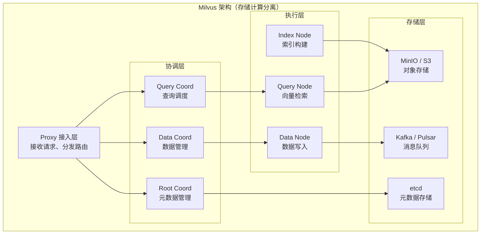

# Milvus（向量数据库）

## 基础概念

Milvus 是一个专门存储和检索**向量（Vector）**的开源数据库。所谓向量，就是把文本、图片、音频等非结构化数据通过 Embedding 模型（嵌入模型）转换成的一串数字（如 `[0.12, -0.34, 0.56, ...]`）。两段语义相近的文本，转出来的向量在数学上也会很接近，Milvus 就是利用这个特性来做"语义搜索"。

传统数据库（如 MySQL）擅长精确匹配——你搜 `id=123` 它能秒回。但如果你问"和这张图片最像的 10 张图是哪些"，传统数据库就无能为力了。Milvus 解决的正是这类**相似度搜索（Similarity Search）**问题，是 RAG（检索增强生成）、推荐系统、人脸识别等 AI 应用的关键基础设施。

### 核心要素

| 要素 | 作用 |
|------|------|
| **Collection（集合）** | 存放向量数据的容器，类似 MySQL 中的"表" |
| **Index（向量索引）** | 加速搜索的数据结构，决定搜索速度和精度的平衡 |
| **混合搜索** | 向量相似度搜索 + 标量条件过滤的组合查询 |
| **分布式架构** | 存储与计算分离，支持水平扩展到 PB 级数据 |

### Collection（集合）

Collection 是 Milvus 中数据的基本组织单位。创建 Collection 前需要先定义 Schema（模式），告诉 Milvus 这个集合里有哪些字段、每个字段的类型是什么。

一个典型的 Schema 包含三类字段：
- **主键字段**：唯一标识每条数据，类似数据库中的 `id`
- **向量字段**：存放 Embedding 向量，维度（dim）由你使用的嵌入模型决定（如 OpenAI text-embedding-3-small 输出 1536 维）
- **标量字段**：存放文本、数字等元数据，用于过滤和展示

```python
from pymilvus import MilvusClient

# 使用新版 MilvusClient API 创建集合
client = MilvusClient(uri="http://localhost:19530")

# 快速创建：自动生成 Schema（id + vector 字段）
client.create_collection(
    collection_name="docs",
    dimension=768  # 向量维度，由嵌入模型决定
)
```

如果需要自定义多个标量字段做过滤，可以手动定义 Schema：

```python
from pymilvus import MilvusClient, DataType

client = MilvusClient(uri="http://localhost:19530")

schema = client.create_schema(auto_id=True)
schema.add_field("id", DataType.INT64, is_primary=True)
schema.add_field("embedding", DataType.FLOAT_VECTOR, dim=768)
schema.add_field("text", DataType.VARCHAR, max_length=1000)
schema.add_field("category", DataType.VARCHAR, max_length=50)
```

### Index（向量索引）

向量索引是加速搜索的核心。没有索引时，Milvus 需要逐一比较每条向量（暴力搜索），数据量一大就慢得不可接受。索引通过特殊的数据结构把 O(n) 的搜索优化到近似 O(log n)。

不同索引适合不同场景：

| 索引类型 | 精度 | 速度 | 内存占用 | 适用场景 |
|---------|------|------|---------|---------|
| **FLAT** | 最高（精确搜索） | 慢 | 低 | 数据量 < 100 万，对精度要求极高 |
| **HNSW** | 高 | 快 | 高（全在内存） | 实时搜索、内存充足的场景 |
| **IVF_FLAT** | 中等 | 中等 | 中等 | 百万到亿级数据 |
| **DiskANN** | 高 | 中等 | 低（数据在磁盘） | PB 级超大规模、成本敏感 |
| **GPU_IVF_FLAT** | 中等 | 极快 | GPU 显存 | 有 NVIDIA GPU、高并发场景 |

### 混合搜索

实际业务中很少只做纯向量搜索。比如在电商搜索中，你可能需要"找语义最像的商品，但只要价格 < 100 元的"。Milvus 支持在向量搜索的同时加标量过滤条件，先过滤再搜索，兼顾语义相关性和业务逻辑。

Milvus 2.5 版本还新增了**全文检索（Full-Text Search）**能力，基于 Sparse-BM25 算法实现，可以同时做关键词匹配和语义搜索，进一步提升检索质量。

### 核心要素关系图



这种存储计算分离的设计，让计算节点和存储节点可以独立扩缩容。比如查询量暴增时，只加 Query Node 就行，不用动存储。

## 基础用法

安装依赖：

```bash
# 安装 Python SDK
pip install "pymilvus>=2.5.0"

# 启动本地 Milvus 服务（需要 Docker）
# 方式一：Docker（推荐新手）
docker run -d --name milvus \
  -p 19530:19530 -p 9091:9091 \
  milvusdb/milvus:v2.5.6

# 方式二：Milvus Lite（无需 Docker，纯 Python，适合开发测试）
# 只需 pip install pymilvus，连接时指定本地文件路径即可
```

> 如需 Milvus Lite（轻量版），连接时将 `uri` 改为本地文件路径（如 `"./milvus_demo.db"`），无需 Docker，适合本地开发和 Jupyter Notebook 环境。

最小可运行示例（基于 pymilvus==2.5.6 验证，截至 2026-03）：

```python
from pymilvus import MilvusClient
import numpy as np

# 1. 连接 Milvus（Docker 版）
client = MilvusClient(uri="http://localhost:19530")
# 若用 Milvus Lite（无需 Docker）：
# client = MilvusClient(uri="./milvus_demo.db")

# 2. 创建集合（自动生成 id + vector 字段）
client.create_collection(
    collection_name="demo",
    dimension=768
)

# 3. 插入向量数据
data = [
    {"id": i, "vector": np.random.rand(768).tolist(), "text": f"文档_{i}"}
    for i in range(100)
]
client.insert(collection_name="demo", data=data)

# 4. 向量相似度搜索
query_vector = np.random.rand(768).tolist()
results = client.search(
    collection_name="demo",
    data=[query_vector],
    limit=5,
    output_fields=["text"]
)

# 5. 输出结果
for hits in results:
    for hit in hits:
        print(f"ID={hit['id']}, 相似度={hit['distance']:.4f}, text={hit['entity']['text']}")

# 6. 清理
client.drop_collection("demo")
```

预期输出：

```text
ID=42, 相似度=0.8876, text=文档_42
ID=17, 相似度=0.8743, text=文档_17
ID=89, 相似度=0.8621, text=文档_89
ID=34, 相似度=0.8512, text=文档_34
ID=51, 相似度=0.8401, text=文档_51
```

上面使用的是 `MilvusClient` 新版 API（pymilvus 2.4+ 引入），比旧版 ORM 风格的 `connections.connect()` + `Collection()` 更简洁。旧版 API 仍然可用，但官方推荐新项目使用 `MilvusClient`。

## 同类工具对比

| 维度 | Milvus | Pinecone | Qdrant | Weaviate |
|------|--------|----------|--------|----------|
| 核心定位 | 开源分布式向量数据库 | 全托管云向量搜索 | 开源向量搜索引擎 | 开源向量 + 文本混合搜索 |
| 部署方式 | 自建（Docker/K8s）或 Zilliz Cloud 托管 | 纯 SaaS，无需运维 | 自建或 Qdrant Cloud | 自建或 Weaviate Cloud |
| 数据规模 | PB 级（十亿+向量） | 十亿级 | 数十亿 | 十亿+ |
| GPU 加速 | 支持（GPU_IVF_FLAT / RAFT） | 不支持 | 支持 | 不支持 |
| 全文检索 | 2.5 版本内置 Sparse-BM25 | 不支持 | 不支持 | 内置 BM25 |
| 适合人群 | 需要大规模部署、成本敏感、有运维能力 | 快速原型、不想运维 | 中等规模、Rust 性能爱好者 | 需要向量 + 关键词混合搜索 |

核心区别：

- **Milvus**：开源免费、可自建部署、支持 PB 级数据和 GPU 加速，适合有运维能力的团队做大规模向量搜索
- **Pinecone**：全托管 SaaS，零运维但成本较高，适合快速验证原型或中小规模应用
- **Qdrant**：Rust 编写，单机性能优秀，API 设计简洁，适合中等规模的实时搜索场景
- **Weaviate**：原生支持向量 + 关键词混合搜索，内置模块化的向量化能力，适合需要多模态检索的场景

## 常见误区

| 误区 | 准确理解 |
|------|----------|
| 向量维度越高搜索越准 | 维度由嵌入模型决定，盲目增加维度只会增加计算成本和内存消耗，不一定提升精度。选对嵌入模型比调维度更重要 |
| Milvus 可以替代 MySQL | Milvus 只擅长向量相似度搜索，不支持事务、JOIN、外键等关系操作。通常 Milvus 搭配 MySQL/PostgreSQL 一起用，各司其职 |
| 相似度分数高就一定相关 | 余弦相似度只反映向量方向接近，高分不一定等于业务上相关。建议用 Reranker（重排序模型）二次筛选提升效果 |
| 向量搜索可以替代关键词搜索 | 向量搜索基于语义理解，关键词搜索基于精确匹配，两者互补。RAG 场景下最佳实践是混合搜索（Hybrid Search）结合两者 |

## 优劣势分析

| 优势 | 劣势 |
|------|------|
| 开源免费，支持自建部署，无厂商锁定 | 分布式部署依赖 etcd、MinIO 等组件，运维复杂度较高 |
| PB 级数据支持，10+ 种索引算法可选 | 内存占用较大，HNSW 索引需要把数据全部加载到内存 |
| GPU 加速搜索，高并发场景下性能突出 | 学习曲线较陡，需要理解索引类型、分区、Segment 等概念 |
| 2.5 版本新增全文检索，一站式满足语义 + 关键词搜索 | Milvus Lite 功能受限，生产环境仍需完整集群部署 |

## 思考题

<details>
<summary>初级：Milvus 中的 Collection 和 MySQL 中的 Table 有什么相似和不同？</summary>

**参考答案：**

相似点：都是数据的基本组织单位，都需要先定义 Schema（字段名、字段类型）再写入数据。

不同点：
- Collection 必须包含至少一个**向量字段**，这是 MySQL Table 没有的
- Collection 的核心查询方式是**向量相似度搜索**（找最像的 TopK），而非 SQL 的精确条件查询
- Collection 需要创建**向量索引**才能高效搜索，MySQL 的 B+ 树索引和向量索引原理完全不同
- Collection 在搜索前需要执行 `load()` 把数据加载到内存，MySQL 的查询不需要这个步骤

</details>

<details>
<summary>中级：HNSW 和 IVF_FLAT 两种索引各适合什么场景？如何选择？</summary>

**参考答案：**

- **HNSW**（Hierarchical Navigable Small World，分层可导航小世界图）：把向量组织成多层图结构，搜索时从顶层快速定位到目标区域再逐层细化。优点是搜索速度快、精度高；缺点是全部数据必须在内存中，内存占用大。适合数据量 < 1000 万、对延迟要求高、内存充足的场景。
- **IVF_FLAT**（Inverted File with Flat，倒排文件索引）：先把向量聚类成若干组（nlist 个），搜索时只在最近的几个组（nprobe 个）里暴力搜索。优点是内存占用适中；缺点是精度略低于 HNSW。适合数据量在百万到亿级、需要平衡精度和成本的场景。

选择原则：内存够用优先 HNSW，数据量大或成本敏感选 IVF 系列，超大规模（十亿+）考虑 DiskANN。

</details>

<details>
<summary>中级：为什么 RAG 系统中推荐使用混合搜索而不是纯向量搜索？</summary>

**参考答案：**

纯向量搜索基于语义理解，擅长捕捉"意思相近"的内容，但在以下场景会丢分：
1. **精确术语匹配**：用户搜"RFC 7231"，语义搜索可能返回其他 HTTP 协议文档，但全文检索能精确命中
2. **专有名词**：产品型号、人名等没有语义上下文的词，向量搜索容易偏移
3. **短查询**：用户输入很短时（如"vLLM"），向量表征信息不够丰富

混合搜索（Hybrid Search）同时执行向量搜索和关键词搜索，再用 RRF（Reciprocal Rank Fusion，倒数排名融合）等算法合并两路结果，兼顾语义理解和精确匹配，检索质量显著优于单一方式。Milvus 2.5 内置了 Sparse-BM25 全文检索，可以在一个系统中同时完成两种搜索。

</details>

## 参考资料

1. 官方文档：https://milvus.io/docs
2. GitHub 仓库：https://github.com/milvus-io/milvus（31k+ stars）
3. PyMilvus SDK 文档：https://milvus.io/api-reference/pymilvus/v2.5.x/About.md
4. Milvus 2.5 全文检索介绍：https://milvus.io/blog
5. Zilliz Cloud（Milvus 托管版）：https://zilliz.com
