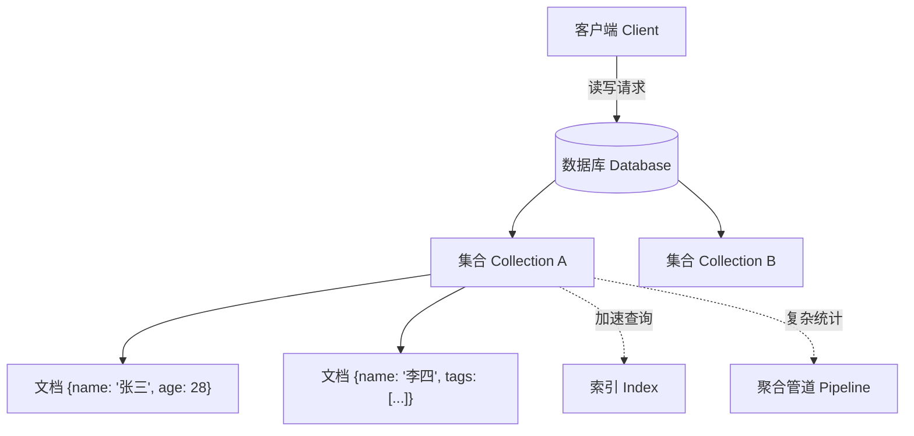

# MongoDB（文档数据库）

## 基础概念

MongoDB 是一个**文档型数据库（Document Database）**，属于 NoSQL（非关系型数据库）阵营。传统数据库（如 MySQL）把数据存在一行行的"表格"里，每一列必须提前定义好；MongoDB 不同，它把数据存成一个个"文档"——本质上就是 JSON 对象，字段可以随时加减，不需要提前画好表格结构。

举个例子：存一个用户信息，MySQL 需要先建表、定义列名和类型；MongoDB 直接往里扔一个 JSON 就行，下一个用户多几个字段也没关系。这种灵活性让 MongoDB 特别适合快速迭代的项目和数据结构经常变化的场景。

MongoDB 8.0（2024 年 10 月发布）是当前最新的主要版本，吞吐量比 7.0 提升 32%，批量写入速度提升 56%。此外，MongoDB Atlas（云托管版）内置了 Atlas Vector Search（向量搜索），可以直接用来做 AI 应用中的语义检索，不需要额外部署向量数据库。

### 核心要素

| 要素 | 作用 |
|------|------|
| **文档（Document）** | 数据的基本单元，就是一个 JSON 对象，支持嵌套和数组 |
| **集合（Collection）** | 存放文档的容器，类似 MySQL 的"表"，但不要求所有文档结构一致 |
| **索引（Index）** | 给字段建目录，让查询更快，不建索引就是全表扫描 |
| **聚合管道（Aggregation Pipeline）** | 多步骤的数据处理流水线，用于统计分析和复杂查询 |

### 文档（Document）

文档是 MongoDB 存储数据的最小单位，内部用 BSON（Binary JSON，二进制 JSON）格式存储。每个文档自动带一个 `_id` 字段作为唯一标识。文档可以嵌套——一个文档里面可以再放对象或数组，不需要像关系数据库那样拆成多张表再 JOIN。

```python
# 一个典型的 MongoDB 文档长这样（Python 字典形式）
user_doc = {
    "_id": "user_001",
    "name": "张三",
    "age": 28,
    "skills": ["Python", "MongoDB"],       # 数组
    "profile": {                            # 嵌套对象
        "company": "创新科技",
        "role": "后端开发"
    }
}
```

### 集合（Collection）

集合是文档的容器，对应关系数据库中的"表"。关键区别：同一个集合里的文档可以有完全不同的字段。比如 `users` 集合中，有的用户文档有 `phone` 字段，有的没有，这完全合法。

### 索引（Index）

索引是提升查询速度的关键。没有索引时，MongoDB 要逐条扫描所有文档（全表扫描）；有了索引，就像字典的目录一样可以快速定位。常用索引类型：单字段索引、复合索引（多字段组合）、文本索引（全文搜索）、地理空间索引。

### 聚合管道（Aggregation Pipeline）

聚合管道是 MongoDB 的数据处理流水线。数据像在工厂流水线上一样，依次经过多个"阶段"处理。常用阶段包括：`$match`（过滤）、`$group`（分组统计）、`$sort`（排序）、`$lookup`（关联查询，类似 SQL 的 JOIN）。

### 核心要素关系图



四者的关系：文档是数据本体，集合是文档的家，索引是查询的加速器，聚合管道是分析的流水线。

## 基础用法

安装依赖：

```bash
# 安装 Python 官方驱动 PyMongo
pip install pymongo

# 本地安装 MongoDB 服务端（任选一种方式）
# macOS: brew install mongodb-community && brew services start mongodb-community
# Windows: 从 https://www.mongodb.com/try/download/community 下载安装包
# Docker: docker run -d -p 27017:27017 --name mongo mongo:8.0
```

最小可运行示例（基于 pymongo==4.9.1 验证，截至 2026-03）：

```python
from pymongo import MongoClient
from datetime import datetime

# 1. 连接 MongoDB（默认本地 27017 端口）
client = MongoClient("mongodb://localhost:27017/")
db = client["mytest"]           # 选择数据库（不存在会自动创建）
users = db["users"]             # 选择集合（不存在会自动创建）

# 2. 插入一条文档
result = users.insert_one({
    "name": "张三",
    "age": 28,
    "tags": ["Python", "AI"],
    "created_at": datetime.now()
})
print(f"插入成功，ID: {result.inserted_id}")

# 3. 查询文档
user = users.find_one({"name": "张三"})
print(f"查到: {user['name']}，{user['age']} 岁")

# 4. 更新文档（$set 只改指定字段，其他不动）
users.update_one({"name": "张三"}, {"$set": {"age": 29}})
print("更新成功")

# 5. 删除文档
users.delete_one({"name": "张三"})
print("删除成功")

# 6. 关闭连接
client.close()
```

预期输出：

```text
插入成功，ID: 65f...（一串自动生成的 ObjectId）
查到: 张三，28 岁
更新成功
删除成功
```

上面的增删改查就是 MongoDB 最核心的四个操作。`insert_one` 插入、`find_one` 查询、`update_one` 更新、`delete_one` 删除——命名非常直白。

带索引和聚合的进阶示例：

```python
from pymongo import MongoClient, ASCENDING

client = MongoClient("mongodb://localhost:27017/")
db = client["mytest"]
orders = db["orders"]

# 批量插入测试数据
orders.insert_many([
    {"product": "手机", "category": "电子", "amount": 4999, "qty": 1},
    {"product": "耳机", "category": "电子", "amount": 299, "qty": 3},
    {"product": "T恤", "category": "服装", "amount": 99, "qty": 5},
    {"product": "外套", "category": "服装", "amount": 399, "qty": 2},
])

# 创建索引（给 category 字段加索引，加速按类目查询）
orders.create_index([("category", ASCENDING)])

# 聚合管道：按类目统计总销售额
pipeline = [
    {"$group": {
        "_id": "$category",
        "total": {"$sum": {"$multiply": ["$amount", "$qty"]}},
        "count": {"$sum": 1}
    }},
    {"$sort": {"total": -1}}
]

for row in orders.aggregate(pipeline):
    print(f"{row['_id']}: 销售额 {row['total']} 元，{row['count']} 笔订单")

# 清理
orders.drop()
client.close()
```

预期输出：

```text
电子: 销售额 5896 元，2 笔订单
服装: 销售额 1293 元，2 笔订单
```

## 同类工具对比

| 维度 | MongoDB | MySQL / PostgreSQL | Redis |
|------|---------|-------------------|-------|
| 核心定位 | 文档数据库，灵活存储 JSON 数据 | 关系数据库，表格+SQL 查询 | 内存键值存储，极速缓存 |
| 数据模型 | JSON 文档，支持嵌套，无固定结构 | 行列表格，需提前定义表结构 | Key-Value，数据结构简单 |
| 最擅长 | 快速迭代、内容管理、用户画像 | 复杂事务、强一致性、财务系统 | 缓存、会话存储、排行榜 |
| 向量搜索 | Atlas Vector Search 原生支持 | 需 pgvector 扩展（PG）/ 不支持（MySQL） | 需 RediSearch 模块 |
| 适合人群 | 全栈开发者、AI 应用开发者 | 传统后端开发者、DBA | 需要高性能缓存的场景 |

核心区别：

- **MongoDB**：数据结构经常变、不想提前建表、需要存复杂嵌套数据时首选
- **MySQL / PostgreSQL**：需要强事务保证（如转账）、复杂 JOIN 查询时首选
- **Redis**：需要毫秒级响应、数据可以丢失（缓存场景）时首选

实际项目中三者经常搭配使用：MongoDB 做主存储，Redis 做缓存，PostgreSQL 做需要强一致性的业务。

## 常见误区

| 误区 | 准确理解 |
|------|----------|
| MongoDB 不需要设计数据结构，随便存就行 | 虽然 MongoDB 支持灵活 Schema（模式），但生产环境仍需认真设计文档结构。混乱的结构会导致查询困难和维护噩梦 |
| MongoDB 没有事务，不能用于严肃业务 | 4.0 版本起就支持多文档 ACID 事务。8.0 版本的事务性能进一步提升，可以支撑大多数业务场景 |
| 不建索引也能跑得很快 | 没有索引的查询会触发全集合扫描（Collection Scan），数据量大时性能急剧下降。常用查询字段必须建索引 |
| MongoDB 只适合小项目 | MongoDB Atlas 支持自动分片和全球部署，eBay、Uber、Adobe 等大厂都在生产环境使用 |

## 优劣势分析

| 优势 | 劣势 |
|------|------|
| 灵活的文档模型，不需要提前定义表结构，快速迭代 | 多表关联查询（JOIN）不如关系数据库方便，`$lookup` 性能有限 |
| 原生支持水平扩展（分片 Sharding），适合海量数据 | 内存占用相对较高，BSON 格式比纯文本 JSON 更占空间 |
| Atlas Vector Search 内置向量搜索，AI 场景一站式解决 | 复杂事务场景下性能不如 PostgreSQL |
| 社区活跃，驱动覆盖几乎所有主流语言 | 社区版部分高级功能（如自动加密）仅企业版可用 |

## 思考题

<details>
<summary>初级：MongoDB 的"文档"和 MySQL 的"行"有什么本质区别？</summary>

**参考答案：**

MySQL 的一行数据是扁平的，每列的类型和名字在建表时就固定了，所有行结构必须一致。MongoDB 的一个文档是一个 JSON 对象，支持嵌套对象和数组，不同文档可以有不同的字段。这意味着 MongoDB 可以在一个文档里存完整的关联数据（如用户+地址+订单），而 MySQL 需要拆成多张表再 JOIN。

</details>

<details>
<summary>中级：什么场景下应该选 MongoDB 而不是 MySQL？反过来呢？</summary>

**参考答案：**

选 MongoDB 的场景：数据结构不固定或经常变化（如内容管理系统）、需要存储深层嵌套数据（如用户画像、商品属性）、需要水平扩展处理海量数据、AI 应用需要向量搜索能力。

选 MySQL/PostgreSQL 的场景：需要复杂的多表 JOIN 查询、对事务一致性要求极高（如金融转账）、团队更熟悉 SQL、数据结构稳定且关系明确。

核心判断标准：数据是"文档型"（一个实体的所有信息聚在一起）还是"关系型"（实体之间有复杂的引用关系）。

</details>

<details>
<summary>中级：MongoDB Atlas Vector Search 在 AI Agent 应用中能解决什么问题？和独立部署 Milvus 相比有什么取舍？</summary>

**参考答案：**

Atlas Vector Search 让 MongoDB 同时承担业务数据存储和向量检索两个角色，避免了在 MongoDB 和独立向量数据库之间同步数据的复杂性。对于 RAG（检索增强生成）场景，可以在同一个数据库中存储原始文本、元数据和嵌入向量，查询时一步完成语义检索+业务过滤。

与 Milvus 相比的取舍：Atlas Vector Search 胜在架构简单、运维成本低（不需要维护两套数据库）；Milvus 胜在向量检索性能更强、支持更多索引算法（如 IVF、HNSW 的细粒度调参）。数据量在千万级以内且不需要极致向量检索性能时，Atlas Vector Search 是更务实的选择。

</details>

## 参考资料

1. MongoDB 官方文档：https://www.mongodb.com/docs/manual/
2. PyMongo 驱动文档：https://pymongo.readthedocs.io/
3. MongoDB 8.0 发布说明：https://www.mongodb.com/zh-cn/docs/manual/release-notes/8.0/
4. Atlas Vector Search 产品页：https://www.mongodb.com/products/platform/atlas-vector-search
5. MongoDB GitHub 仓库：https://github.com/mongodb/mongo
