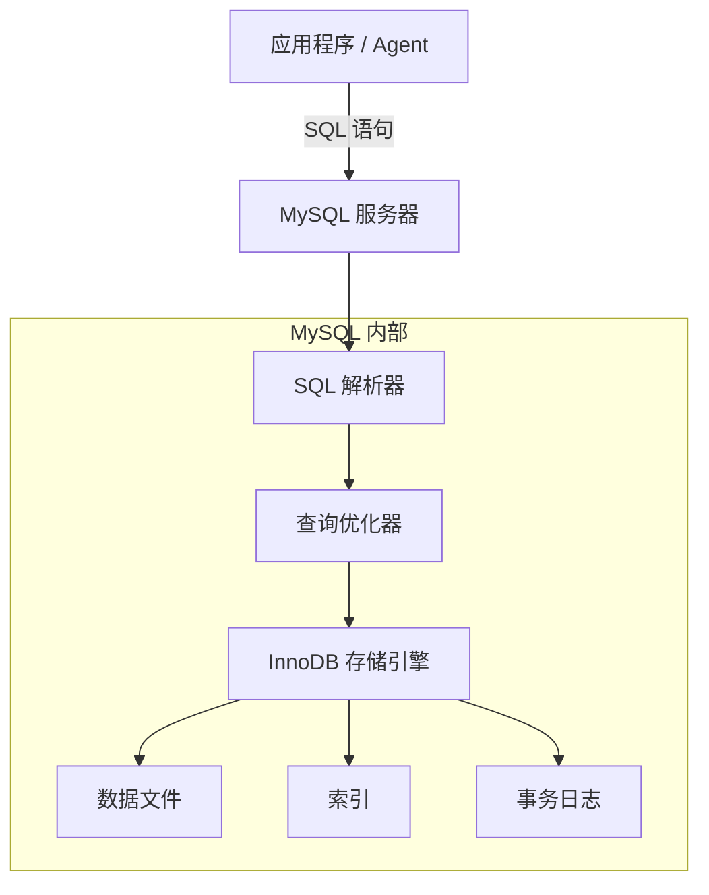

# MySQL（关系型数据库）

## 基础概念

MySQL 是全球使用最广泛的开源关系型数据库管理系统（RDBMS，Relational Database Management System）。你可以把它理解成一个**超级电子表格**：数据按行和列存在"表"里，表和表之间可以建立关联关系，而 MySQL 负责帮你安全、高效地增删改查这些数据。

在 Agent 应用开发中，MySQL 的典型用途是存储**结构化数据**——对话记录、用户信息、Agent 执行状态、工具调用日志等。这类数据有固定的字段格式，需要事务保证（比如"扣费 + 发消息"必须同时成功或同时失败），正是 MySQL 的强项。

> MySQL 9.0（2024 年 7 月发布）新增了 `VECTOR` 数据类型，支持向量存储和相似度搜索，可以在 MySQL 内直接做简单的语义检索，不必额外引入向量数据库。Oracle 还推出了 MySQL AI 功能套件，内置 AutoML、向量存储和 RAG 能力，支持通过 MCP 协议与 Agent 应用集成。

### 核心要素

| 要素 | 作用 |
|------|------|
| **表（Table）** | 数据的容器，由行（记录）和列（字段）组成，每张表存一类数据 |
| **SQL 语言** | 操作数据的标准语言，增删改查全靠它：`SELECT`、`INSERT`、`UPDATE`、`DELETE` |
| **事务（Transaction）** | 把多条 SQL 打包成一个原子操作，要么全做要么全不做，保证数据一致 |
| **索引（Index）** | 加速查询的数据结构，相当于书的目录，避免逐行扫描 |

### 表（Table）

表是 MySQL 存数据的基本单位。设计表的过程就是想清楚"要存什么字段、每个字段是什么类型"。常用数据类型：

- `INT` / `BIGINT`：整数（用户 ID、计数器）
- `VARCHAR(N)`：变长字符串（用户名、标题）
- `TEXT` / `LONGTEXT`：长文本（对话内容、Agent 回复）
- `DECIMAL(M,D)`：精确小数（金额）
- `TIMESTAMP`：时间戳（创建时间）
- `JSON`：JSON 文档（Agent 的工具调用参数）
- `VECTOR(N)`：向量类型（MySQL 9.0+，存储 Embedding）

### SQL 语言

SQL（Structured Query Language，结构化查询语言）是跟 MySQL 对话的唯一方式。四大核心操作：

```sql
-- 插入数据
INSERT INTO users (name, email) VALUES ('张三', 'zhang@example.com');

-- 查询数据
SELECT * FROM users WHERE name = '张三';

-- 更新数据
UPDATE users SET email = 'new@example.com' WHERE name = '张三';

-- 删除数据
DELETE FROM users WHERE name = '张三';
```

### 事务（Transaction）

事务保证一组操作的**原子性**。经典例子：Agent 调用付费 API 时，"扣费"和"记录调用日志"必须同时成功。如果扣费成功但记录日志失败，事务会把扣费也撤销（回滚）。

MySQL 的 InnoDB 引擎（默认引擎）提供完整的 ACID 事务支持：
- **A**tomicity（原子性）：全做或全不做
- **C**onsistency（一致性）：数据始终满足约束
- **I**solation（隔离性）：并发事务互不干扰
- **D**urability（持久性）：提交后数据不会丢失

### 索引（Index）

索引是 MySQL 提速的关键。没有索引时查一条记录要逐行扫描（全表扫描），有索引后直接定位，速度差距可达百倍。

常用索引类型：
- **主键索引（PRIMARY KEY）**：每张表必须有，自动创建，唯一标识每行
- **普通索引（INDEX）**：加速常用查询字段
- **唯一索引（UNIQUE）**：保证字段值不重复（如邮箱）
- **复合索引**：多个字段组合索引，适合多条件查询

### 核心要素关系图



四者的关系：**表**定义数据长什么样，**SQL** 描述你想对数据做什么，**事务**保证操作的安全性，**索引**让操作跑得快。

## 基础用法

安装依赖：

```bash
pip install mysql-connector-python==9.1.0
```

需要一个正在运行的 MySQL 服务。本地开发推荐用 Docker 一键启动：

```bash
docker run -d --name mysql-dev -e MYSQL_ROOT_PASSWORD=123456 -e MYSQL_DATABASE=agent_db -p 3306:3306 mysql:9.0
```

最小可运行示例（基于 mysql-connector-python==9.1.0 验证，截至 2026-03）：

```python
import mysql.connector
import os

# 1. 连接数据库
conn = mysql.connector.connect(
    host=os.getenv("MYSQL_HOST", "localhost"),
    user=os.getenv("MYSQL_USER", "root"),
    password=os.getenv("MYSQL_PASSWORD", "123456"),
    database=os.getenv("MYSQL_DATABASE", "agent_db"),
    charset="utf8mb4"
)
cursor = conn.cursor(dictionary=True)

# 2. 建表
cursor.execute("""
CREATE TABLE IF NOT EXISTS chat_logs (
    id INT AUTO_INCREMENT PRIMARY KEY,
    user_id INT NOT NULL,
    role ENUM('user', 'agent') NOT NULL,
    content TEXT NOT NULL,
    created_at TIMESTAMP DEFAULT CURRENT_TIMESTAMP,
    INDEX idx_user (user_id),
    INDEX idx_time (created_at)
) ENGINE=InnoDB DEFAULT CHARSET=utf8mb4
""")

# 3. 用事务插入一轮对话（用户提问 + Agent 回复）
try:
    cursor.execute("START TRANSACTION")
    cursor.execute(
        "INSERT INTO chat_logs (user_id, role, content) VALUES (%s, %s, %s)",
        (1, "user", "Python 的装饰器怎么用？")
    )
    cursor.execute(
        "INSERT INTO chat_logs (user_id, role, content) VALUES (%s, %s, %s)",
        (1, "agent", "装饰器本质上是一个接收函数并返回函数的高阶函数……")
    )
    conn.commit()
    print("[OK] 对话已保存")
except Exception as e:
    conn.rollback()
    print(f"[ERROR] 保存失败: {e}")

# 4. 查询某用户的最近对话
cursor.execute(
    "SELECT role, content, created_at FROM chat_logs WHERE user_id = %s ORDER BY created_at",
    (1,)
)
for row in cursor.fetchall():
    print(f"[{row['role']}] {row['content']}")

cursor.close()
conn.close()
```

预期输出：

```text
[OK] 对话已保存
[user] Python 的装饰器怎么用？
[agent] 装饰器本质上是一个接收函数并返回函数的高阶函数……
```

## 同类工具对比

| 维度 | MySQL | PostgreSQL | SQLite |
|------|-------|------------|--------|
| 核心定位 | 通用型开源关系数据库，Web 应用首选 | 功能最强的开源关系数据库 | 嵌入式轻量数据库，零配置 |
| 事务支持 | InnoDB 引擎完整 ACID | 更强的隔离和约束能力 | 支持，但并发写入受限 |
| 向量搜索 | 9.0 新增 VECTOR 类型，基础支持 | pgvector 扩展，生态更成熟 | 不支持 |
| 学习曲线 | 低，资料最丰富 | 中等，有 PostgreSQL 特有语法 | 极低，无需安装服务 |
| 适合场景 | 中小型 Web 应用、Agent 对话存储 | 复杂查询、GIS、金融系统 | 本地开发、移动端、嵌入式 |

核心区别：

- **MySQL**：生态最大、上手最简单、部署运维资料最多，中小型 Agent 应用的首选
- **PostgreSQL**：功能更全面（窗口函数、CTE、pgvector），适合对 SQL 能力要求高的场景
- **SQLite**：无需服务端，单文件数据库，适合本地原型开发和轻量场景

## 常见误区

| 误区 | 准确理解 |
|------|----------|
| MySQL 不支持向量搜索，做 AI 必须用专门的向量数据库 | MySQL 9.0 起原生支持 `VECTOR` 数据类型和 `DISTANCE()` 函数，简单的语义检索场景可以直接在 MySQL 内完成，不一定需要额外引入 Milvus / Chroma |
| 加了索引查询就一定快 | 不一定。如果查询条件用了函数（如 `WHERE YEAR(created_at) = 2025`），索引会失效。索引也会增加写入开销，不是越多越好 |
| 事务隔离级别越高越好 | 隔离级别越高，并发性能越差。MySQL 默认的 REPEATABLE READ 已能满足绝大多数场景，不要盲目改成 SERIALIZABLE |

## 优劣势分析

| 优势 | 劣势 |
|------|------|
| 全球使用量最大，教程和解决方案极多 | 复杂查询能力不如 PostgreSQL（窗口函数支持较晚） |
| 上手门槛低，SQL 语法标准化 | 原生向量搜索功能较新，生态不如 pgvector 成熟 |
| InnoDB 引擎事务可靠，经过海量生产验证 | 水平扩展（分库分表）需要借助中间件（如 ShardingSphere） |
| 主从复制成熟，读写分离方案简单 | 存储引擎插件体系灵活但也增加了选择复杂度 |

## 思考题

<details>
<summary>初级：为什么 Agent 对话系统适合用 MySQL 而不是直接写文件？</summary>

**参考答案：**

写文件无法保证并发安全（多个 Agent 同时写同一个文件会冲突）、没有事务支持（写一半断电数据就坏了）、查询效率低（要搜某用户的对话只能全文扫描）。MySQL 通过事务保证数据一致性，通过索引加速查询，通过锁机制处理并发，是结构化数据存储的正确选择。

</details>

<details>
<summary>中级：在 Agent 对话记录表中，对 `(user_id, created_at)` 建复合索引有什么好处？和分别建两个单字段索引有什么区别？</summary>

**参考答案：**

复合索引 `(user_id, created_at)` 可以高效处理"查某用户最近 N 条对话"这类查询（`WHERE user_id = 1 ORDER BY created_at DESC LIMIT 10`），一次索引查找就能同时过滤用户和排序时间。

如果分别建两个单字段索引，MySQL 只能选择其中一个使用（通常选 user_id 的索引过滤），然后对结果再按 created_at 排序，多了一步排序操作。复合索引把"过滤 + 排序"合并成一次索引扫描，效率更高。

</details>

<details>
<summary>中级：MySQL 9.0 的 VECTOR 类型能完全替代专用向量数据库（如 Milvus）吗？边界在哪？</summary>

**参考答案：**

不能完全替代。MySQL 的 VECTOR 类型适合小规模（百万级以下）、低频的语义检索场景，比如在 Agent 应用中查找相似的历史对话。

边界在于：MySQL 的向量索引能力有限（目前无原生 ANN 索引，Google Cloud SQL for MySQL 通过 ScaNN 库提供了 ANN 支持，但这是云托管特性），面对千万级以上高维向量的高并发检索，专用向量数据库（Milvus、Qdrant 等）在索引结构、分布式检索、召回精度方面有明显优势。

实际选型建议：如果你的 Agent 应用已经用了 MySQL，向量数据量不大，可以直接用 VECTOR 类型避免引入新组件；如果向量检索是核心功能且数据量大，应使用专用向量数据库。

</details>

## 参考资料

1. MySQL 官方文档：https://dev.mysql.com/doc/
2. MySQL Connector/Python 文档：https://dev.mysql.com/doc/connector-python/en/
3. MySQL 9.0 VECTOR 数据类型指南：https://www.dbvis.com/thetable/a-complete-guide-to-the-new-mysql-9-vector-data-type/
4. MySQL AI 官方页面（AutoML + GenAI）：https://www.mysql.com/products/mysqlai/
5. Oracle 博客 - MySQL HeatWave 作为 AI Agent 知识库：https://blogs.oracle.com/mysql/using-mysql-heatwave-as-a-knowledge-base-with-the-oci-ai-agent-platform
6. Google Cloud SQL for MySQL 向量搜索 GA 公告：https://cloud.google.com/blog/products/databases/cloud-sql-for-mysql-vector-storage-and-similarity-search-is-ga
