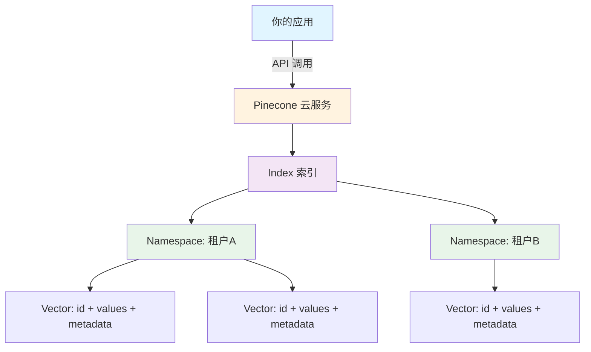

# Pinecone（云原生向量数据库）

## 基础概念

Pinecone 是一款**全托管的云原生向量数据库（Managed Vector Database）**，专门用来存储和检索高维向量数据。通俗讲：你把文本、图片等内容通过嵌入模型（Embedding Model）转成一串数字（向量），扔进 Pinecone，之后就能用"语义相似度"快速找到最相关的内容。

与 Milvus、Qdrant 等需要自己搭服务器的向量数据库不同，Pinecone 走的是**纯云托管路线**——你不需要管服务器、不需要调索引参数、不需要担心扩容。注册账号、拿到 API Key、写几行代码就能用。2025 年 Pinecone 推出了第二代 Serverless 架构，支持 AWS、Azure、GCP 三大云平台，并新增了备份恢复、稀疏向量索引等能力。

### 核心要素

| 要素 | 作用 |
|------|------|
| **Index（索引）** | 向量数据的容器，创建时指定维度和距离度量，所有数据存在索引里 |
| **Vector（向量）** | 最小数据单元，包含 ID + 浮点数组 + 可选元数据 |
| **Namespace（命名空间）** | 索引内的逻辑隔离分区，用于多租户场景下隔离不同用户的数据 |
| **Metadata Filter（元数据过滤）** | 在向量相似度搜索的同时，按业务字段过滤结果 |

### Index（索引）

索引是 Pinecone 里装向量的"桶"。创建索引时需要定两件事：

- **dimension（维度）**：你用的嵌入模型输出多少维的向量，这里就填多少。比如 OpenAI 的 `text-embedding-3-small` 输出 1536 维
- **metric（距离度量）**：衡量两个向量"有多像"的方式。常用 `cosine`（余弦相似度），也支持 `euclidean`（欧氏距离）和 `dotproduct`（点积）

Pinecone 当前主推 **Serverless 索引**，按实际读写量（Read/Write Units）计费，自动扩缩容。旧版 Pod-based 索引按固定资源付费，官方已支持一键迁移到 Serverless。

### Vector（向量）

每条向量包含：

- `id`（必填）：唯一标识，字符串格式
- `values`（必填）：浮点数组，长度必须等于索引的 dimension
- `metadata`（可选）：附加的业务字段，如标题、分类、日期等，用于后续过滤

插入用 `upsert`（存在则更新，不存在则插入），查询用 `query`。

### Namespace（命名空间）

命名空间是索引内部的逻辑分区。比如你做一个 SaaS 产品，A 公司和 B 公司的文档都存在同一个索引里，但各自用不同的命名空间，查询时互不干扰。好处是共享一个索引降低成本，同时保证数据隔离。

### 核心要素关系图



整体关系：应用通过 API 访问 Pinecone 云服务 --> 数据存在 Index 里 --> Index 内可按 Namespace 隔离 --> 每条数据是一个 Vector。

## 基础用法

安装依赖：

```bash
pip install pinecone==7.3.0
```

需要 Pinecone API Key，免费注册获取：https://app.pinecone.io/

最小可运行示例（基于 pinecone==7.3.0 验证，截至 2026-03）：

```python
from pinecone import Pinecone

# 1. 初始化客户端（替换为你的 API Key）
pc = Pinecone(api_key="your-api-key")

# 2. 创建 Serverless 索引（768 维，余弦相似度）
index_name = "quickstart"
if index_name not in pc.list_indexes().names():
    pc.create_index(
        name=index_name,
        dimension=768,
        metric="cosine",
        spec={
            "serverless": {
                "cloud": "aws",
                "region": "us-east-1"
            }
        }
    )

# 3. 获取索引对象
index = pc.Index(index_name)

# 4. 插入向量（实际项目中 values 由嵌入模型生成，这里用随机数演示）
import random
random.seed(42)

index.upsert(vectors=[
    {
        "id": "doc-1",
        "values": [random.random() for _ in range(768)],
        "metadata": {"title": "什么是RAG", "category": "AI"}
    },
    {
        "id": "doc-2",
        "values": [random.random() for _ in range(768)],
        "metadata": {"title": "向量数据库入门", "category": "database"}
    }
])

# 5. 查询最相似的向量（带元数据过滤）
results = index.query(
    vector=[random.random() for _ in range(768)],
    top_k=2,
    include_metadata=True,
    filter={"category": {"$eq": "AI"}}  # 只返回 category 为 AI 的结果
)

for match in results["matches"]:
    print(f"ID: {match['id']}, 分数: {match['score']:.4f}, 标题: {match['metadata']['title']}")

# 6. 删除向量
index.delete(ids=["doc-2"])

# 清理（可选）：pc.delete_index(index_name)
```

预期输出：

```text
ID: doc-1, 分数: 0.7523, 标题: 什么是RAG
```

上面的代码覆盖了 Pinecone 最常用的四个操作：创建索引、插入向量（upsert）、查询（query）、删除（delete）。`filter` 参数演示了元数据过滤——只返回 `category` 为 `"AI"` 的结果。

## 同类工具对比

| 维度 | Pinecone | Milvus | Qdrant |
|------|----------|--------|--------|
| 核心定位 | 全托管云服务，零运维 | 开源自托管，功能全面 | 开源自托管，轻量高效 |
| 部署方式 | 纯 SaaS，注册即用 | Docker / K8s 自部署 | Docker / 二进制自部署 |
| 学习门槛 | 极低，API 简洁直观 | 中等，配置项较多 | 低，API 设计简洁 |
| 成本模型 | 按 Read/Write Units 计费 | 自担硬件成本 | 自担硬件成本 |
| 适合场景 | 快速原型、不想运维、中小规模 | 大规模生产、成本敏感 | 成本优先、需要灵活部署 |

核心区别：

- **Pinecone**：最大卖点是"零运维"。适合不想搭基础设施、希望几分钟内跑通 RAG 原型的团队
- **Milvus**：功能最全面的开源向量数据库，适合有运维能力且对成本敏感的大规模应用
- **Qdrant**：轻量开源方案，Rust 编写性能优秀，单机部署简单，适合中小规模自托管

## 常见误区

| 误区 | 准确理解 |
|------|----------|
| Pinecone 是免费的 | 有免费额度（Starter 计划），但生产级用量需要付费。高并发场景下 Serverless 按量计费可能比预期贵 |
| 向量维度越高搜索越准 | 不一定。1536 维和 384 维在不同任务上表现不同，高维度意味着更高的存储和计算成本，需要根据实际效果权衡 |
| Pinecone 可以替代传统数据库 | 不能。Pinecone 专精向量相似度搜索，不支持 SQL 查询、JOIN、聚合等操作。通常需要配合 PostgreSQL 等关系数据库使用 |
| 元数据里可以存大段文本 | 不推荐。元数据有大小限制（单条 40KB），大文本应存在外部数据库中，通过 ID 关联 |

## 优劣势分析

| 优势 | 劣势 |
|------|------|
| 零运维，注册即用，几分钟跑通原型 | 数据完全托管在第三方，数据主权受限（BYOC 功能仍在预览阶段） |
| Serverless 自动扩缩容，无需容量规划 | 高并发场景下按量计费成本可能高于自托管方案 |
| 支持 AWS / Azure / GCP 三大云平台 | 功能集相比 Milvus 等开源方案较少（如无内置 GPU 索引加速） |
| API 设计简洁，Python/JS/Go 多语言 SDK | 离线场景无法使用，强依赖网络 |

## 思考题

<details>
<summary>初级：Pinecone 的 Index、Namespace、Vector 三者是什么关系？</summary>

**参考答案：**

Index 是最外层的容器，相当于一个"数据库"；Namespace 是 Index 内部的逻辑分区，相当于"表"；Vector 是最小的数据单元，相当于"行"。一个 Index 可以有多个 Namespace，每个 Namespace 里有多条 Vector。Namespace 之间的数据互相隔离，查询时需要指定在哪个 Namespace 中搜索。

</details>

<details>
<summary>中级：什么场景下 Pinecone 的 Serverless 模式比自托管 Milvus 更合适？反过来呢？</summary>

**参考答案：**

Pinecone Serverless 更合适的场景：团队没有专职运维人员、需要快速验证 RAG 原型、流量波动大（白天忙晚上闲）、向量规模在百万级以内。

自托管 Milvus 更合适的场景：数据合规要求不能出内网、向量规模达到十亿级且查询量稳定、团队有 K8s 运维能力、长期运行成本敏感（自托管硬件成本通常低于云服务按量计费）。

核心判断标准：运维能力和成本敏感度。有运维能力且规模大选 Milvus，追求效率且规模适中选 Pinecone。

</details>

<details>
<summary>中级：在 RAG 系统中使用 Pinecone 时，元数据过滤（Metadata Filter）能解决什么实际问题？</summary>

**参考答案：**

元数据过滤解决的是"语义相似但业务不相关"的问题。例如：用户问"2024年的销售数据"，语义搜索可能返回 2022 年的销售文档（因为语义相似），但通过在元数据中添加 `year` 字段并设置 `filter={"year": {"$eq": 2024}}`，就能确保只返回 2024 年的文档。

常见应用：按时间范围过滤、按文档来源过滤、按用户权限过滤（ACL）、按文档类型过滤。元数据过滤相当于在向量语义搜索之上叠加了结构化查询条件。

</details>

## 参考资料

1. 官方文档：https://docs.pinecone.io/
2. GitHub 仓库（Python SDK）：https://github.com/pinecone-io/pinecone-python-client
3. Pinecone 2025 年发布日志：https://docs.pinecone.io/release-notes/2025
4. 官方学习中心：https://www.pinecone.io/learn/
5. Pinecone 第二代 Serverless 架构博客：https://www.pinecone.io/blog/serverless-architecture/
