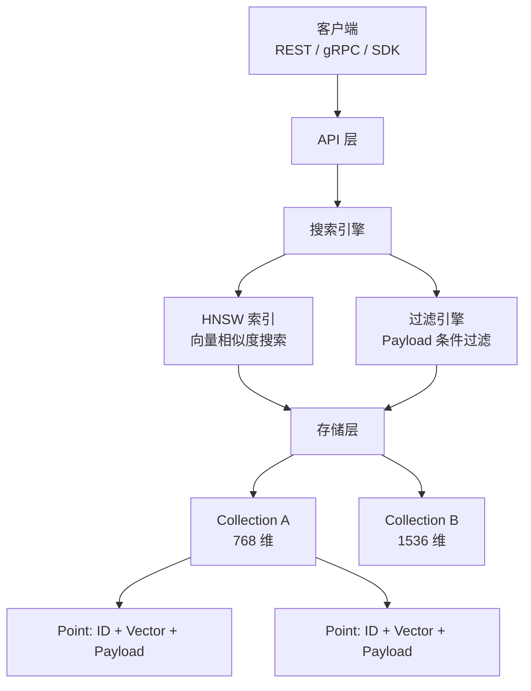

# Qdrant（向量搜索引擎）

## 基础概念

Qdrant（读作 "quadrant"）是一个用 Rust 从零构建的**向量搜索引擎（Vector Search Engine）**，专门用来存储和检索高维向量数据。简单说：你有一堆文本/图片/音频经过 Embedding 模型转成的向量，需要快速找出「跟某个向量最像的那些」，Qdrant 就是干这件事的。

与其他向量数据库最大的区别在于：Qdrant 采用**过滤优先（Filter-First）**设计——搜索向量的同时就在处理元数据过滤条件，而不是先搜出来再过滤。这意味着即使你加了一堆筛选条件（价格范围、日期、标签等），搜索速度也不会断崖式下降。

典型使用场景：RAG 系统的知识库检索、电商语义搜索、推荐系统、多模态搜索。

### 核心要素

| 要素 | 作用 |
|------|------|
| **Collection（集合）** | 向量数据的容器，创建时指定向量维度和距离度量方式 |
| **Point（点）** | 集合中的最小数据单元，由 ID + 向量 + Payload（元数据）三部分组成 |
| **HNSW 索引** | 底层的近似最近邻搜索算法，通过分层图结构实现高效检索 |
| **Payload 过滤** | 对元数据施加条件（AND/OR/NOT、范围、地理位置等），在搜索阶段并行执行 |

### Collection（集合）

Collection 是数据组织的最高层级。每个集合对应一个独立的向量空间，创建时需要指定两个关键参数：向量维度（`size`）和距离度量方式（`distance`）。同一个集合内的所有向量必须维度相同。

一个 Qdrant 实例可以管理多个集合，适合按业务线或租户隔离数据。

### Point（点）

Point 是集合中的基本数据单位，由三部分组成：

- **ID**：唯一标识符（整数或 UUID）
- **Vector**：浮点数数组，就是 Embedding 模型输出的那个向量
- **Payload**：任意 JSON 格式的元数据，比如标题、分类、发布日期、标签等

Payload 是 Qdrant 过滤能力的基础——你存进去的每个字段都可以在查询时作为过滤条件。

### HNSW 索引

HNSW（Hierarchical Navigable Small World，分层可导航小世界图）是 Qdrant 的核心搜索算法。它把向量组织成一个多层图结构：顶层稀疏、底层稠密。搜索时从顶层快速定位大致区域，逐层下降到底层找到精确的最近邻。

两个关键调优参数：
- `m`：每个节点的连接数，越大精度越高但内存越多
- `ef_construct`：构建索引时的搜索范围，越大索引质量越好但构建越慢

### Payload 过滤

Qdrant 的招牌能力。支持的过滤条件包括：

- **精确匹配**：`category == "AI"`
- **范围查询**：`price >= 100 AND price <= 500`
- **逻辑组合**：`must`（AND）、`should`（OR）、`must_not`（NOT）
- **嵌套过滤**：条件可以任意嵌套组合

与「先搜后过」的方案不同，Qdrant 在 HNSW 图遍历的过程中就同步执行过滤（Filterable HNSW），所以加了过滤条件后性能衰减很小。

### 核心要素关系图



搜索引擎同时调用 HNSW 索引和过滤引擎，两者并行工作后合并结果，这就是「过滤优先」设计的核心。

## 基础用法

安装依赖：

```bash
# 启动 Qdrant 服务（Docker 方式，推荐）
docker run -p 6333:6333 -p 6334:6334 qdrant/qdrant

# 安装 Python 客户端
pip install qdrant-client numpy
```

如需使用 Qdrant Cloud 托管服务，前往 https://cloud.qdrant.io/ 注册获取 API Key。

最小可运行示例（基于 qdrant-client==1.13.3 验证，截至 2026-03）：

```python
from qdrant_client import QdrantClient
from qdrant_client.models import (
    Distance, VectorParams, PointStruct,
    Filter, FieldCondition, MatchValue, Range
)
import numpy as np

# 1. 连接 Qdrant（内存模式，无需启动服务器，适合本地测试）
client = QdrantClient(":memory:")

# 2. 创建集合：384 维向量，余弦相似度
client.create_collection(
    collection_name="docs",
    vectors_config=VectorParams(size=384, distance=Distance.COSINE)
)

# 3. 插入数据：向量 + 元数据
points = [
    PointStruct(id=1, vector=np.random.rand(384).tolist(),
                payload={"title": "RAG 入门指南", "category": "AI", "year": 2024}),
    PointStruct(id=2, vector=np.random.rand(384).tolist(),
                payload={"title": "Docker 部署手册", "category": "DevOps", "year": 2023}),
    PointStruct(id=3, vector=np.random.rand(384).tolist(),
                payload={"title": "LLM 微调实战", "category": "AI", "year": 2025}),
    PointStruct(id=4, vector=np.random.rand(384).tolist(),
                payload={"title": "K8s 集群运维", "category": "DevOps", "year": 2024}),
    PointStruct(id=5, vector=np.random.rand(384).tolist(),
                payload={"title": "向量数据库选型", "category": "AI", "year": 2025}),
]
client.upsert(collection_name="docs", points=points)

# 4. 基础向量搜索（不带过滤）
query_vector = np.random.rand(384).tolist()
results = client.search(
    collection_name="docs",
    query_vector=query_vector,
    limit=3
)
print("--- 基础搜索 Top 3 ---")
for r in results:
    print(f"  ID={r.id}, 分数={r.score:.4f}, 标题={r.payload['title']}")

# 5. 带过滤的向量搜索：只看 AI 类别 + 2024 年及以后
results = client.search(
    collection_name="docs",
    query_vector=query_vector,
    query_filter=Filter(
        must=[
            FieldCondition(key="category", match=MatchValue(value="AI")),
            FieldCondition(key="year", range=Range(gte=2024))
        ]
    ),
    limit=3
)
print("\n--- 过滤搜索（AI + 2024年起）---")
for r in results:
    print(f"  ID={r.id}, 分数={r.score:.4f}, {r.payload}")
```

预期输出：

```text
--- 基础搜索 Top 3 ---
  ID=3, 分数=0.5842, 标题=LLM 微调实战
  ID=1, 分数=0.5631, 标题=RAG 入门指南
  ID=5, 分数=0.5487, 标题=向量数据库选型

--- 过滤搜索（AI + 2024年起）---
  ID=3, 分数=0.5842, {'title': 'LLM 微调实战', 'category': 'AI', 'year': 2025}
  ID=1, 分数=0.5631, {'title': 'RAG 入门指南', 'category': 'AI', 'year': 2024}
  ID=5, 分数=0.5487, {'title': '向量数据库选型', 'category': 'AI', 'year': 2025}
```

使用 `QdrantClient(":memory:")` 是纯内存模式，不需要启动 Docker 服务端，复制粘贴就能跑。实际生产环境改为 `QdrantClient(host="localhost", port=6333)` 连接服务端。

## 同类工具对比

| 维度 | Qdrant | Milvus | Pinecone | Weaviate |
|------|--------|--------|----------|----------|
| 核心定位 | 过滤优先的高性能向量搜索引擎 | 分布式向量数据库，面向超大规模 | 全托管向量数据库服务 | 语义搜索 + 知识图谱向量库 |
| 实现语言 | Rust（无 GC，性能稳定） | Go + C++（依赖 etcd 等组件） | 闭源云服务 | Go |
| 最擅长 | 复杂元数据过滤 + 向量搜索并行 | 十亿级向量分布式检索 | 零运维快速上线 | 多跳语义搜索 |
| 部署复杂度 | 低（单二进制 / Docker） | 高（需要 etcd、MinIO 等依赖） | 无需部署（SaaS） | 中等 |
| 适合人群 | 需要精细过滤的 RAG / 搜索系统 | 超大规模分布式场景 | 不想碰运维的团队 | 知识图谱结合向量搜索 |

核心区别：

- **Qdrant**：过滤能力最强，Rust 原生性能优异，单节点即可支撑百万级向量，部署简单
- **Milvus**：天生为分布式设计，十亿级数据的首选，但部署和运维复杂度高
- **Pinecone**：全托管零运维，适合快速验证想法，但成本高且数据不在自己手里

## 常见误区

| 误区 | 准确理解 |
|------|----------|
| Qdrant 只能做向量相似度搜索 | Qdrant 的核心优势恰恰在过滤能力——向量搜索 + 复杂元数据条件可以并行执行，不是只算向量距离 |
| 向量维度越高搜索越准 | 维度过高会增加内存和计算开销。通常 384-768 维已足够，选对 Embedding 模型比堆维度更重要 |
| 所有 Payload 字段都要建索引 | 只对高频过滤字段建索引。索引越多写入越慢，按查询模式选择性创建 |
| 内存模式只能用于测试 | `":memory:"` 模式确实适合测试，但 Qdrant 也支持磁盘存储 + 量化压缩，百万级向量不需要全放内存 |

## 优劣势分析

| 优势 | 劣势 |
|------|------|
| Rust 原生实现，无 GC 停顿，延迟稳定可预测 | 分布式能力不如 Milvus 成熟，超大集群部署经验较少 |
| 过滤优先设计，复杂条件下性能衰减极小 | 社区生态规模小于 Milvus |
| 部署极简：单个 Docker 容器开箱即用 | 不支持 SQL 查询语法，纯 API 交互 |
| 支持多种量化（Scalar / Product / Binary），内存最多可压缩 64 倍 | GPU 加速索引构建为 2025 年新增功能，成熟度有待验证 |

## 思考题

<details>
<summary>初级：Qdrant 中的 Collection、Point、Payload 分别是什么？它们的关系是怎样的？</summary>

**参考答案：**

- Collection（集合）：向量数据的容器，创建时指定向量维度和距离度量。类比关系数据库中的「表」。
- Point（点）：集合中的最小数据单元，包含 ID、Vector（向量）、Payload（元数据）三部分。类比「行」。
- Payload（有效载荷）：附加在 Point 上的 JSON 元数据，用于过滤查询。类比行中的「非主键列」。

关系：一个 Qdrant 实例包含多个 Collection，每个 Collection 包含多个 Point，每个 Point 携带一份 Payload。

</details>

<details>
<summary>中级：Qdrant 的「过滤优先」设计与「先搜后过」有什么区别？对性能有什么影响？</summary>

**参考答案：**

「先搜后过」的做法是：先用向量搜索取出 Top-K 结果，再对这 K 个结果应用过滤条件。问题在于，如果过滤条件很严格，可能过滤完只剩几条甚至零条结果，导致召回不足。

Qdrant 的「过滤优先」是在 HNSW 图遍历过程中同步执行过滤：遍历到一个节点时，同时检查它是否满足过滤条件，不满足就跳过继续找。这样保证返回的 K 个结果都满足过滤条件，且搜索效率不会因过滤条件增多而大幅下降。

性能影响：在有复杂过滤条件的场景下，Qdrant 的 QPS（每秒查询数）远高于「先搜后过」方案，因为它不需要过度检索再丢弃。

</details>

<details>
<summary>中级：如果要存储 500 万条向量数据并支持低延迟查询，你会如何配置 Qdrant？</summary>

**参考答案：**

关键配置思路：

1. **向量维度**：选择 384-768 维的 Embedding 模型，避免 2048+ 高维带来的额外内存开销
2. **量化压缩**：开启 Scalar Quantization（标量量化），将 float32 压缩为 int8，内存减少约 4 倍，精度损失很小
3. **HNSW 参数**：`m=16`（平衡精度和内存），`ef_construct=200`（保证索引质量）
4. **Payload 索引**：只对高频过滤字段（如 category、date）创建索引，不要全建
5. **存储方式**：使用 mmap 存储模式（`on_disk=True`），让操作系统管理内存映射，不需要全量加载到 RAM
6. **部署**：500 万量级单节点即可胜任；如需高可用，部署 2-3 副本

</details>

## 参考资料

1. 官方文档：https://qdrant.tech/documentation/
2. GitHub 仓库：https://github.com/qdrant/qdrant （29k+ stars，Apache-2.0 许可证）
3. 官方 2024 性能基准测试：https://qdrant.tech/blog/qdrant-benchmarks-2024/
4. HNSW 论文：https://arxiv.org/abs/1603.09320
5. Python SDK 文档：https://python-client.qdrant.tech/
