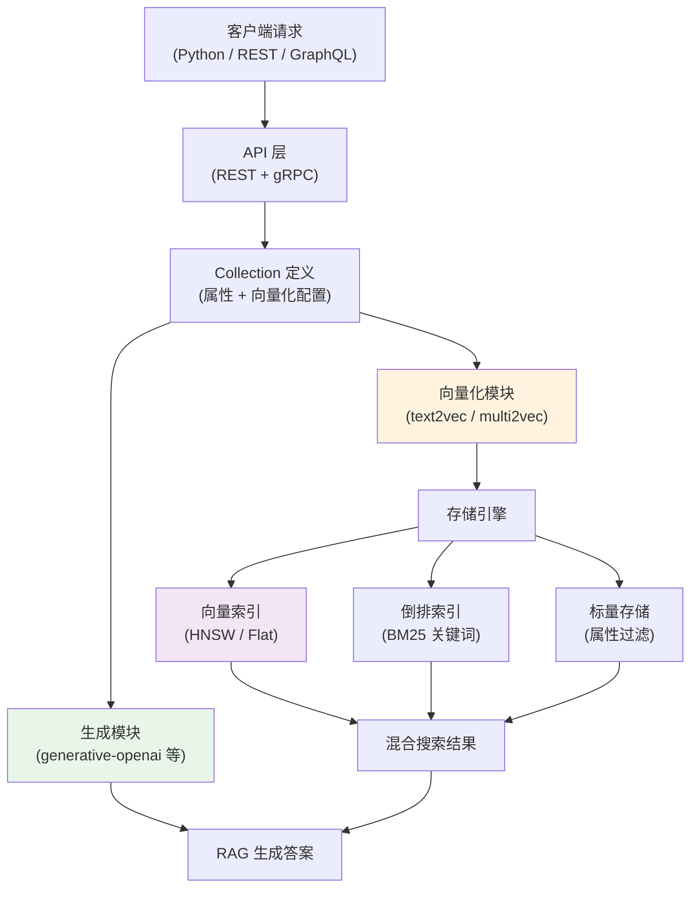

# Weaviate（AI 原生向量数据库）

## 基础概念

Weaviate 是一款用 Go 语言编写的**开源向量数据库（Vector Database）**，核心特点是「AI 原生」——它不只是存向量，还**内置了向量化模块（Vectorizer Module）**，能自动把文本、图像等原始数据转成向量，省去单独部署 Embedding 服务的麻烦。

打个比方：其他向量数据库像「仓库」，你得自己把货物打包好（生成向量）再送进去；Weaviate 像「带打包间的仓库」，你把原材料（原始文本/图像）扔进去，它帮你打包（向量化）、入库、检索一条龙搞定。除此之外，它还内置了生成模块（Generative Module），检索完直接调 LLM 生成答案，天然适合构建 RAG 系统。

### 核心要素

| 要素 | 作用 |
|------|------|
| **Collection（集合）** | 数据的组织单元，类似关系数据库的「表」，定义了字段类型和向量化方式 |
| **Vectorizer Module（向量化模块）** | 内置的向量转换服务，支持 OpenAI、Cohere、HuggingFace 等多种模型，自动把数据转成向量 |
| **混合搜索（Hybrid Search）** | 向量相似度 + BM25 关键词搜索 + 标量过滤三合一，一次查询搞定多种检索需求 |
| **Generative Module（生成模块）** | 内置 RAG 能力，检索后直接调用 LLM 对结果进行摘要或问答 |

### Collection（集合）

Collection 是 Weaviate v4 中数据建模的基础单位（v3 中叫 Class，已废弃）。创建 Collection 时需要指定：

- **属性（Property）**：字段名称和数据类型（text、int、bool、date、blob 等）
- **向量化器（Vectorizer）**：用哪个模型把数据转成向量
- **生成器（Generative）**：用哪个 LLM 做 RAG 生成（可选）

一个 Collection 可以配置多个命名向量（Named Vectors），同一条数据用不同模型生成多组向量，适配不同的搜索场景。

### Vectorizer Module（向量化模块）

向量化模块是 Weaviate 与其他向量数据库最大的区别。数据写入时，Weaviate 自动调用配置好的模型生成向量，不用在外部单独跑 Embedding。主要类别：

- **文本**：text2vec-openai、text2vec-cohere、text2vec-huggingface、text2vec-transformers（本地模型）
- **多模态**：multi2vec-clip（图文联合向量化）、multi2vec-bind（音视频等多模态）
- **生成**：generative-openai、generative-cohere、generative-anthropic（用于 RAG）
- **重排序**：reranker-cohere、reranker-transformers（对搜索结果二次排序提升质量）

### 混合搜索（Hybrid Search）

Weaviate 支持三种搜索方式的任意组合：

1. **向量搜索（nearText / nearVector）**：语义相似度匹配
2. **关键词搜索（BM25）**：传统的词频匹配
3. **标量过滤（Filter）**：按字段值精确过滤（等于、大于、范围等）

三者可以叠加使用。比如搜「机器学习」（语义匹配）+ 分类必须是「技术」（过滤）+ 按关键词「GPU」加权（BM25），一次查询搞定。

### 核心要素关系图



数据写入时经过向量化模块自动生成向量，存入向量索引和标量存储；查询时三种索引协同工作，输出混合搜索结果，再可选地经过生成模块做 RAG 问答。

## 基础用法

安装依赖：

```bash
# 安装 Weaviate Python 客户端 v4（v3 API 已废弃）
pip install -U weaviate-client
```

启动 Weaviate 服务（Docker 方式）：

```bash
docker run -d \
  --name weaviate \
  -p 8080:8080 \
  -p 50051:50051 \
  cr.weaviate.io/semitechnologies/weaviate:1.28.4 \
  --host 0.0.0.0 \
  --port 8080 \
  --scheme http
```

- 8080 端口：REST API
- 50051 端口：gRPC（v4 客户端必需）
- 如果不想装 Docker，可以使用 Weaviate Cloud 免费沙盒：https://console.weaviate.cloud

最小可运行示例（基于 weaviate-client==4.19.2 验证，截至 2026-03）。为了避免本地服务未启动时直接抛出未捕获异常，下面示例会先按官方 v4 写法连接本地实例，并在连接失败时给出明确提示：

```python
import weaviate
import weaviate.classes.config as wc
import weaviate.classes.query as wq
from weaviate.classes.query import Filter

try:
    with weaviate.connect_to_local(
        host="localhost",
        port=8080,
        grpc_port=50051,
    ) as client:
        print(f"[OK] Weaviate 连接成功，ready={client.is_ready()}")

        # 1. 创建 Collection（相当于建表）
        #    显式关闭自动向量化，后续手动传入 vector
        if client.collections.exists("Article"):
            client.collections.delete("Article")

        articles = client.collections.create(
            name="Article",
            properties=[
                wc.Property(name="title", data_type=wc.DataType.TEXT),
                wc.Property(name="content", data_type=wc.DataType.TEXT),
                wc.Property(name="category", data_type=wc.DataType.TEXT),
            ],
            vectorizer_config=wc.Configure.Vectorizer.none(),
        )
        print("[OK] Collection 'Article' 已创建")

        # 2. 插入数据（手动提供向量，3 维示意）
        articles.data.insert(
            properties={
                "title": "向量数据库入门",
                "content": "向量数据库存储高维向量，支持语义搜索",
                "category": "数据库",
            },
            vector=[0.1, 0.9, 0.3],
        )
        articles.data.insert(
            properties={
                "title": "RAG 系统实战",
                "content": "RAG 结合检索与生成，提升 LLM 回答质量",
                "category": "AI应用",
            },
            vector=[0.8, 0.2, 0.7],
        )
        print("[OK] 已插入 2 条数据")

        # 3. 向量相似度搜索
        results = articles.query.near_vector(
            near_vector=[0.1, 0.85, 0.25],  # 与第一条更接近
            limit=2,
            return_metadata=wq.MetadataQuery(distance=True),
        )
        print("\n向量搜索结果：")
        for obj in results.objects:
            print(f"  - {obj.properties['title']}（距离: {obj.metadata.distance:.4f}）")

        # 4. 按属性过滤
        results = articles.query.fetch_objects(
            filters=Filter.by_property("category").equal("数据库"),
            limit=5,
        )
        print("\n过滤 category='数据库' 的结果：")
        for obj in results.objects:
            print(f"  - {obj.properties['title']}")

        print("\n[OK] 示例完成")
except weaviate.exceptions.WeaviateConnectionError as exc:
    print("[WARN] 无法连接到本地 Weaviate。请先按上文 Docker 命令启动服务，并确认 http://localhost:8080 与 gRPC 50051 可访问。")
    print(f"详细信息：{exc}")
```

服务已启动时的预期输出：

```text
[OK] Weaviate 连接成功，ready=True
[OK] Collection 'Article' 已创建
[OK] 已插入 2 条数据

向量搜索结果：
  - 向量数据库入门（距离: 0.0057）
  - RAG 系统实战（距离: 0.5765）

过滤 category='数据库' 的结果：
  - 向量数据库入门

[OK] 示例完成
```

如果本地服务尚未启动，代码会打印 `[WARN]` 提示并安全退出，而不是直接抛出未捕获的连接异常。

上面的示例为了避免依赖 API Key，使用了手动传入向量的方式。实际项目中通常会配置向量化模块（如 text2vec-openai），数据写入时自动生成向量，查询时用 `near_text` 传入自然语言即可。

## 同类工具对比

| 维度 | Weaviate | Milvus | Pinecone |
|------|----------|--------|----------|
| 核心定位 | AI 原生向量数据库，内置向量化 + RAG | 高性能开源向量数据库 | 全托管云向量数据库 |
| 内置向量化 | 支持，数据入库自动生成向量 | 不支持，需外部生成 | 不支持，需外部生成 |
| 内置 RAG | 支持，检索后直接调 LLM 生成 | 不支持 | 不支持 |
| 多模态 | 原生支持图文、音视频 | 需额外处理 | 需额外处理 |
| 部署方式 | Docker / K8s / Weaviate Cloud | Docker / K8s / Zilliz Cloud | 纯云端 SaaS |
| 开源协议 | BSD-3-Clause | Apache 2.0 | 闭源 |

核心区别：

- **Weaviate**：「一站式」体验，向量化 + 存储 + 检索 + 生成全内置，适合想少折腾的团队
- **Milvus**：专注向量检索的极致性能，十亿级数据场景首选，但需要自己搭 Embedding 服务
- **Pinecone**：零运维的云服务，5 分钟上手，但闭源且按量付费

## 常见误区

| 误区 | 准确理解 |
|------|----------|
| 「内置向量化」= 不需要模型 | 向量化模块本质上是调用外部模型（如 OpenAI API）或运行本地模型容器，只是 Weaviate 替你管理了调用过程，该付的 API 费用或 GPU 资源一样要有 |
| v3 客户端（`weaviate.Client`）还能用 | 从 2024 年底开始，v4 客户端不再包含 v3 API。新项目必须用 `weaviate.connect_to_local()` 等 v4 写法 |
| GraphQL 是唯一的查询方式 | Weaviate 同时支持 REST API、GraphQL 和 gRPC 三种接口。v4 Python 客户端底层走 gRPC，比 GraphQL 快 60-80% |
| Weaviate 的生成模块可以替代独立的 LLM 服务 | 生成模块只是封装了对外部 LLM API 的调用（如 OpenAI、Cohere），并非内置模型，仍需要 API Key 和网络连接 |

## 优劣势分析

| 优势 | 劣势 |
|------|------|
| 内置向量化 + 生成模块，部署链路短 | 向量化模块以微服务容器形式运行，Docker 镜像体积较大 |
| 原生多模态支持（图文、音视频联合检索） | GraphQL 查询语法有学习成本，新手上手不如 SQL 直觉 |
| 混合搜索（向量 + BM25 + 过滤）开箱即用 | 超大规模（百亿级）场景下性能不如 Milvus |
| 多租户、RBAC、副本复制等企业级功能完善 | 依赖 gRPC 端口（50051），某些网络环境需额外配置 |

## 思考题

<details>
<summary>初级：Weaviate 的向量化模块和自己用 OpenAI API 生成 Embedding 再存进去，有什么区别？</summary>

**参考答案：**

功能上没有本质区别，最终都是把文本变成向量存入数据库。区别在于「谁来管理这个过程」：

- 自己调 API：需要在应用代码中调用 Embedding API、拿到向量、再写入数据库，三步操作。
- 用向量化模块：只需要把原始文本写入 Weaviate，它自动调用配置好的模型生成向量，一步到位。

向量化模块的好处是简化数据管道、减少出错环节。但如果你需要对 Embedding 过程做精细控制（如自定义分块策略、使用私有模型），自己管理向量更灵活。

</details>

<details>
<summary>中级：什么场景下应该用混合搜索（Hybrid Search）而不是纯向量搜索？</summary>

**参考答案：**

纯向量搜索擅长语义匹配（「意思相近」），但对专有名词、型号、代码等精确匹配的场景不擅长。混合搜索在以下场景更合适：

1. **专业术语查询**：用户搜「ResNet-50」，向量搜索可能返回所有 CNN 架构的结果，BM25 能精确命中包含这个词的文档
2. **编号/型号检索**：产品型号「A7-2024X」这类字符串，向量搜索几乎无能为力，需要关键词匹配
3. **兼顾精确和模糊**：用户搜「Python 异步编程 asyncio」，既需要语义理解（异步编程的概念），也需要精确匹配（asyncio 这个库名）

Weaviate 的 `hybrid` 查询会自动融合向量分数和 BM25 分数，通过 `alpha` 参数调节两者权重（0 = 纯 BM25，1 = 纯向量）。

</details>

<details>
<summary>中级：Weaviate v4 客户端为什么要求开放 gRPC 端口（50051）？不开会怎样？</summary>

**参考答案：**

v4 Python 客户端底层用 gRPC 协议做数据传输，比 REST/GraphQL 的 JSON 序列化更高效（批量导入快 60-80%）。gRPC 使用 HTTP/2 + Protocol Buffers 二进制编码，减少了序列化开销和网络传输量。

如果 50051 端口不可用，`connect_to_local()` 会直接报连接错误，客户端无法初始化。解决方案：

1. Docker 启动时加 `-p 50051:50051` 端口映射
2. 如果网络环境不支持 gRPC，可以降级使用 REST API（但失去性能优势）
3. Weaviate Cloud 已默认开放 gRPC 端口，无需额外配置

</details>

## 参考资料

1. 官方文档：https://weaviate.io/developers/weaviate
2. GitHub 仓库：https://github.com/weaviate/weaviate（~14k stars，BSD-3-Clause 许可证）
3. Python 客户端文档：https://weaviate-python-client.readthedocs.io/en/stable/
4. Weaviate 2025 年度总结：https://weaviate.io/blog/weaviate-in-2025
5. v4 客户端发布博客：https://weaviate.io/blog/py-client-v4-release
