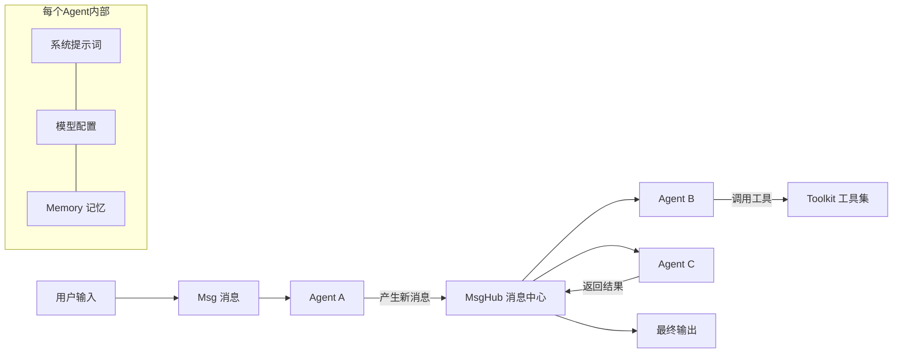

# AgentScope（多Agent平台）

## 基础概念

AgentScope 是阿里巴巴通义实验室开源的**多 Agent 开发框架（Multi-Agent Platform）**，核心思路是：每个 Agent 是一个独立的计算单元，Agent 之间通过**消息（Message）** 通信，由框架统一管理调度。你只需要定义每个 Agent 的职责和它们之间的消息流转方式，框架帮你处理通信、并发、容错这些脏活。

与 LangChain 侧重单 Agent 组件编排不同，AgentScope 从设计之初就面向**多 Agent 协作**场景，内置分布式部署能力（本地 Agent 和远程 Agent 用同一套代码）、容错机制（自动重试、超时保护）、以及可视化调试工具（AgentScope Studio）。2025 年发布的 1.0 版本进一步增加了 MCP 协议支持、异步并行工具调用、浏览器 Agent 等开箱即用的能力。

### 核心要素

| 要素 | 作用 |
|------|------|
| **Agent** | 独立的智能体单元，拥有自己的提示词、模型配置、记忆和工具 |
| **Message（消息）** | Agent 间通信的标准载体，包含发送者、角色、内容等结构化信息 |
| **MsgHub（消息中心）** | 连接多个 Agent 的通信枢纽，支持广播、单播、订阅等模式 |
| **Service / Toolkit（工具）** | Agent 可调用的外部能力，如搜索、代码执行、API 调用等 |

### Agent 与 Message

Agent 是最基本的执行单元。每个 Agent 内部封装了：系统提示词（决定角色行为）、LLM 模型配置、Memory（记忆模块）、Toolkit（工具集）。

Agent 之间不直接互调函数，而是通过 `Msg` 对象通信。`Msg` 是一个结构化消息，包含 `name`（发送者）、`role`（角色）、`content`（内容）等字段。这种设计的好处是解耦——Agent A 不需要知道 Agent B 的内部实现，只要能发消息就行。

### MsgHub（消息中心）

当多个 Agent 需要协作时，MsgHub 充当"邮局"角色：把多个 Agent 注册进来，消息自动路由和分发。MsgHub 既支持同进程的本地 Agent，也支持跨机器的远程 Agent，调用方式一致。

### Service / Toolkit（工具）

AgentScope 内置了一批常用工具（代码执行、搜索、文件读写等），也支持通过 MCP 协议（Model Context Protocol）接入外部工具服务。工具通过 `Toolkit` 统一管理，绑定给 Agent 后，Agent 在推理时会自动决定何时调用哪个工具。

### 核心要素关系图



## 基础用法

安装依赖：

```bash
# 基于 agentscope>=1.0.0（截至 2026-03，Apache 2.0 许可证）
pip install agentscope
```

如使用 OpenAI 模型，需要 API Key：在 https://platform.openai.com/api-keys 获取。

最小可运行示例——两个 Agent 对话：

```python
# 基于 agentscope>=1.0.0 验证（截至 2026-03）
import asyncio
from agentscope.agent import ReActAgent
from agentscope.model import OpenAIChatModel
from agentscope.formatter import OpenAIChatFormatter
from agentscope.message import Msg

# 1. 创建模型和格式化器
model = OpenAIChatModel(model_name="gpt-4", api_key="your-openai-api-key")
formatter = OpenAIChatFormatter()

# 2. 创建两个 Agent
assistant = ReActAgent(
    name="assistant",
    sys_prompt="你是一个技术顾问，用简洁的中文回答问题",
    model=model,
    formatter=formatter,
)

critic = ReActAgent(
    name="critic",
    sys_prompt="你是一个评审员，对回答提出改进建议",
    model=model,
    formatter=formatter,
)

# 3. 运行对话
async def main():
    # 用户提问
    user_msg = Msg(name="user", role="user", content="什么是多Agent系统？")

    # 助手回答
    reply = await assistant(user_msg)
    print(f"[{reply.name}]: {reply.content}\n")

    # 评审员反馈
    feedback = await critic(reply)
    print(f"[{feedback.name}]: {feedback.content}")

asyncio.run(main())
```

预期输出：

```text
[assistant]: 多Agent系统是由多个独立的智能体协同工作的系统，每个Agent有自己的目标和能力，通过消息通信来完成复杂任务...

[critic]: 回答整体清晰，建议补充一个具体例子，比如客服系统中不同Agent分别处理咨询、投诉、退款...
```

使用 MsgHub 实现多 Agent 协作：

```python
import asyncio
from agentscope.pipeline import MsgHub
from agentscope.agent import ReActAgent
from agentscope.model import OpenAIChatModel
from agentscope.formatter import OpenAIChatFormatter
from agentscope.message import Msg

model = OpenAIChatModel(model_name="gpt-4", api_key="your-openai-api-key")
formatter = OpenAIChatFormatter()

# 创建三个角色
researcher = ReActAgent(name="researcher", sys_prompt="你负责收集信息要点", model=model, formatter=formatter)
writer = ReActAgent(name="writer", sys_prompt="你负责撰写内容", model=model, formatter=formatter)
reviewer = ReActAgent(name="reviewer", sys_prompt="你负责审核质量", model=model, formatter=formatter)

# 注册到消息中心
msghub = MsgHub(participants=[researcher, writer, reviewer])

async def workflow():
    task = Msg(name="user", role="user", content="请围绕'AI安全'主题完成一篇短文")
    # 顺序执行：研究 -> 写作 -> 审核
    research = await researcher(task)
    article = await writer(research)
    review = await reviewer(article)
    print(f"审核结果：{review.content}")

asyncio.run(workflow())
```

使用 Toolkit 绑定工具：

```python
import asyncio
from agentscope.tool import Toolkit, execute_python_code
from agentscope.agent import ReActAgent
from agentscope.model import OpenAIChatModel
from agentscope.formatter import OpenAIChatFormatter
from agentscope.message import Msg

model = OpenAIChatModel(model_name="gpt-4", api_key="your-openai-api-key")
formatter = OpenAIChatFormatter()

# 创建工具包并注册工具
toolkit = Toolkit()
toolkit.register_tool_function(execute_python_code)

# 创建带工具的 Agent
coder = ReActAgent(
    name="coder",
    sys_prompt="你是编程助手，需要时可以执行Python代码",
    model=model,
    formatter=formatter,
    toolkit=toolkit,  # 绑定工具包
)

async def main():
    msg = Msg(name="user", role="user", content="请计算斐波那契数列前10项")
    result = await coder(msg)
    print(result.content)

asyncio.run(main())
```

## 同类工具对比

| 维度 | AgentScope | LangGraph | AutoGen |
|------|-----------|-----------|---------|
| 核心定位 | 多 Agent 分布式协作平台 | 有向图状态机工作流 | 多 Agent 对话协作框架 |
| 分布式部署 | 原生支持，本地/远程 Agent 统一接口 | 不支持，仅本地运行 | 不支持，仅本地运行 |
| 容错机制 | 内置重试、超时、心跳检测 | 需自行实现 | 需自行实现 |
| 可视化 | AgentScope Studio，免费 | 依赖 LangSmith（付费） | AutoGen Studio |
| MCP 协议 | 原生支持 | 通过社区集成 | 通过社区集成 |
| 社区规模 | GitHub 12k+ stars | GitHub 27k+ stars | GitHub 40k+ stars |

核心区别：

- **AgentScope**：面向需要分布式部署和生产级容错的多 Agent 系统，强调工程化和可观测性
- **LangGraph**：面向需要精确控制执行路径（分支、循环、中断恢复）的工作流场景
- **AutoGen**：面向多 Agent 角色对话协作，以对话轮次驱动任务推进

## 常见误区

| 误区 | 准确理解 |
|------|----------|
| AgentScope 和 LangChain 差不多，都是 Agent 框架 | AgentScope 的核心差异在分布式和容错，不只是编排工作流，更面向生产部署场景 |
| 分布式部署一定很复杂 | AgentScope 封装了 RPC 通信细节，本地 Agent 和远程 Agent 用同一套代码，只需指定连接地址 |
| Message 和普通字典没区别 | `Msg` 是结构化对象，包含发送者、角色、时间戳等元数据，用于 Agent 识别上下文和消息来源 |

## 优劣势分析

| 优势 | 劣势 |
|------|------|
| 分布式原生，本地和远程 Agent 统一编程模型 | 社区规模和生态成熟度不如 LangChain 系 |
| 内置容错（重试、超时、心跳），适合生产环境 | 学习曲线偏陡，需理解 Actor 模型和异步编程 |
| AgentScope Studio 免费可视化，调试体验好 | 英文文档和教程相对较少，中文社区为主 |
| 1.0 版本后支持 MCP 协议和并行工具调用 | 异步编程（async/await）对新手有门槛 |

## 思考题

<details>
<summary>初级：AgentScope 中 Agent 为什么通过 Message 通信，而不是直接调用函数？</summary>

**参考答案：**

用 Message 通信实现了 Agent 之间的解耦。Agent A 不需要知道 Agent B 的内部实现，只要发送标准格式的 `Msg` 即可。这带来三个好处：

1. 支持分布式——Message 可以序列化后跨网络传输，本地 Agent 和远程 Agent 用同一种通信方式
2. 便于监控——系统可以拦截和记录所有消息，用于调试和审计
3. 灵活替换——随时替换某个 Agent 的实现，不影响其他 Agent

</details>

<details>
<summary>中级：MsgHub 和直接调用 Agent 有什么区别？什么时候必须用 MsgHub？</summary>

**参考答案：**

直接调用（`result = await agent(msg)`）是点对点的顺序执行，适合简单的线性流程。

MsgHub 是多 Agent 的通信枢纽，适合以下场景：
1. 多个 Agent 需要并行工作或相互反馈
2. Agent 分布在不同机器上（分布式场景）
3. 需要动态添加/移除参与者
4. 需要广播消息给所有参与者

必须用 MsgHub 的判断标准：当 Agent 间的通信不是简单的 A→B→C 线性链，而是存在多对多交互或分布式部署需求时。

</details>

<details>
<summary>中级：如果一个远程 Agent 调用超时了，AgentScope 提供了哪些应对手段？</summary>

**参考答案：**

AgentScope 提供多层容错机制：

1. **自动重试**：配置重试次数和间隔，框架自动处理瞬时故障
2. **超时保护**：设置最大等待时间，避免无限阻塞
3. **心跳检测**：定期检测远程 Agent 是否存活，自动剔除故障节点
4. **降级策略**：当主 Agent 不可用时，可切换到备用方案

实际生产中，建议在创建 Agent 时就配置好这些参数，而不是等故障发生再处理。同时配合 AgentScope Studio 的监控面板实时观察 Agent 状态。

</details>

## 参考资料

1. GitHub 仓库：https://github.com/agentscope-ai/agentscope
2. 官方文档：https://doc.agentscope.io/
3. 技术论文（2024）：[AgentScope: A Flexible yet Robust Multi-Agent Platform](https://arxiv.org/abs/2402.14034)
4. AgentScope 1.0 论文（2025）：[AgentScope 1.0: A Developer-Centric Framework for Building Agentic Applications](https://arxiv.org/abs/2508.16279)
5. AgentScope Runtime：https://github.com/agentscope-ai/agentscope-runtime

---

*最后更新：2026-03-25 | 难度等级：3 星（生产环境配置与常见坑点）*
