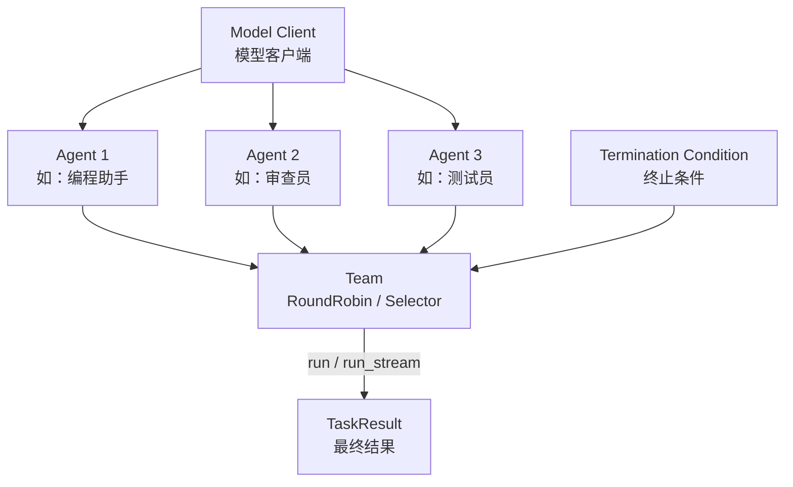

# AutoGen（微软多Agent框架）

## 基础概念

AutoGen 是微软开源的**多智能体协作框架（Multi-Agent Conversation Framework）**，核心思路是：把一个复杂任务交给多个各有专长的 Agent，它们通过对话协商、分工协作来完成任务。

打个比方：你组了一个临时项目组，组里有程序员、测试、产品经理。你扔一个需求进去，他们自己讨论、写代码、审查、测试，最后给你交付结果。AutoGen 干的就是这件事——你定义好每个 Agent 的角色和能力，框架负责让它们有序地对话和协作。

> **重要版本说明**：AutoGen 在 2025 年初发布了 **0.4 版本**，是对旧版 0.2 的彻底重写。新版采用异步架构、模块化设计，API 完全不同。本卡片基于 **0.4 版本**编写。旧版 `pyautogen` 包已不再由微软维护，新版包名为 `autogen-agentchat`。此外，微软已宣布 AutoGen 将演进为 **Microsoft Agent Framework**，作为统一的 Agent 开发框架。

### 核心要素

| 要素 | 作用 |
|------|------|
| **Agent（智能体）** | 独立的对话参与者，具备特定角色和能力（如编程、审查、搜索），是最小工作单元 |
| **Team（团队）** | 多个 Agent 的协作容器，定义 Agent 之间如何轮流发言和协调（取代旧版 GroupChat） |
| **Model Client（模型客户端）** | 独立的 LLM 调用层，支持 OpenAI、Azure、本地模型等，与 Agent 逻辑解耦 |
| **Termination Condition（终止条件）** | 控制对话何时结束的规则，避免 Agent 无限讨论下去 |

### Agent（智能体）

Agent 是 AutoGen 的基本单位。每个 Agent 有名字、系统提示（定义角色）、绑定的模型和工具。0.4 版本中最常用的是 `AssistantAgent`，它接收消息、调用 LLM 生成回复、必要时调用工具。

与 0.2 版本的关键区别：0.4 中 Agent 的运行是**异步**的（基于 `async/await`），不再有 `UserProxyAgent` 自动执行代码的设计。代码执行由专门的 `CodeExecutorAgent` 负责。

### Team（团队）

Team 是 0.4 版本的核心编排机制，取代了旧版的 `GroupChat + GroupChatManager`。AutoGen 0.4 提供两种内置 Team：

- **RoundRobinGroupChat**：Agent 按固定顺序轮流发言，简单直接
- **SelectorGroupChat**：由 LLM 根据对话上下文动态选择下一个发言的 Agent，更智能灵活

### Model Client（模型客户端）

0.4 版本将模型调用抽象为独立的客户端对象。你先创建一个 `OpenAIChatCompletionClient`，再把它传给 Agent。这样同一个模型客户端可以被多个 Agent 共用，换模型只需改一处。

### Termination Condition（终止条件）

控制 Team 运行何时结束。常用的终止条件：

- `TextMentionTermination("TERMINATE")`：当某条消息包含指定文本时停止
- `MaxMessageTermination(10)`：达到最大消息数时停止
- 多个条件可以用 `|` 组合

### 核心要素关系图



Agent 绑定 Model Client 获得 LLM 能力，多个 Agent 组成 Team，Team 按照编排策略驱动 Agent 轮流发言，直到触发终止条件，返回最终结果。

## 基础用法

安装依赖：

```bash
# 安装 AutoGen 0.4 AgentChat 和 OpenAI 扩展
pip install -U "autogen-agentchat" "autogen-ext[openai]"
```

- OpenAI API Key：在 https://platform.openai.com/api-keys 获取
- 设置环境变量：`export OPENAI_API_KEY="sk-your-key-here"`

最小可运行示例（基于 autogen-agentchat==0.4.7 验证，截至 2026-03）：

```python
import asyncio
import os
from autogen_agentchat.agents import AssistantAgent
from autogen_ext.models.openai import OpenAIChatCompletionClient

async def main() -> None:
    # 1. 创建模型客户端（未显式传入时，OpenAI SDK 会读取 OPENAI_API_KEY）
    model_client = OpenAIChatCompletionClient(
        model="gpt-4o",
        api_key=os.getenv("OPENAI_API_KEY"),
    )

    # 2. 创建 Agent
    agent = AssistantAgent(
        name="assistant",
        model_client=model_client,
        system_message="你是一个有经验的 Python 程序员，用中文回复。",
    )

    # 3. 运行单个任务
    result = await agent.run(task="用 Python 写一个计算斐波那契数列前10项的函数")
    print(result.messages[-1].content)

    await model_client.close()

asyncio.run(main())
```

预期输出：

```text
（Agent 返回一段包含斐波那契函数的 Python 代码）
```

多 Agent 团队协作示例：

```python
import asyncio
import os
from autogen_agentchat.agents import AssistantAgent
from autogen_agentchat.teams import RoundRobinGroupChat
from autogen_agentchat.conditions import TextMentionTermination
from autogen_ext.models.openai import OpenAIChatCompletionClient

async def main() -> None:
    model_client = OpenAIChatCompletionClient(
        model="gpt-4o",
        api_key=os.getenv("OPENAI_API_KEY"),
    )

    # 定义两个角色不同的 Agent
    coder = AssistantAgent(
        name="coder",
        model_client=model_client,
        system_message="你是 Python 程序员，负责编写代码。完成后说 TERMINATE。",
    )
    reviewer = AssistantAgent(
        name="reviewer",
        model_client=model_client,
        system_message="你是代码审查员，检查代码质量并提出改进建议。审查通过后说 TERMINATE。",
    )

    # 组建团队：轮流发言，检测到 TERMINATE 时停止
    termination = TextMentionTermination("TERMINATE")
    team = RoundRobinGroupChat(
        participants=[coder, reviewer],
        termination_condition=termination,
    )

    # 运行团队任务
    result = await team.run(task="编写一个线程安全的计数器类，包含 increment 和 get_count 方法")

    # 打印所有对话消息
    for msg in result.messages:
        print(f"[{msg.source}]: {msg.content[:100]}...")

    await model_client.close()

asyncio.run(main())
```

预期输出：

```text
[user]: 编写一个线程安全的计数器类，包含 increment 和 get_count 方法...
[coder]: 以下是线程安全的计数器类实现...（代码）...TERMINATE
[reviewer]: 代码审查意见：1. 使用了 threading.Lock，线程安全...TERMINATE
```

## 同类工具对比

| 维度 | AutoGen | LangGraph | CrewAI |
|------|---------|-----------|--------|
| 核心定位 | 多 Agent 对话协作框架 | 图编排状态机 | 角色扮演式多 Agent 框架 |
| 编排方式 | 轮询 / LLM 动态选择发言者 | 有向图 + 条件边 | 顺序流程 / 管理者委派 |
| 编程范式 | 异步消息驱动 | 状态机 + 共享状态 | 声明式角色定义 |
| 多 Agent 支持 | 原生核心能力 | 需自行在节点中实现 | 原生核心能力 |
| 学习曲线 | 中等（需理解异步和对话模式） | 较陡（需懂状态机和图论） | 较低（声明式配置） |
| 适合场景 | 多角色讨论、需要自发交互 | 精确控制流程、复杂分支循环 | 快速搭建角色分工团队 |

核心区别：

- **AutoGen**：解决「多个 Agent 怎么聊」的问题——通过对话驱动的方式让 Agent 自发协作
- **LangGraph**：解决「流程怎么走」的问题——用图结构精确控制每一步的执行路径
- **CrewAI**：解决「团队怎么分工」的问题——用角色和任务的声明式定义快速组建 Agent 团队

## 常见误区

| 误区 | 准确理解 |
|------|----------|
| 还在用 `pyautogen` 和 `from autogen import` | 0.4 版本包名改为 `autogen-agentchat`，导入路径是 `from autogen_agentchat.agents import AssistantAgent`。旧的 `pyautogen` 已不由微软维护 |
| GroupChat 越多 Agent 越好 | Agent 过多会导致对话发散、token 成本爆炸。建议控制在 3-5 个专业化 Agent，每个角色职责明确 |
| AutoGen 能全自动完成任何任务 | AutoGen 只是编排框架，任务质量取决于 Agent 的系统提示设计、LLM 能力和工具配置 |
| 0.2 和 0.4 的代码可以混用 | 两个版本 API 完全不兼容。0.4 是异步架构，0.2 的 `UserProxyAgent`、`GroupChatManager` 等在 0.4 中不存在 |

## 优劣势分析

| 优势 | 劣势 |
|------|------|
| 多 Agent 对话协作是原生核心能力，不需要额外拼装 | 0.2 到 0.4 断代升级，旧项目迁移成本高 |
| 异步事件驱动架构，性能和可扩展性好 | 多 Agent 对话消耗大量 token，成本较高 |
| SelectorGroupChat 由 LLM 智能选择发言者，灵活度高 | 对话式编排不如图编排（如 LangGraph）流程可控 |
| 微软官方维护，正在演进为 Microsoft Agent Framework | 框架演进方向尚未完全稳定，API 可能继续变化 |
| 支持 Python 和 .NET 双语言 | 异步编程对新手有一定门槛 |

## 思考题

<details>
<summary>初级：AutoGen 0.4 中的 RoundRobinGroupChat 和 SelectorGroupChat 有什么区别？分别适合什么场景？</summary>

**参考答案：**

- **RoundRobinGroupChat**：Agent 按固定顺序轮流发言（A→B→C→A→...）。适合流程确定的场景，比如"先写代码→再审查→再测试"这种固定步骤。
- **SelectorGroupChat**：每轮由 LLM 分析对话上下文，动态选择最适合发言的 Agent。适合开放式讨论场景，比如多角色头脑风暴、问题排查等需要灵活应变的任务。

选择依据：流程固定选 RoundRobin，需要智能决策选 Selector。

</details>

<details>
<summary>中级：为什么 AutoGen 0.4 要把 Model Client 独立出来，而不是像 0.2 那样直接在 Agent 里配置 LLM？</summary>

**参考答案：**

独立 Model Client 实现了关注点分离：

1. **复用**：多个 Agent 可以共享同一个 Model Client，避免重复配置
2. **灵活切换**：换模型（如从 GPT-4o 换到本地 Ollama）只需改 Model Client 创建处，不用逐个修改 Agent
3. **可测试性**：可以用 Mock 的 Model Client 替换真实 LLM，便于单元测试
4. **解耦**：Agent 的角色定义（系统提示、工具）和模型选择（哪个 LLM、什么参数）是两件独立的事

</details>

<details>
<summary>中级：AutoGen 正在演进为 Microsoft Agent Framework，这对现有 AutoGen 0.4 用户意味着什么？</summary>

**参考答案：**

Microsoft Agent Framework 是 AutoGen 和 Semantic Kernel 的统一继承者，2026 年 2 月已发布 Release Candidate。对现有用户的影响：

1. AutoGen 0.4 的核心概念（Agent、Team、异步架构）会被保留到新框架中
2. 微软提供了迁移指南，但 API 会有变化，需要适配
3. 新框架提供跨 .NET 和 Python 的统一编程模型
4. 建议：新项目关注 Microsoft Agent Framework 的进展；已有 0.4 项目短期内可继续使用，但应准备中期迁移

</details>

## 参考资料

1. 官方文档：https://microsoft.github.io/autogen/stable/
2. GitHub 仓库：https://github.com/microsoft/autogen（39k+ stars）
3. 0.2 到 0.4 迁移指南：https://microsoft.github.io/autogen/stable/user-guide/agentchat-user-guide/migration-guide.html
4. Microsoft Agent Framework 公告：https://devblogs.microsoft.com/semantic-kernel/migrate-your-semantic-kernel-and-autogen-projects-to-microsoft-agent-framework-release-candidate/
5. 原始论文：AutoGen: Enabling Next-Gen LLM Applications via Multi-Agent Conversation (Wu et al., 2023)
