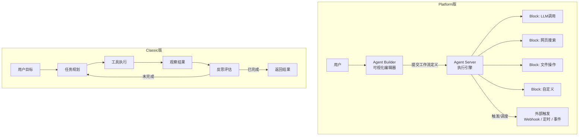

# AutoGPT（自主Agent平台）

## 基础概念

AutoGPT 是由 Significant Gravitas 团队开发的**开源自主 Agent 平台**。2023 年以「让 GPT-4 自主完成任务」的实验项目爆火（GitHub 183k stars），此后经历了从单体脚本到平台化产品的重大转型。

当前版本分为两部分：

- **AutoGPT Platform**（新版）：可视化 Agent 搭建平台，通过拖拽 Block（积木块）组装工作流，后端持续运行 Agent，类似 LLM 版的 ComfyUI。这是官方主力开发方向。
- **AutoGPT Classic**（经典版）：最初的命令行自主 Agent，给定目标后自动分解任务、调用工具、循环执行。目前处于维护状态，不再新增功能。

两者共享同一个仓库，但许可证不同：Platform 采用 Polyform Shield License，Classic 采用 MIT License。

### 核心要素

| 要素 | 作用 |
|------|------|
| **Block（积木块）** | 工作流的最小执行单元，每个 Block 完成一个具体动作（如调用 LLM、搜索网页、读写文件） |
| **Agent Builder（前端）** | 可视化拖拽编辑器，用流程图方式连接 Block 组装 Agent 工作流 |
| **Agent Server（后端）** | 工作流执行引擎，Agent 持续运行、响应外部触发、管理状态和调度 |
| **Feedback Loop（反馈循环）** | Classic 版的核心机制：思考 → 行动 → 观察 → 反思 → 调整，循环执行直到目标完成 |

### Block（积木块）

Block 是 Platform 版本的核心抽象。每个 Block 定义了输入、输出和执行逻辑，类似函数。平台提供大量预制 Block（LLM 调用、网络搜索、文件操作、GitHub API、数据库查询等），也支持自定义 Block。

多个 Block 通过连线组成有向图（DAG），数据从一个 Block 的输出流入下一个 Block 的输入，形成完整的工作流。

### Agent Builder（前端）

Agent Builder 是一个低代码可视化界面，功能包括：
- 拖拽 Block 到画布并用连线定义数据流
- 配置每个 Block 的参数（如 LLM 模型选择、Prompt 模板）
- 预览和调试工作流
- 从模板库导入预构建的 Agent
- 监控已部署 Agent 的运行状态和日志

### Agent Server（后端）

Agent Server 是工作流的执行引擎，负责：
- 解析 Builder 提交的工作流定义，按拓扑顺序调度 Block 执行
- 管理 Agent 的生命周期（启动、暂停、恢复、停止）
- 处理外部触发（Webhook、定时任务、事件驱动）
- 持久化执行状态，支持断点恢复

### Feedback Loop（反馈循环）

反馈循环是 Classic 版本的核心设计思想，也是 AutoGPT 最初爆火的原因。执行流程如下：

1. 用户给定一个高层目标（如「调研 Agent 框架并写报告」）
2. Agent 自主将目标分解为子任务
3. 选择合适的工具执行当前子任务
4. 观察执行结果，评估是否接近目标
5. 根据评估反馈调整策略，回到第 3 步继续

这个循环持续进行，直到目标完成或触发退出条件（成本上限、最大迭代次数等）。

### 核心要素关系图



## 基础用法

### 方式一：Platform 版（推荐）

**硬件要求**：4+ CPU 核心、8GB RAM（推荐 16GB）、10GB 磁盘空间

**软件要求**：Docker Engine 20.10+、Docker Compose 2.0+、Git 2.30+、Node.js 16+、npm 8+

安装并启动：

```bash
# macOS / Linux 一键安装
curl -fsSL https://setup.agpt.co/install.sh -o install.sh && bash install.sh

# 或手动克隆并启动
git clone https://github.com/Significant-Gravitas/AutoGPT.git
cd AutoGPT/autogpt_platform
cp .env.example .env
# 编辑 .env 填入 OPENAI_API_KEY 等配置
docker compose up -d
```

启动后浏览器访问 `http://localhost:3000` 即可进入 Agent Builder 可视化界面。

在 Builder 中创建一个简单的工作流：
1. 拖入一个「LLM 调用」Block，配置模型和 Prompt
2. 拖入一个「输出」Block
3. 将 LLM Block 的输出连接到输出 Block 的输入
4. 点击运行

详细教程参见官方文档：https://agpt.co/docs/platform/getting-started/getting-started

### 方式二：Classic 版（命令行体验自主 Agent）

安装依赖：

```bash
pip install openai python-dotenv
```

需要 OpenAI API Key，在 https://platform.openai.com/api-keys 获取。

最小可运行示例（基于 openai==1.60.0 验证，截至 2026-03）：

```python
import os
from openai import OpenAI

# 初始化客户端。
# 显式传入 api_key 便于读者看清配置来源；若环境变量已设置，也可直接写 OpenAI()
client = OpenAI(api_key=os.getenv("OPENAI_API_KEY"))

class MiniAutoAgent:
    """
    最小自主 Agent：演示「思考-行动-反思」循环。
    给定目标后自动迭代执行，直到目标完成或达到上限。
    """

    def __init__(self, goal: str, max_steps: int = 3):
        self.goal = goal
        self.max_steps = max_steps
        self.history = []  # 执行历史
        self.messages = []  # 对话上下文

    def _format_history(self) -> str:
        """将历史记录转成纯文本，避免 Mock 对象进入 JSON 序列化。"""
        if not self.history:
            return "暂无"

        lines = []
        for item in self.history:
            step = item.get("step", "?")
            decision = str(item.get("decision", ""))
            result = str(item.get("result", ""))
            lines.append(f"- 第 {step} 步：决策={decision}；结果={result}")
        return "\n".join(lines)

    def think(self) -> str:
        """思考阶段：根据目标和历史决定下一步。"""
        prompt = (
            f"你是一个自主 Agent。目标：{self.goal}\n"
            f"已完成步骤：\n{self._format_history()}\n"
            f"可用工具：web_search（搜索）、write_file（写文件）、analyze（分析数据）\n"
            f"请决定下一步行动，格式：[工具] 具体操作说明"
        )
        self.messages.append({"role": "user", "content": prompt})
        resp = client.chat.completions.create(
            model="gpt-4o-mini",
            messages=self.messages,
            max_tokens=200,
        )
        decision = resp.choices[0].message.content or "[analyze] 继续拆解目标并总结当前信息"
        self.messages.append({"role": "assistant", "content": decision})
        return decision

    def act(self, decision: str) -> str:
        """行动阶段：模拟工具执行（实际项目中对接真实工具）。"""
        if "web_search" in decision:
            return "搜索完成：找到 5 条相关结果"
        if "write_file" in decision:
            return "文件写入成功：report.md"
        if "analyze" in decision:
            return "分析完成：提取出 3 个关键结论"
        return "执行完成"

    def run(self):
        """启动反馈循环。"""
        print(f"目标：{self.goal}")
        print(f"最大步数：{self.max_steps}")
        print("-" * 40)

        for step in range(1, self.max_steps + 1):
            # 思考
            decision = self.think()
            print(f"[步骤 {step}] 决策：{decision[:80]}")

            # 行动
            result = self.act(decision)
            print(f"         结果：{result}")

            # 记录历史
            self.history.append(
                {"step": step, "decision": decision[:50], "result": result}
            )

        print("-" * 40)
        print(f"执行完毕，共 {len(self.history)} 步")
        return self.history

if __name__ == "__main__":
    agent = MiniAutoAgent(
        goal="调研主流 Agent 框架，写一份 300 字对比摘要",
        max_steps=3,
    )
    agent.run()
```

预期输出：

```text
目标：调研主流 Agent 框架，写一份 300 字对比摘要
最大步数：3
----------------------------------------
[步骤 1] 决策：[web_search] 搜索主流 Agent 框架（LangChain、AutoGen、CrewAI）的核心特点
         结果：搜索完成：找到 5 条相关结果
[步骤 2] 决策：[analyze] 对比搜索结果，提取各框架的定位、优势和适用场景
         结果：分析完成：提取出 3 个关键结论
[步骤 3] 决策：[write_file] 将对比摘要写入 report.md
         结果：文件写入成功：report.md
----------------------------------------
执行完毕，共 3 步
```

## 同类工具对比

| 维度 | AutoGPT | LangGraph | CrewAI |
|------|---------|-----------|--------|
| 核心定位 | 可视化 Agent 搭建平台 + 经典自主 Agent | 图编排框架，状态机式流程控制 | 多 Agent 角色协作框架 |
| 编程范式 | 低代码拖拽（Platform）/ 目标驱动循环（Classic） | 有向图 + 共享状态 + 条件边 | 角色定义 + 任务分配 + 协作流程 |
| 上手难度 | Platform 版门槛低（拖拽即用），Classic 版需理解自主循环 | 需理解状态机和图编排概念 | 直觉式 API，角色/任务概念易懂 |
| 适合场景 | 非技术人员快速搭建 Agent（Platform）、学习自主 Agent 原理（Classic） | 需要精确控制执行路径的多步骤工作流 | 多角色分工的团队协作任务 |

核心区别：

- **AutoGPT**：两条路线——Platform 面向低代码用户，用可视化方式搭建 Agent；Classic 面向开发者，体验目标驱动的自主循环
- **LangGraph**：面向开发者，用代码精确定义流程图的节点、边和条件分支
- **CrewAI**：面向需要多 Agent 协作的场景，用「角色 + 任务 + 流程」三元组组织多个 Agent

## 常见误区

| 误区 | 准确理解 |
|------|----------|
| AutoGPT 已经停更了 | Classic 版确实不再新增功能，但项目整体非常活跃——Platform 版持续迭代中（2026 年 3 月仍有频繁提交，最新版 v0.6.53） |
| AutoGPT 能完全自主完成任何任务 | Classic 版容易陷入循环、偏离目标、浪费 API 额度。生产环境必须设置成本上限、最大迭代次数等约束 |
| 给 Agent 的工具越多越好 | 工具过多会导致 Agent 决策困难（选择困难症）。应精选 5-10 个高频工具，按场景分组 |

## 优劣势分析

| 优势 | 劣势 |
|------|------|
| Platform 版低代码拖拽，非技术人员也能搭建 Agent | Platform 版依赖 Docker 部署，本地环境配置有门槛 |
| 183k GitHub stars，社区庞大，Block 生态丰富 | Classic 版不再活跃开发，新功能集中在 Platform |
| 支持外部触发（Webhook/定时/事件），适合持续运行场景 | Platform 采用 Polyform Shield License，商用需注意许可限制 |
| Classic 版是学习自主 Agent 原理的经典教材 | Classic 版的自主循环容易失控，成本不可预测 |

## 思考题

<details>
<summary>初级：AutoGPT Classic 的「反馈循环」包含哪几个阶段？为什么需要循环而不是一次执行到底？</summary>

**参考答案：**

反馈循环包含五个阶段：规划（分解目标）→ 执行（调用工具）→ 观察（获取结果）→ 反思（评估进度）→ 调整（修正策略）。

需要循环的原因：LLM 无法一次性完美规划所有步骤，执行过程中会遇到意外情况（工具返回错误、信息不足等）。通过循环，Agent 可以根据每一步的实际结果动态调整后续策略，逐步逼近目标。

</details>

<details>
<summary>中级：AutoGPT Platform 的 Block 机制和 LangGraph 的 Node 机制有什么异同？</summary>

**参考答案：**

**相同点**：都是工作流的最小执行单元，都通过有向图连接，都接收输入并产生输出。

**不同点**：
- Block 是可视化组件，通过拖拽配置参数，面向低代码用户；Node 是 Python 函数，通过代码定义，面向开发者
- Block 之间的数据流通过 UI 连线定义；Node 之间通过共享 State 和 Edge 定义
- Block 生态由平台市场提供预制组件；Node 由开发者自行编写
- LangGraph 的条件边可以实现复杂的动态路由；AutoGPT Platform 的分支逻辑相对固定

</details>

<details>
<summary>中级：如果要在生产环境使用 AutoGPT Classic 的自主循环模式，最关键的三个安全措施是什么？</summary>

**参考答案：**

1. **成本硬上限**：在代码中设置 API 调用成本的绝对上限（如 $5），达到后立即停止，不依赖 LLM 自觉停止
2. **最大迭代次数**：硬编码最大循环次数（如 20 次），防止 Agent 陷入无限循环
3. **执行日志 + 人工审核**：记录每一步的工具调用、LLM 响应和成本数据，关键节点设置人工审核门控，不完全信任 Agent 的自主判断

补充：还应实现状态去重（避免重复执行相同操作）和超时机制（单步执行时间限制）。

</details>

## 参考资料

1. GitHub 仓库：https://github.com/Significant-Gravitas/AutoGPT（183k stars，Platform 版 Polyform Shield License / Classic 版 MIT License）
2. 官方文档（Platform 版）：https://agpt.co/docs/platform/getting-started/getting-started
3. 最新发布版本：autogpt-platform-beta-v0.6.53（2026-03-25）
4. ReAct 论文（AutoGPT 设计思想来源）：https://arxiv.org/abs/2210.03629
