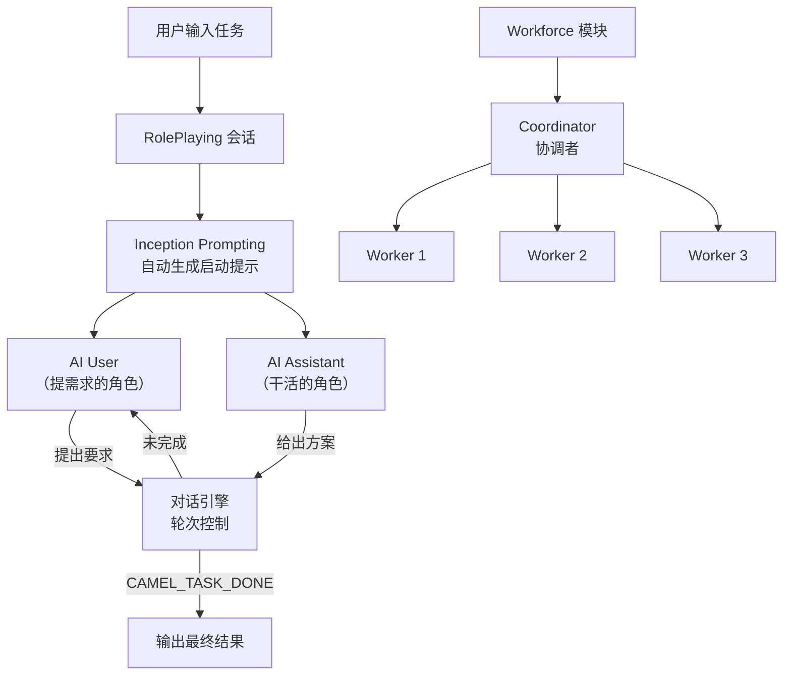

# CAMEL-AI（多Agent通信框架）

## 基础概念

CAMEL-AI（Communicative Agents for "Mind" Exploration of Large Language Model Society）是一个**多智能体角色扮演对话框架**。核心思路很简单：给两个 LLM 分别分配不同角色（比如"产品经理"和"架构师"），让它们围绕一个任务自主对话，不需要人在中间一句一句地引导。

打个比方：你在公司里安排两个同事讨论一个方案，你只需要告诉他们"讨论一下推荐系统怎么做"，然后他们自己聊，聊完给你结果。CAMEL-AI 做的就是这件事，只不过两个"同事"是 LLM 驱动的智能体。

它和普通的多轮对话有什么区别？普通对话需要人一直参与（你问一句 AI 答一句），而 CAMEL 的对话是**全自动的**——两个智能体自己问自己答，直到任务完成。这个机制叫 **Inception Prompting**（启动提示），通过精心设计的初始提示词让智能体"入戏"，知道自己是什么角色、该做什么、什么时候可以结束。

### 核心要素

| 要素 | 作用 |
|------|------|
| **RolePlaying（角色扮演会话）** | 整个框架的入口，管理两个智能体的对话流程、轮次控制和终止判断 |
| **Inception Prompting（启动提示）** | 自动生成的初始提示词，将角色身份、任务目标、行为规则注入智能体 |
| **Workforce（劳动力模块）** | 多智能体协作的高级模块，支持层级式任务分配和协调 |

### RolePlaying（角色扮演会话）

RolePlaying 是 CAMEL 最核心的类，位于 `camel.societies` 模块。它做三件事：

1. **创建两个角色**：一个 AI User（提需求的人）和一个 AI Assistant（干活的人）
2. **自动对话**：两个角色轮流发言，User 提要求，Assistant 给方案，User 再追问或确认
3. **终止控制**：检测到任务完成标记（`CAMEL_TASK_DONE`）或达到最大轮次时自动停止

```python
from camel.societies import RolePlaying

# 一行代码创建角色扮演会话
session = RolePlaying(
    assistant_role_name="Python Programmer",  # 助手角色
    user_role_name="Product Manager",          # 用户角色
    task_prompt="开发一个命令行计算器",           # 任务描述
    with_task_specify=True,                    # 自动细化任务
)
```

### Inception Prompting（启动提示）

启动提示不是简单地在 prompt 里加一句"你是 XX 角色"。CAMEL 会自动生成一段结构化的提示词，包含：

- **角色背景**：你是谁、擅长什么
- **任务目标**：具体要完成什么
- **行为规则**：怎么和对方交互、什么时候该结束
- **关系说明**：你和对话伙伴的分工是什么

这套机制让智能体的对话质量远高于简单的 prompt 拼接——角色不会"出戏"，任务不会跑偏。

### Workforce（劳动力模块）

2024 年新增的高级功能。RolePlaying 是两个角色一对一对话，Workforce 则支持**多个智能体协作**：有一个协调者（Coordinator）分配任务，多个工作节点（Worker Node）各自负责子任务。适合复杂场景，比如"写一篇技术报告"可以拆成调研、写作、审校三个子任务分给不同智能体。

### 核心要素关系图



上半部分是基础的双角色对话流程，下半部分是 Workforce 的多智能体协作架构。

## 基础用法

安装依赖：

```bash
pip install camel-ai
```

如需完整功能（RAG、Web 工具等），可安装全量依赖：

```bash
pip install 'camel-ai[all]'
```

需要 OpenAI API Key（获取地址：https://platform.openai.com/api-keys）：

```bash
export OPENAI_API_KEY="your-openai-api-key"
```

最小可运行示例（基于 camel-ai==0.2.83 验证，截至 2026-03）：

```python
from camel.societies import RolePlaying
from camel.models import ModelFactory
from camel.types import ModelPlatformType, ModelType

# 1. 创建模型实例
model = ModelFactory.create(
    model_platform=ModelPlatformType.DEFAULT,
    model_type=ModelType.GPT_4O,
)

# 2. 创建角色扮演会话
session = RolePlaying(
    assistant_role_name="Python Programmer",
    assistant_agent_kwargs=dict(model=model),
    user_role_name="Stock Trader",
    user_agent_kwargs=dict(model=model),
    task_prompt="开发一个能获取股票价格并计算移动平均线的 Python 脚本",
    with_task_specify=True,
    task_specify_agent_kwargs=dict(model=model),
)

# 3. 启动对话
print(f"任务：{session.task_prompt}\n")
input_msg = session.init_chat()

# 4. 执行多轮对话（限制 10 轮）
for turn in range(10):
    assistant_response, user_response = session.step(input_msg)

    print(f"【第 {turn + 1} 轮】")
    print(f"用户: {user_response.msg.content[:150]}...")
    print(f"助手: {assistant_response.msg.content[:150]}...\n")

    # 三种终止条件
    if assistant_response.terminated:
        print(f"[结束] 助手终止: {assistant_response.info.get('termination_reasons')}")
        break
    if user_response.terminated:
        print(f"[结束] 用户终止: {user_response.info.get('termination_reasons')}")
        break
    if "CAMEL_TASK_DONE" in user_response.msg.content:
        print("[结束] 任务完成")
        break

    # 将助手的回复作为下一轮输入
    input_msg = assistant_response.msg

print(f"共进行 {turn + 1} 轮对话")
```

预期输出：

```text
任务：开发一个能获取股票价格并计算移动平均线的 Python 脚本

【第 1 轮】
用户: 我需要一个 Python 脚本来获取实时股票价格数据，并计算 5 日和 20 日移动平均线...
助手: 好的，我来设计这个脚本。首先我们需要使用 yfinance 库获取股票数据...

【第 2 轮】
用户: 脚本看起来不错，但我还需要加上一个简单的买卖信号判断...
助手: 没问题，我在移动平均线的基础上加入金叉/死叉判断逻辑...

...

[结束] 任务完成
共进行 N 轮对话
```

代码说明：`with_task_specify=True` 让框架自动把粗略的任务描述细化成具体的执行目标。`session.step()` 返回两个响应对象，分别是助手和用户的回复，通过 `.terminated` 和 `CAMEL_TASK_DONE` 判断是否结束。

## 同类工具对比

| 维度 | CAMEL-AI | AutoGen | CrewAI |
|------|----------|---------|--------|
| 核心定位 | 角色扮演驱动的双Agent对话框架 | 多Agent会话协作框架（微软） | 角色分工+流程编排框架 |
| 编程范式 | Inception Prompting + 轮次对话 | 消息驱动的群聊/嵌套对话 | 角色(Agent) + 任务(Task) + 流程(Process) |
| 学习曲线 | 低——核心 API 只有 RolePlaying 一个类 | 中——需理解会话模式和代码执行策略 | 中——需定义 Agent、Task、Crew 三层 |
| 多Agent扩展 | Workforce 模块支持层级协作 | 原生群聊模式，支持动态加入 | 原生支持顺序/层级流程 |
| 适合场景 | 涌现行为研究、角色对话模拟、原型验证 | 代码生成协作、复杂任务自动化 | 企业级工作流、团队协作模拟 |

核心区别：

- **CAMEL-AI**：专注角色扮演对话，API 极简，适合快速验证多Agent协作想法和学术研究
- **AutoGen**：微软出品，代码执行能力强，适合需要Agent实际运行代码的场景
- **CrewAI**：流程编排能力突出，适合定义明确的多步骤团队协作工作流

## 常见误区

| 误区 | 准确理解 |
|------|----------|
| CAMEL 只能做两个角色的对话 | RolePlaying 是双角色对话，但 Workforce 模块支持多智能体层级协作，可以编排任意数量的Agent |
| 角色越多对话质量越高 | 每多一个角色就增加上下文复杂度和 token 消耗。2-3 个角色通常效果最好，超过后收益递减明显 |
| CAMEL 适合所有多Agent场景 | CAMEL 的强项是对话型协作和涌现行为研究，如果需要精确的流程控制和工具调用编排，LangGraph 或 CrewAI 更合适 |

## 优劣势分析

| 优势 | 劣势 |
|------|------|
| API 极简，RolePlaying 一个类就能跑通双Agent对话 | 生产环境成熟度不如 LangChain/AutoGen，文档相对较少 |
| Inception Prompting 机制让角色对话质量高、不易跑偏 | 对话过程消耗大量 token，长对话成本不低 |
| 原生支持涌现行为观察和记录，学术研究友好 | Workforce 模块较新，API 可能随版本变化 |
| 支持多种模型后端（OpenAI、Gemini、本地模型等） | 社区规模小于 LangChain/AutoGen 生态 |

## 思考题

<details>
<summary>初级：CAMEL-AI 的 Inception Prompting 和普通的 system prompt 有什么区别？</summary>

**参考答案：**

普通 system prompt 通常只是一句"你是一个 XX 角色"，而 Inception Prompting 是一套结构化的提示词生成机制，自动包含角色背景、任务目标、行为规则、与对话伙伴的关系说明、终止条件等多个维度。这让智能体不仅知道"我是谁"，还知道"我该做什么、怎么和对方配合、什么时候可以结束"。结果是对话更连贯、角色不易出戏、任务完成度更高。

</details>

<details>
<summary>中级：RolePlaying 会话有哪几种终止条件？为什么需要多种终止机制？</summary>

**参考答案：**

三种终止条件：(1) `assistant_response.terminated` 为 True——助手认为任务已完成；(2) `user_response.terminated` 为 True——用户认为不需要继续；(3) 用户消息中包含 `CAMEL_TASK_DONE` 标记——显式的任务完成信号。此外还有最大轮次限制作为兜底。

需要多种机制是因为自主对话没有人工干预，单靠一种判断容易出错：智能体可能忘记说"完成"导致无限循环，或者误判完成导致提前结束。多种机制互相补充，既防止无限消耗 token，又尽量让任务充分讨论。

</details>

<details>
<summary>中级：什么场景该用 RolePlaying，什么场景该用 Workforce？界限在哪？</summary>

**参考答案：**

RolePlaying 适合**两个互补角色围绕单一任务对话**的场景，比如产品经理和架构师讨论一个方案、面试官和候选人模拟面试。核心是一对一、任务单一、对话驱动。

Workforce 适合**任务需要拆解、多个子任务并行或串行执行**的场景，比如"写一篇技术报告"需要调研、写作、审校三个子任务。核心是有协调者分配任务，各工作节点独立完成子任务。

界限判断：如果任务能通过两个人"聊一聊"解决，用 RolePlaying；如果任务需要"拆开分给不同人做"，用 Workforce。

</details>

## 参考资料

1. 官方文档：https://docs.camel-ai.org/
2. GitHub 仓库：https://github.com/camel-ai/camel（15k+ stars，Apache-2.0 许可证）
3. 原始论文：Li et al., "CAMEL: Communicative Agents for Mind Exploration of Large Language Model Society", NeurIPS 2023. https://arxiv.org/abs/2303.17760
4. Societies 模块文档：https://docs.camel-ai.org/key_modules/societies
5. OWL 项目（基于 CAMEL 的多Agent协作框架）：https://github.com/camel-ai/owl
6. PyPI 包页面：https://pypi.org/project/camel-ai/
