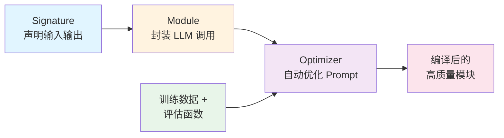

# DSPy（声明式 LLM 编程框架）

## 基础概念

DSPy（Declarative Self-improving Python，声明式自改进 Python）是斯坦福 NLP 组开发的开源框架，核心理念用一句话概括：**用 Python 代码编程 LLM，而不是手写提示词**。

传统做法中，开发者反复调试 Prompt 字符串——改一个词、加一句话、换个格式——本质上是在做体力活。DSPy 把这件事自动化了：你只需要用 Python 声明"输入是什么、输出要什么"，框架会根据你的数据和评估标准，自动帮你编译出最优的 Prompt（甚至微调模型权重）。

类比理解：手写 Prompt 相当于写汇编语言，DSPy 相当于用高级语言 + 编译器。你写 C 代码描述逻辑，编译器帮你生成高效的机器码。

### 核心要素

| 要素 | 作用 |
|------|------|
| **Signature（签名）** | 声明一个 LLM 任务的输入输出契约——"给我什么、要我产出什么" |
| **Module（模块）** | 封装 LLM 调用的可复用积木块，类似 PyTorch 的 nn.Module |
| **Optimizer（优化器）** | 自动编译模块——从数据中学习最优的 Prompt 和少样本示例 |

### Signature（签名）

Signature 是 DSPy 最基础的概念。它定义了一个 LLM 任务的输入和输出字段，每个字段附带语义描述。

两种写法：

```python
import dspy

# 写法一：字符串简写（适合简单任务）
# "question -> answer" 表示输入 question，输出 answer
predictor = dspy.Predict("question -> answer")

# 写法二：类定义（适合复杂任务，字段可加详细描述）
class QA(dspy.Signature):
    """根据上下文回答问题"""
    context = dspy.InputField(desc="包含答案的背景信息")
    question = dspy.InputField(desc="用户的问题")
    answer = dspy.OutputField(desc="基于背景信息的准确答案")
```

字段名本身携带语义：`question` 和 `answer` 会被框架理解为"问题"和"回答"的角色。好的字段命名能显著提升输出质量。

### Module（模块）

Module 是执行实际 LLM 调用的组件。DSPy 内置了多种模块，每种对应一种常见的提示技巧：

| 模块 | 功能 | 类比 |
|------|------|------|
| `dspy.Predict` | 最基础的单次 LLM 调用 | 直接提问 |
| `dspy.ChainOfThought` | 自动注入推理步骤后再输出 | 让模型先想再答 |
| `dspy.ReAct` | 支持调用外部工具的 Agent 循环 | 边想边查边答 |
| `dspy.MultiChainComparison` | 生成多条推理链后投票选最佳 | 多人讨论取共识 |

模块的设计借鉴了 PyTorch：继承 `dspy.Module`，在 `forward()` 中定义处理逻辑：

```python
import dspy

class SimpleQA(dspy.Module):
    def __init__(self):
        super().__init__()
        self.answer = dspy.ChainOfThought("context, question -> answer")

    def forward(self, context, question):
        return self.answer(context=context, question=question)
```

### Optimizer（优化器）

优化器是 DSPy 区别于其他框架的核心竞争力。给定一个模块、训练数据和评估函数，优化器会自动调整模块内部的 Prompt 和少样本示例，使任务性能最大化。

常见优化器：

| 优化器 | 原理 | 适合场景 |
|--------|------|----------|
| `BootstrapFewShot` | 用教师模块生成示例，筛选好的作为 few-shot | 数据量少、快速启动 |
| `MIPROv2` | 同时优化指令文本和 few-shot 示例，贝叶斯搜索 | 追求更高质量，可接受更多优化成本 |
| `SIMBA` | 聚焦高难度样本，LLM 自省生成改进规则 | 长尾困难案例优化 |

### 核心要素关系图



工作流程：先用 Signature 声明任务 → 用 Module 封装调用逻辑 → 用 Optimizer + 数据 + 评估函数自动编译优化。

## 基础用法

安装：

```bash
pip install -U dspy
```

如需外部服务：
- OpenAI API Key：https://platform.openai.com/api-keys（付费）
- 也支持 Claude、Gemini、本地模型（Ollama 等），通过 `dspy.LM()` 切换

最小可运行示例（基于 dspy==2.6 验证，截至 2026-03）：

```python
import dspy
import os

# 1. 配置 LLM 后端
lm = dspy.LM("openai/gpt-4o-mini", api_key=os.getenv("OPENAI_API_KEY"))
dspy.configure(lm=lm)

# 2. 定义签名：声明输入输出
class GenerateAnswer(dspy.Signature):
    """根据背景信息回答问题"""
    context = dspy.InputField(desc="相关的背景知识")
    question = dspy.InputField(desc="用户的问题")
    answer = dspy.OutputField(desc="基于背景信息的准确答案")

# 3. 用 ChainOfThought 模块包装（自动加入推理步骤）
cot = dspy.ChainOfThought(GenerateAnswer)

# 4. 调用
result = cot(
    context="Python 由 Guido van Rossum 于 1991 年创建，以简洁语法著称。",
    question="Python 是谁创建的？"
)

print("推理过程:", result.reasoning)
print("最终答案:", result.answer)
```

预期输出：

```text
推理过程: 根据背景信息，明确提到 Python 由 Guido van Rossum 于 1991 年创建。
最终答案: Python 由 Guido van Rossum 创建。
```

`ChainOfThought` 会自动在签名的输出字段前注入一个 `reasoning` 字段，要求模型先展示推理过程再给答案。不需要你在 Prompt 里手写"请一步步思考"。

### 自动优化示例

DSPy 的核心价值在于优化器。以下示例展示如何用 `BootstrapFewShot` 自动优化一个情感分类模块：

```python
import dspy
import os

# 配置 LLM
lm = dspy.LM("openai/gpt-4o-mini", api_key=os.getenv("OPENAI_API_KEY"))
dspy.configure(lm=lm)

# 定义情感分类签名
class SentimentClassify(dspy.Signature):
    """判断文本的情感倾向"""
    text = dspy.InputField(desc="待分析的文本")
    sentiment = dspy.OutputField(desc="情感标签: positive / negative / neutral")

# 定义模块
classifier = dspy.Predict(SentimentClassify)

# 准备训练数据
trainset = [
    dspy.Example(text="这部电影太棒了！", sentiment="positive").with_inputs("text"),
    dspy.Example(text="浪费时间，不推荐。", sentiment="negative").with_inputs("text"),
    dspy.Example(text="还行吧，一般般。", sentiment="neutral").with_inputs("text"),
    dspy.Example(text="强烈推荐！", sentiment="positive").with_inputs("text"),
]

# 定义评估指标
def match_sentiment(example, pred, trace=None):
    return example.sentiment.strip().lower() == pred.sentiment.strip().lower()

# 用 BootstrapFewShot 优化器编译
optimizer = dspy.BootstrapFewShot(metric=match_sentiment, max_bootstrapped_demos=2)
optimized_classifier = optimizer.compile(classifier, trainset=trainset)

# 测试优化后的模块
result = optimized_classifier(text="非常失望，质量很差。")
print(f"情感: {result.sentiment}")
# 预期输出 → 情感: negative
```

优化器做了什么：在训练数据上运行模块，筛选出输出正确的样本，自动作为 few-shot 示例插入 Prompt。之后模块在面对新输入时，Prompt 里已经包含了精选的示例，分类准确率会更高。

### 多步骤流水线示例

多个模块可以组合成流水线，处理复杂的多步骤任务：

```python
import dspy
import os

lm = dspy.LM("openai/gpt-4o-mini", api_key=os.getenv("OPENAI_API_KEY"))
dspy.configure(lm=lm)

class ResearchAssistant(dspy.Module):
    """多步骤研究助手：拆解问题 → 分析 → 综合答案"""
    def __init__(self):
        super().__init__()
        self.decompose = dspy.ChainOfThought("question -> key_concepts")
        self.analyze = dspy.ChainOfThought("question, key_concepts -> analysis")
        self.synthesize = dspy.ChainOfThought("question, analysis -> final_answer")

    def forward(self, question):
        step1 = self.decompose(question=question)
        step2 = self.analyze(question=question, key_concepts=step1.key_concepts)
        step3 = self.synthesize(question=question, analysis=step2.analysis)
        return step3

assistant = ResearchAssistant()
result = assistant(question="为什么 Transformer 架构在 NLP 中取代了 RNN？")
print(result.final_answer)
```

流水线中每个 `ChainOfThought` 都是可独立优化的模块。用优化器编译整个 `ResearchAssistant` 时，框架会自动优化所有子模块的 Prompt，只要你能评估最终输出的质量。

## 同类工具对比

| 维度 | DSPy | LangChain | LlamaIndex |
|------|------|-----------|------------|
| 核心定位 | 声明式 LLM 编程 + 自动 Prompt 优化 | LLM 应用开发工具链 | 数据索引 + RAG 框架 |
| 编程范式 | 签名 + 模块 + 优化器（类 PyTorch） | 链式调用 / LCEL 管道 | 索引 + 查询引擎 |
| Prompt 优化 | 内置自动优化器，数据驱动 | 手工调整 | 手工调整 |
| 最擅长 | 需要系统化优化 Prompt 的 NLP 任务 | 快速搭建各类 LLM 应用原型 | 文档问答和知识检索 |
| 适合人群 | 追求 Prompt 质量、有评估数据的开发者 | 需要丰富集成和快速出活的团队 | 以 RAG 为核心需求的项目 |

核心区别：

- **DSPy**：解决"Prompt 怎么优化"的问题——自动从数据中学习最佳 Prompt 策略
- **LangChain**：解决"组件怎么接"的问题——LLM、工具、数据源的快速组装
- **LlamaIndex**：解决"数据怎么查"的问题——文档索引、向量检索、RAG 管线

三者不互斥。可以在 LangChain/LlamaIndex 的节点中使用 DSPy 模块来自动优化关键环节的 Prompt。

## 常见误区

| 误区 | 准确理解 |
|------|----------|
| DSPy 完全不需要写 Prompt | DSPy 不是消除 Prompt，而是把 Prompt 的生成从手工调试变成自动编译。你仍需要设计好 Signature 的字段名和描述 |
| 用了 DSPy 性能就会自动提升 | 优化效果取决于评估函数的质量。评估函数设计不当，优化器可能往错误方向走 |
| DSPy 只支持 OpenAI | 支持 OpenAI、Anthropic Claude、Google Gemini、Ollama 本地模型等多种后端，通过 `dspy.LM()` 配置切换 |
| 优化一次就够了 | 当数据分布变化或任务需求更新时，需要重新编译优化。模块性能会随时间漂移 |

## 优劣势分析

| 优势 | 劣势 |
|------|------|
| 自动优化 Prompt，告别手工调试 | 需要准备训练数据和评估函数，前期投入比直接写 Prompt 高 |
| 模块化设计，多步骤流水线可组合、可复用 | 社区生态和集成数量不及 LangChain |
| 优化器可同时调优流水线中所有子模块 | 优化过程需要多次 LLM 调用，有额外 API 成本 |
| 类 PyTorch 的编程模型，对 ML 背景开发者友好 | 概念较新（Signature、Teleprompter），入门有一定学习曲线 |

## 思考题

<details>
<summary>初级：DSPy 的 Signature 和传统手写 Prompt 有什么本质区别？</summary>

**参考答案：**

传统 Prompt 是一段自由文本字符串，开发者需要手动措辞、排版、加示例。Signature 是结构化的输入输出声明，只定义"要什么"（字段名 + 描述），不定义"怎么说"。框架会根据 Signature 自动生成合适的 Prompt，并且可以被优化器自动改进。核心区别：Prompt 是手工产物，Signature 是可编译的声明。

</details>

<details>
<summary>中级：BootstrapFewShot 优化器的工作原理是什么？它是怎么"学习"出好的 Prompt 的？</summary>

**参考答案：**

工作流程分四步：
1. 用当前模块（或指定的教师模块）在训练数据上逐条执行
2. 用评估函数检查每条输出是否合格
3. 把合格的输入-输出对筛选出来，作为 few-shot 示例
4. 将这些精选示例自动插入 Prompt

本质上是"从成功案例中学习"：好的输出被回收利用，成为后续调用的参考样本。模块在优化后，Prompt 中会包含若干高质量示例，LLM 看到这些示例后更容易产出符合预期的结果。

</details>

<details>
<summary>中级：什么情况下 DSPy 的自动优化反而不如手写 Prompt？</summary>

**参考答案：**

三种典型情况：
1. **任务极其简单**：比如固定格式的文本提取，手写一句 Prompt 就能搞定，引入优化器反而增加复杂度
2. **评估函数质量差**：如果评估函数不能准确反映任务目标（比如只检查长度不检查内容），优化器会往错误方向优化
3. **训练数据不足或不具代表性**：BootstrapFewShot 需要足够多样的训练样本才能筛选出好的示例，数据太少会导致过拟合

判断标准：如果你能明确定义"好的输出是什么"，且有足够的评估数据，DSPy 的优化器大概率优于手写。否则不如从手写 Prompt 开始。

</details>

## 参考资料

1. 官方文档：https://dspy.ai/
2. GitHub 仓库：https://github.com/stanfordnlp/dspy
3. PyPI 包页面：https://pypi.org/project/dspy/
4. DSPy 论文：Khattab et al., "DSPy: Compiling Declarative Language Model Calls into Self-Improving Pipelines", arXiv:2310.03714 (2023)
5. 斯坦福 HAI 研究页面：https://hai.stanford.edu/research/dspy-compiling-declarative-language-model-calls-into-state-of-the-art-pipelines
