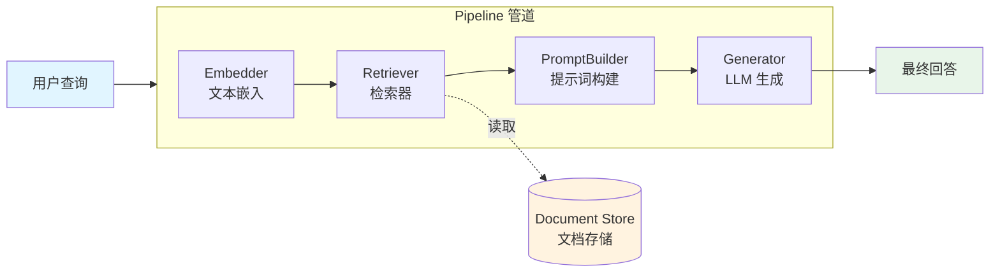

# Haystack（AI 应用框架）

## 基础概念

Haystack 是 deepset 公司开源的 **AI 编排框架（AI Orchestration Framework）**，用模块化管道（Pipeline）的方式把检索、生成、路由等步骤像搭积木一样拼在一起，构建 RAG 系统、语义搜索、问答系统和 Agent 应用。

打个比方：你要做一道菜，需要洗菜、切菜、炒菜、装盘这几步。Haystack 就是帮你把这些步骤串起来的"流水线"——每个步骤是一个独立组件（Component），组件之间通过管道连接，数据自动从上一步流到下一步。你可以随时换掉其中任何一个组件（比如把关键词检索换成向量检索），而不需要改动其他部分。

### 核心要素

| 要素 | 作用 |
|------|------|
| **Component（组件）** | 执行具体任务的最小单元，如检索器、生成器、嵌入器等 |
| **Pipeline（管道）** | 把多个组件连成有向图，定义数据的流转路径 |
| **Document Store（文档存储）** | 存放和索引文档的后端，支持内存、Elasticsearch、各种向量数据库 |
| **Agent（智能体）** | 内置的 Agent 组件，能调用工具、循环推理，解决复杂任务 |

### Component（组件）

组件是 Haystack 的基本积木块。每个组件做一件事，通过标准化的输入/输出接口与其他组件对接。Haystack 内置了大量组件，覆盖常见任务：

- **Retriever（检索器）**：从文档库中找出相关文档，支持 BM25 关键词检索和向量语义检索
- **Embedder（嵌入器）**：把文本转成向量，分为文档嵌入器（给文档建索引）和文本嵌入器（给查询编码）
- **Generator（生成器）**：调用 LLM 生成回答，支持 OpenAI、Anthropic、Hugging Face 等几十种模型
- **Reader（阅读器）**：在文档中精确定位答案片段（抽取式问答）
- **PromptBuilder（提示词构建器）**：用 Jinja2 模板拼接 Prompt

你也可以用 `@component` 装饰器自定义组件。

### Pipeline（管道）

管道是一个有向多重图（Directed Multigraph），把组件按照数据流转关系连在一起。与简单的链式调用不同，Haystack 管道支持：

- **分支**：一个组件的输出分发给多个下游组件
- **合并**：多个组件的输出汇聚到一个下游组件
- **循环**：支持条件路由，实现重试、Agent 工具调用等循环逻辑
- **并行**：使用 AsyncPipeline 时，无依赖关系的组件可以并行执行

```python
from haystack import Pipeline, component

@component
class FakeRetriever:
    @component.output_types(documents=list)
    def run(self):
        return {"documents": ["Haystack 会把组件串成管道"]}

@component
class FakePromptBuilder:
    @component.output_types(prompt=str)
    def run(self, documents: list):
        return {"prompt": f"请总结：{documents[0]}"}

@component
class FakeGenerator:
    @component.output_types(answer=str)
    def run(self, prompt: str):
        return {"answer": f"生成结果：{prompt}"}

# 用 add_component 添加组件，用 connect 定义数据流向
pipeline = Pipeline()
pipeline.add_component("retriever", FakeRetriever())
pipeline.add_component("prompt_builder", FakePromptBuilder())
pipeline.add_component("llm", FakeGenerator())
pipeline.connect("retriever.documents", "prompt_builder.documents")
pipeline.connect("prompt_builder.prompt", "llm.prompt")
```

### Document Store（文档存储）

文档存储是所有检索操作的基础，负责保存文档原文和向量索引。Haystack 通过集成包支持多种后端：

- **InMemoryDocumentStore**：内存存储，零配置，适合开发调试和小规模场景
- **Elasticsearch / OpenSearch**：全文搜索引擎，适合中大规模生产环境
- **向量数据库**：Milvus、Weaviate、Pinecone、Qdrant、Chroma 等，适合语义检索

### Agent（智能体）

Haystack 2.x 内置了 `Agent` 组件，可以与 LLM 交互并调用工具（Tool），支持循环推理直到得出最终答案。Agent 还支持 MCP（Model Context Protocol）协议，可以连接外部 MCP 服务器提供的工具。

### 核心要素关系图



## 基础用法

安装：

```bash
pip install haystack-ai
```

> `haystack-ai` 是 Haystack 2.x 的包名（不要装旧版的 `farm-haystack`）。如需连接 OpenAI，还要装 `pip install openai`。

最小可运行示例——BM25 关键词检索问答（纯本地，无需 API Key）：

```python
# 基于 haystack-ai==2.12.1 验证（截至 2026-03）
from haystack import Document, Pipeline
from haystack.document_stores.in_memory import InMemoryDocumentStore
from haystack.components.retrievers.in_memory import InMemoryBM25Retriever
from haystack.components.readers import ExtractiveReader

# 1. 创建文档存储，写入几条文档
doc_store = InMemoryDocumentStore()
doc_store.write_documents([
    Document(content="Python 是由 Guido van Rossum 于 1991 年创建的高级编程语言。"),
    Document(content="JavaScript 由 Brendan Eich 在 1995 年创建，主要用于网页开发。"),
    Document(content="Go 语言由 Google 在 2009 年发布，专注于并发和高性能。"),
])

# 2. 创建组件
retriever = InMemoryBM25Retriever(document_store=doc_store)
reader = ExtractiveReader(model="deepset/roberta-base-squad2")
reader.warm_up()  # 预加载模型（首次运行需下载，约 500MB）

# 3. 构建管道并连接组件
pipeline = Pipeline()
pipeline.add_component("retriever", retriever)
pipeline.add_component("reader", reader)
pipeline.connect("retriever.documents", "reader.documents")

# 4. 提问
query = "Python 是什么时候创建的？"
result = pipeline.run(data={
    "retriever": {"query": query},
    "reader": {"query": query}
})

# 5. 输出答案
answer = result["reader"]["answers"][0]
print(f"问题：{query}")
print(f"答案：{answer.data}")
print(f"置信度：{float(answer.score):.2%}")
```

预期输出：

```text
问题：Python 是什么时候创建的？
答案：1991 年
置信度：89.34%
```

数据流向：用户查询同时传给 retriever 和 reader → retriever 从文档库中找出相关文档 → 文档传给 reader → reader 用预训练模型在文档中定位答案片段并计算置信度。

带 LLM 生成的 RAG 示例（需要 OpenAI API Key）：

```python
# 需要额外安装：pip install openai
# 需要设置环境变量：export OPENAI_API_KEY="sk-..."
import os
from haystack import Document, Pipeline
from haystack.document_stores.in_memory import InMemoryDocumentStore
from haystack.components.retrievers.in_memory import InMemoryBM25Retriever
from haystack.components.builders import ChatPromptBuilder
from haystack.components.generators.chat import OpenAIChatGenerator
from haystack.dataclasses import ChatMessage

# 文档存储
doc_store = InMemoryDocumentStore()
doc_store.write_documents([
    Document(content="Haystack 是 deepset 开源的 AI 编排框架，支持构建 RAG 和 Agent 应用。"),
    Document(content="LangChain 是一个通用 LLM 应用框架，主打链式调用和组件生态。"),
])

# 提示词模板
template = [ChatMessage.from_user(
    "根据以下文档回答问题。\n"
    "文档：\n{{ doc.content }}\n\n"
    "问题：{{ question }}\n回答："
)]

# 构建 RAG 管道
rag = Pipeline()
rag.add_component("retriever", InMemoryBM25Retriever(document_store=doc_store))
rag.add_component("prompt", ChatPromptBuilder(template=template, required_variables=["question", "documents"]))
rag.add_component("llm", OpenAIChatGenerator(model="gpt-4o-mini"))
rag.connect("retriever.documents", "prompt.documents")
rag.connect("prompt", "llm.messages")

# 执行查询
question = "Haystack 是什么？"
result = rag.run({
    "retriever": {"query": question},
    "prompt": {"question": question},
})
print(result["llm"]["replies"][0].text)
```

## 同类工具对比

| 维度 | Haystack | LangChain | LlamaIndex |
|------|----------|-----------|------------|
| 核心定位 | AI 编排框架，强调管道和组件化 | 通用 LLM 应用框架，组件生态庞大 | 专注数据索引和检索增强生成 |
| 编程范式 | 有向图管道 + 类型化组件接口 | 链式调用（LCEL）+ Agent | 索引/查询引擎 + Agent |
| 最擅长 | 生产级 RAG、语义搜索、问答系统 | 快速原型开发、多种 LLM 应用 | 复杂文档处理、多种索引策略 |
| Agent 能力 | 内置 Agent 组件，支持 Tool 和 MCP | 丰富的 Agent 类型和工具生态 | Agent 支持，偏查询导向 |
| 适合人群 | 需要精确控制数据流的工程团队 | 想快速试验各种 LLM 玩法的开发者 | 需要对大量文档建索引的数据团队 |

核心区别：

- **Haystack**：管道即架构——通过有向图精确定义数据流转，适合需要可控、可复现的生产系统
- **LangChain**：生态即优势——组件最多、集成最广，适合快速搭建原型和多样化应用
- **LlamaIndex**：索引即核心——在文档解析、分块、索引策略上提供最细粒度的控制

## 常见误区

| 误区 | 准确理解 |
|------|----------|
| Haystack 只能做问答系统 | Haystack 2.x 已演进为通用 AI 编排框架，支持 RAG、Agent、语义搜索、多模态等多种应用 |
| 必须用 GPU 才能跑 Haystack | CPU 完全可以运行。只有使用本地模型做推理时 GPU 才有明显加速，调 OpenAI 等 API 不需要 GPU |
| `haystack-ai` 和 `farm-haystack` 是同一个包 | `farm-haystack` 是 1.x 旧版，已停止维护。2.x 的包名是 `haystack-ai`，API 完全不同，不要混装 |
| 添加新文档后需要重新训练模型 | 不需要。只需把新文档写入 Document Store 并更新向量索引，检索器和生成器模型不用重训 |

## 优劣势分析

| 优势 | 劣势 |
|------|------|
| 管道架构清晰，数据流向显式定义，便于调试和维护 | 生态规模不如 LangChain，第三方集成数量较少 |
| 组件接口标准化，替换模型/存储只需换一个组件 | 入门需理解管道、组件、连接等概念，对纯新手有学习成本 |
| 内置 Agent 和 MCP 支持，跟进最新 AI 工程趋势 | 社区活跃度中等，中文资源相对较少 |
| 管道可序列化为 YAML/JSON，支持版本管理和远程部署 | 要求 Python >= 3.10，低版本 Python 无法使用 |

## 思考题

<details>
<summary>初级：Haystack 中 Component、Pipeline、Document Store 三者分别负责什么？</summary>

**参考答案：**

- Component：执行具体任务的最小单元（如检索、生成、嵌入），每个组件有标准化的输入输出接口。
- Pipeline：把多个 Component 连成有向图，定义数据从哪个组件流向哪个组件，是整个应用的骨架。
- Document Store：存储和索引文档的后端数据库，为 Retriever 提供检索能力。

三者的关系：Document Store 提供数据，Component 处理数据，Pipeline 编排 Component 的执行顺序。

</details>

<details>
<summary>中级：BM25 关键词检索和向量语义检索各有什么优缺点？什么时候用混合检索？</summary>

**参考答案：**

BM25 关键词检索：速度快、不需要向量模型、对精确关键词匹配友好，但无法理解语义（"汽车"搜不到"轿车"）。

向量语义检索：理解语义、对同义词和不同表述容错性强，但需要向量模型、计算成本更高、对专业术语或新词可能不够敏感。

混合检索适用场景：文档库主题多样、用户查询表述差异大时，两种检索互补效果最好。实现方式是在管道中同时使用 BM25Retriever 和 EmbeddingRetriever，通过 DocumentJoiner 合并结果。

</details>

<details>
<summary>中级：Haystack 管道和简单的函数链式调用（A → B → C 依次执行）有什么本质区别？</summary>

**参考答案：**

函数链式调用是线性的，A 调 B 调 C，执行路径固定。Haystack 管道是有向图结构，支持：

1. 分支：一个组件的输出可以分发给多个下游组件（如同时做 BM25 和向量检索）
2. 合并：多个组件的结果可以汇聚到一个下游组件（如 DocumentJoiner）
3. 循环：通过条件路由实现 Agent 的工具调用循环
4. 并行：无依赖关系的组件可以并行执行（AsyncPipeline）

此外，管道提供类型校验（连接时检查输入输出类型是否匹配）、序列化（保存为 YAML 便于版本管理）、可视化（直接查看图结构）等工程能力，这些是裸函数调用不具备的。

</details>

## 参考资料

1. 官方文档：https://docs.haystack.deepset.ai/
2. GitHub 仓库：https://github.com/deepset-ai/haystack
3. Haystack 集成列表：https://haystack.deepset.ai/integrations
4. deepset 官网：https://www.deepset.ai/
