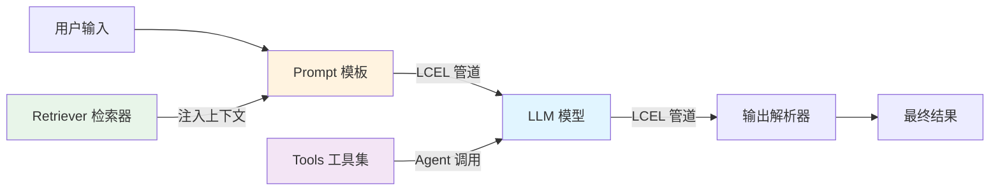

# LangChain（LLM 应用开发框架）

## 基础概念

LangChain 是一个开源的 **LLM 应用编排框架（Orchestration Framework）**，核心思路是把 LLM 调用、提示词模板、工具调用、数据检索等能力做成标准化的"积木块"，然后用管道符 `|` 把它们拼接成完整的处理流水线。

打个比方：如果 LLM 是发动机，LangChain 就是汽车底盘——它不生产发动机，但帮你把发动机、轮子、方向盘组装成一辆能跑的车。

### 核心要素

| 要素 | 作用 |
|------|------|
| **LCEL（LangChain Expression Language）** | 用管道符 `\|` 连接组件的声明式语法，是当前构建链的标准方式 |
| **Chain（链）** | 多个组件按顺序串联的线性工作流，输入从头流到尾 |
| **Agent（智能体）** | 能根据当前状态动态选择工具、循环推理的自主执行单元 |
| **Retriever（检索器）** | 从向量数据库等外部数据源获取相关文档，是 RAG 的核心组件 |

### LCEL（LangChain Expression Language）

LCEL 是 LangChain 当前推荐的组件连接方式。核心思想：每个组件都实现 `Runnable` 接口（提供 `invoke`、`stream`、`batch` 等方法），组件之间用管道符 `|` 连接，前一个组件的输出自动变成后一个组件的输入。

```python
from langchain_core.prompts import ChatPromptTemplate
from langchain_core.output_parsers import StrOutputParser
from langchain_openai import ChatOpenAI

# 三个组件用管道符串联：提示词模板 → LLM → 输出解析器
chain = ChatPromptTemplate.from_template("用一句话解释{concept}") | ChatOpenAI() | StrOutputParser()

result = chain.invoke({"concept": "向量数据库"})
```

LCEL 的组件拼接天然支持同步调用（`invoke`）、流式输出（`stream`）、异步调用（`ainvoke`）、批量处理（`batch`），无需额外改造代码。

### Chain（链）

链是最基础的编排方式——把多个步骤按固定顺序串联。执行时数据从第一个组件流到最后一个，中间不会分叉或回头。适合流程确定、不需要动态决策的场景。

### Agent（智能体）

Agent 在链的基础上增加了**循环推理能力**。执行模式是"思考 → 行动 → 观察 → 再思考"的循环（即 ReAct 模式），直到 Agent 认为可以给出最终答案。与链的区别：链的步骤在写代码时就定死了，Agent 的步骤在运行时动态决定。

> 自 LangChain v0.2 起，官方推荐使用 LangGraph 来构建 Agent。LangGraph 用有向图管理 Agent 的执行流程，比旧版 AgentExecutor 更灵活。

### Retriever（检索器）

检索器负责从外部数据源（向量数据库、搜索引擎等）取回与用户问题相关的文档片段，交给 LLM 生成答案。这就是 RAG（Retrieval-Augmented Generation，检索增强生成）的核心机制——用检索到的真实数据"增强"LLM 的回答，减少幻觉。

### 核心要素关系图



各要素的分工：LCEL 定义「组件怎么连」，Chain 定义「线性流程怎么走」，Agent 处理「需要动态决策的复杂任务」，Retriever 解决「LLM 知识不够时去哪找」。

## 基础用法

安装依赖：

```bash
pip install langchain langchain-core langchain-openai
```

需要 OpenAI API Key，获取地址：https://platform.openai.com/api-keys

将 Key 设置到环境变量：

```bash
export OPENAI_API_KEY="sk-your-key-here"
```

最小可运行示例（基于 langchain==0.3.x、langchain-openai==0.3.x 验证，截至 2026-03）：

```python
from langchain_openai import ChatOpenAI
from langchain_core.prompts import ChatPromptTemplate
from langchain_core.output_parsers import StrOutputParser

# 1. 创建 LLM 实例
llm = ChatOpenAI(model="gpt-3.5-turbo", temperature=0.7)

# 2. 定义提示词模板
prompt = ChatPromptTemplate.from_template(
    "你是一位技术科普作者。请用一句话向完全不懂技术的人解释：{concept}"
)

# 3. 用 LCEL 管道符拼接：模板 → LLM → 字符串解析
chain = prompt | llm | StrOutputParser()

# 4. 执行
result = chain.invoke({"concept": "RAG（检索增强生成）"})
print(result)
```

预期输出：

```text
RAG 就像是给 AI 配了一个随时能翻阅的资料库，回答问题前先查资料再作答，这样答案更准确。
```

带流式输出的示例：

```python
# stream() 返回逐块输出，用户可以实时看到文字生成过程
for chunk in chain.stream({"concept": "向量数据库"}):
    print(chunk, end="", flush=True)
```

带记忆的多轮对话示例：

```python
from langchain_core.prompts import ChatPromptTemplate, MessagesPlaceholder
from langchain_core.chat_history import InMemoryChatMessageHistory
from langchain_core.runnables.history import RunnableWithMessageHistory

# 会话存储（按 session_id 隔离）
store = {}

def get_history(session_id: str) -> InMemoryChatMessageHistory:
    if session_id not in store:
        store[session_id] = InMemoryChatMessageHistory()
    return store[session_id]

chat_prompt = ChatPromptTemplate.from_messages([
    ("system", "你是一个友好的助手。"),
    MessagesPlaceholder(variable_name="history"),
    ("human", "{input}"),
])

conversation = RunnableWithMessageHistory(
    chat_prompt | llm,
    get_history,
    input_messages_key="input",
    history_messages_key="history",
)

config = {"configurable": {"session_id": "user_001"}}
# 第一轮：自我介绍
print(conversation.invoke({"input": "你好，我叫小王"}, config=config).content)
# 第二轮：测试记忆
print(conversation.invoke({"input": "你还记得我叫什么吗？"}, config=config).content)
```

## 同类工具对比

| 维度 | LangChain | LlamaIndex | LangGraph |
|------|-----------|------------|-----------|
| 核心定位 | 通用 LLM 编排框架 | RAG / 检索专用框架 | 图编排，状态机式流程控制 |
| 最擅长 | 多组件灵活拼装，生态最全 | 文档索引与检索优化 | 多步骤 Agent 的分支、循环、中断恢复 |
| 学习曲线 | 中等（概念多但文档丰富） | 平缓（专注 RAG，概念集中） | 较陡（需理解状态机和有向图） |
| 适合人群 | 需要灵活组合各种 LLM 能力的开发者 | 主要做文档问答 / RAG 的团队 | 需要精确控制 Agent 执行路径的场景 |

核心区别：

- **LangChain**：解决「LLM 组件怎么拼装」的问题，生态最完善，集成了 100+ 模型和工具
- **LlamaIndex**：解决「文档怎么检索」的问题，在 RAG 的索引构建和检索算法上做了深度优化
- **LangGraph**：解决「流程怎么走」的问题，原生支持循环、分支、检查点，和 LangChain 配合使用

## 常见误区

| 误区 | 准确理解 |
|------|----------|
| LangChain 能自动解决 LLM 幻觉问题 | LangChain 只负责编排，幻觉是模型本身的问题。RAG 能缓解但不能根治，仍需配合好的提示词和模型选择 |
| 所有任务都应该用 Agent | Agent 有循环推理的额外开销，速度更慢、成本更高。流程确定的简单任务用 Chain 就够了 |
| 版本更新不影响现有代码 | LangChain 迭代快、API 变化频繁。v0.3 全面迁移到 Pydantic 2 并弃用了 Python 3.8，升级前务必检查兼容性 |

## 优劣势分析

| 优势 | 劣势 |
|------|------|
| 集成生态最丰富，支持 100+ LLM 和工具 | 概念多（Chain、Agent、LCEL、Runnable...），新手容易迷路 |
| LCEL 语法简洁，天然支持流式 / 异步 / 批量 | API 变化频繁，不同版本间兼容性问题常见 |
| LangSmith 提供完善的调试和监控能力 | 抽象层次多，出问题时排查链路较长 |
| 社区活跃，GitHub 100k+ Star | 部分旧教程和示例已过时，容易踩坑 |

## 思考题

<details>
<summary>初级：Chain 和 Agent 的核心区别是什么？什么时候该用哪个？</summary>

**参考答案：**

Chain 是线性执行，步骤顺序在写代码时就固定了，数据从头流到尾。Agent 具有循环推理能力，运行时根据观察结果动态决定下一步用哪个工具。

选择标准：流程确定、不需要动态决策的任务用 Chain（快、便宜）；需要多步推理、动态调用工具的复杂任务用 Agent（灵活、智能）。

</details>

<details>
<summary>中级：LCEL 的管道符 `|` 连接组件的底层机制是什么？为什么能自动支持流式输出？</summary>

**参考答案：**

LCEL 的核心是 `Runnable` 接口。每个组件都实现了这个接口，提供 `invoke`（同步）、`stream`（流式）、`ainvoke`（异步）、`batch`（批量）等统一方法。管道符 `|` 本质是 Python 的 `__or__` 运算符重载，将两个 Runnable 组合成一个新的 `RunnableSequence`。

由于每个组件都实现了 `stream` 方法，RunnableSequence 调用 `stream` 时会沿管道逐级传递数据块，无需额外代码改造即可获得流式输出能力。

</details>

<details>
<summary>中级：生产环境中如何控制 LangChain 应用的 API 调用成本？</summary>

**参考答案：**

四个关键策略：
1. **缓存**：用 `InMemoryCache` 或 Redis 缓存相同查询的结果，避免重复调用 API
2. **选对工具**：能用 Chain 解决的不用 Agent，Agent 的循环推理会产生多次 API 调用
3. **模型分级**：简单任务用便宜的模型（如 GPT-3.5-turbo），只在必要时用高端模型
4. **Token 管理**：控制对话历史长度，配合消息裁剪或摘要策略避免上下文无限增长

配合 LangSmith 监控实际 Token 消耗，可以持续优化成本。

</details>

## 参考资料

1. 官方文档：https://python.langchain.com/
2. GitHub 仓库：https://github.com/langchain-ai/langchain
3. LangChain v0.3 发布公告：https://blog.langchain.com/announcing-langchain-v0-3/
4. LCEL 概念文档：https://python.langchain.com/docs/concepts/lcel/
5. LangSmith（调试监控平台）：https://smith.langchain.com/
6. LangChain API Reference (v0.3)：https://reference.langchain.com/v0.3/python/
