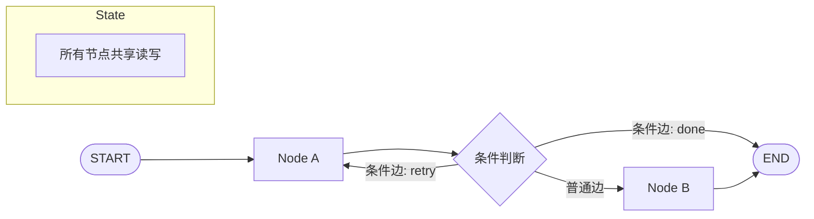

# LangGraph

## 基础概念

LangGraph 是 LangChain 团队开发的**图编排框架（Graph Orchestration Framework）**，用有向图的方式组织 Agent 的执行流程。简单说：你把要做的事拆成若干步骤，每个步骤是一个节点（Node），步骤之间的跳转关系是边（Edge），所有节点共享一份全局状态（State）。

与写一个长函数从头跑到尾不同，LangGraph 的价值在于：流程可以**分支**（根据条件走不同路）、**循环**（失败了回头重试）、**中断恢复**（跑到一半存档，下次接着来）。这些能力在构建需要多轮推理、人工审核、自动重试的 Agent 应用时非常关键。

### 核心要素

| 要素 | 作用 |
|------|------|
| **State（状态）** | 所有节点共同读写的共享数据结构，是节点间传递信息的唯一通道 |
| **Node（节点）** | 执行具体逻辑的 Python 函数，读取 State、返回需要更新的字段 |
| **Edge（边）** | 定义节点间的跳转路径，分为固定跳转和按条件分支两种 |

### State（状态）

State 是整个图的共享数据结构，通常用 Python 的 `TypedDict`（类型化字典）定义。每个节点执行后返回一个 `dict`，框架会自动把返回值合并回 State，后续节点就能读到更新后的数据。

```python
from typing import TypedDict

class MyState(TypedDict):
    question: str   # 用户问题
    answer: str     # 生成的回答
    retries: int    # 已重试次数
```

State 相当于一块共享白板：节点 A 写上去，节点 B 能看到。

### Node（节点）

节点是执行实际工作的 Python 函数。函数签名固定：接收当前 State，返回需要更新的字段（不用返回整个 State）。

```python
def generate(state: MyState) -> dict:
    # 读取用户问题，生成回答
    return {"answer": f"关于 {state['question']} 的回答"}

def check(state: MyState) -> dict:
    # 累加重试次数
    return {"retries": state["retries"] + 1}
```

### Edge（边）

边定义节点间的跳转方式：

- **普通边**：固定跳转，A 完了一定去 B
- **条件边（Conditional Edge）**：根据 State 的当前值动态决定下一步去哪

```python
# 条件函数：返回字符串键名，映射到对应节点
def should_retry(state: MyState) -> str:
    if state["retries"] < 3 and state["answer"] == "":
        return "retry"   # 重试
    return "done"        # 结束
```

### 核心要素关系图



三者的关系：State 决定「存什么数据」，Node 决定「做什么处理」，Edge 决定「接下来去哪」。

## 基础用法

安装：

```bash
pip install -U langgraph
```

最小可运行示例（基于 langgraph==1.1.3 验证，截至 2026-03）：

```python
from typing import TypedDict
from langgraph.graph import StateGraph, START, END

# 1. 定义共享状态
class MyState(TypedDict):
    text: str

# 2. 定义节点函数
def step_a(state: MyState) -> dict:
    return {"text": state["text"] + " -> 经过节点A"}

def step_b(state: MyState) -> dict:
    return {"text": state["text"] + " -> 经过节点B"}

# 3. 构建图：添加节点和边
builder = StateGraph(MyState)
builder.add_node("a", step_a)
builder.add_node("b", step_b)
builder.add_edge(START, "a")
builder.add_edge("a", "b")
builder.add_edge("b", END)

# 4. 编译并运行
graph = builder.compile()
result = graph.invoke({"text": "开始"})
print(result["text"])
```

预期输出：

```text
开始 -> 经过节点A -> 经过节点B
```

带条件边的示例（循环重试）：

```python
from typing import TypedDict
from langgraph.graph import StateGraph, START, END

class RetryState(TypedDict):
    value: int
    count: int

def increment(state: RetryState) -> dict:
    return {"value": state["value"] + 1, "count": state["count"] + 1}

# 条件函数：count < 3 继续循环，否则结束
def check(state: RetryState) -> str:
    return "loop" if state["count"] < 3 else "done"

builder = StateGraph(RetryState)
builder.add_node("inc", increment)
builder.add_edge(START, "inc")
builder.add_conditional_edges("inc", check, {"loop": "inc", "done": END})

graph = builder.compile()
result = graph.invoke({"value": 0, "count": 0})
print(result)  # {'value': 3, 'count': 3}
```

## 同类工具对比

| 维度 | LangGraph | LangChain (LCEL) | AutoGen |
|------|-----------|------------------|---------|
| 核心定位 | 图编排，状态机式流程控制 | LLM 应用组件库，链式调用 | 多 Agent 对话协作框架 |
| 编程范式 | 有向图 + 共享状态 | 管道式链 (Pipe) | 消息驱动的多角色对话 |
| 循环/分支 | 原生条件边，一行代码搞定 | 需要自己在外部写循环逻辑 | 以对话轮次驱动，非显式图结构 |
| 中断恢复 | 内置 Checkpoint 检查点机制 | 无内置支持 | 无内置支持 |
| 适合场景 | 多步骤工作流、需要精确控制执行路径 | 快速搭建原型、简单 LLM 调用链 | 多 Agent 角色分工讨论 |

核心区别：

- **LangGraph**：解决「流程怎么走」的问题——步骤之间的顺序、分支、循环、中断
- **LangChain (LCEL)**：解决「组件怎么接」的问题——LLM、工具、Prompt 的组装
- **AutoGen**：解决「Agent 怎么聊」的问题——多个 Agent 角色之间的对话协作

LangGraph 和 LangChain 通常配合使用：在 LangGraph 的节点里调用 LangChain 的组件。

## 常见误区

| 误区 | 准确理解 |
|------|----------|
| LangGraph 是 LangChain 的替代品 | 两者互补。LangChain 提供 LLM 调用、工具等组件，LangGraph 负责把这些组件按流程编排起来 |
| 所有 Agent 任务都应该用 LangGraph | 单步骤、无分支的简单任务直接写函数更清晰。LangGraph 的价值在流程复杂时才体现 |
| 节点越大越省事，逻辑都塞一个节点里 | 节点应保持单一职责。拆细后便于单独测试、复用和调试，流程结构也更清晰 |

## 优劣势分析

| 优势 | 劣势 |
|------|------|
| 流程结构显式定义，执行路径清晰可追踪 | 简单任务引入额外的结构开销，杀鸡用牛刀 |
| 原生支持分支、循环、重试，无需手写控制逻辑 | 入门需理解状态机、有向图等概念，有一定学习门槛 |
| Checkpoint 机制支持中断恢复，适合长时间运行任务 | 节点拆分过细时，图的连线本身也会变复杂 |
| 与 LangChain / LangSmith 生态无缝集成 | Python >= 3.10，对低版本 Python 不友好 |

## 思考题

<details>
<summary>初级：State、Node、Edge 三者分别负责什么？为什么缺一不可？</summary>

**参考答案：**

- State：保存共享数据，是节点间传递信息的唯一通道。没有 State，节点之间无法通信。
- Node：执行具体逻辑，读取并更新 State。没有 Node，图中没有任何实际计算。
- Edge：定义跳转路径，决定下一步去哪。没有 Edge，节点之间没有连接，图无法运行。

三者缺一不可：State 是数据载体，Node 是处理单元，Edge 是执行路径。

</details>

<details>
<summary>中级：如何用条件边实现「失败重试，最多 3 次」的逻辑？</summary>

**参考答案：**

1. 在 State 中加一个 `retry_count: int` 字段
2. 执行节点每次运行后将 `retry_count` 加 1
3. 用条件边的路由函数判断：失败且 `retry_count < 3` 时返回 `"retry"` 映射回执行节点；成功或超次数时返回 `"done"` 映射到 END

核心思路：循环控制不在节点内部实现，而是通过条件边 + State 字段在图层面控制。

</details>

<details>
<summary>中级：LangGraph 的 Checkpoint 机制解决什么问题？什么场景下需要用？</summary>

**参考答案：**

Checkpoint（检查点）在每个节点执行后自动保存当前 State 的快照。解决的核心问题是：长时间运行的工作流如果中途失败或需要人工介入，可以从上次保存的位置恢复，不用从头跑。

典型场景：需要人工审核后才能继续的流程、运行时间较长容易超时的任务、需要跨会话保持状态的对话系统。

</details>

## 参考资料

1. 官方文档：https://langchain-ai.github.io/langgraph/
2. GitHub 仓库：https://github.com/langchain-ai/langgraph（27.4k stars，MIT 许可证）
3. PyPI 包页面：https://pypi.org/project/langgraph/
4. LangChain 官网：https://www.langchain.com/
