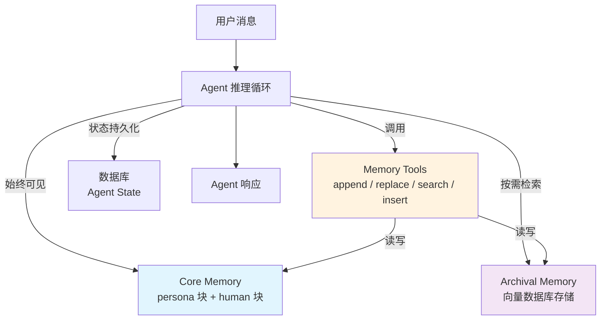

# Letta（有状态Agent框架）

## 基础概念

Letta 是由 MemGPT 论文团队开发的**有状态 Agent 框架（Stateful Agent Framework）**，核心思路是把 LLM 当作操作系统来用——Agent 自己管理多层记忆，能主动读写、编辑自己的上下文，从而实现跨会话的长期学习和自我改进。

打个比方：普通 Agent 像金鱼，聊完就忘；Letta Agent 像一个带笔记本的助手，会主动把重要事情记下来、翻旧笔记、甚至划掉过时信息。这使得 Letta 特别适合需要长期交互、用户个性化、知识积累的场景。

### 核心要素

| 要素 | 作用 |
|------|------|
| **Core Memory（核心记忆）** | 始终在 Agent 上下文窗口内的可编辑记忆块，存放最关键的信息（角色设定、用户画像） |
| **Archival Memory（档案记忆）** | 持久化的长期知识库，通过向量检索按需加载，突破 Token 窗口限制 |
| **Memory Tools（记忆工具）** | Agent 主动调用的内存读写接口，实现自编辑记忆的核心机制 |
| **Agent State Persistence（状态持久化）** | Agent 的所有状态存储在数据库中，关掉程序再开，Agent 还是"同一个人" |

### Core Memory（核心记忆）

Core Memory 是嵌入在系统提示词中的记忆块，始终保持在 LLM 上下文窗口内。与传统的固定 System Prompt 不同，Core Memory **可以被 Agent 自己修改**。

Letta 中的 Core Memory 由多个 Block（块）组成，每个块有一个标签（label）和内容（value）。最常见的两个块：

- **persona**：Agent 自己是谁、行为风格、能力范围
- **human**：对当前用户的了解——名字、职业、偏好、历史交互摘要

Agent 在对话过程中如果发现新信息（比如用户说"我最近换了工作"），会主动调用记忆工具更新 human 块的内容。

### Archival Memory（档案记忆）

Archival Memory 是持久化的大容量存储，用于存放超出 Token 窗口的长期信息。当 Agent 需要回忆某件旧事时，通过向量相似度检索从 Archival Memory 中找到相关内容，动态加载到上下文中。

这解决了一个核心矛盾：LLM 的上下文窗口有限，但 Agent 需要记住的东西可以无限增长。Core Memory 就像工作台上摊开的笔记（随时可看但空间有限），Archival Memory 就像档案柜（容量大但需要翻找）。

### Memory Tools（记忆工具）

Memory Tools 是 Letta 的核心创新。Agent 不是被动接收记忆指令，而是通过 Tool Calling（工具调用）**主动管理自己的记忆**。主要工具包括：

- `core_memory_append`：向核心记忆块追加信息
- `core_memory_replace`：替换核心记忆块中的旧内容
- `archival_memory_insert`：向档案记忆写入新条目
- `archival_memory_search`：从档案记忆中检索相关信息

Agent 在每次推理时自行决定是否需要调用这些工具——比如用户提到了新偏好，Agent 会判断"这条信息值得记住"，然后调用 `core_memory_replace` 更新记忆。

### 核心要素关系图



Agent 推理循环的每一轮：读取 Core Memory → 结合用户消息推理 → 决定是否调用 Memory Tools 更新记忆 → 生成响应。所有状态持久化到数据库，下次启动时恢复。

## 基础用法

安装依赖：

```bash
pip install letta-client
```

Letta 采用客户端-服务器架构。Agent 运行在 Letta Server 上（云端或自部署），客户端通过 API 与之交互。使用云端服务需要获取 API Key：https://app.letta.com/api-keys

若需本地部署 Letta Server：

```bash
pip install letta
letta server
```

最小可运行示例（基于 letta-client 验证，截至 2026-03）：

```python
import os
from letta_client import Letta

# 连接 Letta 服务
# 云端用法：client = Letta(api_key=os.getenv("LETTA_API_KEY"))
# 本地用法（需先启动 letta server）：
client = Letta(base_url="http://localhost:8283")

# 1. 创建一个有记忆的 Agent
agent = client.agents.create(
    model="openai/gpt-4o",
    memory_blocks=[
        {
            "label": "persona",
            "value": "你是一个友善的 Python 编程助手，回答简洁实用。"
        },
        {
            "label": "human",
            "value": "用户是一名刚入门的 Python 开发者，对 Agent 开发感兴趣。"
        }
    ]
)
print(f"Agent 创建成功，ID: {agent.id}")

# 2. 发送消息（Agent 会基于记忆回复）
response = client.agents.messages.create(
    agent_id=agent.id,
    input="你好，你知道我是做什么的吗？"
)

# 3. 打印响应
for message in response.messages:
    print(message)
```

预期输出：

```text
Agent 创建成功，ID: agent-xxxx-xxxx
reasoning_message: 用户在问我是否了解他们的背景，我的 human 记忆块里记录了相关信息...
assistant_message: 你好！根据我的了解，你是一名刚入门的 Python 开发者，对 Agent 开发很感兴趣。有什么我能帮到你的？
```

响应中包含两类消息：`reasoning_message` 是 Agent 的内部推理过程（类似思维链），`assistant_message` 是面向用户的回复。

## 同类工具对比

| 维度 | Letta | LangGraph | AutoGen |
|------|-------|-----------|---------|
| 核心定位 | 有状态 Agent，自编辑记忆 | 图编排引擎，状态机式流程控制 | 多 Agent 对话协作框架 |
| 记忆管理 | 原生多层记忆 + 自编辑工具，框架核心能力 | 状态对象管理，需手动设计记忆逻辑 | 无内置持久记忆，依赖对话历史 |
| 架构模式 | 客户端-服务器（Agent 作为服务运行） | 库（嵌入到应用代码中） | 库（嵌入到应用代码中） |
| 最擅长 | 长期交互、用户个性化、知识积累型 Agent | 多步骤工作流、分支/循环/重试 | 多角色讨论、群体决策 |
| 适合人群 | 需要 Agent "记住用户"的产品开发者 | 需要精确控制执行路径的工程师 | 研究多 Agent 协作的探索者 |

核心区别：

- **Letta**：解决「Agent 怎么记」的问题——让 Agent 拥有跨会话的长期记忆和自我学习能力
- **LangGraph**：解决「流程怎么走」的问题——步骤之间的顺序、分支、循环控制
- **AutoGen**：解决「Agent 怎么聊」的问题——多个 Agent 角色之间的对话协作

## 常见误区

| 误区 | 准确理解 |
|------|----------|
| Letta 就是 MemGPT 论文的代码实现 | Letta 基于 MemGPT 论文思想，但已发展为完整的生产级框架，包含 REST API、客户端 SDK、Agent 持久化等远超论文范畴的能力 |
| Agent 的记忆越多越好 | 冗余和低价值记忆会增加干扰、降低检索精度、浪费 Token。应该只存储高价值、高频访问的信息 |
| Letta 是一个 Python 库，import 进来就能用 | Letta 采用客户端-服务器架构，Agent 运行在 Server 端（云端或本地部署），客户端通过 SDK/API 远程调用 |

## 优劣势分析

| 优势 | 劣势 |
|------|------|
| 原生多层记忆系统 + 自编辑工具，开箱即用 | 需要运行 Server 端，部署成本高于纯库类框架 |
| Agent 状态持久化，天然支持跨会话和长期交互 | 生态和社区规模小于 LangChain 系 |
| 模型无关，支持 OpenAI、Anthropic、Ollama 等多种后端 | 概念较新（自编辑记忆、记忆工具），学习曲线比普通 Agent 框架陡 |
| Python 和 TypeScript 双 SDK，REST API 完备 | 对简单的一次性对话场景属于过度设计 |

## 思考题

<details>
<summary>初级：Core Memory 和 Archival Memory 的区别是什么？为什么需要分两层？</summary>

**参考答案：**

Core Memory 始终在 Agent 的上下文窗口内，Agent 每次推理都能直接看到，适合存放最关键的信息（角色设定、用户核心画像），但受 Token 限制容量有限。Archival Memory 是持久化的大容量存储，通过向量检索按需加载，适合存放大量历史信息。

分两层的原因：LLM 上下文窗口有限但需要记忆的信息可以无限增长。Core Memory 保证关键信息随时可用（快但小），Archival Memory 保证长期信息不丢失（大但需检索）。类似 CPU 缓存和硬盘的关系。

</details>

<details>
<summary>中级：Letta 的自编辑记忆和传统 RAG 的记忆管理有什么本质区别？</summary>

**参考答案：**

传统 RAG 是被动检索：外部系统决定检索什么、何时检索，LLM 本身不参与记忆管理决策。Letta 的自编辑记忆是主动管理：Agent 自己决定何时读取、写入、更新记忆，通过 Tool Calling 机制实现。

关键区别在于"谁做决策"：RAG 中记忆管理逻辑在应用代码里，开发者写死检索策略；Letta 中记忆管理逻辑在 Agent 推理过程中，Agent 根据对话内容自主判断。这使得 Letta Agent 能够适应性地学习——遇到新信息自动记录，发现旧信息过时自动更新。

</details>

<details>
<summary>中级：Letta 的客户端-服务器架构和 LangChain 等库式架构各自适合什么场景？</summary>

**参考答案：**

Letta 的服务器架构意味着 Agent 独立于应用运行，即使客户端断开，Agent 状态依然存在。适合需要长期存活的 Agent（如个人助手、客服机器人），多个客户端共享同一个 Agent（Web + 移动端），以及需要集中管理大量 Agent 实例的生产环境。

库式架构（LangChain、LangGraph）中 Agent 生命周期与应用进程绑定，适合请求-响应式任务（如一次性问答、批处理），嵌入到已有应用中使用，以及不需要 Agent 长期存活的场景。

简单说：Agent 需要"长期活着"选 Letta，Agent 用完即弃选库式框架。

</details>

## 参考资料

1. 官方文档：[Letta Docs](https://docs.letta.com/)
2. GitHub 仓库：[letta-ai/letta](https://github.com/letta-ai/letta)
3. Python SDK：[letta-ai/letta-python](https://github.com/letta-ai/letta-python)
4. MemGPT 原始论文：[arXiv:2310.08560 - MemGPT: Towards LLMs as Operating Systems](https://arxiv.org/abs/2310.08560)
5. Letta 官方博客：[letta.com/blog](https://www.letta.com/blog)
6. PyPI 包页面：[letta-client](https://pypi.org/project/letta-client/)
