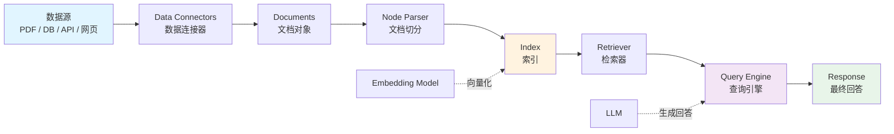

# LlamaIndex（数据框架）

## 基础概念

LlamaIndex（原名 GPT Index）是一个专为大语言模型（LLM）设计的**数据框架（Data Framework）**。它解决的核心问题是：LLM 自身只知道训练数据里的内容，对你的私有数据一无所知——LlamaIndex 就是那座桥，把你的 PDF、数据库、网页等各类数据接入 LLM，让模型能"查阅"你的资料再回答问题。

与 LangChain 侧重"如何编排 Agent 工作流"不同，LlamaIndex 侧重"如何让 LLM 高效地使用你的数据"。它在数据加载、文档切分、索引构建、检索策略这条链路上做了大量优化，是构建 RAG（Retrieval-Augmented Generation，检索增强生成）应用时的首选工具。

### 核心要素

| 要素 | 作用 |
|------|------|
| **Data Connectors（数据连接器）** | 从 PDF、Word、数据库、API、网页等 160+ 数据源加载数据，统一转换为 Document 对象 |
| **Index（索引）** | 对文档进行结构化处理，构建向量索引、关键词索引等，决定后续的检索策略 |
| **Retriever（检索器）** | 根据用户查询，从索引中高效定位最相关的文档片段 |
| **Query Engine（查询引擎）** | 整合检索结果 + LLM，理解用户问题并生成最终回答 |

### Data Connectors（数据连接器）

数据连接器负责"吃进"各种格式的数据，输出标准化的 Document 对象。每个 Document 包含文本内容和元数据（如来源文件名、页码等）。LlamaIndex 通过 LlamaHub 提供了 160+ 种现成的连接器，覆盖 PDF、Notion、Slack、SQL 数据库等主流数据源。

最常用的是 `SimpleDirectoryReader`——指定一个本地目录，它会自动识别目录下的 .txt、.pdf、.docx 等文件并加载。

### Index（索引）

索引是 LlamaIndex 的核心抽象。加载的文档会先被切分成小块（Node），然后按不同策略组织成索引结构：

- **VectorStoreIndex**（向量索引）：最常用，将每个 Node 转为向量嵌入，查询时按语义相似度检索
- **SummaryIndex**（摘要索引）：遍历所有 Node 生成概要，适合需要全局视角的查询
- **KeywordTableIndex**（关键词索引）：基于关键词匹配检索，适合精确查找

不同索引类型适合不同查询场景，也可以组合使用。

### Retriever（检索器）

检索器从索引中取出与用户问题最相关的 Node。可以调整 `similarity_top_k` 参数控制返回数量，也可以用 QueryFusionRetriever 同时调用多种检索器并融合结果（混合检索）。

### Query Engine（查询引擎）

查询引擎是用户交互的入口。它的工作流程：接收用户问题 -> 调用检索器获取相关片段 -> 将问题和片段一起发送给 LLM -> 返回最终回答。一行代码 `index.as_query_engine()` 即可创建。

### 核心要素关系图



数据从左到右流动：连接器加载数据 -> 切分成 Node -> 构建索引 -> 检索相关片段 -> LLM 生成回答。Embedding Model 负责将文本转为向量，LLM 负责最终的回答生成。

## 基础用法

安装：

```bash
# 安装核心包（包含 llama-index-core 及一组默认集成）
pip install llama-index
```

如需调用 OpenAI 模型，再额外安装对应集成并设置 API Key：

```bash
pip install llama-index-llms-openai llama-index-embeddings-openai
export OPENAI_API_KEY="sk-your-api-key"
```

最小可运行示例（基于 llama-index==0.14.x 官方 API 写法验证，截至 2026-03）：

```python
"""
最小 RAG 问答：手动创建文档 -> 构建向量索引 -> 查询
使用 MockLLM + MockEmbedding，避免依赖 OpenAI API Key
"""
from llama_index.core import Document, MockEmbedding, Settings, VectorStoreIndex
from llama_index.core.llms import MockLLM

# 1. 配置无需联网的 Mock 模型
Settings.llm = MockLLM(max_tokens=128)
Settings.embed_model = MockEmbedding(embed_dim=1536)

# 2. 准备文档（实际项目中可改为用 SimpleDirectoryReader 加载本地文件）
documents = [
    Document(text="公司年假政策：入职满一年享有5天带薪年假，满三年增至10天，满五年增至15天。"),
    Document(text="报销流程：因公费用需在30天内提交申请，单笔超5000元需经理审批。"),
    Document(text="考勤制度：标准工作时间为9:00-18:00，迟到超过30分钟按半天事假处理。"),
]

# 3. 构建向量索引
index = VectorStoreIndex.from_documents(documents)

# 4. 创建查询引擎并提问
query_engine = index.as_query_engine(similarity_top_k=3)
response = query_engine.query("年假最多能有多少天？")
print(response)
```

预期输出：

```text
会输出一段基于已索引文档生成的回答；在这个示例里，答案会围绕“入职满五年后最多 15 天带薪年假”展开。
```

如需改用 OpenAI 作为 LLM 与 Embedding，可在设置好 `OPENAI_API_KEY` 后使用默认配置，或显式设置 `Settings.llm` / `Settings.embed_model`。
从本地目录加载文档的写法：

```python
from pathlib import Path

from llama_index.core import SimpleDirectoryReader, VectorStoreIndex

# 先确保目录存在，并且里面至少有一个可读取文件（如 .txt / .md / .pdf）
data_dir = Path("./data")
if data_dir.exists():
    documents = SimpleDirectoryReader(input_dir=str(data_dir)).load_data()
    index = VectorStoreIndex.from_documents(documents)
    query_engine = index.as_query_engine()
    response = query_engine.query("你的问题")
    print(response)
else:
    print("请先创建 ./data 目录，并放入待索引文档后再运行示例。")
```

## 同类工具对比

| 维度 | LlamaIndex | LangChain | Haystack |
|------|-----------|----------|----------|
| 核心定位 | 数据连接与索引，专注 RAG 链路 | 全栈 Agent 编排框架 | 企业级搜索与 RAG 系统 |
| 最擅长 | 多数据源接入、索引策略丰富、检索优化 | Agent 工作流编排、工具链串联 | 生产级文档检索、Pipeline 管理 |
| 索引类型 | 向量、摘要、关键词、知识图谱等多种 | 主要依赖向量存储 | Pipeline 组件式，可自定义 |
| 学习曲线 | 中等，API 直观，从 3 行代码起步 | 较陡，概念多且迭代快 | 中等，Pipeline 模式清晰 |
| 适合人群 | 需要快速构建知识问答 / RAG 应用的开发者 | 需要构建复杂 Agent 多步骤工作流的开发者 | 需要企业级可靠性和商业支持的团队 |

核心区别：

- **LlamaIndex**：解决"数据怎么给 LLM 用"的问题——数据加载、切分、索引、检索全链路优化
- **LangChain**：解决"LLM 应用怎么编排"的问题——Agent 流程、工具调用、Prompt 管理
- **Haystack**：解决"企业级检索怎么搭"的问题——生产部署、性能调优、商业支持

LlamaIndex 和 LangChain 经常配合使用：在 LangChain 的 Agent 节点里调用 LlamaIndex 的检索能力。

## 常见误区

| 误区 | 准确理解 |
|------|----------|
| LlamaIndex 就是 RAG | LlamaIndex 是实现 RAG 的工具之一。RAG 是一种技术方案，还涉及 LLM 选型、Prompt 设计、评估调优等多个环节 |
| 向量索引是唯一选择 | 向量索引擅长语义匹配，但关键词索引在精确查找时更有效。实际项目中混合检索（向量 + 关键词）往往效果最好 |
| 索引越大越好 | 索引要和 LLM 的 token 预算匹配。在有限的上下文窗口下，精准的小索引比塞满无关内容的大索引更高效 |
| 默认切分策略够用 | 默认的 chunk_size=1024 不一定适合你的数据。文档结构不同（代码 vs 法律文书 vs 对话记录），最优的切分大小和重叠量也不同 |

## 优劣势分析

| 优势 | 劣势 |
|------|------|
| 160+ 数据连接器，几乎覆盖所有主流数据源 | 默认依赖 OpenAI API，离线场景需额外配置本地模型 |
| 多种索引类型可选，灵活适配不同检索需求 | 包拆分为 llama-index-core + 大量子包，依赖管理有一定复杂度 |
| 从 3 行代码到生产部署都有覆盖，学习曲线平滑 | Agent 编排能力不如 LangChain / LangGraph 成熟 |
| LlamaCloud 提供托管索引服务，降低运维负担 | 版本迭代快（v0.9 -> v0.10 -> v0.11 -> v0.12），API 变更较频繁 |

## 思考题

<details>
<summary>初级：LlamaIndex 的四个核心要素（Data Connectors、Index、Retriever、Query Engine）分别负责什么？</summary>

**参考答案：**

- Data Connectors：从各种数据源加载数据，统一转为 Document 对象
- Index：将文档切分成 Node 并按策略组织（向量、关键词等），是检索的基础结构
- Retriever：根据用户查询从索引中取出最相关的文档片段
- Query Engine：将检索结果和用户问题交给 LLM，生成最终回答

四者构成一条完整的数据流水线：加载 -> 索引 -> 检索 -> 回答。

</details>

<details>
<summary>中级：什么场景下应该用混合检索（向量 + 关键词）而非单一向量检索？</summary>

**参考答案：**

单一向量检索擅长语义匹配（"公司放假规定"能匹配到"年假政策"），但对精确关键词（如产品编号 "SKU-12345"、法条编号 "第三十七条"）的匹配能力较弱。

适合混合检索的场景：
1. 文档包含大量专有名词、编号、代码标识符等需要精确匹配的内容
2. 用户查询既有自然语言描述，也有具体关键词
3. 对召回率要求高，不能遗漏关键文档

实现方式：用 QueryFusionRetriever 同时调用 VectorIndexRetriever 和 KeywordTableSimpleRetriever，自动融合两者的结果。

</details>

<details>
<summary>中级：LlamaIndex 的 chunk_size 和 chunk_overlap 如何影响检索质量？如何选择合适的值？</summary>

**参考答案：**

- chunk_size 过小（< 128 tokens）：每个片段信息不完整，LLM 拿到的上下文碎片化，回答质量下降
- chunk_size 过大（> 1024 tokens）：片段中混入无关内容，检索精度降低；同时消耗更多 token 预算
- chunk_overlap 的作用：相邻片段重叠一部分文本，避免关键信息恰好被切断在边界上

选择建议：
1. 通用场景：chunk_size=512，chunk_overlap=50 是较好的起点
2. 结构化文档（法律、合同）：按段落或条款自然分割，chunk_size 可以更大
3. 代码文档：按函数 / 类为单位分割，避免把一个函数切成两半
4. 最终应通过检索评估（对比不同参数下的召回率和准确率）来确定最优值

</details>

## 参考资料

1. 官方文档：https://docs.llamaindex.ai/
2. GitHub 仓库：https://github.com/run-llama/llama_index
3. PyPI 包页面：https://pypi.org/project/llama-index-core/
4. LlamaHub（数据连接器市场）：https://llamahub.ai/
5. LlamaCloud（托管服务）：https://cloud.llamaindex.ai/
