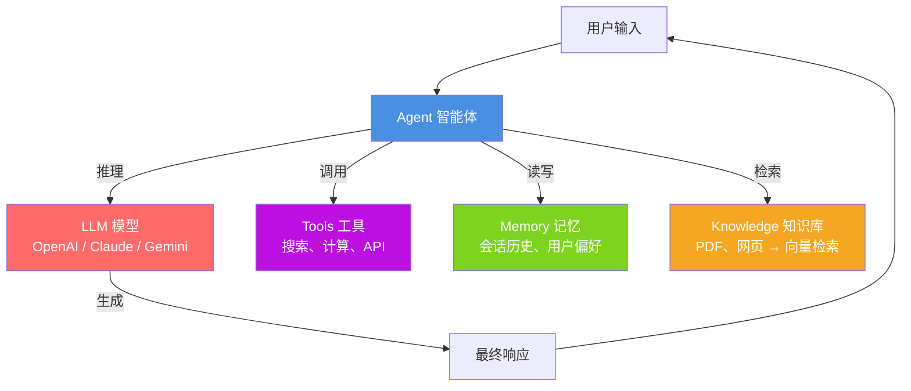

# Phidata / Agno（Agent 构建框架）

## 基础概念

Phidata 是一个用纯 Python 构建 AI Agent 的开源框架，2025 年初正式更名为 **Agno**。它的核心理念是"开箱即用"——不搞复杂的链、图、管道概念，直接用普通 Python 代码定义 Agent，几行代码就能跑起来。

与 LangChain 那种"先学一堆抽象概念再写代码"的风格不同，Agno 的目标是：**你会写 Python 函数，就会用 Agno 构建 Agent**。它支持文本、图片、音频、视频等多种模态，兼容 OpenAI、Claude、Gemini 等主流模型，自带记忆（Memory）、知识库（Knowledge）、工具（Tools）等生产级组件。

### 核心要素

| 要素 | 作用 |
|------|------|
| **Agent（智能体）** | 核心容器，聚合模型、工具、记忆、知识库四项能力，驱动推理和执行 |
| **Tools（工具）** | 让 Agent 能调用外部函数或 API，执行实际动作（搜索、计算、查数据库等） |
| **Memory（记忆）** | 跨会话存储用户偏好和对话历史，让 Agent 记住上下文 |
| **Knowledge（知识库）** | 接入向量数据库实现 RAG 检索，让 Agent 拥有领域知识 |

### Agent（智能体）

Agent 是 Agno 的核心对象。创建一个 Agent 时，你要告诉它三件事：用什么模型思考、有哪些工具可用、遵循什么指令。Agent 收到用户消息后，会自动决定是直接回复、调用工具还是检索知识库。

```python
from agno.agent import Agent
from agno.models.openai import OpenAIChat

# 最简单的 Agent：指定模型 + 指令
agent = Agent(
    model=OpenAIChat(id="gpt-4o-mini"),
    instructions=["用中文回答，简洁明了"],
)
agent.print_response("什么是 Agent？")
```

### Tools（工具）

工具让 Agent 不只会说话，还能做事。Agno 内置 100+ 工具包（搜索、金融数据、文件操作等），也支持把任意 Python 函数注册为工具。Agent 会根据用户请求自动判断需不需要调用工具。

```python
from agno.agent import Agent
from agno.models.openai import OpenAIChat
from agno.tools.duckduckgo import DuckDuckGoTools

# 给 Agent 装上搜索工具
agent = Agent(
    model=OpenAIChat(id="gpt-4o-mini"),
    tools=[DuckDuckGoTools()],
)
agent.print_response("今天有什么 AI 新闻？")
```

### Memory（记忆）

Memory 让 Agent 在多次对话之间记住用户信息。Agno 支持两种级别：

- **会话记忆（Session Memory）**：单次会话内的上下文，进程退出就丢失
- **持久化记忆（Persistent Memory）**：存到数据库，跨会话保持，能记住用户名字、偏好等

### Knowledge（知识库）

Knowledge 实现 RAG（检索增强生成）能力。你把文档（PDF、网页、文本）喂进去，Agno 自动分块、生成向量、存入向量数据库。Agent 回答问题时会先从知识库检索相关内容作为上下文。

### 核心要素关系图



## 基础用法

安装依赖：

```bash
# 安装 Agno（原 Phidata 已更名）
pip install agno

# 安装 DuckDuckGo 搜索依赖（可选）
pip install ddgs
```

需要配置 LLM 提供商的 API Key：

- OpenAI：https://platform.openai.com/api-keys 获取，设置环境变量 `OPENAI_API_KEY`
- Anthropic：https://console.anthropic.com/ 获取，设置环境变量 `ANTHROPIC_API_KEY`

最小可运行示例（基于 agno==1.4.6 验证，截至 2026-03）：

```python
import os
# 确保设置了 API Key
# os.environ["OPENAI_API_KEY"] = "sk-xxx"

from agno.agent import Agent
from agno.models.openai import OpenAIChat
from agno.tools.duckduckgo import DuckDuckGoTools

# 创建一个能搜索的 Agent
agent = Agent(
    model=OpenAIChat(id="gpt-4o-mini"),
    tools=[DuckDuckGoTools()],
    instructions=["用中文回答", "回答要简洁"],
    markdown=True,
)

# 单轮对话
agent.print_response("Agno 框架是什么？", stream=True)
```

预期输出：

```text
┌──────────────────────────────────────────────┐
│ Tool Call: duckduckgo_search(query="Agno框架")│
└──────────────────────────────────────────────┘

Agno（原名 Phidata）是一个开源的 Python Agent 框架，
用于构建多模态 AI 智能体。它支持记忆、知识库、工具调用，
兼容 OpenAI、Claude 等多种模型……
```

自定义工具示例——把任意 Python 函数变成 Agent 可调用的工具：

```python
from agno.agent import Agent
from agno.models.openai import OpenAIChat

# 自定义一个计算工具
def add(a: int, b: int) -> str:
    """两个整数相加"""
    return str(a + b)

agent = Agent(
    model=OpenAIChat(id="gpt-4o-mini"),
    tools=[add],
)

agent.print_response("请计算 128 + 256")
# Agent 会自动调用 add(128, 256)，返回 "384"
```

## 同类工具对比

| 维度 | Agno（Phidata） | LangChain | CrewAI |
|------|-----------------|-----------|--------|
| 核心定位 | 纯 Python 构建生产级 Agent | LLM 应用通用组件库 | 多 Agent 角色协作框架 |
| 编程范式 | 普通 Python 函数 + Agent 对象 | 链式调用 + 大量抽象概念 | 角色定义 + 任务分配 |
| 学习曲线 | 低——会 Python 就能上手 | 高——Chain、Retriever 等概念多 | 中——需理解角色和任务分工 |
| 多模态支持 | 原生支持文本、图片、音频、视频 | 需额外集成 | 有限 |
| 性能 | Agent 实例化 < 5μs，内存占用极低 | 实例化较慢，内存占用较高 | 中等 |
| 适合场景 | 快速构建单 Agent 或小团队 Agent 应用 | 需要高度自定义的复杂工作流 | 多角色分工合作任务 |

核心区别：

- **Agno**：追求极简和性能，几行代码搞定一个生产级 Agent，不引入额外抽象
- **LangChain**：组件丰富但学习成本高，适合需要精细控制每个环节的复杂场景
- **CrewAI**：专注多 Agent 协作，适合需要多个角色分工配合的业务流程

## 常见误区

| 误区 | 准确理解 |
|------|----------|
| Phidata 和 Agno 是两个不同的框架 | 同一个项目，2025 年初 Phidata 正式更名为 Agno，`pip install agno` 就是新版，旧的 `phidata` 包仍可安装但不再更新 |
| Agno 只适合做 Demo，不能用于生产 | Agno 的设计目标就是生产就绪，内置会话隔离、持久化存储、监控追踪等生产特性 |
| 工具越多 Agent 越强 | 工具太多会增加 LLM 的决策复杂度，导致选错工具或幻觉。只给 Agent 真正需要的工具 |

## 优劣势分析

| 优势 | 劣势 |
|------|------|
| 极简 API，几行代码构建 Agent，学习成本极低 | 刚从 Phidata 更名，部分文档和社区资源还在过渡期 |
| 性能出色，Agent 实例化微秒级，内存占用极低 | 深度自定义能力不如 LangChain 灵活 |
| 原生多模态支持（文本、图片、音频、视频） | 生态规模和社区活跃度不如 LangChain |
| 内置 100+ 工具包，开箱即用 | Python 3.12+ 才支持，对低版本不友好 |
| 模型无关——OpenAI、Claude、Gemini、Ollama 等均支持 | 监控面板（AgentOS）为商业产品，完整功能需付费 |

## 思考题

<details>
<summary>初级：Agno 的 Agent 对象聚合了哪几项核心能力？各自解决什么问题？</summary>

**参考答案：**

Agent 聚合四项能力：
1. **模型（Model）**：接入 LLM 进行推理和文本生成
2. **工具（Tools）**：调用外部函数/API 执行实际操作
3. **记忆（Memory）**：存储对话历史和用户偏好，保持上下文连贯
4. **知识库（Knowledge）**：通过向量检索提供领域知识（RAG）

四者分别解决了"怎么想""怎么做""怎么记""知道什么"的问题。

</details>

<details>
<summary>中级：Phidata 更名为 Agno 后，import 路径从 `phi.xxx` 变成了 `agno.xxx`。如果你有一个旧项目用的 phidata，迁移到 agno 需要注意什么？</summary>

**参考答案：**

主要注意三点：
1. **包名变更**：`pip install phidata` 改为 `pip install agno`，旧包不再更新
2. **导入路径变更**：所有 `from phi.xxx` 改为 `from agno.xxx`，如 `from phi.agent import Agent` 改为 `from agno.agent import Agent`
3. **API 变更**：部分类名和参数可能有调整（如 Assistant 统一改为 Agent），需对照 Agno 官方迁移文档逐项确认

建议用全局搜索替换 `from phi.` 为 `from agno.`，然后运行测试排查不兼容的地方。

</details>

<details>
<summary>中级：Agno 号称 Agent 实例化比 LangGraph 快 10000 倍，这个性能优势在什么场景下有实际意义？什么场景下不重要？</summary>

**参考答案：**

**有意义的场景**：需要频繁创建和销毁 Agent 实例的情况，比如 API 服务中每个请求创建一个独立 Agent、批量处理任务中动态生成多个 Agent。此时实例化速度直接影响吞吐量和响应延迟。

**不重要的场景**：Agent 是长驻进程（创建一次、持续使用），或者瓶颈在 LLM API 调用延迟上（通常几百毫秒到几秒），此时 Agent 实例化快几微秒几乎没有体感差异。

实际项目中，LLM 推理延迟通常远大于框架开销，但在高并发服务场景下，框架本身的轻量性确实能减少资源占用。

</details>

## 参考资料

1. Agno 官方文档：https://docs.agno.com/
2. Agno GitHub 仓库：https://github.com/agno-agi/agno（38.9k stars，Apache 2.0 许可证）
3. PyPI 包页面：https://pypi.org/project/agno/
4. Agno 官网：https://www.agno.com/
5. 旧版 Phidata 文档（已重定向至 Agno）：https://docs.phidata.com/
