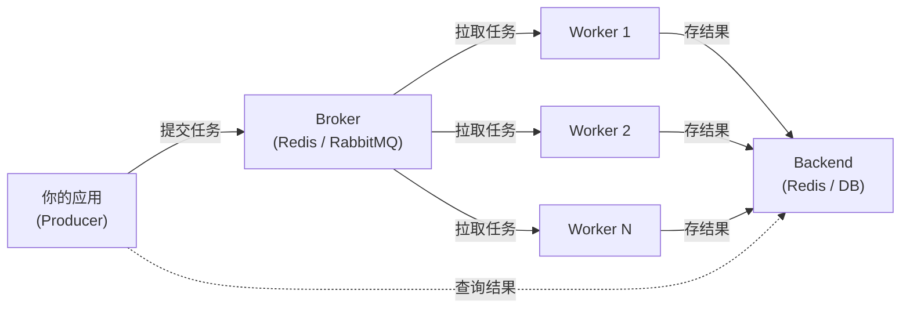

# Celery（分布式任务队列）

## 基础概念

Celery 是 Python 生态中最主流的**分布式任务队列框架（Distributed Task Queue）**。它的核心思路很简单：把耗时的操作（发邮件、处理文件、调用 AI 模型）从主程序中拆出来，扔到后台队列里，由专门的工作进程去执行。主程序提交完任务就可以继续干别的事，不用傻等。

打个比方：你去餐厅点餐，服务员把你的单子夹到厨房窗口（提交任务到队列），厨师看到单子就做菜（Worker 执行任务），做好了放到取餐口（结果存到 Backend），你凭小票去取就行。你不用站在厨房门口干等。

在 AI Agent 场景下，Celery 可以把 LLM 推理、RAG 检索、工具调用等耗时操作异步化，实现多请求并行处理和定时调度。

### 核心要素

| 要素 | 作用 |
|------|------|
| **Broker（消息代理）** | 任务消息的中转站，接收任务并分发给 Worker，常用 Redis 或 RabbitMQ |
| **Worker（工作进程）** | 后台运行的进程，从 Broker 拉取任务并执行，支持多进程/协程并发 |
| **Task（任务函数）** | 被 `@app.task` 装饰的普通 Python 函数，提交后变成可异步执行的任务单元 |
| **Backend（结果后端）** | 存储任务执行结果的地方，不配也能跑，但配了才能查询任务状态和返回值 |

### Broker（消息代理）

Broker 是整个系统的中枢。生产者（你的应用）把任务消息发给 Broker，Worker 从 Broker 拉取任务。

三种主流选择：
- **Redis**：部署最简单，一行 Docker 命令就能跑，适合开发和中小规模生产。缺点是消息持久化能力弱，重启可能丢消息。
- **RabbitMQ**：消息可靠性最高，支持持久化、优先级队列、消息确认。生产环境首选，但部署和运维成本更高。
- **Amazon SQS**：云托管方案，不用自己维护基础设施，按使用量计费。

### Worker（工作进程）

Worker 是真正干活的角色。启动后它会持续监听 Broker，有新任务就取出来执行。一台机器可以启动多个 Worker，多台机器也可以同时跑 Worker，天然支持水平扩展。

Worker 支持三种并发模式：
- **prefork**（默认）：多进程，适合 CPU 密集任务
- **gevent/eventlet**：协程，适合 I/O 密集任务（网络请求、数据库查询）
- **solo**：单进程无并发，用于调试

### Task（任务函数）

任何被 `@app.task` 装饰的函数都变成 Celery 任务。调用方式有两种：

- `task.delay(args)` —— 异步调用，立即返回一个 AsyncResult 对象，任务在后台执行
- `task(args)` —— 同步调用，直接执行并返回结果（不经过队列）

### Backend（结果后端）

Backend 存储任务的执行结果。如果你只是"发射后不管"（fire-and-forget），可以不配 Backend。但如果需要查询任务状态（成功/失败/进行中）或获取返回值，就必须配置。常用 Redis 或数据库作为 Backend。

### 核心要素关系图



数据流向：应用把任务扔给 Broker → Worker 从 Broker 取任务执行 → 结果存到 Backend → 应用按需查询结果。

## 基础用法

安装依赖：

```bash
pip install "celery[redis]==5.5.3"
```

需要一个运行中的 Redis 服务作为 Broker。本地开发可用 Docker 一键启动：

```bash
docker run -d --name redis -p 6379:6379 redis:latest
```

最小可运行示例（基于 celery==5.5.3 验证，截至 2026-03）：

```python
# tasks.py —— 定义任务
from celery import Celery

# 创建 Celery 应用，指定 Broker 和 Backend 都用本地 Redis
app = Celery(
    'myapp',
    broker='redis://localhost:6379/0',
    backend='redis://localhost:6379/1'
)

# 配置：使用 JSON 序列化（比默认的 Pickle 更安全）
app.conf.update(
    task_serializer='json',
    accept_content=['json'],
    result_serializer='json',
    timezone='Asia/Shanghai',
    enable_utc=True,
)

@app.task
def add(x, y):
    """加法任务"""
    return x + y

@app.task
def greet(name):
    """打招呼任务"""
    return f"你好，{name}！欢迎使用 Celery"
```

```python
# main.py —— 调用任务（需先启动 Worker）
# 注：此文件与 tasks.py 在同一目录，需在完整项目中运行
from tasks import add, greet

# 异步调用：立即返回，不阻塞
result = add.delay(10, 20)
print(f"任务 ID: {result.id}")
print(f"是否完成: {result.ready()}")

# 等待结果（最多等 10 秒）
value = result.get(timeout=10)
print(f"计算结果: {value}")

# 再试一个
greeting = greet.delay("小白")
print(greeting.get(timeout=10))
```

运行步骤（需要两个终端窗口）：

```bash
# 终端 1：启动 Worker（会持续运行，等待任务）
celery -A tasks worker --loglevel=info

# 终端 2：运行主程序
python main.py
```

预期输出：

```text
任务 ID: a1b2c3d4-e5f6-7890-abcd-ef1234567890
是否完成: False
计算结果: 30
你好，小白！欢迎使用 Celery
```

## 同类工具对比

| 维度 | Celery | Dramatiq | RQ (Redis Queue) | APScheduler |
|------|--------|----------|-------------------|-------------|
| 核心定位 | 分布式任务队列 + 定时调度 | 轻量级任务队列 | 极简 Redis 任务队列 | 纯定时任务调度器 |
| Broker 支持 | Redis、RabbitMQ、SQS 等 | Redis、RabbitMQ | 仅 Redis | 无（进程内调度） |
| 任务编排 | chain/group/chord 原语 | 支持管道 | 不支持 | 不支持 |
| 定时任务 | 原生支持（Celery Beat） | 需搭配 APScheduler | 需 rq-scheduler | 专门为此设计 |
| 学习曲线 | 较陡（配置项多） | 平缓 | 极简 | 平缓 |
| GitHub Stars | 25k+ | 4k+ | 9k+ | 6k+ |

核心区别：

- **Celery**：功能最全面的分布式任务系统，支持复杂工作流编排，生态成熟，但配置项多、上手成本高
- **Dramatiq**：Celery 的轻量替代品，API 更简洁，默认配置更合理，适合不需要复杂编排的场景
- **RQ**：追求极简，几行代码就能用，但功能有限，只支持 Redis
- **APScheduler**：只做定时调度，不涉及分布式任务队列，适合单机定时任务

## 常见误区

| 误区 | 准确理解 |
|------|----------|
| 不配 Backend 就不能用 Celery | 不配 Backend 也能正常执行任务，只是无法查询任务结果和状态。"发射后不管"的场景完全不需要 Backend |
| 用 Pickle 序列化没问题 | Pickle 反序列化时会执行任意代码，存在严重安全风险。生产环境应使用 JSON 序列化 |
| 任务拆得越细越好 | 任务粒度要适中。太细会导致 Broker 消息量暴增、序列化开销累积；太粗又无法并行。一般以"一个独立的业务操作"为单位 |
| Celery 只能用 Python 调用 | Celery 协议可以被其他语言实现。已有 Node.js（node-celery）、Go（gocelery）、Rust（rusty-celery）等客户端 |

## 优劣势分析

| 优势 | 劣势 |
|------|------|
| Python 生态最成熟的任务队列，Instagram 等大厂验证 | 配置项多达上百个，初学者容易迷失 |
| 支持多种 Broker（Redis/RabbitMQ/SQS），灵活切换 | 依赖外部服务（Redis/RabbitMQ），本地开发需额外搭建 |
| Canvas 原语（chain/group/chord）能表达复杂工作流 | 调试不直观，任务在 Worker 进程执行，断点调试困难 |
| 内置重试、超时、优先级队列等生产级功能 | 5.x 版本要求 Python >= 3.8，5.7 将要求 >= 3.10 |

## 思考题

<details>
<summary>初级：Broker 和 Backend 分别负责什么？不配 Backend 会怎样？</summary>

**参考答案：**

Broker 是任务消息的中转站，负责接收应用提交的任务并分发给 Worker。Backend 是结果存储，负责保存任务执行后的返回值和状态。

不配 Backend 时，任务照常执行，但调用 `result.get()` 会报错，因为没有地方存结果。适合"发射后不管"的场景（如发邮件、写日志），不适合需要获取返回值的场景。

</details>

<details>
<summary>中级：chain、group、chord 三种编排原语分别适合什么场景？</summary>

**参考答案：**

- **chain（链）**：多个任务串行执行，前一个的输出是后一个的输入。适合流水线式处理，如：下载文件 → 解析内容 → 存入数据库。
- **group（组）**：多个任务并行执行，互不依赖。适合批量处理，如：同时向 100 个用户发送通知。
- **chord（和弦）**：先并行执行一组任务（group 部分），全部完成后再执行一个汇总任务。适合 MapReduce 模式，如：并行抓取 10 个网页 → 汇总分析结果。

</details>

<details>
<summary>中级：生产环境中，Redis 和 RabbitMQ 作为 Broker 该怎么选？</summary>

**参考答案：**

选 Redis：部署简单、延迟低、团队已在用 Redis 做缓存可以复用。但 Redis 的消息持久化弱（AOF/RDB 有窗口期），极端情况下重启可能丢消息。适合对消息可靠性要求不极端的场景。

选 RabbitMQ：消息可靠性最高，支持持久化、消息确认（ACK）、优先级队列、死信队列。适合金融、订单等不能丢消息的场景。代价是部署运维更复杂，需要额外学习 AMQP 协议。

经验法则：开发和中小项目用 Redis，对消息可靠性有严格要求的生产系统用 RabbitMQ。

</details>

## 参考资料

1. 官方文档：https://docs.celeryq.dev/
2. GitHub 仓库：https://github.com/celery/celery（25k+ stars）
3. PyPI 包页面：https://pypi.org/project/celery/
4. Flower 监控工具文档：https://flower.readthedocs.io/
5. Full Stack Python - Task Queues：https://www.fullstackpython.com/task-queues.html
