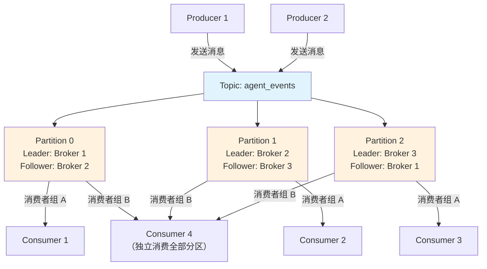

# Apache Kafka（分布式流处理平台）

## 基础概念

Apache Kafka 是 LinkedIn 开发、后捐赠给 Apache 基金会的**分布式事件流平台（Distributed Event Streaming Platform）**。它的核心能力是：把海量数据当成一条持续追加的日志流，生产者往里写，消费者从中读，中间的数据存在磁盘上，想什么时候读、从哪里开始读都行。

打个比方：传统消息队列像快递柜——消息取走就没了；Kafka 更像广播电台的录播系统——节目播完后录音还在，你可以回放昨天的节目，也可以同时有多个听众各自听各自的进度。

在 AI Agent 领域，Kafka 越来越重要。多 Agent 系统需要异步、解耦的通信方式，Kafka 天然适合充当 Agent 之间的"事件总线"——Agent A 把执行结果发到 Kafka Topic，Agent B 和 Agent C 各自订阅处理，互不干扰。2025 年 Google 提出的 A2A（Agent-to-Agent）协议和 MCP（Model Context Protocol）都可以通过 Kafka Topic 实现异步通信。

### 核心要素

| 要素 | 作用 |
|------|------|
| **Topic + Partition（主题 + 分区）** | 消息的逻辑分类和物理分片，分区是并行处理和水平扩展的基本单位 |
| **Producer（生产者）** | 向 Kafka 发送消息的应用程序，通过消息键决定消息进入哪个分区 |
| **Consumer Group（消费者组）** | 一组消费者共同消费一个 Topic，Kafka 自动分配分区，实现负载均衡 |
| **Broker + Replica（代理 + 副本）** | Kafka 集群的服务节点，每个分区有一个 Leader 和多个 Follower 副本，保证高可用 |

### Topic + Partition（主题 + 分区）

Topic 是消息的逻辑分类，相当于"频道"。每个 Topic 被切成多个 Partition（分区），分区是 Kafka 并行处理的最小单位。

关键规则：
- 同一分区内的消息**严格有序**，不同分区之间**不保证顺序**
- 相同 key 的消息通过 `hash(key) % 分区数` 路由到同一分区，保证相关消息的顺序性
- 分区分布在不同 Broker 上，分区数越多，并行度越高

```python
# 概念说明：Topic 和 Partition 的关系
# 假设创建一个 3 分区的 Topic
topic_config = {
    'name': 'agent_events',       # 主题名
    'num_partitions': 3,          # 3 个分区 → 最多 3 个消费者并行
    'replication_factor': 2       # 每个分区 2 个副本（1 Leader + 1 Follower）
}

# 消息路由示例：
# key="agent_001" → hash("agent_001") % 3 = 1 → 进入 Partition 1
# key="agent_002" → hash("agent_002") % 3 = 0 → 进入 Partition 0
# 同一个 agent 的所有事件进入同一分区，保证时间顺序
```

### Producer（生产者）

生产者负责往 Kafka 写消息，支持同步和异步两种发送方式。核心配置：

- `acks`：确认级别。`acks=0` 不等确认（最快但可能丢）；`acks=1` Leader 确认；`acks='all'` 所有副本确认（最安全）
- `batch_size` + `linger_ms`：批处理策略。攒一批再发，用少量延迟换大幅提升吞吐量
- `compression_type`：消息压缩，减少网络传输量

### Consumer Group（消费者组）

消费者组是 Kafka 消费端的核心设计。规则很简单：**同一组内的消费者瓜分分区，一个分区只能被组内一个消费者处理**。

举个例子：Topic 有 3 个分区，消费者组有 3 个消费者 → 每人处理 1 个分区。如果组里只有 1 个消费者 → 它处理全部 3 个分区。如果组里有 5 个消费者 → 3 个干活，2 个闲着。

不同消费者组之间互不影响，各自维护各自的消费进度（Offset，偏移量）。

### Broker + Replica（代理 + 副本）

Broker 是 Kafka 集群中的一个服务节点。多个 Broker 组成集群，每个 Broker 存储若干分区。每个分区有一个 Leader 负责读写，若干 Follower 从 Leader 同步数据。Leader 挂了，Follower 自动顶上。

### 核心要素关系图



数据流向：Producer 写消息到 Topic → 按 key 路由到 Partition → 消费者组内的 Consumer 各自消费分配到的 Partition。不同消费者组独立消费同一份数据。

## 基础用法

安装依赖：

```bash
# Python 客户端（推荐 confluent-kafka，性能优于 kafka-python）
pip install confluent-kafka==2.6.1

# 或者使用 kafka-python（纯 Python 实现，安装更简单）
pip install kafka-python==2.0.2
```

启动 Kafka 服务（使用 Docker，最快的方式）：

```bash
# 使用 KRaft 模式（Kafka 3.3+ 不再需要 ZooKeeper）
docker run -d --name kafka \
  -p 9092:9092 \
  -e KAFKA_NODE_ID=1 \
  -e KAFKA_PROCESS_ROLES=broker,controller \
  -e KAFKA_LISTENERS=PLAINTEXT://0.0.0.0:9092,CONTROLLER://0.0.0.0:9093 \
  -e KAFKA_ADVERTISED_LISTENERS=PLAINTEXT://localhost:9092 \
  -e KAFKA_CONTROLLER_QUORUM_VOTERS=1@localhost:9093 \
  -e KAFKA_CONTROLLER_LISTENER_NAMES=CONTROLLER \
  -e KAFKA_LISTENER_SECURITY_PROTOCOL_MAP=CONTROLLER:PLAINTEXT,PLAINTEXT:PLAINTEXT \
  -e CLUSTER_ID=MkU3OEVBNTcwNTJENDM2Qk \
  apache/kafka:3.8.0
```

最小可运行示例（基于 kafka-python==2.0.2 验证，截至 2026-03）：

```python
#!/usr/bin/env python3
# -*- coding: utf-8 -*-
"""
Kafka 最小可运行示例：生产者发送 5 条消息，消费者读取并打印。
前提：本地 9092 端口已运行 Kafka 服务。
"""

from kafka import KafkaProducer, KafkaConsumer
from kafka.errors import KafkaError
import json
import threading
import time

TOPIC = "demo_topic"
SERVERS = ["localhost:9092"]

# ---- 生产者：发送 5 条消息 ----
def produce():
    producer = KafkaProducer(
        bootstrap_servers=SERVERS,
        value_serializer=lambda v: json.dumps(v, ensure_ascii=False).encode("utf-8"),
        acks="all",
    )

    for i in range(5):
        msg = {"id": i, "content": f"第 {i} 条消息"}
        future = producer.send(TOPIC, value=msg)
        metadata = future.get(timeout=10)
        print(f"[生产者] 发送成功 -> Partition {metadata.partition}, Offset {metadata.offset}")

    producer.flush()
    producer.close()

# ---- 消费者：读取消息 ----
def consume():
    time.sleep(2)  # 等待生产者先发几条
    consumer = KafkaConsumer(
        TOPIC,
        bootstrap_servers=SERVERS,
        group_id="demo_group",
        auto_offset_reset="earliest",
        value_deserializer=lambda m: json.loads(m.decode("utf-8")),
    )

    count = 0
    for message in consumer:
        print(f"[消费者] 收到: {message.value} (Partition={message.partition}, Offset={message.offset})")
        count += 1
        if count >= 5:
            break

    consumer.close()

# ---- 运行 ----
if __name__ == "__main__":
    t1 = threading.Thread(target=produce)
    t2 = threading.Thread(target=consume)
    t1.start()
    t2.start()
    t1.join()
    t2.join()
    print("演示完成")
```

预期输出：

```text
[生产者] 发送成功 -> Partition 0, Offset 0
[生产者] 发送成功 -> Partition 0, Offset 1
[生产者] 发送成功 -> Partition 0, Offset 2
[生产者] 发送成功 -> Partition 0, Offset 3
[生产者] 发送成功 -> Partition 0, Offset 4
[消费者] 收到: {'id': 0, 'content': '第 0 条消息'} (Partition=0, Offset=0)
[消费者] 收到: {'id': 1, 'content': '第 1 条消息'} (Partition=0, Offset=1)
[消费者] 收到: {'id': 2, 'content': '第 2 条消息'} (Partition=0, Offset=2)
[消费者] 收到: {'id': 3, 'content': '第 3 条消息'} (Partition=0, Offset=3)
[消费者] 收到: {'id': 4, 'content': '第 4 条消息'} (Partition=0, Offset=4)
演示完成
```

## 同类工具对比

| 维度 | Kafka | RabbitMQ | Redis Streams |
|------|-------|----------|---------------|
| 核心定位 | 分布式事件流平台 | 传统消息队列（AMQP 协议） | 内存数据结构中的流功能 |
| 吞吐量 | 极高，单集群百万级 msg/s | 中等，数万级 msg/s | 高，数十万级 msg/s |
| 消息持久化 | 默认持久化到磁盘，可配置保留时间 | 支持但非默认，取走即删 | 支持（AOF/RDB），受限于内存容量 |
| 消息回溯 | 支持，按时间或偏移量任意回放 | 不支持，消费后即删除 | 有限支持，通过 ID 范围查询 |
| 路由能力 | 弱，只按 key 哈希到分区 | 强，Exchange + Routing Key 灵活路由 | 无路由，按 Stream 名称消费 |
| 适合场景 | 大规模数据管道、日志收集、Agent 事件流 | 微服务通信、任务队列、延迟队列 | 轻量级流处理、实时排行榜 |

核心区别：

- **Kafka**：数据管道级选手——消息量大、需要回溯历史、多个消费者独立消费同一份数据时选它
- **RabbitMQ**：业务通信级选手——需要灵活路由、优先级队列、消息确认机制时选它
- **Redis Streams**：轻量级选手——项目已用 Redis、消息量不大、不想引入额外中间件时选它

## 常见误区

| 误区 | 准确理解 |
|------|----------|
| Kafka 保证消息全局有序 | Kafka 只保证**分区内有序**。要全局有序只能用 1 个分区，但这会牺牲并行度。实际做法是用消息 key 把相关消息路由到同一分区，保证"局部有序" |
| Kafka 只是个消息队列 | Kafka 是**流处理平台**，除了消息传输，还支持 Kafka Streams（流式计算）、Kafka Connect（数据集成）、Schema Registry（数据格式管理）等组件 |
| 副本越多越安全 | 副本数从 1 到 3 是质的飞跃（单点故障 → 容忍 1~2 节点宕机），但从 3 到 5 收益递减。生产环境通常 3 副本 + min.insync.replicas=2 |
| 消息堆积说明 Kafka 出问题了 | 堆积是正常的，Kafka 本身就设计为允许消费落后于生产。需要关注的是消费者 Lag（延迟）是否持续增长，增长才说明消费能力不足 |

## 优劣势分析

| 优势 | 劣势 |
|------|------|
| 吞吐量极高，单集群轻松百万级消息/秒 | 运维复杂度高，需要管理 Broker、分区、副本、监控 Lag |
| 消息持久化 + 可回溯，适合数据管道和审计场景 | 延迟不如 RabbitMQ / Redis，通常在毫秒到百毫秒级 |
| 多消费者组独立消费，一份数据多种用途 | 学习曲线陡峭，分区、副本、偏移量等概念需要时间消化 |
| 生态完善（Streams、Connect、Schema Registry） | 对小规模项目来说过于重量级，Docker 启动也需要一定资源 |

## 思考题

<details>
<summary>初级：Kafka 的 Partition（分区）有什么作用？为什么相同 key 的消息会进入同一分区？</summary>

**参考答案：**

分区有三个作用：(1) 并行处理——多个消费者可以同时消费不同分区；(2) 水平扩展——分区分散在不同 Broker 上；(3) 顺序性保证——分区内消息严格有序。

相同 key 的消息通过 `hash(key) % 分区数` 计算，结果固定，所以一定进入同一分区。这保证了同一用户、同一订单的所有事件按时间顺序排列，不会因为分布式处理而乱序。

</details>

<details>
<summary>中级：消费者组内有 5 个消费者，但 Topic 只有 3 个分区，会发生什么？怎么解决？</summary>

**参考答案：**

Kafka 规则是"一个分区最多被组内一个消费者处理"，所以 3 个分区最多让 3 个消费者干活，剩余 2 个消费者处于空闲状态。

解决方案：增加分区数至少到 5 个（分区数只能增不能减），或者减少消费者数量到 3 个。设计 Topic 时应提前规划分区数 = 预期最大消费者并发数。

</details>

<details>
<summary>中级：如何配置 Kafka 实现「消息不丢失」？生产者、Broker、消费者各需要怎么设置？</summary>

**参考答案：**

三层配合：

- **生产者**：`acks='all'`（所有副本确认）+ `retries >= 3`（失败重试）+ `enable_idempotence=True`（避免重试导致重复）
- **Broker**：`replication.factor >= 3`（至少 3 副本）+ `min.insync.replicas >= 2`（至少 2 个副本同步成功才算写入成功）
- **消费者**：`enable_auto_commit=False`（关闭自动提交偏移量）+ 消息处理成功后手动调用 `commit()`

这套配置实现"至少一次"（at-least-once）投递语义。配合生产者幂等性和消费端去重逻辑，可以接近"恰好一次"（exactly-once）语义。

</details>

## 参考资料

1. 官方文档：[Apache Kafka Documentation](https://kafka.apache.org/documentation/)
2. GitHub 仓库：[apache/kafka](https://github.com/apache/kafka)
3. Python 客户端 kafka-python：[kafka-python 文档](https://kafka-python.readthedocs.io/)
4. Python 客户端 confluent-kafka：[confluent-kafka-python](https://github.com/confluentinc/confluent-kafka-python)
5. Kafka 与 Agentic AI：[How Apache Kafka and Flink Power Event-Driven Agentic AI](https://www.kai-waehner.de/blog/2025/04/14/how-apache-kafka-and-flink-power-event-driven-agentic-ai-in-real-time/)
6. Kafka 与 A2A/MCP 协议：[Agentic AI with A2A and MCP using Kafka](https://www.kai-waehner.de/blog/2025/05/26/agentic-ai-with-the-agent2agent-protocol-a2a-and-mcp-using-apache-kafka-as-event-broker/)

---
