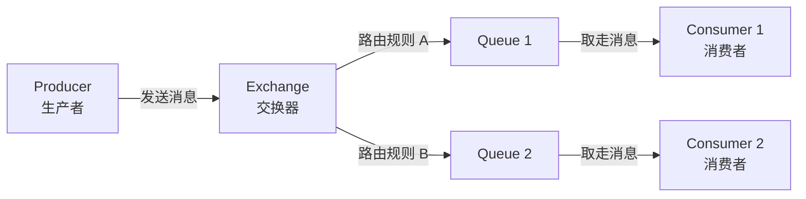

# RabbitMQ（消息代理）

## 基础概念

RabbitMQ 是一个开源的**消息代理（Message Broker）**，用 Erlang 语言写成。简单说：A 程序想给 B 程序传话，但两边可能不在同一台机器上、也不一定同时在线——RabbitMQ 就是中间的「邮局」，A 把消息投到邮局，B 有空了再来取。

这种「投递-暂存-取走」的模式叫**异步通信**。好处是：发送方不用等接收方处理完，双方各跑各的，系统整体更快更稳。在 AI Agent 系统中，RabbitMQ 常用于 Agent 之间的任务分发、事件通知和解耦通信。

### 核心要素

| 要素 | 作用 |
|------|------|
| **Producer（生产者）** | 发送消息的程序，相当于寄信人 |
| **Exchange（交换器）** | 接收消息并按规则分发，相当于邮局的分拣中心 |
| **Queue（队列）** | 存放消息的缓冲区，相当于收件人的信箱 |
| **Consumer（消费者）** | 从队列取走消息并处理，相当于收信人 |

### Producer（生产者）

生产者是消息的发送方。它不直接把消息塞进队列，而是交给 Exchange（交换器）。为什么要多这一层？因为交换器能按规则把一条消息分发给多个队列，实现灵活路由。

### Exchange（交换器）

交换器是 RabbitMQ 最有特色的设计，提供四种路由模式：

| 类型 | 路由规则 | 典型场景 |
|------|---------|---------|
| **Direct** | 路由键完全匹配才投递 | 一对一精准分发，如错误日志单独处理 |
| **Topic** | 路由键支持通配符匹配（`*` 匹配一个词，`#` 匹配多个词） | 按主题分级，如 `order.created`、`order.paid` |
| **Fanout** | 忽略路由键，广播给所有绑定队列 | 系统通知、日志分发 |
| **Headers** | 按消息头部属性匹配 | 复杂属性过滤（用得少） |

### Queue（队列）

队列是消息的暂存地。消息到了队列就会按先进先出的顺序排队，等消费者来取。队列支持**持久化**（`durable=True`），开启后即使 RabbitMQ 重启，队列里的消息也不会丢。

### Consumer（消费者）

消费者从队列取消息并处理。处理完后发一个 ACK（确认信号）告诉 RabbitMQ「这条我处理好了，可以删了」。如果消费者挂了没发 ACK，RabbitMQ 会把消息重新交给其他消费者——这就是**消息不丢失**的保证。

### 核心要素关系图



一句话总结：生产者发消息给交换器，交换器按规则分发到队列，消费者从队列取走并处理。

## 基础用法

安装 Python 客户端库和启动 RabbitMQ 服务：

```bash
# 安装 pika（RabbitMQ 的 Python 客户端）
pip install pika==1.3.2

# 用 Docker 一键启动 RabbitMQ（含 Web 管理界面）
docker run -d --name rabbitmq \
  -p 5672:5672 \
  -p 15672:15672 \
  rabbitmq:4-management
```

启动后访问 `http://localhost:15672`，用户名密码都是 `guest`，可以看到 Web 管理界面。

最小可运行示例——先运行消费者，再运行生产者（基于 pika==1.3.2 验证，截至 2026-03）：

**producer.py（生产者）**：

```python
import json
import pika

params = pika.ConnectionParameters(
    host="localhost",
    port=5672,
    connection_attempts=3,
    retry_delay=1,
)

try:
    connection = pika.BlockingConnection(params)
except pika.exceptions.AMQPConnectionError:
    print("[提示] RabbitMQ 未启动或 5672 端口不可用，请先执行上面的 Docker 启动命令。")
else:
    channel = connection.channel()

    # 2. 声明队列（不存在则自动创建，durable=True 开启持久化）
    channel.queue_declare(queue="hello_queue", durable=True)

    # 3. 发送 3 条消息
    for i in range(3):
        msg = {"id": i, "content": f"第 {i} 条消息"}
        channel.basic_publish(
            exchange="",                # 空字符串 = 使用默认交换器
            routing_key="hello_queue",  # 默认交换器下，路由键就是队列名
            body=json.dumps(msg, ensure_ascii=False).encode("utf-8"),
            properties=pika.BasicProperties(delivery_mode=2),  # 消息持久化
        )
        print(f"[已发送] {msg}")

    connection.close()
```

**consumer.py（消费者）**：

```python
import json
import pika

params = pika.ConnectionParameters(
    host="localhost",
    port=5672,
    connection_attempts=3,
    retry_delay=1,
)

try:
    connection = pika.BlockingConnection(params)
except pika.exceptions.AMQPConnectionError:
    print("[提示] RabbitMQ 未启动或 5672 端口不可用，请先执行上面的 Docker 启动命令。")
else:
    channel = connection.channel()

    # 2. 声明同一个队列（消费者也要声明，防止队列不存在）
    channel.queue_declare(queue="hello_queue", durable=True)

    print("[消费者] 开始拉取消息，连续 2 轮没有新消息就退出")
    idle_rounds = 0

    for method_frame, properties, body in channel.consume(
        "hello_queue", inactivity_timeout=1
    ):
        if method_frame is None:
            idle_rounds += 1
            if idle_rounds >= 2:
                print("[消费者] 暂无新消息，结束演示")
                break
            continue

        idle_rounds = 0
        msg = json.loads(body.decode("utf-8"))
        print(f"[已收到] {msg}")
        channel.basic_ack(delivery_tag=method_frame.delivery_tag)

    channel.cancel()
    connection.close()
```

运行方式：终端 1 执行 `python consumer.py`，终端 2 执行 `python producer.py`。

预期输出：

```text
# 终端 2（生产者）
[已发送] {'id': 0, 'content': '第 0 条消息'}
[已发送] {'id': 1, 'content': '第 1 条消息'}
[已发送] {'id': 2, 'content': '第 2 条消息'}

# 终端 1（消费者）
[消费者] 等待消息中... 按 Ctrl+C 退出
[已收到] {'id': 0, 'content': '第 0 条消息'}
[已收到] {'id': 1, 'content': '第 1 条消息'}
[已收到] {'id': 2, 'content': '第 2 条消息'}
```

## 同类工具对比

| 维度 | RabbitMQ | Kafka | Redis（队列模式） |
|------|----------|-------|------------------|
| 核心定位 | 通用消息代理，灵活路由 | 分布式日志流平台，超高吞吐 | 内存数据库附带的轻量队列 |
| 最擅长 | 业务消息路由、任务分发、Agent 间通信 | 日志采集、大数据管道、事件流 | 简单任务队列、缓存场景 |
| 吞吐量 | 中等（约 10 万条/秒） | 极高（约 100 万条/秒） | 高（依赖内存大小） |
| 路由能力 | 强——四种交换器 + 绑定规则 | 弱——只有 Topic 分区 | 弱——简单的列表操作 |
| 学习成本 | 中等 | 较高 | 低 |
| 管理界面 | 自带完善的 Web UI | 需第三方工具（如 Kafdrop） | 无自带 UI |

核心区别：

- **RabbitMQ**：「邮局」模型——消息路由灵活，投递可靠，适合业务系统和 Agent 任务分发
- **Kafka**：「日志」模型——消息持久保存可回放，适合大数据流和日志管道
- **Redis 队列**：「便签纸」模型——快但简单，适合轻量级临时任务，不适合对可靠性要求高的场景

## 常见误区

| 误区 | 准确理解 |
|------|----------|
| RabbitMQ 就是个简单队列 | RabbitMQ 是**消息代理**，不仅有队列，还有交换器、绑定、路由等机制，能实现复杂的消息分发模式 |
| 消息发出去就一定不会丢 | 不一定。必须同时开启三项才能保证不丢：生产者确认（Confirm）、消息持久化（delivery_mode=2）、消费者手动 ACK |
| 多个消费者监听同一个队列会导致重复消费 | 不会。RabbitMQ 默认轮询分发，一条消息只会交给一个消费者处理 |

## 优劣势分析

| 优势 | 劣势 |
|------|------|
| 路由能力强，四种交换器覆盖绝大部分分发场景 | 吞吐量不及 Kafka，不适合百万级/秒的日志流场景 |
| 消息可靠性高，支持持久化 + ACK + 重试 + 死信队列 | 用 Erlang 编写，二次开发和调试门槛较高 |
| 自带 Web 管理界面，运维友好 | 消息堆积过多时性能下降明显（不擅长大量积压） |
| 多语言多协议支持（AMQP、MQTT、STOMP） | 集群配置相对复杂，需要理解镜像队列 / 仲裁队列机制 |

## 思考题

<details>
<summary>初级：Exchange 和 Queue 分别负责什么？为什么不让生产者直接往 Queue 里塞消息？</summary>

**参考答案：**

Exchange 负责「消息往哪送」（路由），Queue 负责「消息存在哪」（缓存）。分开设计的好处是解耦：同一条消息可以通过 Exchange 的路由规则同时送到多个 Queue，生产者不需要知道有多少个队列、多少个消费者。如果直接往 Queue 塞，生产者就得自己管理所有队列的地址，扩展性很差。

</details>

<details>
<summary>中级：如何保证 RabbitMQ 消息「绝对不丢」？需要在哪三个环节做配置？</summary>

**参考答案：**

三个环节都要做：
1. **生产者端**：开启 Confirm 模式（`channel.confirm_delivery()`），确认消息已到达 RabbitMQ
2. **RabbitMQ 服务端**：队列声明 `durable=True`，消息设置 `delivery_mode=2`，写入磁盘
3. **消费者端**：关闭自动确认（`auto_ack=False`），处理成功后才手动发送 `basic_ack`

三个环节缺任何一个，消息都可能丢失。

</details>

<details>
<summary>中级：RabbitMQ 和 Kafka 都能做消息队列，什么时候该选 RabbitMQ？</summary>

**参考答案：**

选 RabbitMQ 的典型场景：需要灵活路由（如按类型分发到不同队列）、需要消息优先级、需要请求-响应（RPC）模式、消息量在十万级/秒以内的业务系统。选 Kafka 的典型场景：日志采集、数据管道、需要消息回放、吞吐量要求百万级/秒。简单判断：业务消息选 RabbitMQ，数据流选 Kafka。

</details>

## 参考资料

1. RabbitMQ 官方文档：https://www.rabbitmq.com/docs
2. pika Python 客户端文档：https://pika.readthedocs.io/
3. RabbitMQ GitHub 仓库：https://github.com/rabbitmq/rabbitmq-server
4. AMQP 0-9-1 协议参考：https://www.rabbitmq.com/amqp-0-9-1-reference.html
