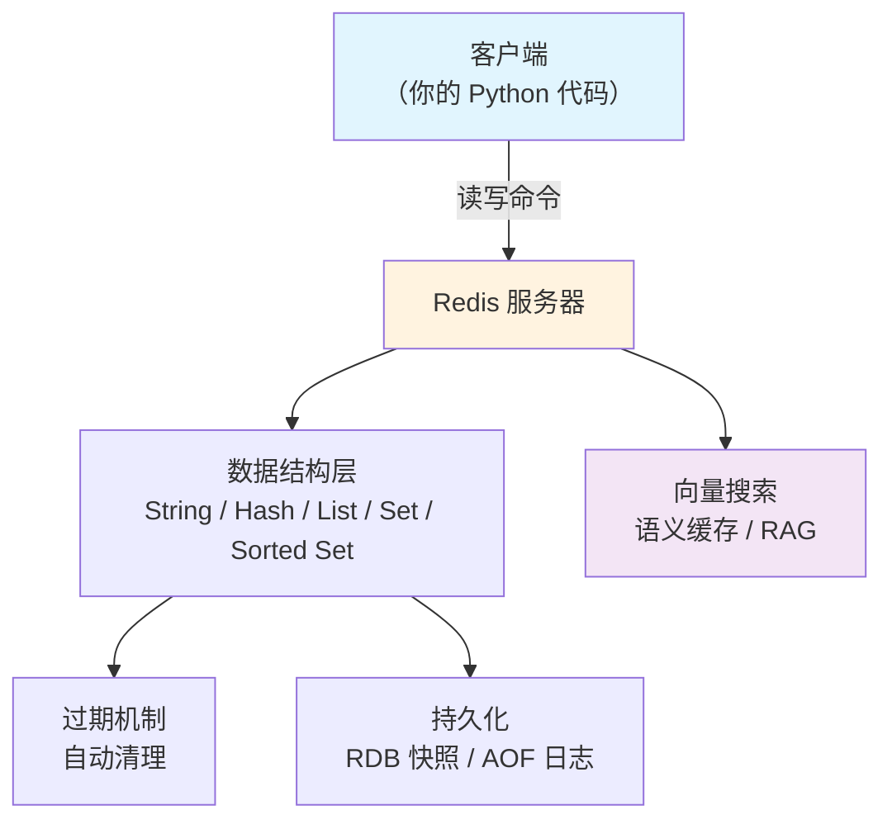

# Redis（内存数据库/缓存）

## 基础概念

Redis（Remote Dictionary Server，远程字典服务）是一个开源的**内存键值数据库**。你可以把它理解成一个超快的「字典本」——数据全部放在内存里，查起来比传统数据库快几百倍。

传统数据库（如 MySQL）把数据存在硬盘上，每次查询要做磁盘读写，速度慢；Redis 把数据存在内存（RAM）里，读写速度是微秒级的，单机每秒可以处理 10 万次以上的请求。

Redis 在 AI Agent 开发中的典型用途：
- **缓存 LLM 返回结果**，避免重复调用 API 花钱
- **语义缓存（Semantic Cache）**，通过向量搜索命中相似问题的历史回答
- **任务队列**，Agent 的异步任务排队执行
- **会话状态存储**，保存用户和 Agent 的对话上下文
- **分布式锁**，多个 Agent 实例并发时防止冲突

### 核心要素

| 要素 | 作用 |
|------|------|
| **数据结构（Data Structures）** | 不只是简单的 key-value，还支持列表、哈希表、集合、有序集合等，覆盖多种业务场景 |
| **过期机制（TTL）** | 每个 key 可设定「保质期」，到期自动删除，这是缓存的核心能力 |
| **持久化（Persistence）** | 虽然数据在内存里，但可以定期存到硬盘，重启后数据不丢 |
| **向量搜索（Vector Search）** | Redis 8.0+ 内置向量索引，可用于语义缓存和 RAG 检索 |

### 数据结构（Data Structures）

Redis 的强大之处在于它不只能存字符串，还提供了 5 种常用数据结构，每种都对应一类实际业务场景：

| 数据结构 | 可以理解为 | 典型用途 |
|---------|-----------|---------|
| **String** | 一个变量 | 缓存、计数器、分布式锁 |
| **Hash** | 一个 Python dict | 存储用户信息、Agent 会话状态 |
| **List** | 一个队列/栈 | 任务队列、消息列表 |
| **Set** | 一个去重集合 | 标签管理、去重判断 |
| **Sorted Set** | 带分数的排行榜 | 排行榜、优先级队列 |

### 过期机制（TTL）

每个 key 可以设置一个存活时间（TTL，Time To Live）。到了时间 Redis 自动删除这个 key。这就是缓存的核心——数据不需要永久保留，过期后从源头重新获取即可。

### 持久化（Persistence）

Redis 提供两种持久化方式：

- **RDB（快照）**：每隔一段时间把整个数据库"拍照"存到硬盘。恢复快，但可能丢失最后一次快照后的数据。
- **AOF（日志追加）**：每条写操作都记到日志文件里。数据更安全，但文件更大、恢复更慢。

纯缓存场景可以关闭持久化，让 Redis 跑得更快。

### 向量搜索（Vector Search）

Redis 8.0 起内置向量索引能力，支持 HNSW（分层导航小世界）算法做近似最近邻搜索。配合 Redis 的 LangCache 服务，可实现**语义缓存**——把用户问题转成向量，在缓存中找到语义相似的历史问答，命中则直接返回，无需再调用 LLM，可节省 40-60% 的 API 调用成本。

### 核心要素关系图



## 基础用法

安装依赖：

```bash
# 安装 Python 客户端
pip install redis

# 本地启动 Redis 服务（用 Docker 一行搞定）
docker run -d --name my-redis -p 6379:6379 redis:latest
```

最小可运行示例（基于 redis-py==5.2.1 验证，截至 2026-03）：

```python
import redis
import json

# 连接 Redis（默认 localhost:6379）
r = redis.Redis(host="localhost", port=6379, db=0, decode_responses=True)

# --- 1. String：最基础的缓存 ---
r.set("greeting", "你好，Redis！")
print(r.get("greeting"))  # 输出：你好，Redis！

# --- 2. 带过期时间的缓存 ---
r.setex("token:user123", 60, "abc123")  # 60 秒后自动删除
print(f"剩余存活时间：{r.ttl('token:user123')} 秒")

# --- 3. Hash：存储结构化数据（像 Python dict） ---
r.hset("agent:session:001", mapping={
    "user_id": "u_42",
    "topic": "如何学Redis",
    "turn_count": "3"
})
session = r.hgetall("agent:session:001")
print(f"会话信息：{session}")

# --- 4. List：简易任务队列 ---
r.delete("task_queue")
tasks = ["分析文档", "生成摘要", "发送邮件"]
r.rpush("task_queue", *tasks)
for _ in range(len(tasks)):
    task = r.lpop("task_queue")
    print(f"处理任务：{task}")

# --- 5. 计数器（原子操作） ---
r.delete("api_calls")
for i in range(5):
    count = r.incr("api_calls")
print(f"API 累计调用：{count} 次")
```

预期输出：

```text
你好，Redis！
剩余存活时间：60 秒
会话信息：{'user_id': 'u_42', 'topic': '如何学Redis', 'turn_count': '3'}
处理任务：分析文档
处理任务：生成摘要
处理任务：发送邮件
API 累计调用：5 次
```

## 同类工具对比

| 维度 | Redis | Memcached | MongoDB |
|------|-------|-----------|---------|
| 核心定位 | 内存数据结构存储，兼顾缓存和持久化 | 纯内存键值缓存 | 磁盘型文档数据库 |
| 数据结构 | 丰富（String、Hash、List、Set、Sorted Set、向量） | 只有 String | JSON 文档 |
| 性能 | 单机 10 万+ QPS | 单机 50 万+ QPS（仅简单 KV） | 万级 QPS |
| 持久化 | 支持（RDB + AOF） | 不支持 | 支持 |
| 向量搜索 | 8.0+ 内置支持 | 不支持 | Atlas Vector Search |
| 学习曲线 | 平缓，命令简洁 | 极浅 | 中等 |
| 最擅长 | 缓存 + 队列 + 锁 + 向量搜索，一站式 | 极简缓存 | 复杂文档查询 |
| 适合人群 | 需要多种数据结构和 AI 场景的开发者 | 只需最简单缓存的场景 | 需要持久化文档存储的场景 |

核心区别：

- **Redis**：「瑞士军刀」型——缓存、队列、锁、向量搜索都能做，AI Agent 开发首选
- **Memcached**：极致简单的纯缓存，不需要花哨功能时选它
- **MongoDB**：重点在持久化的文档存储和复杂查询，不是缓存工具

## 常见误区

| 误区 | 准确理解 |
|------|----------|
| Redis 能存无限多的数据 | Redis 数据放在内存里，受物理内存大小限制。单个 value 建议不超过 1MB，大数据量应该用专门的数据库 |
| Redis 的数据绝对不会丢 | 即使开了持久化，极端情况（如宕机瞬间）仍可能丢失少量数据。不要把 Redis 当唯一的数据存储 |
| Pub/Sub 可以替代 RabbitMQ/Kafka | Redis 的发布订阅不持久化消息，订阅者不在线就收不到。生产环境的消息队列应该用专业工具 |

## 优劣势分析

| 优势 | 劣势 |
|------|------|
| 读写极快（微秒级），适合高并发场景 | 数据量受内存大小限制，存储成本较高 |
| 数据结构丰富，一个工具覆盖缓存、队列、锁等多种需求 | 复杂查询能力弱，不能替代关系型数据库 |
| 8.0+ 内置向量搜索，直接支持 AI 语义缓存 | 单线程模型，CPU 密集型计算不是强项 |
| 社区活跃，与 LangChain/LangGraph 等 AI 框架有原生集成 | 集群配置相对复杂，小项目可能用不上 |

## 思考题

<details>
<summary>初级：Redis 为什么快？它把数据存在哪里？</summary>

**参考答案：**

Redis 快的核心原因是**数据全部存在内存（RAM）中**，内存的读写速度比硬盘快上千倍。加上单线程模型避免了锁竞争，以及 I/O 多路复用技术高效处理网络连接，单机就能达到 10 万+ QPS。

</details>

<details>
<summary>中级：在 AI Agent 系统中，Redis 可以承担哪些角色？分别用什么数据结构？</summary>

**参考答案：**

- **LLM 结果缓存**：用 String 存储序列化的 JSON，设置 TTL 过期
- **会话状态管理**：用 Hash 存储对话上下文（user_id、history、turn_count 等字段）
- **异步任务队列**：用 List 的 RPUSH/LPOP 实现先进先出队列
- **分布式锁**：用 `SET key value NX EX timeout` 原子操作，防止多 Agent 实例并发冲突
- **语义缓存**：用向量索引存储问题的 Embedding，相似问题直接返回缓存答案
- **API 限流**：用 INCR 原子计数 + EXPIRE 实现滑动窗口限流

</details>

<details>
<summary>中级：RDB 和 AOF 两种持久化方式各有什么优缺点？纯缓存场景应该怎么选？</summary>

**参考答案：**

- **RDB（快照）**：文件小、恢复快，但可能丢失最后一次快照之后的写入数据
- **AOF（日志追加）**：数据安全性更高（最多丢 1 秒），但文件大、恢复慢

纯缓存场景建议**关闭持久化**（`save ""` + `appendonly no`），因为缓存丢了可以从源头重建，关闭持久化能让 Redis 跑得更快、避免磁盘 I/O 开销。

</details>

## 参考资料

1. 官方文档：https://redis.io/docs/latest/
2. GitHub 仓库：https://github.com/redis/redis
3. Python 客户端 redis-py：https://github.com/redis/redis-py
4. Redis for AI（官方 AI 场景介绍）：https://redis.io/redis-for-ai/
5. Redis 向量搜索文档：https://redis.io/docs/latest/develop/ai/search-and-query/query/vector-search/
6. LangCache 发布博客（2025）：https://redis.io/blog/spring-release-2025/
