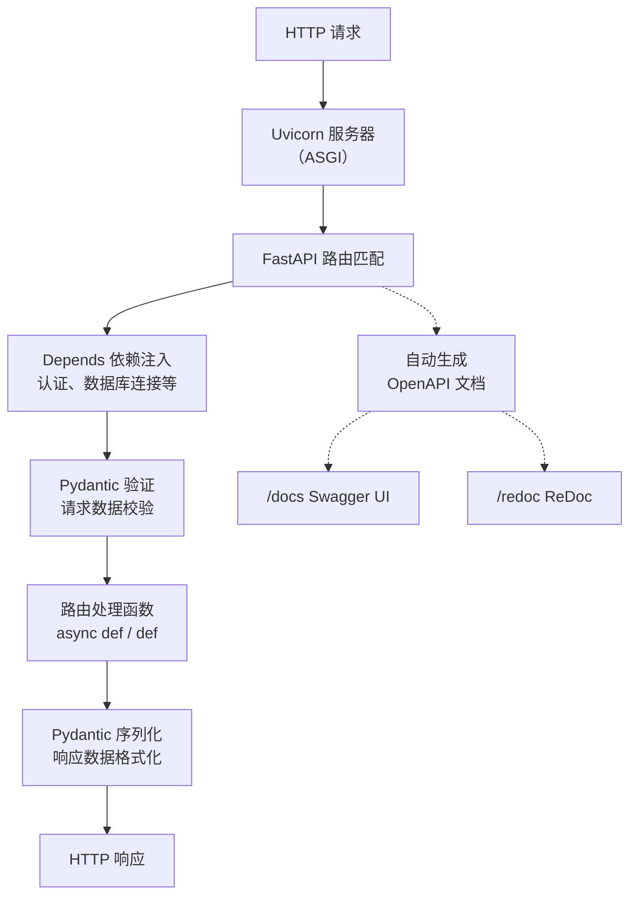

# FastAPI（高性能Web框架）

## 基础概念

FastAPI 是一个用 Python 构建 REST API 的 **高性能 Web 框架**。你用 Python 的类型注解写代码，它自动帮你做三件事：**验证请求数据**、**序列化响应**、**生成可交互的 API 文档**。不需要手写数据校验逻辑，不需要手写 Swagger 文档——写完代码，这些全有了。

为什么 AI 应用开发者特别喜欢它？因为训练好的模型、写好的 Agent 逻辑，最终都要通过 API 暴露给前端或其他服务调用。FastAPI 的异步特性天然适合处理 LLM 推理这种 I/O 密集型场景（等模型返回的时候不阻塞其他请求），而且它的流式响应（Streaming / SSE）能力可以实现 Token 逐字输出的效果。

### 核心要素

| 要素 | 作用 |
|------|------|
| **Pydantic 数据模型** | 用类型注解定义数据结构，框架自动验证请求、序列化响应、生成文档 |
| **路由与异步处理** | 用装饰器绑定 URL 和处理函数，原生 async/await 支持高并发 |
| **依赖注入（Depends）** | 把数据库连接、认证逻辑等公共操作抽成可复用的依赖，自动注入到路由函数 |

### Pydantic 数据模型

Pydantic 是 FastAPI 的基石。你定义一个继承 `BaseModel` 的类，标注每个字段的类型，FastAPI 就知道：请求体应该长什么样、哪些字段必填、类型不对怎么报错。

```python
from pydantic import BaseModel, Field
from typing import Optional

class UserCreate(BaseModel):
    username: str = Field(..., min_length=2, max_length=50)  # 必填，2-50 字符
    email: str                                                # 必填
    age: Optional[int] = Field(None, ge=0, le=150)           # 可选，0-150 之间

# 传入合法数据 → 自动通过验证
user = UserCreate(username="alice", email="alice@test.com", age=25)
print(user.model_dump())
# {'username': 'alice', 'email': 'alice@test.com', 'age': 25}

# 传入非法数据 → 自动抛出详细错误信息
# UserCreate(username="a", email="bad", age=200)  → ValidationError
```

不需要手写 `if len(username) < 2: raise ...` 这种校验代码，Pydantic 全包了。

### 路由与异步处理

用 `@app.get()`、`@app.post()` 等装饰器把 URL 和函数绑定。函数可以是 `async def`（异步）或普通 `def`（同步）。异步函数在等待 I/O（数据库查询、模型推理）时不会阻塞其他请求。

```python
from fastapi import FastAPI

app = FastAPI()

# 异步路由：适合有 I/O 等待的场景
@app.get("/async-hello")
async def async_hello():
    return {"message": "异步响应"}

# 同步路由：FastAPI 自动放到线程池执行，不阻塞事件循环
@app.get("/sync-hello")
def sync_hello():
    return {"message": "同步响应"}
```

两种写法都能正常工作。有 `await` 操作时用 `async def`，纯计算或调用同步库时用普通 `def`。

### 依赖注入（Depends）

把重复的逻辑（获取数据库连接、校验 Token、分页参数）封装成函数，用 `Depends()` 声明，FastAPI 自动调用并把结果传给路由函数。

```python
from fastapi import Depends, HTTPException

# 定义一个依赖：模拟认证
async def get_current_user(token: str = ""):
    if token != "secret-token":
        raise HTTPException(status_code=401, detail="未授权")
    return {"user_id": 1, "name": "alice"}

# 路由函数通过 Depends 自动获取当前用户
@app.get("/me")
async def read_me(user: dict = Depends(get_current_user)):
    return user
```

依赖可以嵌套（依赖 A 里再声明依赖 B），同一个请求内同一个依赖只执行一次。

### 核心要素关系图



三者的关系：Pydantic 管「数据长什么样」，路由管「请求怎么处理」，Depends 管「公共逻辑怎么复用」。

## 基础用法

安装依赖：

```bash
pip install fastapi uvicorn
```

最小可运行示例（基于 fastapi==0.115.x、uvicorn==0.34.x 验证，截至 2026-03）：

```python
from fastapi import FastAPI, HTTPException
from pydantic import BaseModel, Field
from typing import Optional

app = FastAPI(title="待办事项 API")

# 数据模型
class Todo(BaseModel):
    id: int
    title: str = Field(..., min_length=1, max_length=100)
    done: bool = False

# 内存存储
todos: dict[int, Todo] = {}

@app.get("/")
async def root():
    return {"message": "待办事项 API 运行中"}

@app.post("/todos/", response_model=Todo, status_code=201)
async def create_todo(todo: Todo):
    """创建一条待办事项"""
    if todo.id in todos:
        raise HTTPException(status_code=400, detail="ID 已存在")
    todos[todo.id] = todo
    return todo

@app.get("/todos/", response_model=list[Todo])
async def list_todos():
    """获取所有待办事项"""
    return list(todos.values())

@app.get("/todos/{todo_id}", response_model=Todo)
async def get_todo(todo_id: int):
    """根据 ID 获取待办事项"""
    if todo_id not in todos:
        raise HTTPException(status_code=404, detail="不存在")
    return todos[todo_id]

@app.delete("/todos/{todo_id}", status_code=204)
async def delete_todo(todo_id: int):
    """删除待办事项"""
    if todo_id not in todos:
        raise HTTPException(status_code=404, detail="不存在")
    del todos[todo_id]

if __name__ == "__main__":
    import uvicorn
    uvicorn.run(app, host="127.0.0.1", port=8000)
```

预期输出：

```text
INFO:     Uvicorn running on http://127.0.0.1:8000 (Press CTRL+C to quit)
INFO:     Application startup complete.

# 测试创建
$ curl -X POST http://localhost:8000/todos/ -H "Content-Type: application/json" -d '{"id":1,"title":"学FastAPI"}'
{"id":1,"title":"学FastAPI","done":false}

# 测试列表
$ curl http://localhost:8000/todos/
[{"id":1,"title":"学FastAPI","done":false}]

# 浏览器打开 http://localhost:8000/docs 可看到自动生成的 Swagger 交互文档
```

## 同类工具对比

| 维度 | FastAPI | Flask | Django REST framework |
|------|---------|-------|-----------------------|
| 核心定位 | 高性能异步 API 框架 | 轻量级同步微框架 | 全栈 Web 框架的 API 扩展 |
| 异步支持 | 原生 async/await | 需第三方库（Quart 等） | 部分支持（Django 3.1+） |
| 自动文档 | 内置 Swagger UI + ReDoc | 无，需 flask-restx 等插件 | 内置可浏览 API 界面 |
| 数据验证 | Pydantic 自动验证 | 无内置，需手写或用插件 | Serializer 手动定义 |
| 适合场景 | AI 服务 API、微服务、高并发接口 | 快速原型、小型 Web 应用 | 需要 ORM / 后台管理的大型项目 |

核心区别：

- **FastAPI**：为 API 而生，自动文档 + 自动验证 + 原生异步，开发体验最好
- **Flask**：最灵活的微框架，但 API 相关能力（文档、验证）都要手动加
- **Django REST framework**：功能最全（含 ORM、权限、分页），但体量重，异步支持有限

## 常见误区

| 误区 | 准确理解 |
|------|----------|
| FastAPI 必须全用 async def | `async def` 和普通 `def` 可以混用。FastAPI 会自动把同步函数放到线程池执行，不会阻塞事件循环 |
| 有了 Pydantic 就不用做安全防护了 | Pydantic 只做类型和格式验证，不防 SQL 注入、XSS 等安全问题，这些需要单独处理 |
| FastAPI 性能一定比 Flask 高 | 性能优势主要体现在 I/O 密集场景（网络请求、数据库查询）。纯 CPU 计算场景下差距不大 |

## 优劣势分析

| 优势 | 劣势 |
|------|------|
| 自动生成交互式 API 文档，省去维护文档的工作 | 生态插件不如 Flask / Django 丰富，部分功能需自己实现 |
| Pydantic 自动验证，减少手写校验代码和低级 bug | 异步编程有学习门槛，混用同步库容易踩坑 |
| 原生异步 + 流式响应，适合 AI 推理服务 | 不含 ORM、模板引擎等，构建全栈应用需额外组合 |
| 类型注解驱动，IDE 智能提示友好 | 依赖 Python 3.8+，老项目迁移有版本要求 |

## 思考题

<details>
<summary>初级：FastAPI 的自动文档是怎么生成的？为什么不需要手写？</summary>

**参考答案：**

FastAPI 根据路由装饰器（URL、HTTP 方法）、函数参数类型注解、Pydantic 模型定义，自动生成 OpenAPI 规范（一个 JSON 描述文件）。Swagger UI 和 ReDoc 前端界面读取这个 JSON 文件，渲染成可交互的文档页面。

因为所有信息（URL、参数类型、字段约束、响应格式）都已经在代码中通过类型注解声明了，不需要再写一遍。

</details>

<details>
<summary>中级：什么时候用 async def，什么时候用普通 def？选错了会怎样？</summary>

**参考答案：**

- 需要 `await` 异步操作（异步数据库、httpx、aiofiles 等）时用 `async def`
- 调用同步阻塞库（requests、传统数据库驱动）时用普通 `def`

选错的后果：如果在 `async def` 里调用同步阻塞函数（如 `requests.get()`），会阻塞整个事件循环，所有并发请求都会被卡住。用普通 `def` 时 FastAPI 会自动把它放到线程池执行，反而不会阻塞。

</details>

<details>
<summary>中级：FastAPI 的依赖注入和直接在函数里 import 调用有什么区别？为什么推荐用 Depends？</summary>

**参考答案：**

直接 import 调用是硬编码依赖，测试时难以替换（比如想用模拟数据库替代真实数据库）。Depends 实现了控制反转：依赖由框架负责创建和注入，测试时可以用 `app.dependency_overrides` 轻松替换为 mock 实现。

此外，Depends 还支持：同一请求内依赖结果缓存（避免重复执行）、依赖嵌套、生命周期管理（yield 依赖可以在请求结束后执行清理逻辑）。

</details>

## 参考资料

1. 官方文档：[FastAPI Documentation](https://fastapi.tiangolo.com/)
2. GitHub 仓库：[fastapi/fastapi](https://github.com/fastapi/fastapi)（80k+ stars，MIT 许可证）
3. Pydantic 官方文档：[Pydantic v2 Documentation](https://docs.pydantic.dev/)
4. PyPI 包页面：[fastapi - PyPI](https://pypi.org/project/fastapi/)
5. Uvicorn 官方文档：[Uvicorn](https://www.uvicorn.org/)
