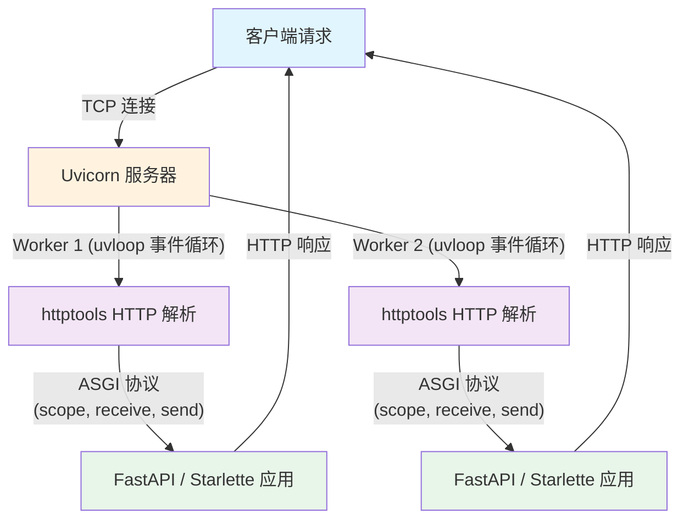

# Uvicorn（ASGI 服务器）

## 基础概念

Uvicorn 是一个用 Python 写的 **ASGI 服务器（Asynchronous Server Gateway Interface Server）**，专门用来运行异步 Web 应用。通俗地说：你用 FastAPI 或 Starlette 写好了一个 Web 应用，需要一个"服务员"把它跑起来、接收用户的请求并返回响应——Uvicorn 就是这个服务员。

它的核心卖点是**快**。底层用 uvloop（高性能事件循环）和 httptools（C 语言级别的 HTTP 解析器）替代了 Python 自带的慢组件，性能接近 Go 和 Node.js。同时它足够轻量，配置简单，几行命令就能启动，非常适合从开发到生产全链路使用。

### 核心要素

| 要素 | 作用 |
|------|------|
| **ASGI 协议** | 定义服务器和应用之间"怎么说话"的规范，让服务器和框架可以自由组合 |
| **事件循环（Event Loop）** | 异步处理请求的引擎，一个线程就能同时处理成百上千个连接 |
| **Worker 进程** | 多个独立运行的服务器进程，用来榨干多核 CPU 的性能 |

### ASGI 协议

ASGI 是 WSGI（同步网关接口）的异步升级版。传统的 WSGI 每个请求独占一个线程，处理完才能接下一个；ASGI 则是异步事件驱动的，一个线程就能交替处理大量请求，而且原生支持 WebSocket 长连接。

ASGI 应用和服务器之间通过三个参数通信：

- **Scope**：请求的"身份证"，包含路径、方法、请求头等元信息
- **Receive**：异步函数，应用用它接收客户端发来的数据（比如请求体）
- **Send**：异步函数，应用用它向客户端发送响应

```python
# 一个最原始的 ASGI 应用（不借助任何框架）
async def app(scope, receive, send):
    """scope 包含请求元信息，receive 接收数据，send 发送响应"""
    assert scope["type"] == "http"

    # 发送响应头
    await send({
        "type": "http.response.start",
        "status": 200,
        "headers": [(b"content-type", b"text/plain")],
    })
    # 发送响应体
    await send({
        "type": "http.response.body",
        "body": b"Hello, World!",
    })
```

实际开发中不需要手写这些底层代码，FastAPI/Starlette 会帮你封装好。这里只是为了说明 Uvicorn 和应用之间的通信机制。

### 事件循环（Event Loop）

事件循环是异步编程的核心引擎。想象一个餐厅只有一个服务员：同步模式下，他给 A 桌点完菜、等厨房做完、端给 A 桌，才去 B 桌；异步模式下，他给 A 桌点完菜就去 B 桌了，厨房做好后他再回来端菜。Uvicorn 默认在 Linux/macOS 上使用 uvloop（比 Python 自带的 asyncio 快 2-4 倍），Windows 上退化为标准 asyncio。

### Worker 进程

单个 Uvicorn 进程只用一个 CPU 核心。要榨干多核 CPU 的性能，需要启动多个 Worker 进程。每个 Worker 是一个独立的 Uvicorn 实例，各自运行事件循环，操作系统负责把请求分配到不同 Worker。

### 核心要素关系图



## 基础用法

安装：

```bash
# 最小安装（纯 Python 依赖）
pip install uvicorn

# 推荐：完整安装（包含 uvloop + httptools 高性能组件）
pip install "uvicorn[standard]"
```

最小可运行示例（基于 uvicorn==0.34.0 验证，截至 2026-03）：

```python
# main.py
# 依赖安装：pip install "uvicorn[standard]"
import asyncio

import uvicorn

async def app(scope, receive, send):
    assert scope["type"] == "http"

    await send({
        "type": "http.response.start",
        "status": 200,
        "headers": [(b"content-type", b"text/plain; charset=utf-8")],
    })
    await send({
        "type": "http.response.body",
        "body": "Hello, Uvicorn!".encode("utf-8"),
    })

async def main():
    config = uvicorn.Config(app, host="127.0.0.1", port=8000, log_level="info")
    server = uvicorn.Server(config)

    server_task = asyncio.create_task(server.serve())
    await asyncio.sleep(1)
    server.should_exit = True
    await server_task

if __name__ == "__main__":
    asyncio.run(main())
```

两种启动方式：

```bash
# 方式 1：命令行启动（推荐，支持热重载）
uvicorn main:app --reload --host 127.0.0.1 --port 8000

# 方式 2：Python 直接运行（此处示例会在 1 秒后自动退出，便于演示和校验）
python main.py
```

预期输出：

```text
INFO:     Started server process [12345]
INFO:     Waiting for application startup.
INFO:     ASGI 'lifespan' protocol appears unsupported.
INFO:     Application startup complete.
INFO:     Uvicorn running on http://127.0.0.1:8000 (Press CTRL+C to quit)
```

浏览器访问 `http://127.0.0.1:8000` 会返回 `Hello, Uvicorn!`。如果你要接入 FastAPI，再把 `app` 换成 FastAPI 实例即可。

## 同类工具对比

| 维度 | Uvicorn | Gunicorn | Hypercorn |
|------|---------|----------|-----------|
| 核心定位 | ASGI 异步服务器 | WSGI 进程管理器 | ASGI 服务器（支持 HTTP/2） |
| 协议支持 | HTTP/1.1、WebSocket | HTTP/1.0、HTTP/1.1 | HTTP/1.1、HTTP/2、WebSocket |
| 异步支持 | 原生异步 | 需通过 Worker 类扩展 | 原生异步 |
| 最擅长 | 跑 FastAPI/Starlette，启动快、配置简单 | 进程管理、优雅重启、生产级可靠性 | 需要 HTTP/2 或 HTTP/3 的场景 |
| 适合人群 | 用异步框架开发的 Python 开发者 | 传统 Flask/Django 用户，或需要完善进程管理 | 对 HTTP/2 有硬需求的团队 |

核心区别：

- **Uvicorn**：轻量快速的 ASGI 服务器，擅长跑异步应用，但单独使用缺少进程管理能力
- **Gunicorn**：成熟的进程管理器，可以管理多个 Uvicorn Worker，生产环境推荐搭配使用
- **Hypercorn**：功能更全（支持 HTTP/2），但社区活跃度和生态不如 Uvicorn

## 常见误区

| 误区 | 准确理解 |
|------|----------|
| Uvicorn 单独就能用于生产环境 | 单进程 Uvicorn 只用一个 CPU 核心，且缺少优雅重启、进程监控等能力。生产环境建议 Gunicorn + Uvicorn Worker 或配置 `--workers` 参数 |
| 异步一定比同步快 | 异步适合 I/O 密集型任务（网络请求、数据库查询）。CPU 密集型任务（大量计算）反而会被异步拖慢，因为协程切换也有开销 |
| WebSocket 可以搭配多 Worker 直接用 | WebSocket 是长连接，绑定在某个 Worker 上。多 Worker 时不同 Worker 之间无法共享连接状态，需要借助 Redis 等做进程间通信 |

## 优劣势分析

| 优势 | 劣势 |
|------|------|
| 性能极高，uvloop + httptools 组合接近 Go/Node.js 水平 | 单独使用缺少进程管理，生产环境需搭配 Gunicorn |
| 配置极简，一行命令就能启动开发服务器 | Windows 上无法使用 uvloop，性能会打折扣 |
| 原生支持 WebSocket，适合实时应用 | 不支持 HTTP/2（需要 HTTP/2 得用 Hypercorn） |
| 与 FastAPI 生态深度绑定，安装 FastAPI 自带 Uvicorn | 需要 Python 3.10+（0.40.0 版本起已放弃 3.9 支持） |

## 思考题

<details>
<summary>初级：ASGI 和 WSGI 的核心区别是什么？为什么 FastAPI 需要 ASGI 服务器？</summary>

**参考答案：**

WSGI 是同步协议，每个请求独占一个线程，处理完才能接下一个；ASGI 是异步协议，一个线程能交替处理多个请求，且支持 WebSocket 长连接。

FastAPI 基于 async/await 异步编程，WSGI 服务器（如 Gunicorn 默认模式）无法运行异步代码。只有 ASGI 服务器才能正确处理 FastAPI 的异步路由函数。

</details>

<details>
<summary>中级：生产环境为什么推荐 Gunicorn + Uvicorn Worker 而不是单独用 Uvicorn？</summary>

**参考答案：**

单独 Uvicorn 的 `--workers` 参数虽然能启动多进程，但缺少成熟的进程管理能力。Gunicorn 提供了：(1) 优雅重启——更新代码后不中断服务；(2) Worker 健康检查——进程挂了自动拉起；(3) 信号处理——正确响应 SIGTERM 等系统信号。

配置方式：`gunicorn main:app --workers 4 --worker-class uvicorn.workers.UvicornWorker`，Gunicorn 负责管进程，每个 Worker 内部是 Uvicorn 在跑异步应用。

</details>

<details>
<summary>中级：`uvicorn.run(app, ...)` 和 `uvicorn.run("main:app", ...)` 有什么区别？什么时候必须用字符串形式？</summary>

**参考答案：**

传入 app 实例时，Uvicorn 直接使用该对象；传入字符串 `"main:app"` 时，Uvicorn 通过 import 机制加载应用。

使用 `--reload`（热重载）或 `--workers`（多进程）时**必须用字符串形式**。因为热重载需要重新 import 模块来获取最新代码，多进程需要在每个子进程中独立 import 应用。直接传入对象实例在这两种场景下会报错或行为异常。

</details>

## 参考资料

1. 官方文档：[https://www.uvicorn.org/](https://www.uvicorn.org/)
2. GitHub 仓库：[https://github.com/encode/uvicorn](https://github.com/encode/uvicorn)
3. PyPI 包页面：[https://pypi.org/project/uvicorn/](https://pypi.org/project/uvicorn/)
4. FastAPI 部署文档：[https://fastapi.tiangolo.com/deployment/manually/](https://fastapi.tiangolo.com/deployment/manually/)
5. ASGI 规范：[https://asgi.readthedocs.io/](https://asgi.readthedocs.io/)
