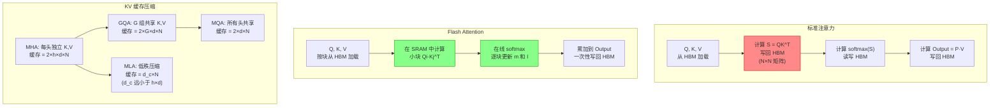

# 注意力优化（Attention Optimization）

## 概念解释

注意力优化是一组围绕 Transformer 自注意力（Self-Attention）机制做加速和省内存的技术集合。它不改变模型的基本结构，而是在"怎样算注意力"这一步做文章——用更聪明的内存访问方式、更少的 KV 缓存（KV Cache）、更稀疏的计算模式，让大模型在同样的硬件上跑得更快、吃的显存更少。

标准自注意力的计算复杂度是 $O(N^2)$（N 为序列长度）。当序列长度从 2K 增长到 128K，注意力矩阵的大小从 400 万膨胀到 160 亿——既装不进显存，也算不过来。注意力优化就是要打破这个二次方的枷锁。

目前主流的优化路线有三条：第一条是 **IO 感知优化**（以 Flash Attention 为代表），不改变计算量但大幅减少显存读写；第二条是 **KV 缓存压缩**（以 MQA、GQA、MLA 为代表），减少需要存储的 Key/Value 数量；第三条是 **稀疏/局部注意力**（以滑动窗口、Longformer 为代表），让每个 Token 只关注一部分邻居而不是全序列。这三条路线互不排斥，可以组合使用。

## 关键结构

| 优化路线 | 代表技术 | 核心思路 |
|---------|---------|---------|
| IO 感知优化 | Flash Attention 系列 | 把大矩阵分块，在 GPU 片上高速缓存（SRAM）中完成计算，减少对慢速显存（HBM）的读写 |
| KV 缓存压缩 | MQA / GQA / MLA | 让多个查询头共享同一组 Key-Value，或用低秩压缩把 KV 缓存变小 |
| 稀疏注意力 | 滑动窗口 / Longformer / BigBird | 每个 Token 只关注局部窗口或少量全局 Token，把 $O(N^2)$ 降到 $O(N)$ |
| 推理内存管理 | PagedAttention（vLLM） | 把 KV 缓存像操作系统管理内存页一样按需分配，消除碎片浪费 |

### 结构 1：Flash Attention — IO 感知的分块计算

标准实现会在 GPU 全局显存（HBM，High Bandwidth Memory，高带宽内存）中生成一整个 $N \times N$ 的注意力矩阵，然后再做 softmax 和矩阵乘法。HBM 虽然带宽大（约 2-3 TB/s），但相比 GPU 片上的 SRAM（约 19 TB/s 带宽，但容量只有几十 MB）还是慢很多。Flash Attention 的核心见解：**瓶颈不是计算量，而是内存搬运量**。它把 Q、K、V 分成小块，每块都在 SRAM 里完成全部计算，算完直接写回结果，不生成完整的 $N \times N$ 中间矩阵。

- **Flash Attention v1**（2022）：首次提出分块 + 在线 softmax 技巧，在 A100 上比标准实现快 2-4 倍，内存从 $O(N^2)$ 降到 $O(N)$。
- **Flash Attention v2**（2023）：优化了 GPU 线程分工（warp partitioning），减少冗余计算，在 A100 上达到理论吞吐量的 73%。
- **Flash Attention v3**（2024）：专为 Hopper 架构（H100/H200）设计，利用 warp-specialization 实现计算与数据搬运重叠，支持 FP8 低精度，H100 上 GPU 利用率达 75%。

### 结构 2：KV 缓存压缩 — MQA、GQA 与 MLA

在自回归推理中，模型每生成一个 Token 都要读取之前所有 Token 的 Key 和 Value（即 KV Cache）。当序列很长、batch size 很大时，KV Cache 占用的显存比模型参数本身还多。

- **MQA（Multi-Query Attention，多查询注意力）**：所有查询头共享同一组 K 和 V。KV Cache 直接缩小到原来的 $1/h$（h 为头数），但模型质量有一定下降。由 Shazeer 在 2019 年提出，PaLM、Falcon 等模型采用。
- **GQA（Grouped-Query Attention，分组查询注意力）**：把查询头分成 G 个组，每组共享一组 K-V。当 G=1 时退化为 MQA，当 G=h 时退化为标准 MHA。LLaMA 2/3、Mistral 等主流模型采用。GQA 在推理速度和模型质量之间取得了比 MQA 更好的平衡。
- **MLA（Multi-head Latent Attention，多头潜注意力）**：DeepSeek-V2/V3/R1 提出。不直接缓存 K 和 V，而是把输入压缩为一个低维潜向量（latent vector），推理时再解压回 K 和 V。相比标准 MHA，KV Cache 缩小到 4%-14%，且 DeepSeek 声称模型质量不降反升。

### 结构 3：稀疏与局部注意力

让每个 Token 不再关注全部 Token，而是只关注一个"子集"：

- **滑动窗口注意力（Sliding Window Attention）**：每个 Token 只看前后 W 个位置。虽然单层感受野有限，但经过 L 层堆叠后有效感受野为 $W \times L$。Mistral 7B 用 W=4096，32 层堆叠后理论感受野超 128K。
- **Longformer 模式**：局部窗口 + 少量全局 Token（如 [CLS]），全局 Token 充当信息枢纽。
- **BigBird 模式**：局部窗口 + 全局 Token + 随机连接。随机连接保证远距离信息在概率上能被捕捉到。

### 结构 4：PagedAttention — 推理时的内存管理

vLLM 团队在 2023 年提出 PagedAttention，借鉴操作系统虚拟内存的分页机制管理 KV Cache。传统方式为每个请求预分配一大块连续显存，但因生成长度未知而大量浪费（实测利用率仅 20-40%）。PagedAttention 把 KV Cache 切成固定大小的"页"（block），按需分配，内存浪费从 60-80% 降到不足 4%，吞吐量提升 2-4 倍。

## 核心原理

### 原理说明

以 Flash Attention 为例，说明"IO 感知优化"是如何工作的。

标准注意力的计算公式：

$$\text{Attention}(Q, K, V) = \text{softmax}\left(\frac{QK^T}{\sqrt{d_k}}\right) V$$

直接算需要在显存中构造 $N \times N$ 的矩阵 $S = QK^T$，对 N=4096、d=64 而言，这个矩阵占 64 MB（FP16），对 N=128K 则需要 64 GB。

Flash Attention 的做法是**分块 + 在线 softmax**：

1. 把 Q 按行切成大小为 $B_r$ 的块，K 和 V 按行切成大小为 $B_c$ 的块。
2. 对每对 $(Q_i, K_j)$，在 SRAM 中计算一个 $B_r \times B_c$ 的小注意力矩阵。
3. 用"在线 softmax"技巧（维护当前最大值 m 和指数和 l）逐块累积 softmax 结果，不需要等所有块算完才做归一化。
4. 每个小块计算完毕后，立即把对输出的贡献累加到最终结果里，不保存中间的 $N \times N$ 矩阵。

结果：计算量不变（仍然是 $O(N^2 d)$ 浮点运算），但 HBM 读写量从 $O(N^2 + Nd)$ 降到 $O(N^2 d^2 / M)$（M 为 SRAM 大小）。由于 GPU 是"带宽受限"的，减少读写量直接转化为速度提升。

GQA 的原理更直观：标准 MHA 中每个注意力头有独立的 $K_h$ 和 $V_h$，GQA 则把 h 个头分成 G 组，同组内的头共享同一份 K 和 V。推理时 KV Cache 大小从 $2 \times h \times d \times N$ 降到 $2 \times G \times d \times N$，当 G 远小于 h 时节省显著。

### Mermaid 图解



图中标红节点是标准注意力的瓶颈——在 HBM 中构造和读写 $N \times N$ 矩阵。标绿节点是 Flash Attention 的关键改进——在 SRAM 中完成计算，避免中间矩阵落地。下方展示了 KV 缓存从 MHA 到 GQA/MQA/MLA 的逐步压缩路径。

### 运行示例

```python
# 伪代码：Flash Attention 分块计算核心逻辑
# 说明 IO 感知优化的关键步骤，非完整实现

def flash_attention_pseudocode(Q, K, V, block_size):
    """
    Q, K, V: 形状 (N, d)
    block_size: 分块大小 Br/Bc
    """
    N, d = Q.shape
    O = zeros(N, d)       # 输出矩阵
    l = zeros(N)          # softmax 分母累积
    m = full(N, -inf)     # 当前最大值（用于数值稳定）

    # 外层循环：遍历 K, V 的块
    for j in range(0, N, block_size):
        Kj = K[j:j+block_size]    # 从 HBM 加载一块 K
        Vj = V[j:j+block_size]    # 从 HBM 加载一块 V

        # 内层循环：遍历 Q 的块
        for i in range(0, N, block_size):
            Qi = Q[i:i+block_size]    # 从 HBM 加载一块 Q

            # ---- 以下全部在 SRAM 中完成 ----
            Sij = Qi @ Kj.T / sqrt(d)    # 小块注意力分数
            m_new = max(m[i:i+block_size], Sij.max(axis=1))
            P = exp(Sij - m_new[:, None])  # 数值稳定的 softmax 分子

            # 在线更新 softmax 累积量
            l_new = exp(m[i:i+block_size] - m_new) * l[i:i+block_size] + P.sum(axis=1)
            O[i:i+block_size] = (exp(m[i:i+block_size] - m_new)[:, None]
                                 * O[i:i+block_size] + P @ Vj)

            m[i:i+block_size] = m_new
            l[i:i+block_size] = l_new

    # 最终归一化
    O = O / l[:, None]
    return O
```

伪代码展示了 Flash Attention 的两层循环结构和在线 softmax 更新逻辑。`m` 维护当前最大值用于数值稳定，`l` 累积 softmax 分母。整个过程不生成完整的 $N \times N$ 矩阵，每个小块算完即合并到输出。

```python
# GQA 的最小示意：分组共享 K, V
# 基于 PyTorch 语法（torch >= 2.0）

import torch

batch, seq_len, num_heads, head_dim = 1, 256, 8, 64
num_kv_groups = 2  # GQA: 8 个查询头分成 2 组，每组 4 个头共享一份 K,V

Q = torch.randn(batch, seq_len, num_heads, head_dim)      # 8 个独立的查询头
K = torch.randn(batch, seq_len, num_kv_groups, head_dim)   # 只有 2 组 K
V = torch.randn(batch, seq_len, num_kv_groups, head_dim)   # 只有 2 组 V

# 将 K, V 扩展（repeat）到与 Q 相同的头数
heads_per_group = num_heads // num_kv_groups  # = 4
K_expanded = K.repeat_interleave(heads_per_group, dim=2)  # (1, 256, 8, 64)
V_expanded = V.repeat_interleave(heads_per_group, dim=2)

# 标准注意力计算（简化版）
scores = torch.einsum("bshd,bthd->bhst", Q, K_expanded) / (head_dim ** 0.5)
attn = scores.softmax(dim=-1)
output = torch.einsum("bhst,bthd->bshd", attn, V_expanded)

# KV Cache 对比
mha_cache = 2 * num_heads * head_dim * seq_len      # MHA: 2×8×64×256 = 262144
gqa_cache = 2 * num_kv_groups * head_dim * seq_len   # GQA: 2×2×64×256 = 65536
print(f"MHA KV Cache: {mha_cache} 个参数")
print(f"GQA KV Cache: {gqa_cache} 个参数")
print(f"GQA 节省: {(1 - gqa_cache/mha_cache)*100:.0f}%")
# 输出: GQA 节省: 75%
```

GQA 示例中，8 个查询头只需要 2 组 K-V，推理时 KV Cache 缩小 75%。`repeat_interleave` 操作在计算时将 K-V 广播到每个查询头，不额外占用缓存空间。

## 易混概念辨析

| 概念 | 与注意力优化的区别 | 更适合关注的重点 |
|------|-------------------|-----------------|
| 模型量化（Quantization） | 量化压缩的是模型权重和激活值的精度（如 FP16→INT8），注意力优化改的是注意力计算本身的流程和内存模式 | 量化关注"用更少的位数表示权重"，注意力优化关注"用更少的内存搬运和更少的 KV 存储完成注意力计算" |
| 模型剪枝（Pruning） | 剪枝删掉不重要的权重或结构（如整层、整头），注意力优化不删除结构，而是改变注意力的计算和存储方式 | 剪枝是"让模型变小"，注意力优化是"让同样大的模型跑得更快" |
| KV Cache | KV Cache 是推理时缓存历史 Key-Value 的机制本身，注意力优化（如 GQA、MLA、PagedAttention）是对 KV Cache 做压缩或管理的技术 | KV Cache 是"问题背景"，注意力优化是"解决方案" |
| 模型并行（Model Parallelism） | 模型并行把模型切分到多张 GPU 上，注意力优化在单张 GPU 内部改善注意力计算效率 | 两者互补——注意力优化减少单卡开销，模型并行解决单卡放不下的问题 |

核心区别：

- **注意力优化**：在不改变模型结构的前提下，优化注意力的计算流程和内存使用
- **量化/剪枝**：改变模型权重本身的精度或结构
- **KV Cache**：是推理加速的基础设施，注意力优化中的 GQA/MLA/PagedAttention 是对它的进一步优化

## 适用边界与局限

### 适用场景

1. **长序列推理**：当输入序列超过 4K Token（如长文档问答、代码仓库分析），Flash Attention + GQA 组合可以把显存占用降低数倍，使单卡部署成为可能
2. **高并发推理服务**：PagedAttention 在 vLLM 中实现了接近零浪费的 KV Cache 管理，在同等硬件下把服务吞吐量提升 2-4 倍
3. **大模型训练**：Flash Attention 已成为 LLaMA、Mistral、DeepSeek 等模型训练的标配，节省 50-80% 的注意力内存开销
4. **资源受限部署**：在消费级 GPU（如 RTX 4090）上部署 7B-13B 模型时，GQA 和 Flash Attention 的组合是必要条件

### 不适合的场景

1. **短序列且低并发**：当序列长度 < 512 且只有单条请求时，Flash Attention 的分块开销可能不比标准实现快，优化收益不明显
2. **需要完整注意力矩阵的任务**：某些可解释性研究需要提取完整的注意力权重矩阵进行分析，Flash Attention 不保存中间矩阵，稀疏注意力丢弃了部分注意力对

### 局限性

1. **硬件绑定**：Flash Attention 的加速幅度与 GPU 架构强相关。v3 版本专为 Hopper 架构优化，在 Ampere（A100）上只能用 v2，在更老的 GPU 上甚至无法运行。CPU 推理无法使用 Flash Attention
2. **稀疏模式需要任务适配**：没有通用最优的稀疏模式。滑动窗口对对话场景很好，但对需要全局信息的任务（如文档摘要）可能丢失关键信息
3. **MLA 的生态限制**：MLA 目前主要在 DeepSeek 系列模型中使用，主流推理框架对它的支持仍在完善中
4. **与部分训练技术的兼容性**：某些量化 + LoRA 微调的组合在开启 Flash Attention 时可能出现兼容性问题

## 常见误区

| 常见误区 | 正确理解 |
|----------|----------|
| Flash Attention 改变了注意力的计算结果 | Flash Attention 是**精确实现**（exact attention），输出与标准注意力在数学上完全一致。它只改变计算的执行顺序和内存访问模式，不做任何近似 |
| GQA 和 MQA 只是"缩水版"的 MHA，效果一定更差 | GQA 在多数基准测试上接近 MHA 的质量，LLaMA 2 70B 采用 GQA 后推理速度大幅提升且质量损失极小。MLA 甚至声称质量优于 MHA |
| 稀疏注意力一定会丢失远距离信息 | BigBird 的随机连接在概率上保证了远距离信息流通。此外层间堆叠效应使滑动窗口的有效感受野远大于单层窗口大小 |
| PagedAttention 只是 vLLM 的内部实现细节 | PagedAttention 的分页思想已被 TensorRT-LLM、HuggingFace TGI 等主流推理框架采纳，是当前 LLM 推理服务的标准技术 |

## 思考题

<details>
<summary>初级：Flash Attention 为什么能在不减少计算量的情况下实现加速？</summary>

**参考答案：**

Flash Attention 的加速来自减少 GPU 显存（HBM）的读写次数，而非减少浮点运算量。标准实现需要把 $N \times N$ 的注意力矩阵在 HBM 中来回读写多次，而 Flash Attention 通过分块计算让每个小块在高速的 SRAM 中完成全部运算，只在最终写回结果时访问 HBM。由于 GPU 的性能瓶颈通常在内存带宽而非算力，减少读写就直接转化为时间缩短。

</details>

<details>
<summary>中级：GQA、MQA、MLA 三者各自的 KV Cache 大小是多少？在什么场景下选哪个？</summary>

**参考答案：**

设注意力头数为 h、头维度为 d、序列长度为 N：
- MHA（标准）：$2 \times h \times d \times N$
- MQA：$2 \times d \times N$（所有头共享一组 K-V）
- GQA（G 组）：$2 \times G \times d \times N$（G 介于 1 和 h 之间）
- MLA：$d_c \times N$（$d_c$ 为潜向量维度，远小于 $h \times d$）

选型建议：对质量要求高且 KV Cache 不是瓶颈时用 MHA；追求推理速度且可接受少量质量损失时用 GQA（目前最主流）；极端长序列场景用 MLA（需 DeepSeek 生态）；MQA 更多出现在早期模型中，新模型一般优先选 GQA。

</details>

<details>
<summary>中级/进阶：假设你要在单张 A100（80GB）上部署一个 70B 参数模型，处理 32K Token 的输入。请分析 KV Cache 的显存占用，并说明需要哪些注意力优化技术的组合。</summary>

**参考答案：**

70B 模型典型配置：80 层、64 个注意力头、头维度 128。

MHA 的 KV Cache = $2 \times 80 \times 64 \times 128 \times 32768 \times 2$（FP16 每参数 2 字节）= 约 84 GB，单卡根本放不下（还没算模型参数本身约 140 GB）。

必须组合使用：(1) **模型量化**（INT4 量化后模型约 35GB）；(2) **GQA**（LLaMA 2 70B 用 8 组 GQA，KV Cache 降到 $2 \times 80 \times 8 \times 128 \times 32768 \times 2 \approx$ 10.5 GB）；(3) **Flash Attention**（避免 $32K \times 32K$ 的中间矩阵占满显存）；(4) **PagedAttention**（消除 KV Cache 的碎片浪费）。四者组合后模型参数（35GB）+ KV Cache（约 10GB）+ 激活等开销 ≈ 约 55GB，可以在 80GB A100 上运行。

</details>

## 参考资料

1. Dao, T. et al. (2022). "FlashAttention: Fast and Memory-Efficient Exact Attention with IO-Awareness." arXiv:2205.14135. https://arxiv.org/abs/2205.14135
2. Dao, T. (2023). "FlashAttention-2: Faster Attention with Better Parallelism and Work Partitioning." arXiv:2307.08691. https://arxiv.org/abs/2307.08691
3. Shah, J. et al. (2024). "FlashAttention-3: Fast and Accurate Attention with Asynchrony and Low-precision." arXiv:2407.08608. https://arxiv.org/abs/2407.08608
4. Ainslie, J. et al. (2023). "GQA: Training Generalized Multi-Query Transformer Models from Multi-Head Checkpoints." arXiv:2305.13245. https://arxiv.org/abs/2305.13245
5. Shazeer, N. (2019). "Fast Transformer Decoding: One Write-Head is All You Need." arXiv:1911.02150. https://arxiv.org/abs/1911.02150
6. DeepSeek-AI (2024). "DeepSeek-V2: A Strong, Economical, and Efficient Mixture-of-Experts Language Model." arXiv:2405.04434. https://arxiv.org/abs/2405.04434
7. Kwon, W. et al. (2023). "Efficient Memory Management for Large Language Model Serving with PagedAttention." arXiv:2309.06180. https://arxiv.org/abs/2309.06180
8. Dao-AILab/flash-attention GitHub 仓库. https://github.com/Dao-AILab/flash-attention
