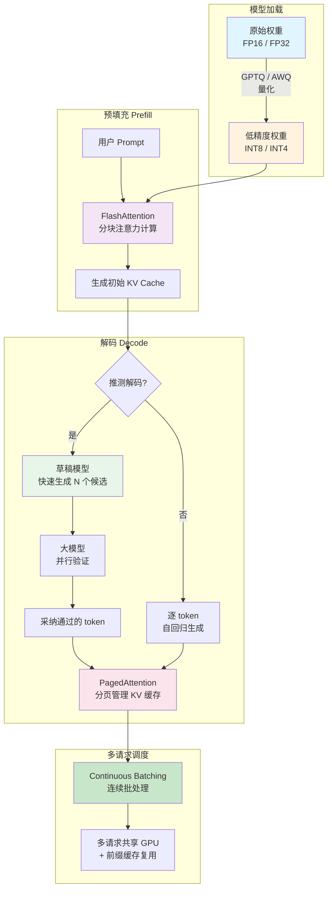

# 高效推理（Efficient Inference）

## 概念解释

高效推理（Efficient Inference）是一组旨在降低大语言模型（LLM）推理阶段显存占用、计算延迟和硬件成本的技术集合。它不是某一个单独的算法，而是量化（Quantization）、KV 缓存优化（KV Cache Optimization）、注意力加速（Attention Acceleration）、推测解码（Speculative Decoding）等多种优化手段的统称。

大模型推理面临一个核心矛盾：模型越大、生成质量越好，但所需的显存和计算资源也越多。一个 70B 参数的模型以 FP32 精度加载，需要约 280GB 显存，远超单张消费级 GPU 的容量。即使能装下模型本身，自回归生成过程中不断累积的 KV 缓存（Key-Value Cache）也会迅速占满剩余显存。高效推理的目标就是在"生成质量基本不变"的前提下，大幅降低这些资源消耗。

与训练阶段的优化不同，推理优化面向的是已经训练好的模型，不需要修改模型参数的学习过程，而是在"怎么用这个模型"上做文章——用更少的位数存储权重、更聪明地管理缓存、更高效地调度计算。

## 关键结构

高效推理技术可从四个维度理解：

| 维度 | 代表技术 | 核心思路 |
|------|----------|----------|
| 模型量化 | GPTQ、AWQ、BitsAndBytes | 降低权重精度（FP32 → INT8/INT4），减小模型体积 |
| KV 缓存优化 | PagedAttention、GQA、MQA | 减少缓存显存浪费，提升并发能力 |
| 注意力计算加速 | FlashAttention、Flash-Decoding | 优化注意力计算的内存访问模式，减少 IO 瓶颈 |
| 解码策略加速 | Speculative Decoding、Medusa | 用小模型预生成草稿 token，大模型并行验证，打破逐 token 生成的瓶颈 |

### 维度 1：模型量化（Model Quantization）

将模型权重从高精度浮点数（FP32/FP16）转换为低位整数（INT8/INT4）。核心假设是：大模型权重中存在大量冗余精度，适当降低数值精度不会显著影响输出质量。量化后的模型体积更小、计算更快，能在更便宜的硬件上运行。

主流方法包括：
- **GPTQ**（Generative Pre-trained Transformer Quantization）：逐行量化权重矩阵，利用 Hessian（海森矩阵）信息最小化量化误差，2022 年首次实现 175B 模型的 4-bit 量化
- **AWQ**（Activation-aware Weight Quantization，激活感知权重量化）：根据激活值的重要性分布来决定哪些权重需要保留更高精度，泛化能力更好

### 维度 2：KV 缓存优化（KV Cache Optimization）

自回归生成时，每产出一个新 token 都要访问之前所有 token 的 Key 和 Value 向量。传统做法为每个序列预分配最大长度的连续显存块，导致大量内部碎片。优化手段包括：
- **PagedAttention**：借鉴操作系统虚拟内存的分页思想，把 KV 缓存拆成固定大小的块（block），按需分配、不连续存储，将显存浪费从 60-80% 降至 4% 以下
- **GQA**（Grouped-Query Attention，分组查询注意力）：多个查询头共享同一组 KV 头，减少 KV 缓存的总量。Llama 2 70B 等模型已采用此设计
- **MQA**（Multi-Query Attention，多查询注意力）：所有查询头共享同一对 KV 头，压缩更激进但可能损失精度

### 维度 3：注意力计算加速

标准注意力计算需要将完整的 Q、K、V 矩阵写入 GPU 的高带宽显存（HBM），产生大量 IO 开销。FlashAttention 通过分块计算（tiling）将数据尽量留在片上缓存（SRAM）中完成，避免反复读写 HBM，在不改变数学结果的前提下将注意力计算加速 2-4 倍。

### 维度 4：推测解码（Speculative Decoding）

传统自回归解码每步只能生成 1 个 token，硬件利用率低。推测解码引入一个小型"草稿模型"（Draft Model），先快速生成若干候选 token，再由大模型一次性并行验证。验证通过的 token 直接采纳，不通过的从失败处重新生成。由于验证多个 token 的计算量与生成单个 token 接近，整体速度可提升 2-3 倍，且输出分布与原始大模型完全一致。

## 核心原理

### 原理说明

以一次完整的 LLM 推理请求为例，说明各优化技术在推理流程中的作用位置：

1. **模型加载阶段**：量化技术在此生效。原始 FP16 权重经过 GPTQ 或 AWQ 算法转换为 INT4 格式存储，加载到 GPU 时占用的显存降至原来的 1/4。
2. **预填充阶段（Prefill）**：用户输入的 prompt 被一次性处理，计算所有 token 的 KV 向量。FlashAttention 在此阶段加速注意力计算，减少 HBM 读写。
3. **逐步解码阶段（Decode）**：每步生成一个新 token，同时将新 KV 存入缓存。PagedAttention 管理 KV 缓存的分配与回收，GQA/MQA 减少每步新增的 KV 数据量。推测解码在此阶段将"逐步生成"变为"批量猜测 + 并行验证"。
4. **多请求调度**：多个并发请求共享 GPU，PagedAttention 允许不同请求的 KV 块不连续存储、支持公共前缀共享（如相同的系统提示），连续批处理（Continuous Batching）动态调度请求，最大化 GPU 利用率。

### Mermaid 图解



图中展示了四组优化技术在推理流程中的位置：量化作用于模型加载、FlashAttention 作用于预填充计算、推测解码和 PagedAttention 作用于解码阶段、连续批处理作用于多请求调度。实际部署中，这些技术通常组合使用，而非二选一。

### 运行示例

以下用伪代码展示量化加载和 PagedAttention 推理的核心逻辑：

```python
# 伪代码：展示高效推理核心流程（非完整可运行代码）

# 1. 量化加载 —— 用 INT4 精度加载模型，显存降为原来的 1/4
model = load_model("llama-2-7b", quantization="int4")
# 原始 FP16 需要 ~14GB 显存，INT4 仅需 ~3.5GB

# 2. PagedAttention 管理 KV 缓存
kv_cache = PagedKVCache(
    block_size=16,        # 每个块存 16 个 token 的 KV
    num_blocks=1024,      # 总共 1024 个块，按需分配
)

# 3. 推理过程
prompt_tokens = tokenize("高效推理的核心思想是")
kv_cache.allocate(request_id=1)         # 按需分配块，不预占最大长度

for step in decoding_loop:
    new_token = model.forward(prompt_tokens, kv_cache)
    kv_cache.append(new_token.kv)       # 追加到已有块，块满了自动分配新块
    if new_token == EOS:
        kv_cache.free(request_id=1)     # 请求结束，立即释放块供其他请求使用
        break
```

上述代码对应两个关键机制：量化将模型体积压缩到可在单卡部署的大小；PagedAttention 的按需分配和即时释放避免了显存浪费。真实场景中，vLLM、TensorRT-LLM 等推理引擎已内置这些功能，使用者通过参数配置即可启用。

## 易混概念辨析

| 概念 | 与高效推理的区别 | 更适合关注的重点 |
|------|-----------------|-----------------|
| 高效训练（Efficient Training） | 作用于训练阶段（梯度计算、参数更新），目标是降低训练成本；高效推理作用于已训练好的模型 | 混合精度训练、梯度检查点、数据并行 |
| 模型压缩（Model Compression） | 是高效推理的子集之一，侧重减小模型本身的体积（量化、剪枝、蒸馏） | 模型体积、参数量、存储空间 |
| 推理引擎（Inference Engine） | 是实现高效推理技术的工程框架（如 vLLM、TensorRT-LLM），而非技术原理本身 | 框架选型、API 使用、部署运维 |
| 模型蒸馏（Knowledge Distillation） | 是训练一个更小的新模型去模仿大模型的行为，需要额外的训练过程；量化则直接转换已有权重的精度 | 训练数据、师生模型结构设计 |

核心区别：

- **高效推理**：关注"已有模型怎么跑得更快更省"，不修改模型的训练过程
- **高效训练**：关注"模型怎么训得更快更省"，涉及训练算法和基础设施
- **模型压缩**：高效推理中"减小模型"的那部分技术，是手段而非全貌
- **推理引擎**：高效推理技术的工程载体，关注的是实现和部署

## 适用边界与局限

### 适用场景

1. **资源受限的本地部署**：消费级 GPU（如 RTX 4090，24GB 显存）无法加载完整精度的大模型。通过 INT4 量化，7B 模型仅需约 3.5GB 显存，13B 模型约 7GB，单卡即可运行
2. **高并发在线推理服务**：云服务需要在同一块 GPU 上服务更多并发请求。PagedAttention + Continuous Batching 可将单卡并发能力提升数倍，直接降低单请求成本
3. **长文本生成场景**：处理数万 token 的长文本时，KV 缓存会急剧膨胀。分页管理和 GQA 能有效控制缓存占用，避免 OOM（Out of Memory，显存溢出）
4. **实时交互应用**：聊天机器人、代码补全等场景对延迟敏感。推测解码可将首 token 延迟和整体生成速度提升 2-3 倍

### 不适合的场景

1. **对精度极度敏感的任务**：数学推理、逻辑推导等任务中，INT4 量化可能引入可感知的精度下降。此时应优先使用 FP16 或 INT8，或改用更大的模型
2. **模型本身很小（< 1B 参数）**：小模型的冗余有限，激进量化的精度损失比例更大，且显存和速度瓶颈不明显，优化收益有限

### 局限性

1. **量化精度损失不可完全消除**：虽然 GPTQ、AWQ 等方法已大幅改善，但在部分基准测试上，INT4 量化仍可观察到 1-5% 的精度下降，需要在具体任务上实测验证
2. **硬件适配差异**：INT4 计算在 NVIDIA Ampere/Hopper 架构 GPU 上有硬件加速（Tensor Core 支持），但在旧款 GPU 或 CPU 上可能没有加速效果
3. **推测解码的加速比不稳定**：草稿模型的预测准确率直接影响加速效果。对于高度创造性或不可预测的生成任务，候选 token 的接受率可能较低，加速比会下降
4. **技术栈组合复杂度**：量化格式（GPTQ/AWQ/GGUF）、推理引擎（vLLM/TensorRT-LLM/llama.cpp）、硬件平台之间存在兼容性问题，选型和调试需要经验

## 常见误区

| 常见误区 | 正确理解 |
|----------|----------|
| 量化到 INT4 精度一定大幅下降 | GPTQ、AWQ 等现代方法通过校准数据和优化算法，可将 INT4 量化的精度损失控制在较低水平。HuggingFace 社区大量 4-bit 模型已在实际应用中广泛使用 |
| KV Cache 优化只对长序列有用 | PagedAttention 对短序列同样有效。多个并发请求可共享公共前缀的 KV 块（如相同的系统提示），按需分配也能减少短序列的显存浪费 |
| 推测解码会改变模型输出分布 | 标准推测解码使用拒绝采样（Rejection Sampling）保证输出分布与原始大模型数学上完全一致，只加速不改变结果 |
| 用了 vLLM 就自动拥有所有优化 | vLLM 提供 PagedAttention 和 Continuous Batching，但模型量化需要在上游用 GPTQ/AWQ 等工具完成后再加载。两者需要配合使用 |

## 思考题

<details>
<summary>初级：量化为什么能在降低精度的同时基本保持模型效果？</summary>

**参考答案：**

大模型的权重值分布通常集中在一个较窄的范围内，大部分权重对输出的影响很小。量化本质上是用更少的位数来近似这些数值，对于影响小的权重，近似带来的误差不会显著改变模型输出。此外，GPTQ 等方法利用 Hessian 矩阵信息，优先保护对输出影响大的权重的精度，进一步减小了量化误差。

</details>

<details>
<summary>中级：PagedAttention 为什么能将显存浪费从 60-80% 降至 4% 以下？</summary>

**参考答案：**

传统方法为每个序列预分配最大长度的连续显存空间，而实际序列长度往往远短于最大值，导致大量显存空闲但无法被其他请求使用（内部碎片）。PagedAttention 借鉴操作系统的分页机制，将 KV 缓存拆分为固定大小的块（如 16 个 token 一块），按需分配。序列增长时动态追加新块，结束时立即释放，且多个请求的公共前缀可共享同一物理块。这样显存利用率接近理论最优。

</details>

<details>
<summary>中级/进阶：如果你要为一个日均 10 万请求的在线客服系统选择推理方案，会如何组合这些优化技术？需要考虑哪些因素？</summary>

**参考答案：**

推荐组合：AWQ INT4 量化 + vLLM（内置 PagedAttention + Continuous Batching）+ 前缀缓存。理由：客服场景的系统提示高度统一（前缀缓存命中率高）、并发量大（PagedAttention 和连续批处理提升吞吐）、对延迟敏感但对创造性要求不高（INT4 精度损失可接受）。需要考虑的因素包括：模型大小与 GPU 显存的匹配、量化后在客服领域测试集上的精度验证、峰值并发下的 OOM 风险（需设置 gpu_memory_utilization 上限）、以及量化格式与推理引擎的兼容性。

</details>

## 参考资料

1. Kwon, W. et al. "Efficient Memory Management for Large Language Model Serving with PagedAttention." SOSP 2023. [https://arxiv.org/abs/2309.06180](https://arxiv.org/abs/2309.06180)
2. Frantar, E. et al. "GPTQ: Accurate Post-Training Quantization for Generative Pre-Trained Transformers." ICLR 2023. [https://arxiv.org/abs/2210.17323](https://arxiv.org/abs/2210.17323)
3. Lin, J. et al. "AWQ: Activation-aware Weight Quantization for LLM Compression and Acceleration." MLSys 2024. [https://arxiv.org/abs/2306.00978](https://arxiv.org/abs/2306.00978)
4. Leviathan, Y. et al. "Fast Inference from Transformers via Speculative Decoding." ICML 2023. [https://arxiv.org/abs/2211.17192](https://arxiv.org/abs/2211.17192)
5. Dao, T. et al. "FlashAttention: Fast and Memory-Efficient Exact Attention with IO-Awareness." NeurIPS 2022. [https://arxiv.org/abs/2205.14135](https://arxiv.org/abs/2205.14135)
6. vLLM 官方文档. [https://docs.vllm.ai/](https://docs.vllm.ai/)
