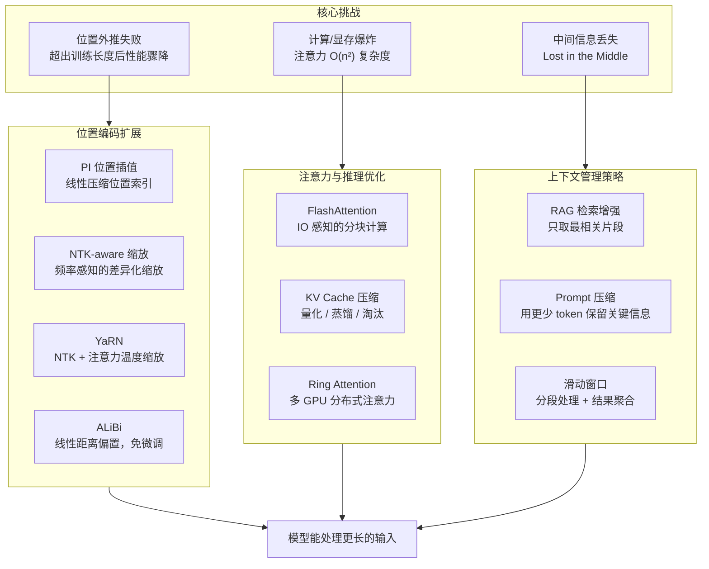

# 长上下文处理（Long Context Handling）

## 概念解释

长上下文处理是一组让大语言模型（LLM, Large Language Model）能够接收并有效利用超长文本输入的技术。通俗地说，模型出厂时有一个"阅读窗口"——上下文窗口（Context Window），超出这个窗口的文字模型就"看不见"了。长上下文处理就是想办法把这个窗口撑大，同时让模型在窗口变大后依然能好好读完、读准。

为什么需要它？因为真实世界的任务往往远超早期模型的窗口大小。一份法律合同动辄数万字，一次多轮对话的历史消息会不断累积，一个代码仓库可能有几十个文件需要一起理解。如果模型只能看 4K 个 token（词元），就像只准你读一本书的前两页就要回答全书内容——显然不够用。

与传统的"截断丢弃"做法不同，长上下文技术从三个层面入手：改进位置编码（Position Encoding）让模型"认识"更远的位置、优化注意力计算让显存撑得住、压缩或检索让有限窗口装下更多信息。截至 2025 年，主流模型的上下文窗口已从早期的 2K-4K 扩展到 128K-1M 级别（如 GPT-4 Turbo 128K、Claude 3 200K、Gemini 1.5 Pro 1M）。

## 关键结构

长上下文处理涉及的技术可以从三个维度理解：

| 维度 | 核心问题 | 代表技术 |
|------|---------|---------|
| 位置编码扩展 | 模型如何"认识"训练时没见过的远距离位置？ | RoPE 缩放（PI、NTK-aware、YaRN）、ALiBi |
| 注意力与推理优化 | 上下文变长后，计算和显存怎么扛得住？ | FlashAttention、稀疏注意力、KV Cache 压缩、Ring Attention |
| 上下文管理策略 | 窗口就这么大，如何塞进最有用的信息？ | 滑动窗口、Prompt 压缩、RAG 检索增强 |

### 维度 1：位置编码扩展

Transformer（变换器）模型本身不知道 token 的先后顺序，需要位置编码（Position Encoding）来告诉模型"这个词在第几个位置"。如果模型训练时只见过位置 0~4095，推理时遇到位置 10000 就会"懵"——输出质量急剧下降。位置编码扩展技术的目标就是让模型在训练长度之外的位置上依然能正常工作。

### 维度 2：注意力与推理优化

标准自注意力（Self-Attention）的计算量和显存占用与序列长度的平方成正比（O(n^2)）。上下文从 4K 扩到 128K，计算量膨胀约 1000 倍。不做优化的话，即使最强的 GPU 也撑不住。这个维度的技术目标是在保持模型质量的前提下降低长序列的计算和显存开销。

### 维度 3：上下文管理策略

即使模型支持 128K 上下文，也不意味着把所有信息无脑塞进去就行。研究表明模型对超长输入中间部分的信息利用率明显偏低（即"Lost in the Middle"问题）。上下文管理策略的目标是筛选、压缩、组织输入信息，让模型能真正用好窗口里的每一个 token。

## 核心原理

### 原理说明

#### 1. RoPE 与位置编码扩展

目前主流 LLM（LLaMA、Mistral、Qwen 等）普遍使用 RoPE（Rotary Position Embedding，旋转位置编码）。RoPE 的核心思想是：用旋转矩阵把位置信息"编织"到 token 的向量表示中，使得两个 token 之间的注意力分数只取决于它们的相对距离。

RoPE 对每个位置 m 和频率维度 i，生成一对旋转角度 m * theta_i，其中 theta_i = 1/10000^(2i/d)。训练时模型只见过 m 在 [0, L_train] 范围内的角度值。当推理时 m 超过 L_train，角度值进入"未知区域"，模型性能骤降。

**位置插值（Position Interpolation, PI）** 的思路最直接：把超出范围的位置"压缩"回训练范围。如果训练长度是 4K、目标长度是 16K，就把所有位置乘以 4K/16K = 0.25，相当于把尺子的刻度压细。代价是相邻 token 之间的位置区分度变小，需要少量微调恢复。

**NTK-aware 缩放** 认识到不同频率维度的敏感度不同：高频维度捕捉局部细节（相邻几个 token 的关系），低频维度捕捉全局结构（段落级别的关系）。NTK-aware 对高频维度少缩放、低频维度多缩放，比均匀的 PI 更好地保留了局部分辨率。

**YaRN（Yet another RoPE extensioN）** 是这一族方法的集大成者。它在 NTK-aware 的基础上增加了注意力温度缩放（Attention Temperature Scaling），进一步稳定超长序列的注意力分布。YaRN 仅需用原始预训练数据量的约 0.1% 做微调，就能将上下文可靠地扩展到 128K+ 级别。

**ALiBi（Attention with Linear Biases）** 走了另一条路：不修改位置编码本身，而是在注意力分数上直接加一个与距离成正比的负偏置。距离越远，惩罚越大。这种设计天然支持长度外推（Extrapolation），无需额外微调。BLOOM 和 MPT 系列模型采用了这种方案。

#### 2. 注意力与推理优化

**FlashAttention** 通过重新组织注意力计算的内存访问模式，避免把完整的 n*n 注意力矩阵写入 GPU 高带宽内存（HBM），从而在不改变计算结果的前提下大幅降低显存占用、提升速度。FlashAttention-2 进一步优化了并行策略，已成为长上下文训练和推理的标配。

**KV Cache（键值缓存）压缩** 针对推理阶段。自回归生成时，每个新 token 都要与所有历史 token 做注意力计算，历史 token 的 Key 和 Value 向量需要缓存。128K 上下文的 KV Cache 可占数十 GB 显存。压缩方法包括：量化 KV Cache（用更低精度存储）、丢弃不重要的 KV 条目（如 H2O 算法保留"重型打手" token）、将 KV 蒸馏到 Beacon Token 中（Activation Beacon 方法）。

**Ring Attention / 分布式注意力** 将长序列切分到多块 GPU 上，每块 GPU 只计算一段序列的注意力，通过环状通信传递中间结果。这使得上下文长度可以随 GPU 数量线性扩展。

#### 3. Lost in the Middle 问题

斯坦福大学 2023 年的研究（Liu et al.）揭示了一个重要现象：当关键信息放在长上下文的中间部分时，模型的表现显著下降，呈现 U 形曲线——开头和结尾的信息被较好地利用，中间的信息容易被"遗忘"。

这个问题的根源与多个因素有关：注意力机制对开头 token 的天然偏好（attention sink 效应）、RoPE 在长距离上的衰减特性、以及训练数据中"答案多在开头/结尾"的分布偏差。

应对策略包括：将重要信息放在 Prompt 的开头或结尾、使用 RAG 检索最相关的片段而非塞入全部文本、以及模型层面的改进（如 CREAM 方法通过调整位置编码的衰减速率来缓解此问题）。

### Mermaid 图解



三组挑战对应三组解决方案。位置编码扩展解决"模型能不能认识远距离位置"的问题；推理优化解决"硬件能不能算得动"的问题；上下文管理解决"信息能不能被模型真正用好"的问题。实际工程中三者通常组合使用——比如用 YaRN 扩展位置编码 + FlashAttention 加速计算 + RAG 筛选输入内容。

### 运行示例

```python
# 位置插值的核心逻辑示意（伪代码）
# 说明 PI、NTK-aware、YaRN 三种方法对 RoPE 频率的不同处理方式

import math

def compute_rope_freqs(dim: int, base: float = 10000.0):
    """计算标准 RoPE 的频率向量"""
    # 每个频率维度 i 对应 theta_i = 1 / base^(2i/dim)
    return [1.0 / (base ** (2 * i / dim)) for i in range(dim // 2)]

def position_interpolation(position: int, scale_factor: float):
    """PI：直接将位置索引按比例缩小"""
    # 训练长度 4K → 目标 16K，scale_factor = 0.25
    return position * scale_factor

def ntk_aware_base(original_base: float, scale_factor: float):
    """NTK-aware：调高 base 使低频维度获得更大缩放"""
    # base 变大 → 低频维度的 theta 变小 → 等效于对低频做更大的"拉伸"
    return original_base * (scale_factor ** (dim / (dim - 2)))

# 直观对比：处理位置 8000（超出 4K 训练范围）
original_pos = 8000
train_length = 4096
target_length = 16384
scale = train_length / target_length  # 0.25

# PI：位置 8000 → 2000（压回训练范围内）
pi_pos = position_interpolation(original_pos, scale)
print(f"PI 插值后位置: {pi_pos}")  # 输出: 2000.0

# NTK-aware：不压缩位置，而是调整频率 base
dim = 128
new_base = ntk_aware_base(10000.0, target_length / train_length)
print(f"NTK-aware 新 base: {new_base:.0f}")  # base 从 10000 增大
```

上述代码展示了 PI 和 NTK-aware 两种方法的核心差异：PI 压缩位置索引本身，NTK-aware 调整频率基数。YaRN 在 NTK-aware 的基础上对不同频率维度分区处理，并额外引入注意力温度系数，此处未展开以保持示例简洁。

## 易混概念辨析

| 概念 | 与长上下文处理的区别 | 更适合关注的重点 |
|------|---------------------|------------------|
| RAG（检索增强生成） | RAG 是长上下文处理的一种上下文管理策略，但 RAG 的核心目标是引入外部知识，不局限于解决"长度"问题 | 外部知识库的构建与检索质量 |
| Context Engineering（上下文工程） | 上下文工程是更广的概念，关注"给模型喂什么信息"，长上下文处理只是其中"如何支撑更多信息"这一子问题 | Prompt 的整体设计与信息组织策略 |
| Sparse Attention（稀疏注意力） | 稀疏注意力是长上下文处理中"注意力优化"维度的具体技术，不等于长上下文处理的全部 | 注意力矩阵中哪些位置可以跳过不算 |
| Sliding Window Attention（滑动窗口注意力） | 滑动窗口注意力（如 Mistral 采用的）是一种模型架构设计，限制每个 token 只关注局部邻域，是长上下文处理技术之一 | 局部注意力的窗口大小和层间信息传递 |

核心区别：

- **长上下文处理**：关注"如何让模型能处理更长的输入"，是一个技术问题集合
- **RAG**：关注"如何用外部知识增强模型输出"，长度只是它附带解决的问题之一
- **上下文工程**：关注"如何最优地组织送给模型的全部信息"，长度只是约束条件之一

## 适用边界与局限

### 适用场景

1. **长文档理解与问答**：法律合同、学术论文、技术文档等需要模型一次性看到数万字内容才能准确回答的任务，是长上下文技术最直接的受益场景
2. **多轮对话与 Agent 记忆**：Agent 系统中对话历史不断累积，长上下文让模型能保持更长的"工作记忆"，减少信息遗忘
3. **代码仓库级理解**：软件开发中需要模型同时理解多个文件的依赖关系，长上下文窗口使跨文件推理成为可能
4. **Few-shot 大量示例注入**：当任务需要在 Prompt 中提供大量示例来引导模型行为时，更大的上下文窗口允许放入更多高质量示例

### 不适合的场景

1. **实时低延迟要求**：超长上下文的推理耗时和首 token 延迟（TTFT）随长度显著增加，对延迟敏感的实时交互场景不宜盲目使用最大上下文
2. **信息密度极低的输入**：如果输入文本大量冗余、与问题相关的信息占比很低，不如用 RAG 精准检索，塞入全文反而浪费 token 预算并可能触发 Lost in the Middle

### 局限性

1. **Lost in the Middle 尚未根治**：即使窗口支持 128K+，模型对中间位置信息的利用率仍然偏低。目前的缓解手段（位置编码改进、信息排布策略）只是减轻而非消除
2. **成本与长度正相关**：API 调用按 token 计费，128K 输入的成本是 4K 的 32 倍。即使本地部署，KV Cache 的显存占用也随长度线性增长
3. **位置编码扩展有上限**：PI/YaRN 等方法在极端扩展比例（如 32 倍以上）下性能衰减明显，不是无限可拉伸的
4. **评测与真实效果存在差距**：模型宣称支持 128K 上下文，不代表在 128K 长度上的效果与 4K 一样好。Needle-in-a-Haystack 测试通过不等于复杂推理任务也能通过

## 常见误区

| 常见误区 | 正确理解 |
|----------|----------|
| "模型支持 128K 上下文 = 128K 范围内效果一样好" | 上下文窗口是"能装多少"的上限，不是"装多少都一样好"的保证。实际效果随长度增加通常会有不同程度的衰减，尤其是中间位置的信息 |
| "上下文够长就不需要 RAG 了" | 长上下文和 RAG 解决不同层面的问题。长上下文解决"一次能看多少"，RAG 解决"从海量信息中找到最相关的"。对于百万级文档库，即使 1M 窗口也装不下，仍然需要检索 |
| "位置插值就是简单地把位置除以一个数" | PI 确实是线性缩放，但 NTK-aware 和 YaRN 已经是频率感知的非均匀缩放，不同维度的处理方式完全不同。笼统说"位置插值"容易掩盖方法间的本质差异 |
| "FlashAttention 改变了注意力的计算结果" | FlashAttention 的输出与标准注意力在数学上等价（在浮点误差范围内），它优化的是内存访问模式和计算分块策略，不改变算法语义 |

## 思考题

<details>
<summary>初级：RoPE 位置编码在超出训练长度时为什么会失效？位置插值（PI）用什么思路解决这个问题？</summary>

**参考答案：**

RoPE 在训练时只见过 [0, L_train] 范围内的旋转角度。超出这个范围后，角度值进入模型未学习过的区域，注意力分数的计算变得不可靠，导致输出质量骤降。

PI 的思路是线性缩放：把目标长度范围内的所有位置按比例压缩回训练范围。例如训练长度 4K、目标 16K，则位置 m 变成 m * (4K/16K)。这样所有位置的角度值都落在模型见过的范围内。代价是相邻 token 的位置区分度变小，通常需要少量微调来适应。

</details>

<details>
<summary>中级：一个 Agent 系统需要处理用户上传的 80K token 法律文档并回答问题。模型支持 128K 上下文。你会选择直接塞入全文，还是用 RAG 检索相关段落？请说明理由。</summary>

**参考答案：**

建议使用 RAG 而非直接塞入全文，理由有三：

1. Lost in the Middle 风险：80K 文档中间的关键条款可能被模型忽略，RAG 可以把最相关的段落放在 Prompt 的开头位置，提高利用率。
2. 成本控制：80K token 的输入成本远高于 RAG 检索后只输入 5K-10K 相关片段。
3. 精准度：法律问答通常只涉及文档中的特定条款，RAG 的精准检索比全文注入更聚焦。

但如果问题涉及文档的整体结构理解（如"总结这份合同的核心条款"），则可以考虑全文输入配合分段摘要策略。实际工程中可以先用 RAG 尝试，检索置信度不够时再回退到全文输入。

</details>

<details>
<summary>中级/进阶：为什么 YaRN 比朴素的位置插值（PI）效果更好？从频率维度的角度解释其改进原理。</summary>

**参考答案：**

PI 对所有频率维度做均匀的线性缩放，但不同频率维度承担的角色不同：

- 高频维度（theta 较大）：捕捉相邻 token 之间的细粒度位置差异，对局部理解至关重要
- 低频维度（theta 较小）：捕捉远距离的全局位置结构

PI 的均匀缩放会过度压缩高频维度的分辨率，导致模型难以区分相邻 token 的位置——这对局部语义理解是致命的。

YaRN 的改进有两点：(1) 采用 NTK-by-parts 策略，对高频维度保持较小的缩放（保护局部分辨率），对低频维度做较大的缩放（适应更长的全局距离）；(2) 引入注意力温度缩放系数，补偿因位置编码变化导致的注意力分布偏移。这两个改进使得 YaRN 在极低微调成本下就能达到远优于 PI 的扩展效果。

</details>

## 参考资料

1. Chen, S., Wong, S., Chen, L., & Tian, Y. (2023). "Extending Context Window of Large Language Models via Positional Interpolation." arXiv:2306.15595. https://arxiv.org/abs/2306.15595
2. Peng, B., et al. (2023). "YaRN: Efficient Context Window Extension of Large Language Models." arXiv:2309.00071. https://arxiv.org/abs/2309.00071
3. Liu, N. F., et al. (2023). "Lost in the Middle: How Language Models Use Long Contexts." TACL 2024. https://aclanthology.org/2024.tacl-1.9/
4. Dao, T., et al. (2022). "FlashAttention: Fast and Memory-Efficient Exact Attention with IO-Awareness." NeurIPS 2022. https://arxiv.org/abs/2205.14135
5. Press, O., Smith, N., & Lewis, M. (2022). "Train Short, Test Long: Attention with Linear Biases Enables Input Length Generalization." ICLR 2022. https://arxiv.org/abs/2108.12409
6. Shang, N., et al. (2025). "LongRoPE2: Near-Lossless LLM Context Window Scaling." arXiv:2502.20082. https://arxiv.org/abs/2502.20082
7. "Beyond the Limits: A Survey of Techniques to Extend the Context Length in Large Language Models." arXiv:2402.02244. https://arxiv.org/abs/2402.02244
