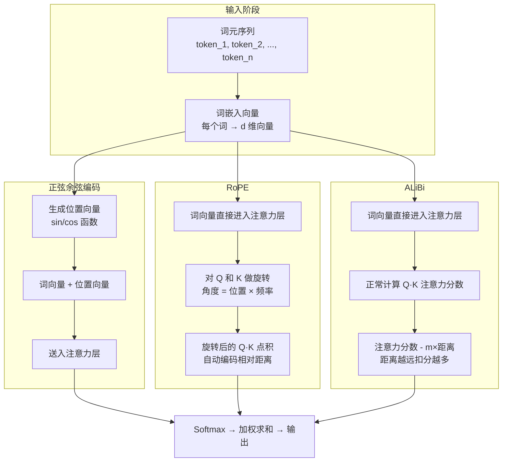

# 位置编码（Positional Encoding）

## 概念解释

位置编码是 Transformer 中用来告诉模型"每个词在句子的第几个位置"的一种机制。Transformer 的自注意力（Self-Attention）在计算时会同时看到所有词，但它天生分不清词的先后顺序——"猫咬狗"和"狗咬猫"在它眼里是一样的。位置编码就是解决这个"顺序盲"问题的。

之所以需要位置编码，根本原因在于 Transformer 抛弃了 RNN 的逐词处理方式，换成了并行计算。并行虽然快，但丢失了天然的顺序信息。如果不补上位置信息，模型就像拿到一堆散乱的拼图碎片却不知道拼接顺序。

从 2017 年最初的正弦/余弦编码，到如今主流的 RoPE（旋转位置编码）和 ALiBi（线性偏置注意力），位置编码技术的核心追求始终是两件事：让模型理解顺序，并且在推理超长文本时不崩溃（即长度外推能力）。

## 关键结构

位置编码方案按"位置信息注入方式"可以分为三大类：

| 类别 | 代表方法 | 注入位置 | 核心思路 |
|------|---------|---------|---------|
| 绝对位置编码 | 正弦/余弦编码、可学习编码 | 输入嵌入层（加到词向量上） | 给每个位置一个固定的"身份证号" |
| 旋转位置编码 | RoPE | 注意力层（旋转 Q/K 向量） | 用旋转角度编码位置，点积自动反映距离 |
| 偏置式编码 | ALiBi | 注意力层（加偏置到注意力分数） | 距离越远，注意力分数扣分越多 |

### 类别 1：绝对位置编码（正弦/余弦）

原始 Transformer（"Attention Is All You Need", 2017）的方案。用不同频率的正弦和余弦函数为每个位置生成一个固定向量，然后直接加到词嵌入（Word Embedding）上。

公式：
- 偶数维度：`PE(pos, 2i) = sin(pos / 10000^(2i/d))`
- 奇数维度：`PE(pos, 2i+1) = cos(pos / 10000^(2i/d))`

其中 `pos` 是位置序号，`i` 是维度索引，`d` 是嵌入维度。

低维度变化快、高维度变化慢，类似于用不同精度的"刻度尺"同时标记位置。这套编码没有可学习参数，确定性地生成。

### 类别 2：旋转位置编码（RoPE）

RoPE（Rotary Position Embedding，2021）是目前大语言模型的事实标准，被 LLaMA、Llama 2/3、PaLM、Qwen 等主流模型采用。

核心思路：不在输入层加位置信息，而是在注意力层对 Query（查询向量）和 Key（键向量）做旋转。每个位置对应一个旋转角度，两个位置的点积结果只取决于它们的角度差（即相对距离），不取决于绝对位置。

具体操作：把高维向量拆成若干个二维小平面（如 128 维拆成 64 个二维对），每对按不同频率旋转。这就像 64 个独立转动的时钟指针，各自以不同速度转动来标记位置。

### 类别 3：线性偏置（ALiBi）

ALiBi（Attention with Linear Biases，2022）的思路最简洁：完全不添加位置嵌入，而是在计算注意力分数时直接减去一个与距离成正比的惩罚值。

公式：`注意力分数 = QK^T / sqrt(d) - m * |i - j|`

其中 `m` 是每个注意力头（Attention Head）特有的斜率，`|i - j|` 是两个词之间的距离。不同头用不同斜率，使模型同时捕捉短距离和长距离的关系。被 Falcon、MPT、BLOOM 等模型采用。

## 核心原理

### 原理说明

三种方案的工作方式差异明显：

**正弦/余弦编码**：在数据进入 Transformer 之前，将位置向量直接加到词向量上。这意味着位置信息和语义信息混在同一个向量里。优点是简单；缺点是位置信息会"干扰"原始语义向量的大小和方向。

**RoPE**：在注意力计算的 Q 和 K 上施加旋转变换，不改变向量的模长（大小），只改变方向。旋转后做点积，结果自动包含相对距离信息。这保证了位置编码不会扭曲语义信息的强度——这是 RoPE 相比正弦编码的关键优势。

**ALiBi**：更加直接——不碰嵌入层，也不碰 Q/K 向量本身，只在注意力分数上做减法。距离远的词对扣分多，距离近的扣分少。这使得模型天然倾向于关注附近的词，符合自然语言中"局部信息通常比远处信息更重要"的规律。

三种方案的长度外推（Length Extrapolation）能力差异是它们被选用的核心依据：
- 正弦编码：超出训练长度后性能急剧下降
- RoPE：配合 YaRN/NTK 缩放可从 4K 训练长度外推到 100K+
- ALiBi：开箱即用的外推能力最强，训练 1K 可推理 2-3K

### Mermaid 图解



三条路径对应三种方案的注入时机：正弦编码在输入阶段就混入位置信息；RoPE 在注意力层旋转 Q/K；ALiBi 在注意力分数上做后处理。越往后注入，位置信息对原始语义的"污染"越小。

### 运行示例

以下用最小代码演示三种编码的核心机制。基于 PyTorch >= 2.0 验证（截至 2026-03）。

```python
import torch
import torch.nn as nn
import math

# === 1. 正弦/余弦位置编码 ===
def sinusoidal_pe(seq_len: int, d_model: int) -> torch.Tensor:
    """生成正弦/余弦位置编码矩阵"""
    pe = torch.zeros(seq_len, d_model)
    pos = torch.arange(seq_len).unsqueeze(1).float()
    # 不同维度对应不同频率
    div = torch.exp(torch.arange(0, d_model, 2).float() * -(math.log(10000.0) / d_model))
    pe[:, 0::2] = torch.sin(pos * div)  # 偶数维用 sin
    pe[:, 1::2] = torch.cos(pos * div)  # 奇数维用 cos
    return pe

pe = sinusoidal_pe(seq_len=10, d_model=8)
# pe[0] 是位置 0 的编码向量，pe[1] 是位置 1 的，以此类推
print("位置 0 的编码:", pe[0].tolist()[:4], "...")  # 只看前 4 维


# === 2. RoPE 核心操作：对二维向量做旋转 ===
def apply_rope_2d(x: torch.Tensor, pos: int, freq: float) -> torch.Tensor:
    """对一个二维向量按位置旋转（RoPE 最小单元）"""
    angle = pos * freq  # 旋转角度 = 位置 × 频率
    cos_a, sin_a = math.cos(angle), math.sin(angle)
    # 二维旋转矩阵：[cos -sin; sin cos] × [x0, x1]
    return torch.tensor([x[0]*cos_a - x[1]*sin_a,
                         x[0]*sin_a + x[1]*cos_a])

q = torch.tensor([1.0, 0.0])  # 查询向量
k = torch.tensor([1.0, 0.0])  # 键向量
freq = 0.1

# 位置 3 和位置 7，相对距离 = 4
q_rot = apply_rope_2d(q, pos=3, freq=freq)
k_rot = apply_rope_2d(k, pos=7, freq=freq)
dot_3_7 = torch.dot(q_rot, k_rot).item()

# 位置 10 和位置 14，相对距离同样 = 4
q_rot2 = apply_rope_2d(q, pos=10, freq=freq)
k_rot2 = apply_rope_2d(k, pos=14, freq=freq)
dot_10_14 = torch.dot(q_rot2, k_rot2).item()

# 两个点积几乎相等——相对距离相同，绝对位置不同
print(f"位置(3,7)点积: {dot_3_7:.6f}, 位置(10,14)点积: {dot_10_14:.6f}")


# === 3. ALiBi 偏置矩阵 ===
def alibi_bias(seq_len: int, num_heads: int) -> torch.Tensor:
    """生成 ALiBi 的注意力偏置矩阵"""
    # 每个头的斜率：几何级数递减
    slopes = torch.tensor([1.0 / (2 ** (8 * i / num_heads))
                           for i in range(1, num_heads + 1)])
    # 距离矩阵 |i - j|
    pos = torch.arange(seq_len).float()
    dist = torch.abs(pos.unsqueeze(0) - pos.unsqueeze(1))  # (seq, seq)
    # 每个头的偏置 = -slope × 距离
    bias = -slopes.view(-1, 1, 1) * dist.unsqueeze(0)  # (heads, seq, seq)
    return bias

bias = alibi_bias(seq_len=5, num_heads=2)
print(f"ALiBi 头 0 的偏置矩阵（5×5）:\n{bias[0]}")
# 对角线为 0（自身距离 0），越远数值越负
```

代码对应的三个核心机制：正弦编码生成固定位置向量；RoPE 的二维旋转展示了"相同相对距离 → 相同点积"的性质；ALiBi 生成的偏置矩阵展示了距离越远惩罚越大的线性衰减模式。

## 易混概念辨析

| 概念 | 与位置编码的区别 | 更适合关注的重点 |
|------|----------------|-----------------|
| 词嵌入（Word Embedding） | 编码的是词的语义信息（"猫"是什么意思），不包含位置信息 | 语义表示、词向量空间 |
| 注意力掩码（Attention Mask） | 控制"哪些位置可以被看到"（如因果掩码），不编码位置本身 | 信息可见性、因果性 |
| 位置插值（Position Interpolation） | 不是一种编码方案，而是对已有编码（如 RoPE）做缩放以支持更长序列 | 长度外推策略 |
| 可学习位置编码（Learned PE） | 同属位置编码，但每个位置的向量是训练出来的，有最大长度限制 | 灵活性 vs 泛化性的权衡 |

核心区别：

- **位置编码**：让模型知道"这个词在第几个位置"或"两个词隔多远"
- **词嵌入**：让模型知道"这个词是什么意思"，两者是互补关系
- **注意力掩码**：决定信息的可见性（能不能看），位置编码决定位置感知（在哪里）

## 适用边界与局限

### 适用场景

1. **长上下文语言建模**：LLaMA 系列用 RoPE + YaRN 实现从 4K 训练长度外推到 128K+ 推理长度，适合处理长文档、长对话
2. **多轮对话系统**：对话历史不断累积，ALiBi 的线性衰减天然匹配"最近的消息更重要"的特征
3. **代码理解与补全**：代码中函数定义和调用的相对位置关系很重要，RoPE 的相对距离编码能有效捕捉这种结构

### 不适合的场景

1. **非序列数据**：图结构、集合数据等不具备线性顺序的数据，一维位置编码不适用，需要图位置编码等专门方案
2. **极短固定长度输入**：如果输入长度总是固定且很短（如分类任务的 10 词标题），简单的可学习位置编码就够了，用 RoPE 属于过度设计

### 局限性

1. **正弦编码的外推天花板**：超出训练长度后性能急剧下降，这是绝对编码的根本限制，无法通过微调解决
2. **RoPE 的外推需要额外工程**：原生 RoPE 在超出训练长度 2 倍以上时也会退化，需要 YaRN、NTK-Aware Scaling 等扩展技术配合
3. **ALiBi 的表达能力上限**：线性衰减是一种强先验假设——"距离越远越不重要"。对于需要远距离精确关联的任务（如长文档中首尾呼应的内容），这个假设可能过强
4. **多模态场景的适配难题**：视频帧 + 文本的混合输入涉及跨模态的位置关系，现有一维方案不能直接处理，需要专门设计

## 常见误区

| 常见误区 | 正确理解 |
|----------|---------|
| "位置编码就是在输入层加一个向量" | 只有绝对编码是加向量。RoPE 是在注意力层旋转 Q/K 向量，ALiBi 是在注意力分数上减偏置。不同方案的注入位置和方式完全不同 |
| "RoPE 是相对编码，所以模型不知道绝对位置" | RoPE 对每个位置施加了唯一的旋转角度（绝对信息），但点积结果只依赖相对角度差。它同时包含绝对和相对信息 |
| "ALiBi 太简单，肯定不如 RoPE" | ALiBi 在长度外推上的开箱效果甚至优于原生 RoPE。训练 512 长度的 ALiBi 模型在 3072 长度上的困惑度，比训练 3072 长度的正弦编码模型更好。简单不等于弱 |
| "长度外推就是让模型能处理更长的文本" | 能处理只是第一步。真正的外推要求在更长序列上性能不明显下降（如困惑度保持稳定）。仅仅"不报错"不算外推成功 |

## 思考题

<details>
<summary>初级：为什么 Transformer 需要位置编码，而 RNN 不需要？</summary>

**参考答案：**

RNN 按时间步逐词处理输入，天然按顺序执行，位置信息隐含在处理顺序中。Transformer 的自注意力机制并行处理所有词，对输入的排列顺序不敏感（交换两个词的位置，注意力分数不变）。因此必须通过位置编码显式注入顺序信息。

</details>

<details>
<summary>中级：RoPE 说"点积只依赖相对距离"，请用直觉解释为什么旋转能实现这一点。</summary>

**参考答案：**

想象两根时钟指针，一根转到了 30 度位置，另一根转到了 50 度位置。它们之间的夹角是 20 度。如果分别转到 100 度和 120 度，夹角仍然是 20 度。向量点积的大小取决于两向量的夹角，而旋转只改变方向不改变大小。RoPE 让每个位置的 Q/K 向量旋转一个与位置成正比的角度，因此点积只取决于角度差（即位置差），不取决于绝对角度（即绝对位置）。

</details>

<details>
<summary>中级/进阶：你要构建一个处理法律合同（平均 30K token）的问答系统，模型在 4K token 上训练。在 RoPE + YaRN 和 ALiBi 之间你如何选择？</summary>

**参考答案：**

需要从多个维度权衡：

- **外推倍数**：30K / 4K = 7.5 倍。ALiBi 开箱可外推 2-3 倍，超过此范围效果未充分验证。RoPE + YaRN 已被证明可从 4K 外推到 100K+，覆盖能力更强。
- **任务特性**：法律合同需要精确关联首尾条款（如"第一条定义"和"第二十条违约责任"），ALiBi 的线性衰减可能过度惩罚远距离关联。RoPE 的旋转机制对远距离关系的保留更好。
- **工程成本**：ALiBi 零额外工程，RoPE + YaRN 需要配置缩放参数。
- **推荐选择**：RoPE + YaRN。7.5 倍的外推需求超出了 ALiBi 的舒适区，且法律场景对远距离关联的准确性要求高。

</details>

## 参考资料

1. Vaswani, A. et al. (2017). "Attention Is All You Need." — 原始 Transformer 论文，提出正弦/余弦位置编码。https://arxiv.org/abs/1706.03762
2. Su, J. et al. (2021). "RoFormer: Enhanced Transformer with Rotary Position Embedding." — RoPE 原始论文。https://arxiv.org/abs/2104.09864
3. Press, O. et al. (2022). "Train Short, Test Long: Attention with Linear Biases Enables Input Length Extrapolation." — ALiBi 原始论文。https://arxiv.org/abs/2108.12409
4. Peng, B. et al. (2023). "YaRN: Efficient Context Window Extension of Large Language Models." — RoPE 长度外推扩展。https://arxiv.org/abs/2309.00071
5. EleutherAI Blog. "Rotary Embeddings: A Relative Revolution." — RoPE 直觉解读。https://blog.eleuther.ai/rotary-embeddings/
6. Towards Data Science. "Positional Embeddings in Transformers: A Math Guide to RoPE & ALiBi." https://towardsdatascience.com/positional-embeddings-in-transformers-a-math-guide-to-rope-alibi/
