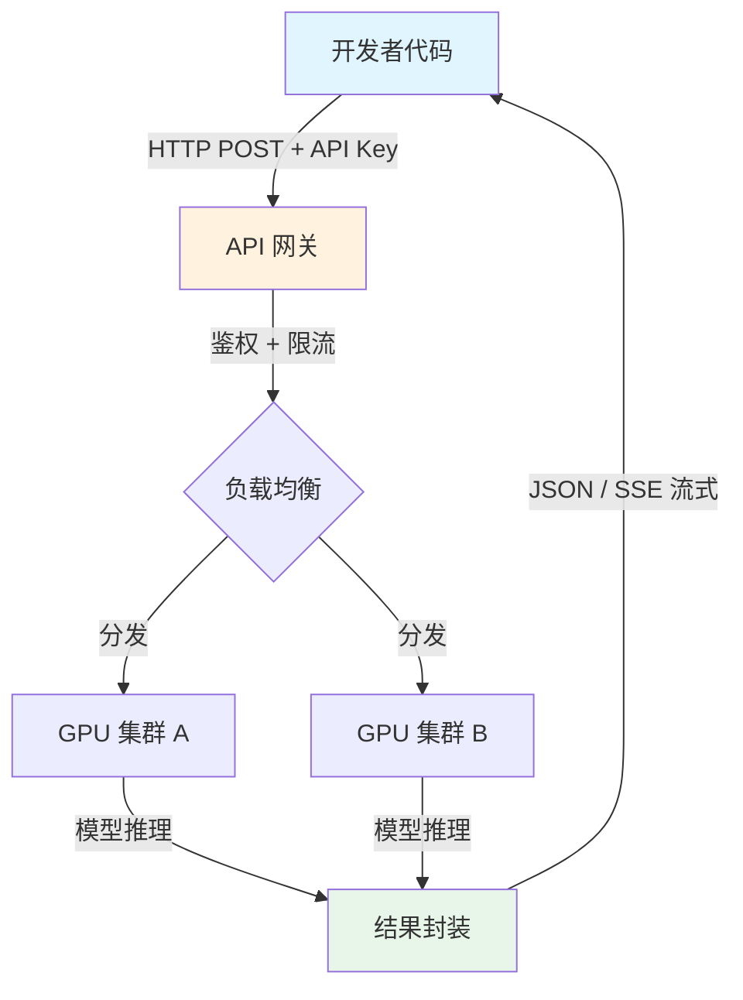

# 云端模型服务概述

## 概念解释

云端模型服务是指由云服务商在自有 GPU 集群上部署大语言模型（LLM，Large Language Model），开发者通过 HTTP API 远程调用模型推理能力的一种服务模式。你不需要买显卡、不需要装 CUDA，只要有一个 API Key（密钥）和几行代码就能用上世界顶级的大模型。

这种模式出现的背景是：训练和运行大模型需要的硬件投入极高（一台 8 卡 H100 服务器售价超百万元），且模型迭代速度极快（GPT-5、Claude Opus、Gemini 3 等几乎每季度都有新版本）。对绝大多数开发者和企业来说，自建推理集群既烧钱又跟不上模型更新。云端模型服务把这个问题反转过来——硬件投入和模型运维由云厂商承担，开发者只管调 API、按用量付费。

与传统的"下载模型到本地跑"相比，云端服务的核心差异在于三个字：**不用管**。不用管硬件采购、不用管模型部署、不用管版本升级。代价是数据需要传到云端，且长期高频调用的成本可能高于自建。

## 关键结构

云端模型服务的生态可以从两个维度理解：**谁提供模型**和**怎么接入模型**。

| 维度 | 分类 | 代表 | 说明 |
|------|------|------|------|
| 模型直供商 | 直接提供自研模型的 API | OpenAI、Anthropic、Google、DeepSeek | 开发者直接对接模型厂商，通常价格最优 |
| 云平台托管 | 在云基础设施上托管多家模型 | Azure AI、AWS Bedrock、Google Vertex AI | 适合已有云生态的企业，提供统一管理和合规保障 |
| 聚合平台 | 统一接口聚合多家模型 | OpenRouter、SiliconFlow | 一个 API Key 切换多家模型，方便对比选型 |

### 模型直供商

模型直供商是最直接的接入方式。OpenAI（GPT 系列）、Anthropic（Claude 系列）、Google（Gemini 系列）、DeepSeek 等厂商各自提供 API 端点，开发者注册账号、获取 API Key 后即可调用。优点是价格通常最低（没有中间商加价），缺点是每家的账号、计费、接口细节各自独立。

### 云平台托管

对于已经在使用 AWS、Azure 或 Google Cloud 的企业，通过云平台托管接入大模型更自然。Azure AI Foundry 提供 OpenAI 模型的企业级托管（含合规、私有网络等保障）；AWS Bedrock 支持 Claude、Llama、Titan 等多家模型的统一调用；Google Vertex AI 则提供 Gemini 系列以及 Model Garden 中的开源模型。这类方案的核心价值不在模型本身，而在于与企业现有云基础设施（存储、权限、监控）的无缝集成。

### 聚合平台

聚合平台（如 OpenRouter、SiliconFlow）用一个统一的 API 接口封装多家模型。开发者可以在同一套代码中切换 OpenAI、Claude、DeepSeek 等不同模型，适合快速对比选型或构建多模型路由系统。

## 核心原理

### 原理说明

云端模型服务的工作机制可以分为三步理解：

1. **请求发送**：开发者在本地代码中构造请求（包括模型名称、提示词、参数等），通过 HTTP POST 发送到云服务商的 API 端点，请求头中携带 API Key 用于身份认证。

2. **云端推理**：云服务商的网关收到请求后，完成鉴权和限流检查，然后将请求分发到 GPU 集群执行模型推理。这一步对开发者完全透明——用的是哪块 GPU、跑的是模型的哪个副本、做了哪些推理加速，开发者都不需要关心。

3. **结果返回**：模型生成的文本被包装成 JSON 格式返回给开发者。如果启用了流式输出（Streaming），结果会以 SSE（Server-Sent Events，服务器推送事件）的方式逐字返回，用户体验更好。

这三步之下，还有一个关键的行业趋势：**OpenAI 兼容接口已成为事实标准**。几乎所有主流厂商（DeepSeek、通义千问、Gemini 等）都提供与 OpenAI 格式兼容的 API 端点，这意味着开发者只需要学一套接口规范，就能切换多家模型。

### Mermaid 图解



图中关键节点说明：

- **API 网关**：所有请求的入口，负责验证 API Key 是否有效、检查是否超出速率限制（Rate Limit，限速）。
- **负载均衡**：将请求分发到不同的 GPU 集群，确保高并发时服务不崩溃。
- **结果封装**：将模型原始输出包装成标准 JSON 格式（或 SSE 流），附上 token 用量等元信息。

### 运行示例

以下示例展示如何用同一套代码调用不同云服务商的模型（基于 openai==1.68.0 验证，截至 2026-03）：

```python
from openai import OpenAI

# 调用 OpenAI 的 GPT 模型
client_openai = OpenAI(api_key="你的Key")
# 调用 DeepSeek —— 只需换 base_url 和 api_key
client_deepseek = OpenAI(
    api_key="你的Key",
    base_url="https://api.deepseek.com/v1"  # DeepSeek 兼容 OpenAI 接口
)

# 同一个调用方式，适用于所有兼容 OpenAI 接口的服务商
response = client_deepseek.chat.completions.create(
    model="deepseek-chat",
    messages=[{"role": "user", "content": "用一句话解释什么是 Agent"}],
    max_tokens=200
)
print(response.choices[0].message.content)
# 输出示例：Agent 是一个能自主规划并调用工具完成任务的 AI 程序。
```

上述代码的核心在于 `base_url` 参数——切换到不同厂商只需要改这一个地址，调用方式完全相同。这就是 OpenAI 兼容接口作为行业标准的实际意义。

## 易混概念辨析

| 概念 | 与云端模型服务的区别 | 更适合关注的重点 |
|------|---------------------|------------------|
| 本地模型部署 | 模型运行在自己的硬件上，不依赖外部 API | 数据隐私要求高、调用量极大、需要深度定制模型的场景 |
| 模型微调（Fine-tuning） | 在已有模型基础上用自有数据训练，改变模型行为 | 通用模型无法满足特定领域需求时，用微调提升专项表现 |
| 模型聚合平台 | 封装多家模型的统一接口，本身不训练模型 | 需要快速对比多个模型或构建模型路由时使用 |

核心区别：

- **云端模型服务**：关注的是"怎么用上大模型"——不管硬件、不管部署，API 调用即用。
- **本地模型部署**：关注的是"怎么自己跑大模型"——需要自己买硬件、装环境、管运维。
- **模型微调**：关注的是"怎么让模型更懂我的业务"——在云端或本地都可以做，是模型能力的定制化手段。

## 适用边界与局限

### 适用场景

1. **快速原型验证**：初创团队或个人开发者没有 GPU 资源，用云端 API 几小时内就能搭出可用的 AI 功能原型，验证产品想法。
2. **流量波动型业务**：电商大促、直播审核等场景的调用量可能突增 10 倍，云端服务自动扩容，活动结束后费用自动回落，无需维护闲置硬件。
3. **多模型选型对比**：通过聚合平台在同一套代码中切换多家模型，对比生成质量、速度和成本，找到性价比最优的方案。
4. **低频长尾应用**：日均调用只有几百次的内部工具（如企业翻译助手），自建服务器的固定成本远超 API 费用。

### 不适合的场景

1. **强数据隐私要求**：医疗、金融、政府等行业有"数据不出域"的合规要求，敏感数据不能传输到第三方云端。
2. **超高频调用**：日均千万级请求的场景下，API 按量计费的总成本可能远超自建 GPU 集群的摊销成本。

### 局限性

1. **网络依赖**：API 调用必须依赖网络连接，网络故障或云服务商宕机会直接导致业务中断。
2. **定制天花板**：只能通过微调和提示词调整模型行为，无法修改模型架构或中间层参数。
3. **版本不可控**：云服务商可能下线旧版本模型（如 OpenAI 已陆续停用 GPT-4、GPT-4o 等），开发者需要被动迁移到新版本，可能引起输出行为变化。

## 常见误区

| 常见误区 | 正确理解 |
|----------|----------|
| 云端 API 一定比本地部署便宜 | 低频场景确实更便宜，但日均百万级调用时本地部署成本更低。需要根据实际调用量做成本测算，没有绝对结论 |
| API Key 写在代码里问题不大 | API Key 泄露会被他人盗用产生巨额账单。必须存储在环境变量或密钥管理服务中，绝不能硬编码在代码或 Git 仓库中 |
| 所有云服务商的 API 格式都不一样 | 实际上 OpenAI 的接口格式已成为行业事实标准，绝大多数厂商都提供兼容接口，切换服务商通常只需改 base_url |
| 云端模型不支持任何定制 | 多数云服务商支持 Fine-tuning（微调）服务，可以用自有数据定制模型行为。只是无法修改模型底层架构 |

## 思考题

<details>
<summary>初级：云端模型服务和本地部署模型的核心区别是什么？各自最适合什么场景？</summary>

**参考答案：**

核心区别在于模型运行的位置和资源负担方。云端服务的模型跑在厂商的 GPU 上，开发者按量付费、无需运维；本地部署的模型跑在自己的硬件上，需要自行采购、部署和维护。云端适合低频调用、快速验证、弹性扩缩的场景；本地适合数据隐私要求高、调用量极大、需要深度定制的场景。

</details>

<details>
<summary>中级：一个日均调用 5 万次的对话应用，平均每次消耗 2000 输入 token 和 800 输出 token，分别使用 GPT-5.2（$1.75/$14 每百万 token）和 DeepSeek V3（$0.28/$0.42 每百万 token）时月成本大约是多少？</summary>

**参考答案：**

月调用量 = 5 万 x 30 = 150 万次。总输入 token = 150 万 x 2000 = 30 亿（3000M），总输出 token = 150 万 x 800 = 12 亿（1200M）。

- GPT-5.2：输入 3000 x $1.75 = $5,250，输出 1200 x $14 = $16,800，合计约 $22,050/月。
- DeepSeek V3：输入 3000 x $0.28 = $840，输出 1200 x $0.42 = $504，合计约 $1,344/月。

差距约 16 倍。实际项目中常用"模型路由"策略：简单问题用便宜模型，复杂问题才用高端模型，可将整体成本压缩 60%-80%。

</details>

<details>
<summary>中级/进阶：你的应用同时接入了 OpenAI 和 DeepSeek 两家云服务。如果 OpenAI 突然宕机，你会如何设计自动切换机制？需要考虑哪些问题？</summary>

**参考答案：**

设计一个 Fallback（降级回退）机制：请求先发往主服务商（OpenAI），如果返回超时或 5xx 错误，自动切换到备用服务商（DeepSeek）。需要考虑的问题包括：(1) 两家模型的输出风格可能不同，切换后用户体验是否一致；(2) 重试策略应使用指数退避（Exponential Backoff），避免雪崩式请求；(3) 需要记录切换日志用于事后分析；(4) 备用服务商的模型名称和参数可能不同，需要在配置层做映射。

</details>

## 参考资料

1. OpenAI. "API Reference." https://platform.openai.com/docs/api-reference
2. Anthropic. "Claude API Documentation." https://docs.anthropic.com/en/api
3. Google. "Gemini API Documentation." https://ai.google.dev/docs
4. DeepSeek. "API Documentation." https://platform.deepseek.com/api-docs
5. AWS. "Amazon Bedrock Overview." https://aws.amazon.com/bedrock/
6. Microsoft. "Azure AI Foundry." https://azure.microsoft.com/en-us/products/ai-foundry
