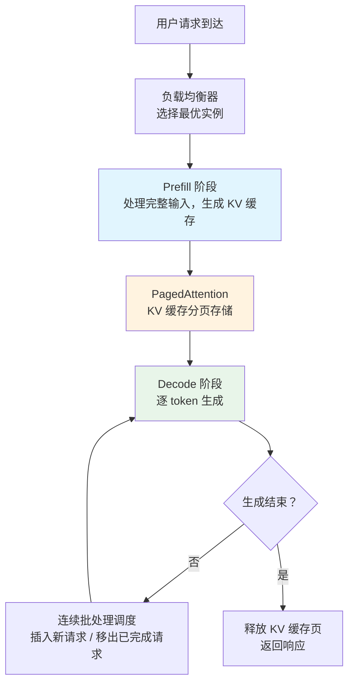

# 部署架构（Deployment Architecture）

## 概念解释

部署架构（Deployment Architecture）是指将训练好的大语言模型（LLM）变成可以对外提供服务的在线系统时，所涉及的**内存管理、请求调度、负载均衡**等一整套技术方案。

一个简单的类比：训练好一个模型，就像厨师研发出了一道菜的配方；而部署架构，则是设计一整套厨房流水线 -- 从接单、备料、烹饪到出餐，让这道菜能同时高效供应给成百上千位客人。

为什么需要专门的部署架构？因为 LLM 推理有两个独特难题：一是模型参数巨大（动辄几十 GB），显存（GPU Memory）极度紧张；二是生成过程是逐 token（词元）输出的，一个请求要占用 GPU 好几秒甚至几十秒。如果不做优化，一块价值数万元的 GPU 同时只能服务个位数的用户，成本完全无法承受。

现代部署架构通过三个核心突破来解决这些问题：**PagedAttention**（分页注意力）解决显存浪费、**Prefill-Decode 分离调度**解决硬件利用率、**连续批处理**（Continuous Batching）解决吞吐量瓶颈。这三者共同构成了当前 LLM 推理服务的技术基座。

## 关键结构

| 结构 | 作用 | 说明 |
|------|------|------|
| PagedAttention | 显存管理 | 把 KV 缓存（KV Cache）像操作系统管理内存一样分页管理，消除碎片化 |
| Prefill-Decode 分离 | 请求调度 | 将"理解输入"和"生成输出"两个阶段分开优化，各自用最优策略 |
| 连续批处理 | 吞吐量优化 | 新请求随到随处理，不必等凑齐一批再执行 |
| 负载均衡 | 多实例扩展 | 智能分发请求到多个 GPU 实例，应对高并发 |

### 结构 1：PagedAttention（分页注意力）

LLM 在生成每个 token 时，需要用到之前所有 token 的 Key 和 Value 向量，这些数据统称为 KV 缓存。传统做法是为每个请求预分配一段**连续的**显存空间来存放 KV 缓存。问题在于：请求长度各不相同，短请求浪费空间，长请求分配不到连续大块，结果是 60-80% 的显存被白白浪费。

PagedAttention 借鉴了操作系统虚拟内存（Virtual Memory）的思路：把 KV 缓存切成固定大小的"页"（Page），每页存放若干 token 的 KV 数据。逻辑上连续的缓存，在物理显存上可以分散存放。这样显存碎片化率从 30-40% 降到 5% 以下，同一块 GPU 能同时服务的请求数提升数倍。

### 结构 2：Prefill-Decode 分离调度

LLM 推理分两个阶段，特性截然不同：

- **Prefill（预填充）阶段**：一次性处理用户输入的全部 token，计算密集型（大量矩阵乘法），适合大批量并行处理。
- **Decode（解码）阶段**：逐个生成输出 token，内存密集型（需要反复读取 KV 缓存），对延迟敏感。

如果两者混在一起调度，Prefill 的大计算量会阻塞 Decode，导致用户等待已开始的对话迟迟不出下一个字。分离调度让两个阶段各自独立运行、独立优化参数，吞吐量可提升 2-3 倍。

### 结构 3：连续批处理（Continuous Batching）

传统批处理要等凑齐一批请求、所有请求都完成后才能处理下一批。连续批处理则是：有新请求就立即插入当前批次，已完成的请求立即移出。GPU 始终保持满负荷运转，不会因为等待而闲置。

### 结构 4：负载均衡（Load Balancing）

当部署多个推理实例时，负载均衡器根据各实例的实时状态（队列长度、显存占用率、处理延迟）将新请求分发到最空闲的实例。相比简单的轮询（Round-Robin），智能负载均衡能显著降低尾部延迟（P99 Latency，即 99% 请求的最大延迟）。

## 核心原理

### 原理说明

一个完整的 LLM 推理请求经过以下步骤：

1. **请求到达**：用户发送 prompt（提示词）到推理服务的 API 端点。
2. **负载分发**：负载均衡器检查各实例状态，将请求路由到最优实例。
3. **Prefill 计算**：GPU 一次性处理完整输入，生成所有 token 的 KV 缓存，输出第一个 token（即 TTFT，Time To First Token，首 token 延迟）。
4. **KV 缓存分页存储**：PagedAttention 将生成的 KV 数据按页分配到显存的空闲块中，无需连续空间。
5. **Decode 循环**：每次迭代读取 KV 缓存、生成一个新 token，直到输出结束符（EOS）或达到长度上限。
6. **连续批处理调度**：在 Decode 循环的每次迭代间隙，调度器检查是否有新请求可以插入、是否有已完成的请求可以移出。
7. **响应返回**：生成完毕的结果通过流式（Streaming）或一次性方式返回给用户。

### Mermaid 图解



图中关键流转：Prefill（蓝色）是一次性计算，产出 KV 缓存交给 PagedAttention（橙色）分页管理；Decode（绿色）在循环中反复读取缓存生成 token。连续批处理调度穿插在 Decode 循环中，实现请求的动态进出。

### 运行示例

以下用 Python 模拟 PagedAttention 的核心机制 -- 逻辑页到物理页的映射，帮助理解"非连续存储"的本质：

```python
# 模拟 PagedAttention 分页管理（纯 Python，无需 GPU）
class SimplePagedCache:
    """最小化模拟：KV 缓存的分页管理"""

    def __init__(self, total_pages: int, page_size: int):
        """
        total_pages: 物理页总数（类比显存总量）
        page_size: 每页容纳的 token 数
        """
        self.page_size = page_size
        self.free_pages = list(range(total_pages))  # 空闲物理页池
        self.page_table: dict[str, list[int]] = {}  # 请求 -> 物理页列表

    def allocate(self, request_id: str, num_tokens: int) -> list[int]:
        """为一个请求分配物理页，返回分配到的页号列表"""
        import math
        pages_needed = math.ceil(num_tokens / self.page_size)
        if pages_needed > len(self.free_pages):
            raise MemoryError(f"显存不足: 需要 {pages_needed} 页，剩余 {len(self.free_pages)} 页")
        # 从空闲池中取页（不要求连续）
        allocated = [self.free_pages.pop(0) for _ in range(pages_needed)]
        self.page_table[request_id] = allocated
        return allocated

    def release(self, request_id: str):
        """请求完成，归还物理页"""
        pages = self.page_table.pop(request_id, [])
        self.free_pages.extend(pages)

    @property
    def utilization(self) -> float:
        """当前显存利用率"""
        total = len(self.free_pages) + sum(len(p) for p in self.page_table.values())
        used = sum(len(p) for p in self.page_table.values())
        return used / total


# 演示
cache = SimplePagedCache(total_pages=16, page_size=256)

# 三个不同长度的请求同时到达
cache.allocate("req_A", num_tokens=500)   # 需要 2 页
cache.allocate("req_B", num_tokens=300)   # 需要 2 页
cache.allocate("req_C", num_tokens=100)   # 需要 1 页
print(f"分配后利用率: {cache.utilization:.0%}")  # 31%

# req_A 完成，释放 2 页
cache.release("req_A")
print(f"释放后利用率: {cache.utilization:.0%}")  # 19%

# 新请求 req_D 需要 3 页 -- 传统连续分配可能失败，分页分配无问题
cache.allocate("req_D", num_tokens=700)
print(f"再分配后利用率: {cache.utilization:.0%}")  # 38%
```

`allocate()` 从空闲池中取任意页（不要求连续），对应 PagedAttention 的核心优势：逻辑上连续的 KV 缓存可以映射到物理上分散的显存块。`release()` 将页归还空闲池，立即可被其他请求复用。

## 易混概念辨析

| 概念 | 与部署架构的区别 | 更适合关注的重点 |
|------|------------------|------------------|
| 模型压缩 / 量化（Quantization） | 量化是减小模型本身的体积（如 FP16 转 INT8），部署架构是管理推理过程中的资源调度 | 模型体积、精度损失 |
| 模型训练架构 | 训练关注梯度计算和参数更新，部署关注推理延迟和并发吞吐 | 反向传播、数据并行 |
| 推理框架（Inference Framework） | 推理框架是具体的软件工具（如 vLLM、TGI），部署架构是这些工具背后的设计理念和技术原理 | 安装、配置、API 调用 |

核心区别：

- **部署架构**：关注"如何让模型高效地同时服务大量用户"，是方法论层面的知识
- **量化**：关注"如何让模型本身更小更快"，是模型优化层面的技术
- **推理框架**：关注"用什么工具落地"，是工程实践层面的选择

## 适用边界与局限

### 适用场景

1. **高并发在线服务**：如 AI 聊天助手、代码补全等需要同时处理大量用户请求的场景，PagedAttention + 连续批处理可将单 GPU 并发能力提升数倍
2. **长短混合请求**：系统既要处理长文档分析（数千 token 输入），又要处理简短问答（几十 token 输入），分页内存管理让两者共存而不互相挤占
3. **多实例弹性扩展**：流量有明显波峰波谷（如白天高峰、夜间低谷），通过负载均衡 + 自动扩缩容（Auto-scaling）控制成本

### 不适合的场景

1. **单用户本地推理**：个人在本机用 Ollama 跑 7B 模型，并发为 1，PagedAttention 和连续批处理带来的调度开销反而是额外负担
2. **极低延迟要求（< 10ms）**：部署架构的调度器本身有开销，对于延迟要求极端苛刻的嵌入式或边缘场景，可能需要更轻量的方案

### 局限性

1. **学习门槛高**：理解 PagedAttention、Prefill-Decode 分离等概念需要 GPU 内存模型和注意力机制的基础知识
2. **调度开销**：分离调度和连续批处理本身消耗 CPU 资源，在低并发场景下收益可能不明显
3. **硬件依赖**：当前主流方案高度依赖 NVIDIA GPU 生态（CUDA、NVLink），异构硬件适配仍需额外工作

## 常见误区

| 常见误区 | 正确理解 |
|----------|----------|
| Prefill 和 Decode 必须部署在不同 GPU 上 | 两者可以共享同一块 GPU，"分离"指的是调度策略独立优化（不同 batch size、不同优先级），不是物理隔离 |
| PagedAttention 只是一个小优化 | 它是架构级创新，不仅解决碎片化，还支持 KV 缓存共享（多个请求共用相同前缀的缓存）、显存换出（Swap）等高级特性 |
| 显存利用率越高越好 | 过高的利用率（如 > 95%）会导致新请求无法分配页，触发排队甚至换出，反而拉高延迟。生产环境通常设置 85-90% 的上限 |
| 部署就是装个框架启动服务 | 真正的生产部署还需要考虑监控告警、灰度发布、故障恢复、成本核算等运维层面的完整体系 |

## 思考题

<details>
<summary>初级：PagedAttention 解决了什么问题？它借鉴了操作系统的哪个机制？</summary>

**参考答案：**

PagedAttention 解决了 KV 缓存的显存碎片化问题。传统方案需要为每个请求分配连续显存，不同长度的请求会产生大量碎片，浪费 30-40% 的显存。PagedAttention 借鉴了操作系统的虚拟内存分页（Paging）机制，将 KV 缓存切成固定大小的页，逻辑连续但物理分散，碎片化率降到 5% 以下。

</details>

<details>
<summary>中级：为什么 Prefill 和 Decode 需要分离调度？混合调度会出什么问题？</summary>

**参考答案：**

Prefill 是计算密集型（大量矩阵运算），适合大 batch 以充分利用 GPU 算力；Decode 是内存密集型（反复读 KV 缓存），对延迟敏感，适合小 batch 快速响应。混合调度时，大量 Prefill 任务堆积会阻塞正在 Decode 的请求，导致用户看到对话"卡住"；同时两种任务的最优 batch size 相互矛盾，硬件利用率下降。分离调度让各阶段按自身特性独立优化，吞吐量提升 2-3 倍。

</details>

<details>
<summary>中级/进阶：你要部署一个 70B 参数的模型服务，日常 QPS 为 50，突发可达 300。请简述你的部署架构设计要点。</summary>

**参考答案：**

关键设计要点：(1) 70B 模型单卡放不下（约需 140GB FP16），需要至少 2 张 80GB GPU 做张量并行（Tensor Parallelism）；(2) 基础配置 2-3 个推理实例覆盖日常 QPS，通过 Kubernetes HPA 或类似机制在突发时自动扩到 6-8 个实例；(3) 使用 vLLM 等框架启用 PagedAttention + 连续批处理，设置 GPU 显存利用率上限 85-90%；(4) 前置负载均衡器根据实例队列长度路由请求，避免热点；(5) 监控 TTFT（首 token 延迟 < 200ms）和吞吐量（> 30 tokens/s），设置告警阈值。

</details>

## 参考资料

1. Kwon, W., Li, Z., Zhuang, S., et al. (2023). "Efficient Memory Management for Large Language Model Serving with PagedAttention." *SOSP 2023*. [https://arxiv.org/abs/2309.06180](https://arxiv.org/abs/2309.06180)
2. vLLM 官方文档与 GitHub 仓库. [https://github.com/vllm-project/vllm](https://github.com/vllm-project/vllm)
3. Clarifai. "vLLM vs Triton vs TGI: Choosing the Right LLM Serving Framework." [https://www.clarifai.com/blog/model-serving-framework/](https://www.clarifai.com/blog/model-serving-framework/)
4. Introl. "vLLM Production Deployment: Inference Serving Architecture." [https://introl.com/blog/vllm-production-deployment-inference-serving-architecture](https://introl.com/blog/vllm-production-deployment-inference-serving-architecture)
5. Arxiv. "Comparative Analysis of Large Language Model Inference Serving Systems: vLLM and HuggingFace TGI." [https://arxiv.org/abs/2511.17593](https://arxiv.org/abs/2511.17593)
