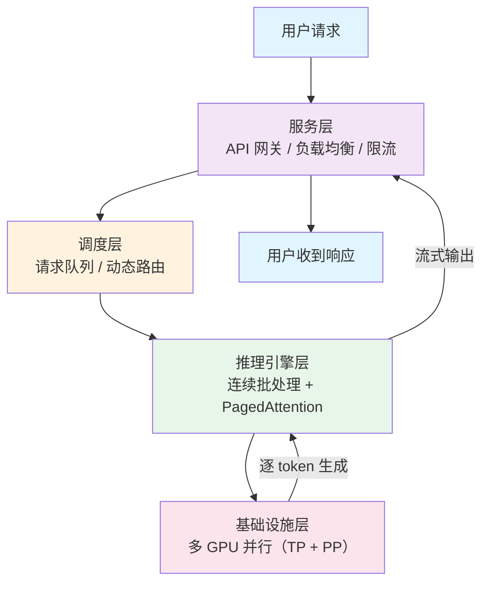

# 部署系统（Deployment System）

## 概念解释

部署系统是一套把训练好的大模型变成可以对外提供服务的工程体系。它要解决的核心问题是：模型太大、推理太慢、成本太高、用户太多——怎么同时搞定这四件事。

传统的机器学习模型（比如一个情感分类器），部署很简单：把模型文件加载到一台服务器上，暴露一个 API 接口就行了。但大语言模型（LLM）动辄几十亿、上千亿参数，一块 GPU 根本装不下，而且每次生成文本都是一个 token 一个 token 逐步输出，天然就慢。

部署系统就是为了应对这些挑战而诞生的分层工程方案。它不是某一个工具或框架，而是从底层硬件到上层服务的一整套协作体系。在 Agent 应用中，部署系统决定了你的 Agent 能不能快速响应用户、能不能扛住并发请求、推理成本是不是可控。

## 关键结构

部署系统分为四个层次，每层解决一个明确的问题：

| 层次 | 解决什么问题 | 典型技术 |
|------|-------------|---------|
| 基础设施层 | 模型太大，一块 GPU 放不下 | 张量并行（TP）、流水线并行（PP）、多 GPU 集群 |
| 推理引擎层 | 逐 token 生成太慢，GPU 利用率低 | vLLM、TGI、TensorRT-LLM、连续批处理 |
| 服务层 | 用户请求多、需要稳定在线 | API 网关、负载均衡、健康检查、限流 |
| 调度层 | 不同请求的优先级和资源需求不同 | 请求队列、动态路由、自动扩缩容 |

### 结构 1：基础设施层——把大模型"拆开放"

当一个模型有 700 亿参数（如 Llama 2 70B），用 BF16 精度存储就需要约 140 GB 显存，而一块 A100 GPU 只有 80 GB。解决办法是把模型拆到多块 GPU 上。

拆法有两种主流策略：

- **张量并行（Tensor Parallelism，简称 TP）**：把同一层内的参数矩阵切开，每块 GPU 算一部分。好比一张大试卷，4 个人各做 1/4 的题，最后拼成完整答案。优点是所有 GPU 同时干活；缺点是每一层都要通信汇总结果，对 GPU 之间的带宽要求高。
- **流水线并行（Pipeline Parallelism，简称 PP）**：把不同层分给不同 GPU，数据像流水线一样依次经过。好比工厂的装配线，每个工人只负责一道工序。优点是通信量小（只在层间传数据）；缺点是前面的 GPU 在算的时候，后面的在等，会产生"气泡"（idle 空闲）。

生产中的常见做法：**节点内用 TP（利用 NVLink 高带宽），跨节点用 PP（减少网络通信）**。

### 结构 2：推理引擎层——让 GPU 别闲着

推理引擎是部署系统的性能核心，它要解决两个问题：批处理效率和显存管理。

**批处理的演进**：

- 静态批处理（Static Batching）：攒够 N 个请求才开始推理，短请求要等长请求做完，GPU 利用率低。
- 连续批处理（Continuous Batching）：不等所有请求完成，某个请求一结束就立刻插入新请求，GPU 几乎不停歇。vLLM 的论文证明，这种方式可以把吞吐量提升到传统方案的 **23 倍以上**。

**显存管理的突破——PagedAttention（分页注意力）**：

LLM 推理时，每个请求都要维护一份 KV Cache（键值缓存），用来存已经生成过的 token 的注意力信息。传统做法按最长可能长度预分配显存，实际利用率只有约 60%。PagedAttention 借鉴操作系统的虚拟内存分页思想，把 KV Cache 切成小块按需分配，利用率提升到 90% 以上。

### 结构 3：服务层——让模型变成稳定的在线服务

推理引擎只管"算得快"，服务层管"跑得稳"。它的职责包括：

- **API 网关**：接收用户请求，格式校验，协议转换（HTTP/gRPC）
- **负载均衡**：多个推理实例之间分发请求
- **健康检查与容错**：某个实例挂了自动摘除，请求不会打到坏节点
- **监控与日志**：追踪延迟、吞吐、错误率等关键指标

### 结构 4：调度层——根据实际情况灵活调配

调度层根据请求特征和系统负载做动态决策：

- 高优请求（如用户实时对话）走低延迟通道
- 低优请求（如离线批处理）走高吞吐通道
- 流量高峰自动扩容，低谷自动缩容，节省成本

## 核心原理

### 原理说明

部署系统的核心机制可以用一句话概括：**用并行化解决"装不下"的问题，用批处理和分页显存解决"跑不快"的问题，用分层服务解决"扛不住"的问题**。

一个用户请求进来后，经过以下流程：

1. 请求到达服务层的 API 网关，经过认证和限流后进入请求队列
2. 调度器根据当前负载选择一个推理实例，将请求分配过去
3. 推理引擎通过连续批处理将该请求插入当前正在处理的批次
4. 引擎在多块 GPU 上通过并行策略执行前向推理，逐 token 生成结果
5. 生成过程中 PagedAttention 动态管理 KV Cache，按需分配显存页
6. 每生成一个 token 可以流式返回给用户（Streaming），也可以等全部生成完再返回

### Mermaid 图解



自上而下是请求的流入方向，自下而上是结果的返回方向。推理引擎层和基础设施层之间存在持续交互——引擎不断向 GPU 发出计算指令，GPU 返回计算结果，直到完整响应生成完毕。

### 运行示例

以下示例展示用 vLLM 创建推理引擎并处理批量请求的最小流程。基于 vLLM==0.8.x 验证（截至 2026-03）。

```python
from vllm import LLM, SamplingParams

# 初始化推理引擎，配置并行策略和显存管理
llm = LLM(
    model="meta-llama/Llama-2-7b-hf",
    tensor_parallel_size=1,       # 张量并行度，多 GPU 时改为 GPU 数量
    dtype="bfloat16",             # 混合精度，减少显存占用
    gpu_memory_utilization=0.9,   # PagedAttention 显存利用率上限
)

# 设置生成参数
params = SamplingParams(temperature=0.7, max_tokens=64, top_p=0.95)

# 模拟多个并发请求（连续批处理自动生效）
prompts = [
    "用一句话解释什么是机器学习",
    "Python 和 Java 的主要区别是什么",
    "为什么天空是蓝色的",
]

# generate() 内部自动使用连续批处理和 PagedAttention
outputs = llm.generate(prompts, params)

for prompt, output in zip(prompts, outputs):
    text = output.outputs[0].text.strip()
    tokens = len(output.outputs[0].token_ids)
    print(f"问: {prompt}\n答: {text}\n(生成 {tokens} 个 token)\n")
```

`LLM()` 构造函数中的 `tensor_parallel_size` 和 `gpu_memory_utilization` 分别对应基础设施层的并行配置和推理引擎层的显存管理策略。调用 `generate()` 时，vLLM 在内部自动完成连续批处理调度，调用者不需要手动管理批次。

## 易混概念辨析

| 概念 | 与部署系统的区别 | 更适合关注的重点 |
|------|-----------------|-----------------|
| 推理引擎（如 vLLM） | 是部署系统的一个组件，专注"算得快" | 批处理策略、显存管理、吞吐量 |
| 模型优化（量化/蒸馏） | 在部署之前对模型本身做压缩，属于前置环节 | 模型体积缩小、精度与性能的权衡 |
| MLOps / 模型运维 | 关注模型全生命周期管理，部署只是其中一环 | 版本管理、A/B 测试、监控、回滚 |
| 训练集群 | 关注模型训练阶段的分布式计算 | 梯度同步、数据并行、checkpoint |

核心区别：

- **部署系统**：关注的是"训练好的模型如何高效地对外提供推理服务"
- **推理引擎**：是部署系统内部负责执行推理计算的核心组件，不包含服务化、调度等外围能力
- **模型优化**：发生在部署之前，目标是让模型更小更快，属于部署的输入准备
- **MLOps**：覆盖从训练到部署到监控的整个流程，部署系统是 MLOps 中的一个环节

## 适用边界与局限

### 适用场景

1. **在线 AI 服务（ChatBot / Agent）**：用户量大、对延迟敏感，需要连续批处理和负载均衡来保证响应速度和稳定性
2. **离线批量推理**：需要用 LLM 处理海量数据（如文档摘要、数据标注），通过最大化吞吐量来降低单条成本
3. **多模型混合部署**：一个系统同时运行多个不同规模的模型（如小模型做初筛、大模型做精处理），需要调度层协调资源分配

### 不适合的场景

1. **单机小模型推理**：如果模型小到一块 GPU 就能装下、并发量也不高（如个人本地跑 7B 模型），直接用 Ollama 或 llama.cpp 更简单，不需要搭建完整的部署体系
2. **纯研究/实验环境**：只是跑跑实验看看效果，不需要考虑稳定性和并发，用 HuggingFace Transformers 直接加载就够了

### 局限性

1. **工程复杂度高**：分布式系统涉及网络同步、显存管理、故障恢复等问题，排查故障需要对每一层都有一定了解
2. **并行配置依赖经验**：TP 和 PP 的最优组合因模型、硬件而异，通常需要多次试验才能找到最佳配置
3. **硬件成本门槛**：生产级部署至少需要 A100/H100 级别的 GPU，单卡云租赁月费在 2000-3000 美元

## 常见误区

| 常见误区 | 正确理解 |
|----------|----------|
| 张量并行度越高越好 | TP 每一层都需要 GPU 间通信（AllReduce），并行度超过单节点 GPU 数后通信开销会急剧增加。通常 TP 不超过单节点 GPU 数（如 8），跨节点用 PP |
| 显存占用就等于模型参数大小 | 推理时显存包括模型权重、KV Cache、激活值三部分。KV Cache 在长序列场景下可能比模型权重占用更多显存 |
| 批大小越大吞吐量越高 | 批大小增加确实提升吞吐量，但也会拉高单个请求的等待时间（尾部延迟）。实时对话场景需要在吞吐量和延迟之间找平衡点 |
| 各推理引擎性能差不多 | 实测差距很大。vLLM 在高并发下 GPU 利用率可达 85-92%，TGI 约 68-74%，TensorRT-LLM 在 NVIDIA 硬件上吞吐量最高但配置最复杂 |

## 思考题

<details>
<summary>初级：张量并行和流水线并行各自解决什么问题？什么时候用哪种？</summary>

**参考答案：**

张量并行（TP）解决的是"单层参数太大，一块 GPU 算不完"的问题，它把同一层的计算拆到多块 GPU 上同时进行。流水线并行（PP）解决的是"层数太多，一块 GPU 装不下所有层"的问题，它把不同层分配到不同 GPU 上依次处理。

选择原则：同一台机器内的多块 GPU（有 NVLink 高速互连）优先用 TP，跨机器部署（网络带宽有限）优先用 PP。两者可以组合使用。

</details>

<details>
<summary>中级：为什么连续批处理比静态批处理的吞吐量高这么多？</summary>

**参考答案：**

静态批处理要求一个批次内所有请求全部完成才能开始下一个批次。如果批次中一个请求只需要生成 10 个 token，另一个需要生成 500 个 token，那块 GPU 会在短请求结束后空转，等最长的那个请求完成。

连续批处理改为"逐步调度"——每生成一个 token 就检查一次：有请求完成了就移出，有新请求等待就插入。这样 GPU 几乎永远在满负荷工作，不存在空转等待的浪费。实测吞吐量可以提升 23 倍以上。

</details>

<details>
<summary>中级/进阶：你要部署一个 70B 参数的模型做 Agent 的推理后端，有 2 台机器各 8 块 A100（80GB），请设计并行策略并估算是否够用。</summary>

**参考答案：**

70B 模型用 BF16 存储需要约 140 GB 显存。单台 8 块 A100 共 640 GB，仅模型权重就需要至少 2 块 GPU（140/80）。考虑到 KV Cache 和激活值的额外开销，建议在每台机器内使用 TP=4（4 块 GPU 做张量并行，每块分担约 35 GB 模型权重，剩余显存留给 KV Cache）。2 台机器之间用 PP=2（流水线并行）。

这样每台机器用 4 块 GPU 做一个推理实例（TP=4），另外 4 块 GPU 可以启动第二个实例做数据并行，或者预留给 KV Cache 以支持更大批处理量。总体配置：TP=4, PP=2，共使用 8 块 GPU 组成一个推理实例；剩余 8 块 GPU 可以再部署一个副本做负载均衡。

</details>

## 参考资料

1. Kwon, Woosuk, et al. "Efficient Memory Management for Large Language Model Serving with PagedAttention." SOSP 2023. https://arxiv.org/abs/2309.06180
2. vLLM Project. "Parallelism and Scaling — vLLM Documentation." https://docs.vllm.ai/en/stable/serving/parallelism_scaling/
3. NVIDIA. "Parallelisms Guide — Megatron Bridge." https://docs.nvidia.com/nemo/megatron-bridge/latest/parallelisms.html
4. Colossal-AI. "Paradigms of Parallelism." https://colossalai.org/docs/concepts/paradigms_of_parallelism/
5. BentoML. "Data, Tensor, Pipeline, Expert and Hybrid Parallelism — LLM Inference Handbook." https://bentoml.com/llm/inference-optimization/data-tensor-pipeline-expert-hybrid-parallelism
6. Anyscale. "Achieve 23x LLM Inference Throughput & Reduce p50 Latency." https://www.anyscale.com/blog/continuous-batching-llm-inference
