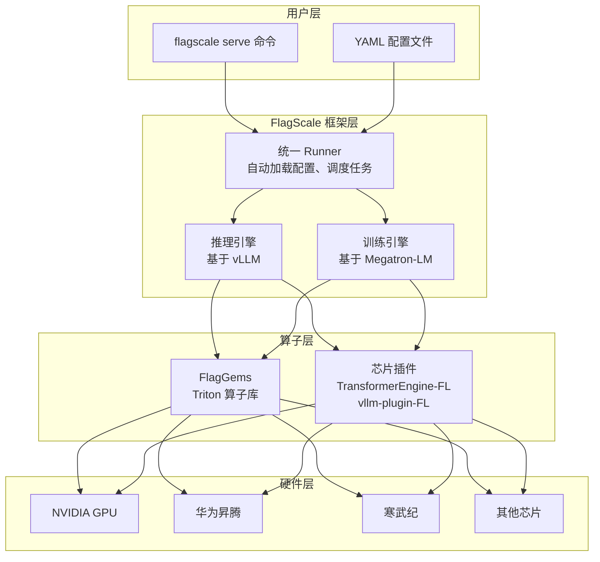

# FlagOS（模型服务平台）

## 基础概念

FlagOS 是北京智源人工智能研究院（BAAI）推出的**开源 AI 系统软件栈**，核心理念是「一次开发，跨芯片迁移」（develop once, migrate across various chips）。它把大模型从训练到部署推理的全流程封装成统一的工具链，让你不用关心底层用的是 NVIDIA GPU、华为昇腾还是寒武纪芯片——写一套配置，换个参数就能跑在不同硬件上。

FlagOS 不是一个单独的 pip 包，而是一整套软件栈，核心组件包括 FlagScale（训练和推理框架）、FlagGems（高性能算子库）等。适合需要多芯片适配、私有化部署、大规模分布式推理的场景。

### 核心要素

| 要素 | 作用 |
|------|------|
| **FlagScale** | 大模型全生命周期工具包，提供训练和推理服务的统一入口，基于 Megatron-LM 和 vLLM 构建 |
| **FlagGems** | 基于 Triton 的高性能算子库，提供 25+ 通用算子的 CUDA 开源替换方案，支持多芯片迁移 |
| **统一 Runner** | FlagScale 的统一命令行机制，一条 `flagscale serve` 命令即可跨硬件平台部署推理服务 |

### FlagScale

FlagScale 是 FlagOS 中最核心的组件，相当于整个系统的「大脑」。它基于 Megatron-LM（训练）和 vLLM（推理）两个成熟的开源项目构建，但在此基础上做了两件关键的事：

1. **多芯片抽象**：通过插件体系（TransformerEngine-FL、vllm-plugin-FL）把硬件差异隐藏起来，上层代码不用改
2. **一键部署**：提供 `flagscale serve` 命令，只需两个 YAML 配置文件就能启动推理服务

FlagScale 支持的模型非常广泛，训练侧支持 DeepSeek-V3、Qwen2/2.5/3、LLaMA2/3、Mixtral 等；推理侧支持 DeepSeek-V3/R1（671B）、Qwen2.5/3、QwQ、Grok2（270B）等。

### FlagGems

FlagGems 是用 Triton 语言编写的算子库，提供矩阵乘法、注意力机制、LayerNorm 等核心算子的高性能实现。它的价值在于：Triton 算子不绑定 CUDA，可以编译到不同芯片后端。在 FlagScale 中切换到 FlagGems 算子只需在配置文件中添加一个环境变量 `USE_FLAGGEMS=1`。

### 要素关系图



## 基础用法

FlagOS 的部署推荐使用 Docker 镜像 + FlagScale CLI 的方式。以下以在 NVIDIA GPU 上部署 QwQ-32B 模型为例，展示完整的部署流程。

环境要求：
- Python 3.8+
- Docker 环境
- GPU 服务器（NVIDIA H100 或同等算力的国产芯片）

**步骤 1：拉取 Docker 镜像并启动容器**

```bash
# 拉取 FlagOS 预构建镜像（以 NVIDIA 版本为例）
docker pull flagrelease-registry.cn-beijing.cr.aliyuncs.com/flagrelease/flagrelease:deepseek-flagos-nvidia

# 启动容器（挂载模型目录）
docker run -itd \
    --name flagos \
    --privileged \
    --gpus all \
    --net=host \
    --ipc=host \
    --shm-size 512g \
    -v /nfs:/nfs \
    flagrelease-registry.cn-beijing.cr.aliyuncs.com/flagrelease/flagrelease:deepseek-flagos-nvidia \
    /bin/bash

# 进入容器
docker exec -it flagos /bin/bash
```

**步骤 2：下载模型权重**

```bash
# 安装 modelscope（国内模型下载工具）
pip install modelscope

# 下载 QwQ-32B 模型到本地
modelscope download --model Qwen/QwQ-32B --local_dir /nfs/QwQ-32B
```

**步骤 3：安装 FlagScale 和 FlagGems**

```bash
# 安装 FlagGems 算子库
git clone https://github.com/FlagOpen/FlagGems.git
cd FlagGems && pip install . && cd ..

# 安装 FlagScale CLI
cd FlagScale
pip install . --no-build-isolation
```

**步骤 4：一键启动推理服务**

```bash
# 一条命令启动推理服务
flagscale serve qwq_32b
```

该命令会自动读取 `FlagScale/examples/qwq_32b/conf/` 下的配置文件，启动基于 vLLM 的推理服务，默认监听 9010 端口。

**步骤 5：调用推理服务**

```python
# 基于 openai==1.60.0 验证（截至 2026-03）
# 需要安装：pip install openai
from openai import OpenAI

# FlagOS 推理服务兼容 OpenAI API 格式
client = OpenAI(
    api_key="not-needed",                  # FlagOS 本地服务不需要 API Key
    base_url="http://localhost:9010/v1",   # 指向 FlagOS 服务地址
)

response = client.chat.completions.create(
    model="qwq-32b-flagos",               # 配置文件中定义的 served_model_name
    messages=[
        {"role": "user", "content": "请用一句话解释什么是 Agent"}
    ],
    max_tokens=256,
    temperature=0.7,
)

print(response.choices[0].message.content)
```

预期输出：

```text
Agent 是一个具备感知环境、自主决策和执行行动能力的智能系统，能根据目标自动规划并完成多步骤任务。
```

FlagScale 的配置通过两个 YAML 文件管理。外层 YAML 定义实验级参数（环境变量、运行器配置），内层 YAML 定义推理引擎参数（模型路径、并行度、显存利用率等）。以 QwQ-32B 为例，推理配置如下：

```yaml
# serve/qwq_32b.yaml —— 推理引擎配置
- serve_id: vllm_model
  engine: vllm
  engine_args:
    model: /nfs/QwQ-32B              # 模型权重路径
    served_model_name: qwq-32b-flagos
    tensor_parallel_size: 8           # 张量并行度（几张卡并行推理）
    max_model_len: 32768              # 最大上下文长度
    max_num_seqs: 256                 # 最大并发请求数
    gpu_memory_utilization: 0.9       # GPU 显存利用率
    port: 9010                        # 服务端口
    trust_remote_code: true
```

## 同类工具对比

| 维度 | FlagOS（FlagScale） | vLLM | SGLang |
|------|-------------------|------|--------|
| 核心定位 | 多芯片统一部署的系统软件栈 | NVIDIA GPU 高性能推理引擎 | 高吞吐 LLM 推理与编排框架 |
| 芯片支持 | NVIDIA、昇腾、寒武纪等多种芯片 | 主要支持 NVIDIA GPU | 主要支持 NVIDIA GPU |
| 部署方式 | `flagscale serve` 一键部署 + Docker 镜像 | Python API 或 CLI 启动 | Python API 或 CLI 启动 |
| 底层引擎 | 基于 vLLM + Megatron-LM 构建 | 原生实现 | 自研引擎，RadixAttention 优化 |
| 适合场景 | 多芯片环境、国产化要求、私有化部署 | NVIDIA 环境下追求极致推理性能 | 复杂 LLM 应用编排、高并发在线服务 |

核心区别：

- **FlagOS**：解决「跨芯片怎么部署」的问题——一套代码适配多种硬件，降低国产化迁移成本
- **vLLM**：解决「NVIDIA 上怎么跑得快」的问题——PagedAttention 等技术把单卡性能拉到极致
- **SGLang**：解决「复杂应用怎么高效服务」的问题——RadixAttention 等技术优化多轮对话、Tree-of-Thought 等复杂推理场景

FlagOS 的推理引擎底层就是 vLLM，所以在 NVIDIA GPU 上两者性能接近。FlagOS 的核心价值在多芯片适配和一键部署的工程化能力。

## 常见误区

| 误区 | 准确理解 |
|------|----------|
| FlagOS 是一个 pip 包，`pip install flagos` 就能用 | FlagOS 是一整套系统软件栈，核心组件是 FlagScale（CLI 工具）和 FlagGems（算子库），通常通过 Docker 镜像 + 源码安装部署 |
| FlagOS 只能部署在国产芯片上 | FlagOS 同样支持 NVIDIA GPU，HuggingFace 上有 QwQ-32B-FlagOS-Nvidia 等预构建镜像。它的核心价值是「跨芯片统一」，而非「只支持国产」 |
| 使用 FlagOS 意味着性能大幅下降 | FlagOS 的推理引擎底层是 vLLM，在 NVIDIA 上性能与原生 vLLM 接近。在国产芯片上通过 FlagGems 算子优化，能充分发挥硬件算力 |

## 优劣势分析

| 优势 | 劣势 |
|------|------|
| 一套代码 + 配置适配多种芯片，降低硬件迁移成本 | 相比直接用 vLLM，多了一层抽象，排查问题时需要理解更多组件 |
| `flagscale serve` 一键部署，Docker 镜像开箱即用 | 社区规模小于 vLLM 和 SGLang，遇到问题可参考的资料较少 |
| 基于 vLLM + Megatron-LM 等成熟项目构建，底层经过充分验证 | 版本迭代较快（v1.0 重构了代码库），旧版本迁移有成本 |
| Apache 2.0 开源协议，可商用 | 部分预构建 Docker 镜像体积较大，首次拉取耗时 |

## 思考题

<details>
<summary>初级：FlagOS 的「一次开发，跨芯片迁移」是通过什么机制实现的？</summary>

**参考答案：**

通过两个关键机制：
1. **FlagGems 算子库**：用 Triton 语言编写的通用算子，可编译到不同芯片后端，替代 CUDA 专用算子
2. **插件体系**：TransformerEngine-FL 和 vllm-plugin-FL 等插件封装了芯片相关的适配逻辑，上层代码通过统一接口调用

用户只需在配置文件中指定目标芯片类型，FlagScale 的统一 Runner 会自动加载对应的插件和算子库。

</details>

<details>
<summary>中级：FlagOS 的 `flagscale serve` 底层做了什么？为什么只需两个 YAML 文件就能启动服务？</summary>

**参考答案：**

`flagscale serve` 使用 Hydra 配置管理框架，将部署参数分为两层：
- 外层 YAML：实验级配置（环境变量、SSH 端口、启动前命令等运行环境参数）
- 内层 YAML：引擎级配置（模型路径、张量并行度、显存利用率、服务端口等推理参数）

执行时，统一 Runner 会：加载并合并两层配置 -> 根据配置初始化推理引擎（默认 vLLM）-> 自动设置张量并行/流水线并行 -> 启动兼容 OpenAI API 的 HTTP 服务。这样用户不需要写任何 Python 代码，只需修改 YAML 参数即可完成部署。

</details>

<details>
<summary>中级：在什么场景下应该选择 FlagOS 而非直接用 vLLM？</summary>

**参考答案：**

三种典型场景适合选择 FlagOS：

1. **多芯片环境**：团队同时有 NVIDIA GPU 和国产芯片（昇腾、寒武纪等），希望用一套部署流程管理所有硬件
2. **国产化合规要求**：政府、金融、医疗等行业要求数据不出境或使用国产基础设施，FlagOS 提供原生国产芯片支持
3. **大规模异构集群**：需要跨节点、跨芯片类型的分布式推理，FlagScale 的自动并行策略能根据不同芯片的算力自动优化分配

如果只用 NVIDIA GPU 且追求极致性能调优，直接用 vLLM 更轻量。

</details>

## 参考资料

1. FlagOpen 开源体系官网：[https://flagopen.baai.ac.cn/](https://flagopen.baai.ac.cn/)
2. FlagScale GitHub 仓库：[https://github.com/FlagOpen/FlagScale](https://github.com/FlagOpen/FlagScale)
3. FlagGems GitHub 仓库：[https://github.com/FlagOpen/FlagGems](https://github.com/FlagOpen/FlagGems)
4. QwQ-32B-FlagOS-Nvidia 部署指南（HuggingFace）：[https://huggingface.co/FlagRelease/QwQ-32B-FlagOS-Nvidia](https://huggingface.co/FlagRelease/QwQ-32B-FlagOS-Nvidia)
5. BAAI 智源研究院系统板块：[https://www.baai.ac.cn/en/system](https://www.baai.ac.cn/en/system)
