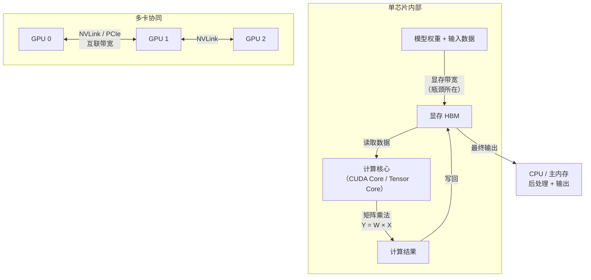
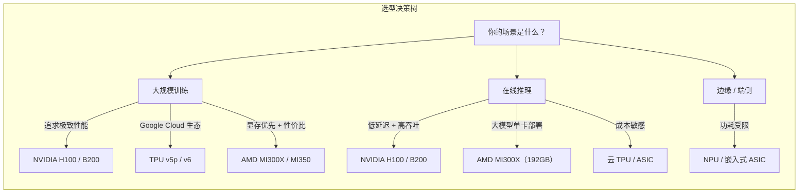

# AI 硬件概述（Hardware Overview）

## 概念解释

AI 硬件是指专门为深度学习训练和推理优化的计算芯片及其配套系统。最常见的是 GPU（Graphics Processing Unit，图形处理单元），此外还有 TPU（Tensor Processing Unit，张量处理单元）、ASIC（Application-Specific Integrated Circuit，专用集成电路）等。

为什么需要专用硬件？因为大语言模型的核心运算是海量的矩阵乘法。通用 CPU 虽然什么都能算，但它的核心少（几十个）、每次只能串行处理少量数据，就像一个全能但只有两只手的厨师。而 GPU 拥有数千个并行计算核心，可以同时处理大量矩阵运算，相当于几千个助手同时切菜——速度快了几个数量级。

在 Agent 应用中，硬件决定了模型推理的速度和成本。选错硬件可能导致：推理延迟太高（用户等不了）、显存不够（模型装不下）、或者花了冤枉钱（杀鸡用牛刀）。理解 AI 硬件的基本类型和关键指标，是做好模型部署的前提。

## 关键结构

AI 硬件生态可以从两个维度理解：**芯片类型**（用什么）和**核心指标**（看什么）。

### 芯片类型速览

| 类型 | 代表产品 | 核心优势 | 典型用途 |
|------|---------|---------|---------|
| GPU | NVIDIA H100 / B200、AMD MI300X | 通用并行计算，生态最成熟 | 训练 + 推理，最主流选择 |
| TPU | Google TPU v5p / v6 (Trillium) | 张量运算优化，与 Google Cloud 深度集成 | 大规模训练和推理（Google 生态） |
| ASIC | AWS Trainium / Inferentia、华为昇腾 | 特定任务极致优化，能效比高 | 大规模推理、边缘计算 |
| CPU | Intel Xeon、AMD EPYC | 通用计算，灵活性最高 | 数据预处理、调度编排、小模型推理 |

### 核心指标速览

| 指标 | 含义（大白话） | 为什么重要 |
|------|--------------|-----------|
| 算力（FLOPS） | 每秒能做多少次浮点运算 | 决定训练和推理的计算速度 |
| 显存容量（GB） | 芯片上能装多少数据 | 决定能跑多大的模型 |
| 显存带宽（TB/s） | 数据从显存搬到计算核心的速度 | LLM 推理的真正瓶颈，比算力更关键 |
| 互联带宽（GB/s） | 多块芯片之间传数据的速度 | 多卡并行时，通信慢会拖垮性能 |
| 功耗（W） | 芯片运行时消耗的电力 | 影响电费和散热成本 |

## 核心原理

### 原理说明

AI 硬件加速的核心逻辑可以归结为一句话：**把矩阵乘法从通用处理器搬到专用并行处理器上**。

大语言模型推理时，绝大部分计算是矩阵乘法：$Y = W \times X$（$W$ 是模型权重，$X$ 是输入）。CPU 处理这种运算时是"一个一个算"，而 GPU 可以"几千个同时算"。

但光有计算能力还不够。模型权重和中间结果都存在显存（通常是 HBM，High Bandwidth Memory，高带宽存储器）里。计算核心要不停地从显存读数据、算完再写回去。如果显存带宽不够，计算核心就会"饿着肚子等数据"——这就是为什么 LLM 推理是**显存带宽受限**（memory-bandwidth bound）而不是计算受限。

多块 GPU 协同工作时，还需要高速互联（如 NVIDIA NVLink）在卡间传输数据。互联带宽不足会导致多卡扩展效率大打折扣。

### Mermaid 图解



**图解要点：**
- 单芯片内部：数据在显存和计算核心之间反复搬运，显存带宽是推理性能的真正瓶颈。
- 多卡协同：大模型装不进单卡显存时，需要把模型切分到多块 GPU，卡间通过 NVLink 等高速互联传输数据。
- 最终结果通过 PCIe 回传 CPU，由 CPU 完成采样、输出等后处理。

### 运行示例

```python
# 检查 GPU 硬件信息（基于 PyTorch 2.1+，截至 2026-03）
import torch

if torch.cuda.is_available():
    props = torch.cuda.get_device_properties(0)
    print(f"GPU 型号: {props.name}")
    print(f"显存容量: {props.total_mem / (1024**3):.1f} GB")  # total_mem 单位为字节
    print(f"SM 数量: {props.multi_processor_count}")  # SM = 流多处理器
else:
    print("未检测到 CUDA GPU")
```

`torch.cuda.get_device_properties()` 返回 GPU 的硬件属性。SM（Streaming Multiprocessor，流多处理器）数量反映并行计算能力——SM 越多，同时处理的矩阵分块越多。

## 主流硬件对比

### NVIDIA GPU 产品线

NVIDIA 凭借 CUDA 生态的先发优势，是目前 AI 硬件的事实标准。

| 型号 | 架构 | 显存 | 显存带宽 | FP16 算力 | 功耗 | 定位 |
|------|------|------|---------|----------|------|------|
| A100 | Ampere | 80 GB HBM2e | 2.0 TB/s | ~312 TFLOPS | 400W | 上一代主力，仍广泛使用 |
| H100 | Hopper | 80 GB HBM3 | 3.35 TB/s | ~990 TFLOPS | 700W | 当前生产主力 |
| H200 | Hopper 升级 | 141 GB HBM3e | 4.8 TB/s | ~990 TFLOPS | 700W | H100 的大显存版本 |
| B200 | Blackwell | 192 GB HBM3e | 8 TB/s | ~2.5 PFLOPS (FP8) | 1000W | 最新旗舰，性能最强 |

**关键信息：**
- **H100** 是目前最广泛部署的训练和推理 GPU，支持 FP8 精度和 Transformer Engine（变压器引擎），相比 A100 训练速度提升约 3 倍。
- **B200**（Blackwell 架构，2025 年量产）是新一代性能王者：192 GB 显存、8 TB/s 带宽、支持 FP4 精度。NVIDIA 称其训练性能是 H100 的 4 倍，推理能效提升 30 倍。
- **GB200** 是 Grace CPU + 2 块 B200 GPU 的超级芯片组合，72 块 GPU 组成的 NVL72 机架可作为单个 1.4 EFLOPS 的"超级 GPU"运行。

### AMD GPU 产品线

AMD 是 NVIDIA 在 AI GPU 领域的主要竞争对手，核心优势是大显存和性价比。

| 型号 | 架构 | 显存 | 显存带宽 | FP16 算力 | 定位 |
|------|------|------|---------|----------|------|
| MI300X | CDNA 3 | 192 GB HBM3 | 5.3 TB/s | ~1.3 PFLOPS | 大显存推理，单卡可装 70B 模型 |
| MI325X | CDNA 3+ | 256 GB HBM3e | 6 TB/s | ~1.3 PFLOPS | MI300X 的显存升级版 |
| MI350X/MI355X | CDNA 4 | 288 GB HBM3e | 8 TB/s | ~5 PFLOPS | 新一代旗舰，支持 FP4/FP6 |

**关键信息：**
- **MI300X** 的 192 GB 显存是最大卖点：单卡可装下 70B 参数模型（FP16），省去多卡拆分的麻烦。
- **MI350/MI355X**（2025 年发布，CDNA 4 架构）性能大幅跃升：FP8 算力 10 PFLOPS，AMD 称推理速度比 MI300X 快 35 倍。
- AMD 的软件生态（ROCm）仍是短板：虽然在持续改进，但与 CUDA 的成熟度仍有差距，部分框架和工具需要额外适配。

### Google TPU

TPU 是 Google 自研的 AI 专用芯片，深度集成于 Google Cloud。

| 型号 | 单芯片 BF16 算力 | 显存 | 显存带宽 | 特点 |
|------|-----------------|------|---------|------|
| TPU v5p | ~459 TFLOPS | 95 GB HBM2e | 2.76 TB/s | 单 Pod 最多 8960 芯片 |
| TPU v6e (Trillium) | ~918 TFLOPS | 32 GB | 1.6 TB/s | 能效比 v5e 提升 67% |

**关键信息：**
- TPU 的优势不在单芯片性能，而在**超大规模集群**：通过 3D 环面互联拓扑，数千块 TPU 可以像一块"超级芯片"一样协同工作。
- TPU 与 TensorFlow / JAX 框架深度绑定，在 Google Cloud 上使用最方便。但脱离 Google 生态后灵活性有限。

### 对比总结



## 易混概念辨析

| 概念 | 与 AI 硬件概述的区别 | 更适合关注的重点 |
|------|---------------------|------------------|
| 模型部署架构 | 硬件是"用什么跑"，部署架构是"怎么组织起来跑" | 关注推理服务的系统设计（负载均衡、弹性伸缩） |
| 模型量化 | 硬件提供算力，量化是降低模型对算力和显存的需求 | 关注精度与效率的权衡（FP16→INT8→FP4） |
| 分布式训练 | 硬件是基础设施，分布式训练是利用多卡/多机的并行策略 | 关注数据并行、张量并行、流水线并行等策略 |
| 云服务 | 硬件是物理层面，云服务是把硬件打包成按需付费的服务 | 关注 GPU 实例选型、定价模式、弹性调度 |

核心区别：

- **AI 硬件概述**：关注芯片本身的类型、指标和选型逻辑
- **模型部署架构**：关注硬件之上的软件和系统设计
- **模型量化**：关注如何让模型在有限硬件上跑得更高效

## 适用边界与局限

### 适用场景

1. **硬件选型决策**：需要为项目选择 GPU 型号时，理解各芯片的显存、带宽、算力指标是基本功。
2. **成本估算**：部署方案的成本核算离不开硬件参数——显存决定需要几张卡，功耗决定电费。
3. **性能瓶颈分析**：当推理速度不达预期时，判断瓶颈在计算、显存带宽还是互联带宽，需要理解硬件原理。

### 不适合的场景

1. **纯应用层开发**：如果只是调用 API（如 OpenAI API），不需要关心底层硬件细节。
2. **硬件设计与制造**：本卡片面向 AI 应用开发者，不涉及芯片架构设计和半导体工艺。

### 局限性

1. **硬件迭代极快**：AI 芯片几乎每年一代，本卡片中的具体参数可能随时间过时，需参考厂商官网获取最新数据。
2. **实际性能因场景而异**：厂商标称的峰值算力在实际工作负载中通常只能达到 30%–60%，不能直接用峰值数据做决策。
3. **软件生态比硬件更关键**：再强的硬件，如果框架不支持、驱动不稳定，也发挥不出性能。NVIDIA 的 CUDA 生态优势短期内难以被替代。

## 常见误区

| 常见误区 | 正确理解 |
|----------|----------|
| "算力越高推理越快" | LLM 推理主要受**显存带宽**限制，不是算力。一块带宽 8 TB/s 的卡，推理速度可能远超一块算力更高但带宽只有 2 TB/s 的卡。 |
| "显存越大越好" | 显存大小应匹配模型大小。7B 模型 FP16 约占 14 GB，用 192 GB 显存的卡跑它纯属浪费。按需选择，把钱花在刀刃上。 |
| "NVIDIA 是唯一选择" | AMD MI300X 在大显存推理场景有独特优势；Google TPU 在大规模训练上性价比出色；华为昇腾在国产化合规场景不可替代。没有"唯一最好"的硬件。 |
| "多卡一定比单卡快" | 多卡并行有通信开销。如果模型能装进单卡，单卡推理延迟通常更低。只有模型太大装不下时，才需要多卡切分。 |
| "FP8 / FP4 量化会严重损失精度" | 现代芯片（H100、B200、MI350）原生支持低精度计算。FP8 推理在大多数任务上精度损失不到 1%，但速度可提升 2–4 倍。 |

## 思考题

<details>
<summary>初级：LLM 推理的性能瓶颈通常是算力还是显存带宽？为什么？</summary>

**参考答案：**

通常是显存带宽。LLM 推理时，每生成一个 token 都需要从显存读取全部模型权重，但每次读取只做少量计算（一次矩阵-向量乘法）。计算量相对于数据搬运量来说很小，所以计算核心大部分时间在等数据，显存带宽成为瓶颈。这就是为什么 H200（4.8 TB/s）比 H100（3.35 TB/s）在推理上更快，尽管两者算力相同。

</details>

<details>
<summary>中级：一个 70B 参数的模型（FP16 精度），至少需要多少显存才能装下？如果只有 80 GB 显存的 GPU，有什么解决办法？</summary>

**参考答案：**

70B 参数 × 2 字节（FP16）= 140 GB，这还不算推理时的 KV Cache 和激活值，实际需要约 150–160 GB。80 GB 显存的单卡装不下。解决办法有三种：(1) 量化到 INT8（约 70 GB）或 INT4（约 35 GB），可以装进单卡；(2) 使用多卡张量并行，把模型切分到 2–3 张 80 GB 卡上；(3) 选择大显存卡如 AMD MI300X（192 GB），单卡可装下 FP16 的 70B 模型。

</details>

<details>
<summary>中级/进阶：你的团队需要部署一个在线问答 Agent，基于 7B 模型，日均 10 万次请求，P99 延迟要求 < 200ms。预算有限。你会如何选择硬件？请说明理由。</summary>

**参考答案：**

7B 模型 FP16 约占 14 GB 显存，单张中端 GPU 即可装下。推荐方案：(1) 使用 INT8 量化将模型压缩到约 7 GB，进一步降低显存和计算需求；(2) 选择 1–2 张 NVIDIA A100 或同等级 GPU（无需 H100，因为 7B 模型不需要那么大的带宽和算力）；(3) 使用 vLLM 等高效推理框架，利用 PagedAttention 和连续批处理提升吞吐量。10 万次/天 ≈ 1.2 QPS 平均，峰值约 5–10 QPS，单卡 + vLLM 足够支撑。选择依据：模型小，不需要顶配硬件；预算有限，A100 性价比优于 H100；使用成熟推理框架可以最大化硬件利用率。

</details>

## 参考资料

1. NVIDIA. "NVIDIA Blackwell Architecture." NVIDIA 官方页面. https://www.nvidia.com/en-us/data-center/technologies/blackwell-architecture/
2. NVIDIA. "DGX B200." NVIDIA 数据中心产品页. https://www.nvidia.com/en-us/data-center/dgx-b200/
3. AMD. "AMD Instinct MI350 Series GPUs." AMD 官方产品页. https://www.amd.com/en/products/accelerators/instinct/mi350.html
4. AMD. "AMD Instinct MI300 Series Accelerators." AMD 官方产品页. https://www.amd.com/en/products/accelerators/instinct/mi300.html
5. Google Cloud. "Trillium sixth-generation TPU is in preview." Google Cloud Blog. https://cloud.google.com/blog/products/compute/trillium-sixth-generation-tpu-is-in-preview
6. Google Cloud. "TPU v5p Documentation." Google Cloud 文档. https://cloud.google.com/tpu/docs/v5p
7. Northflank. "12 Best GPUs for AI and Machine Learning in 2026." https://northflank.com/blog/best-gpu-for-ai
8. AIMultiple Research. "Multi-GPU Benchmark: B200 vs H200 vs H100 vs MI300X." https://research.aimultiple.com/multi-gpu/
