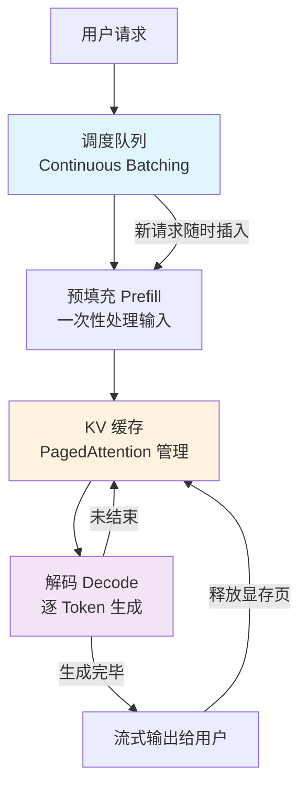

# 推理引擎（Inference Engines）

## 概念解释

推理引擎是一类专门用来**加速大语言模型推理过程**的软件工具。模型训练完成后，不能直接拿来服务用户——它需要一个高效的"运行环境"来处理请求、生成回答。推理引擎就是这个运行环境，负责把模型的能力以低延迟、高吞吐的方式交付出去。

为什么需要专门的推理引擎？因为大语言模型的推理方式很特殊：它是**逐个 Token（词元）生成**的。生成一段 200 字的回答，模型可能要跑几百次前向计算，每一次都要保存之前所有 Token 的中间状态（KV 缓存）。如果不做任何优化，一个 70B 参数的模型光放权重就需要 140GB 显存（FP16），再加上 KV 缓存和计算中间值，单张 GPU 根本装不下。

推理引擎通过量化（Quantization，权重压缩）、连续批处理（Continuous Batching，动态调度请求）、分页注意力（PagedAttention，高效管理显存）等技术，把原本"跑不动、跑得慢、跑不起"的模型变成能在生产环境中高效服务的推理服务。

## 关键结构

推理引擎内部的优化可以从四个层面理解：

| 层面 | 核心技术 | 解决的问题 |
|------|---------|-----------|
| 显存压缩 | 量化（FP8 / INT4） | 模型太大，GPU 装不下 |
| 请求调度 | 连续批处理 | 多用户请求排队等太久 |
| 缓存管理 | PagedAttention / RadixAttention | KV 缓存碎片化浪费显存 |
| 生成加速 | 推测解码（Speculative Decoding） | 逐 Token 生成太慢 |

### 层面 1：量化——把模型"压缩"到 GPU 里

量化的核心思路是降低数值精度。模型权重原本用 FP16（16 位浮点数）存储，量化后改用 FP8（8 位）或 INT4（4 位整数）。一个 70B 模型从 FP16 的 140GB 压缩到 INT4 只需约 35GB，就能塞进单张 80GB 的 A100 显卡。现代量化方案（如 AWQ、GPTQ）可以把精度损失控制在 0.5% 以内，实际使用几乎无感。

### 层面 2：连续批处理——请求来了就处理，不用排队等

传统批处理（Static Batching）要等凑齐一批请求才一起算，先到的请求得等后到的。连续批处理打破了这个限制：新请求随时插入，完成的请求随时退出。好比餐厅从"满桌才上菜"变成"点一道上一道"，GPU 利用率可以提升 10-20 倍。

### 层面 3：PagedAttention——像操作系统管内存一样管 KV 缓存

生成每个 Token 时，模型都要保存之前所有 Token 的 Key 和 Value 矩阵，这就是 KV 缓存。传统方式为每个请求预分配一大块连续显存，实际往往只用一部分，浪费 60-80%。PagedAttention 借鉴操作系统的虚拟内存机制，把 KV 缓存切成固定大小的"页"，按需分配、用完回收，显存利用率提升 30-40%。

### 层面 4：推测解码——用小模型"打草稿"，大模型"批改"

逐个 Token 生成的瓶颈在于每次只产出一个 Token。推测解码的做法是：先用一个小的"草稿模型"快速猜测接下来 5-10 个 Token，再让大模型一次性验证。猜对的直接保留，猜错的重新生成。这样一轮就能产出多个 Token，吞吐量可提升 2-3 倍。

## 核心原理

### 原理说明

推理引擎处理一个用户请求的完整流程：

1. **请求进入**：用户发送提示词（Prompt），推理引擎将其加入调度队列
2. **预填充阶段（Prefill）**：一次性处理整段输入提示词，生成初始 KV 缓存。这一步是计算密集型（Compute-bound），GPU 算力拉满
3. **解码阶段（Decode）**：逐个生成输出 Token。每生成一个 Token 就要读取全部 KV 缓存，这一步是内存带宽密集型（Memory-bound），显存读写速度是瓶颈
4. **调度与复用**：连续批处理让多个请求的 Prefill 和 Decode 交替执行；PagedAttention 让不同请求的 KV 缓存高效共享显存
5. **流式输出**：每生成一个 Token 就立即返回给用户，用户无需等到整段回复生成完毕

关键认知：Prefill 和 Decode 两个阶段的计算特征完全不同，这就是为什么有些引擎（如 SGLang）会做"预填充-解码分离"（PD Disaggregation），用不同的 GPU 分别处理两个阶段以获得最佳性能。

### Mermaid 图解

图中有三个关键节点需要注意：

- **调度队列**（蓝色）：连续批处理的核心，新请求无需等待当前批次完成
- **KV 缓存**（橙色）：PagedAttention 将显存利用率从 20-40% 提升到 90%+，是高并发的基础
- **解码循环**（紫色）：每生成一个 Token 就要回到 KV 缓存读取历史信息，这个循环的效率决定了生成速度

## 易混概念辨析

| 概念 | 与推理引擎的区别 | 更适合关注的重点 |
|------|-----------------|----------------|
| 推理框架（如 PyTorch） | PyTorch 是通用深度学习框架，推理引擎是专门为 LLM 推理场景优化的服务系统 | 通用计算图执行 |
| 模型服务框架（如 Triton） | Triton 是通用模型部署平台，可以把推理引擎作为后端集成 | 多模型统一管理和路由 |
| 模型压缩 | 量化只是推理引擎的一个子技术，推理引擎还包括调度、缓存、并行等一整套优化 | 单纯减小模型体积 |
| 训练框架（如 DeepSpeed） | 训练框架优化的是前向 + 反向传播，推理引擎只做前向传播的推理优化 | 梯度计算和参数更新 |

核心区别：

- **推理引擎**：专注于"让训练好的模型以最高效率服务用户请求"，是部署阶段的核心组件
- **推理框架**：提供通用计算能力，推理引擎在其基础上做了大量 LLM 专用优化
- **模型服务框架**：管理模型的部署和路由，推理引擎负责单个模型的具体推理执行

## 主流推理引擎对比

> 截至 2026 年 3 月的生态格局。

| 引擎 | 开发方 | 核心优势 | 硬件要求 | 适合场景 |
|------|-------|---------|---------|---------|
| **vLLM** | UC Berkeley | PagedAttention，并发稳定性好 | NVIDIA / AMD GPU | 通用生产部署（默认选择） |
| **SGLang** | UC Berkeley / LMSYS | RadixAttention，结构化输出和多轮对话极快 | NVIDIA / AMD GPU | RAG、多轮对话、结构化生成 |
| **TensorRT-LLM** | NVIDIA | 深度硬件优化，极致吞吐 | 仅 NVIDIA GPU | 追求最高性能的大规模服务 |
| **llama.cpp** | 社区 | 纯 C++ 无依赖，CPU/GPU 通吃 | CPU / GPU 均可 | 本地部署、边缘设备、个人使用 |
| **Ollama** | Ollama Inc | 一行命令运行模型，开箱即用 | CPU / GPU 均可 | 快速原型、本地实验 |

几个关键判断依据：

- **不确定选哪个 → vLLM**。社区最大、文档最全、兼容性最好，是当前的行业默认选择
- **大量多轮对话或 RAG → SGLang**。RadixAttention 对重复前缀的缓存效率远超其他引擎，xAI（Grok）和 LMSYS Chatbot Arena 都在用
- **NVIDIA GPU + 极致性能 → TensorRT-LLM**。编译优化后吞吐量比 vLLM 高 30-50%，但配置复杂且锁定 NVIDIA 硬件
- **笔记本 / 没有 GPU → llama.cpp / Ollama**。llama.cpp 是底层引擎，Ollama 是它的封装，追求便捷选 Ollama，追求性能控制选 llama.cpp

> **注意**：Hugging Face 的 TGI（Text Generation Inference）已于 2025 年 12 月进入维护模式，不再接受新功能开发。如果你正在使用 TGI，官方建议迁移到 vLLM 或 SGLang。

### 性能参考

以下数据综合多方基准测试，仅供量级参考，实际表现受模型大小、硬件配置、请求模式影响很大：

| 指标 | vLLM（H100） | SGLang（H100） | TensorRT-LLM（H100） | llama.cpp（CPU） |
|------|-------------|---------------|---------------------|-----------------|
| 吞吐量（tok/s） | ~12,500 | ~16,200 | ~18,000+ | ~50-80 |
| 首 Token 延迟 | 50-80ms | 40-60ms | 30-50ms | 500ms+ |
| 显存利用率 | 高 | 高 | 最高 | 不适用 |
| 配置难度 | 低 | 低-中 | 高 | 低 |

## 适用边界与局限

### 适用场景

1. **在线 API 服务**：需要同时处理大量并发请求（如 ChatGPT 类产品），推理引擎的连续批处理和 PagedAttention 是支撑高并发的基础
2. **本地离线部署**：医疗、金融等不能将数据传到云端的场景，llama.cpp + 量化可以让模型在普通服务器甚至笔记本上运行
3. **RAG / 多轮对话系统**：大量请求共享相同的系统提示词和上下文前缀，SGLang 的 RadixAttention 可以避免重复计算

### 不适合的场景

1. **模型训练和微调**：推理引擎只做前向传播，不支持反向传播和梯度更新，训练请使用 PyTorch、DeepSpeed 等训练框架
2. **非 LLM 模型的推理**：推理引擎的优化（KV 缓存、自回归解码调度）是为 LLM 设计的，图像分类、目标检测等任务应使用 TensorRT、ONNX Runtime 等通用推理框架

### 局限性

1. **模型架构兼容性**：推理引擎通常只支持主流架构（Transformer Decoder），非标准架构或全新模型可能需要等待引擎适配
2. **硬件锁定风险**：TensorRT-LLM 仅支持 NVIDIA GPU，选型时需考虑未来硬件更换的可能性
3. **调优门槛**：虽然基础使用门槛不高，但要榨干最后一点性能（量化策略、批处理参数、显存分配比例），需要对底层原理有深入理解

## 常见误区

| 常见误区 | 正确理解 |
|----------|----------|
| "量化一定会大幅降低模型质量" | 现代量化方案（AWQ、GPTQ、FP8）在精心校准后，精度损失可控制在 0.5% 以内，绝大多数应用场景无感知差异 |
| "推理引擎只在 GPU 上有用" | llama.cpp 专门为 CPU 优化，7B 模型量化后在普通笔记本上可达 50+ tok/s，完全可用 |
| "vLLM 一定比 TensorRT-LLM 慢" | vLLM 在高并发场景下的延迟稳定性优于 TensorRT-LLM；SGLang 在多轮对话场景下吞吐量反而更高。没有"绝对最快"的引擎，只有"最适合当前场景"的引擎 |
| "Ollama 和 llama.cpp 是两个完全不同的东西" | Ollama 底层就是 llama.cpp，它是 llama.cpp 的封装。不过 Ollama 正在逐步开发自己的推理后端，两者未来可能分化 |

## 思考题

初级：为什么推理引擎要把 KV 缓存切成"页"来管理，而不是给每个请求分配一大块连续显存？

**参考答案：**

连续分配有两个问题：一是需要预估最大长度提前分配，实际生成往往远短于最大长度，造成大量显存浪费；二是不同请求释放时间不同，频繁分配释放会造成显存碎片化。PagedAttention 把 KV 缓存切成固定大小的页，按需分配，用完即回收，就像操作系统用分页机制管理内存一样，既避免了浪费，又消除了碎片化。

中级：如果你的业务场景是"1000 个用户对同一篇长文档提问"（典型 RAG 场景），你会选 vLLM 还是 SGLang？为什么？

**参考答案：**

选 SGLang。因为 1000 个请求共享同一篇文档作为上下文前缀，SGLang 的 RadixAttention 会用 Radix Tree 自动缓存这个共同前缀的 KV 缓存，只需计算一次就能被所有请求复用。vLLM 虽然也支持前缀缓存（Automatic Prefix Caching），但 SGLang 的实现在这种"大量请求共享长前缀"的场景下效率更高，官方基准测试显示可达 3-6 倍吞吐提升。

进阶：Prefill 阶段是计算密集型，Decode 阶段是内存带宽密集型。基于这个特点，SGLang 的"预填充-解码分离"（PD Disaggregation）具体是怎么优化的？它的代价是什么？

**参考答案：**

PD Disaggregation 把 Prefill 和 Decode 分配到不同的 GPU 上执行。Prefill GPU 配置高算力（充分利用计算单元处理输入），Decode GPU 配置高显存带宽（充分利用带宽逐 Token 读取 KV 缓存）。这样两类 GPU 各自发挥硬件优势，避免了混合执行时的互相干扰。代价是：需要在两组 GPU 之间传输 KV 缓存，增加了网络通信开销；同时需要更多 GPU 和更复杂的集群调度，适合大规模部署但不适合小规模场景。

## 参考资料

1. Kwon, W. et al. (2023). "Efficient Memory Management for Large Language Model Serving with PagedAttention." *SOSP 2023*. https://arxiv.org/abs/2309.06180 — vLLM 核心论文，提出 PagedAttention
2. Zheng, L. et al. (2024). "SGLang: Efficient Execution of Structured Language Model Programs." *NSDI 2025*. https://arxiv.org/abs/2312.07104 — SGLang 核心论文，提出 RadixAttention
3. NVIDIA TensorRT-LLM GitHub 仓库. https://github.com/NVIDIA/TensorRT-LLM
4. llama.cpp GitHub 仓库. https://github.com/ggml-org/llama.cpp
5. vLLM 官方文档与博客. https://docs.vllm.ai/ / https://blog.vllm.ai/
6. BentoML. "Choosing the Right Inference Framework." https://bentoml.com/llm/getting-started/choosing-the-right-inference-framework — 推理框架选型实用指南
