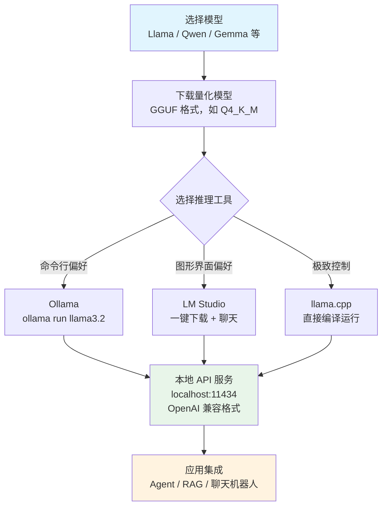

# 本地模型概述（Local Model Deployment）

## 概念解释

本地模型部署（Local Model Deployment）是指把大语言模型（LLM）下载到自己的电脑或服务器上直接运行，而不是通过网络调用云端 API（如 OpenAI、Claude 等）。你可以把它理解为"把 AI 装进自己的机器里"。

为什么需要本地部署？核心原因有三个。第一，**隐私安全**：所有数据留在自己机器上，不会传到别人的服务器，这对医疗、金融、法律等敏感行业至关重要。第二，**成本可控**：云端 API 按调用次数收费，用得越多越贵；本地部署只需一次硬件投入，后续推理（Inference，即让模型生成回答的过程）是免费的。第三，**零延迟**：不经过网络，模型的响应速度完全由本地硬件决定，可以做到即时回答。

和传统的"装软件"不同，本地部署 LLM 的挑战在于模型文件通常很大（几 GB 到几十 GB），需要足够的显存（VRAM）或内存来装下。这催生了一整套让大模型在消费级硬件上高效运行的技术生态，包括模型量化（Quantization，用更少的数据精度存储模型参数来减小体积）和专门的推理工具。

## 关键结构

本地模型部署涉及四个核心要素，缺一不可：

| 结构 | 作用 | 说明 |
|------|------|------|
| 模型文件 | 实际的 AI"大脑" | 开源模型的权重文件，常用 GGUF 格式分发 |
| 量化策略 | 压缩模型体积 | 决定需要多少显存才能跑起来 |
| 推理工具 | 加载和运行模型 | Ollama、LM Studio、llama.cpp 三大主流工具 |
| 硬件资源 | 提供算力支撑 | 显存（VRAM）是最关键的瓶颈指标 |

### 结构 1：模型文件与 GGUF 格式

GGUF（GPT-Generated Unified Format）是当前本地部署的通用模型格式，由 llama.cpp 生态发展而来。它把模型权重、分词器（Tokenizer，将文字拆成模型能理解的片段的工具）、配置信息打包成一个文件。Ollama、LM Studio、llama.cpp 都直接使用 GGUF 文件。

常见的开源模型系列包括：Llama（Meta）、Qwen（阿里）、Gemma（Google）、DeepSeek、Mistral 等。这些模型在 Hugging Face 或各工具的模型库中都能免费下载。

### 结构 2：量化策略

量化的核心思想是用更少的比特位存储每个模型参数，从而缩小模型体积、降低显存需求。GGUF 格式采用一套命名规则来标识不同的量化级别：

| 量化级别 | 含义 | 典型体积（7B 模型） | 质量 |
|----------|------|---------------------|------|
| Q8_0 | 8-bit 量化 | 约 7 GB | 接近原始精度 |
| Q5_K_M | 5-bit K-量化 | 约 5 GB | 质量优秀 |
| **Q4_K_M** | **4-bit K-量化** | **约 4 GB** | **推荐平衡点** |
| Q2_K | 2-bit K-量化 | 约 2.5 GB | 质量下降明显 |

其中 Q4_K_M 是大多数场景下的最佳选择：体积缩小约 70%，质量损失很小（基准测试通常保持原始精度的 95% 左右）。名称中的 "K" 表示使用了分组量化技术（对不同层使用不同精度），"M" 代表中等压缩力度。

### 结构 3：三大推理工具

| 工具 | 定位 | 界面 | 适合谁 |
|------|------|------|--------|
| **Ollama** | 开发者首选 | 命令行（CLI） | 想写代码集成的开发者 |
| **LM Studio** | 最易上手 | 图形界面（GUI） | 不想碰命令行的用户 |
| **llama.cpp** | 性能极致 | 命令行 / 编译运行 | 追求最大控制权的高级用户 |

三者的关系：llama.cpp 是底层推理引擎，Ollama 和 LM Studio 都在其之上做了封装。Ollama 封装成简洁的命令行工具和 API 服务；LM Studio 封装成可视化桌面应用。直接用 llama.cpp 则去掉所有中间层，获得最大灵活性和性能。

### 结构 4：硬件与显存

显存（VRAM）是本地部署的第一瓶颈。经验公式：**Q4_K_M 量化下，每 10 亿参数约需 0.6-0.7 GB 显存**。

| 显存 | 能跑的模型规模 | 代表显卡 |
|------|---------------|----------|
| 8 GB | 7B 参数模型 | RTX 4060、Apple M1 (8GB) |
| 16 GB | 13-14B 参数模型 | RTX 4060 Ti 16GB、Apple M2 Pro (16GB) |
| 24 GB | 30-70B 参数模型（量化后） | RTX 3090、RTX 4090 |
| 32 GB | 70B+ 参数模型 | RTX 5090 |

Apple Silicon（M1/M2/M3/M4）的统一内存架构让 Mac 也成为本地部署的热门选择，虽然速度比独立显卡慢一些，但可以利用全部内存来装载大模型。

## 核心原理

### 原理说明

本地模型部署的工作流程可以分为五步：

1. **选择模型**：根据任务需要（文本对话、代码生成、多模态理解等）和硬件条件，选择合适的开源模型和参数规模。
2. **下载与量化**：从模型库下载 GGUF 格式的量化模型文件。大多数情况下，直接下载已量化好的版本即可，不需要自己做量化。
3. **工具加载**：使用推理工具（Ollama/LM Studio/llama.cpp）将模型文件加载到 GPU 显存或内存中。
4. **推理服务**：模型加载后，工具会提供一个本地 API 接口（通常兼容 OpenAI API 格式），应用程序可以像调用云端 API 一样调用本地模型。
5. **持续运行**：模型常驻内存，随时响应请求。Ollama 支持自动管理显存——当显存不够时自动卸载不活跃的模型。

关键点在于第 4 步：几乎所有本地工具都提供 OpenAI 兼容的 API 接口，这意味着你写的代码只需要改一个 URL 地址（从 `api.openai.com` 改成 `localhost:11434`），就能从云端切换到本地，代码几乎不用改。

### Mermaid 图解



图中的核心流转：模型文件经过量化压缩后，由推理工具加载到本地硬件上，对外暴露标准 API，应用层通过这个 API 调用模型能力。三种工具殊途同归，最终都提供相同格式的 API 接口。

### 运行示例

以 Ollama 为例，从零开始运行一个本地模型只需两步：

```bash
# 安装 Ollama（macOS / Linux）
curl -fsSL https://ollama.com/install.sh | sh

# 下载并运行 Llama 3.2（3B 参数，约 2GB）
ollama run llama3.2
```

执行 `ollama run` 后直接进入对话模式，输入问题即可获得回答。

在代码中调用本地模型（Python 示例）：

```python
# 基于 requests 库调用 Ollama 本地 API
# 前提：已执行 ollama run llama3.2 启动模型
import requests

response = requests.post(
    "http://localhost:11434/api/chat",  # 本地地址
    json={
        "model": "llama3.2",
        "messages": [{"role": "user", "content": "什么是 RAG？"}],
        "stream": False
    }
)
print(response.json()["message"]["content"])
```

上述代码调用的是本地 Ollama 的 API 接口。接口格式与 OpenAI API 类似，切换模型只需改 `model` 字段。`stream: False` 表示等全部生成完再返回（设为 `True` 则逐字流式输出）。

## 易混概念辨析

| 概念 | 与本地模型部署的区别 | 更适合关注的重点 |
|------|---------------------|------------------|
| 云端 API 调用 | 模型运行在服务商的服务器上，按调用量付费 | 开箱即用、无需硬件、弹性扩容 |
| 模型微调（Fine-tuning） | 是对模型进行再训练以适配特定领域，而不是直接部署运行 | 修改模型能力本身，而非仅运行它 |
| 模型量化（Quantization） | 是本地部署中使用的一种压缩技术，不等于部署本身 | 减小模型体积和显存占用的具体方法 |
| 推理引擎（如 vLLM） | vLLM 侧重高并发生产环境，本地部署更偏个人或小团队使用 | 高吞吐量、大规模并发服务的优化 |

核心区别：

- **本地模型部署**：关注的是"如何在自己的机器上把模型跑起来并使用"
- **云端 API**：关注的是"花钱买服务，不操心硬件和运维"
- **模型微调**：关注的是"改变模型的能力"，而不是"把模型跑在哪里"
- **推理引擎**：关注的是"高并发场景下的性能优化"，是本地部署在生产环境的进阶方案

## 适用边界与局限

### 适用场景

1. **隐私敏感场景**：医疗病历、金融数据、法律文书等不能上传云端的数据处理，本地部署保证数据零外泄
2. **高频调用场景**：如果每天需要调用模型上万次，本地部署的固定成本远低于按次计费的云端 API
3. **离线或弱网环境**：边缘设备、飞机上、偏远地区等无法依赖网络连接的场景
4. **开发和实验**：开发者在本地快速尝试不同的开源模型，不需要为实验付费

### 不适合的场景

1. **需要顶级模型能力**：如果任务必须用 GPT-4、Claude 等闭源模型才能达到要求，目前开源模型在部分复杂推理任务上仍有差距
2. **高并发生产服务**：当并发用户超过几十人时，单机的硬件能力会成为瓶颈，需要多机集群或切换到 vLLM 等专业推理引擎

### 局限性

1. **硬件门槛**：至少需要 8GB 显存（或统一内存）才能流畅运行最小的实用模型（7B），想跑大模型需要更贵的硬件
2. **模型能力上限**：开源模型的能力在持续进步但总体仍略逊于顶级闭源模型，尤其在复杂逻辑推理和长文本任务上
3. **运维成本**：需要自己处理模型更新、硬件维护、驱动兼容等问题，不像云端 API 开箱即用

## 常见误区

| 常见误区 | 正确理解 |
|----------|----------|
| 本地部署 = 完全断网运行 | 本地部署只是指模型推理在本地执行，应用本身仍然可以联网调用搜索、数据库等外部服务 |
| 量化后模型质量会大幅下降 | 现代量化技术（如 Q4_K_M）在 4-bit 精度下仍能保持原始精度约 95% 的质量，对大多数对话和文本任务几乎无感 |
| 需要顶级显卡才能跑本地模型 | 8GB 显存的入门级显卡或 16GB 内存的 Mac 就能流畅运行 7B 参数模型，日常使用体验已经很好 |
| Ollama / LM Studio 本身就是 AI 模型 | 它们是运行和管理模型的工具（类似播放器），模型文件（类似视频文件）是另外下载的 |

## 思考题

<details>
<summary>初级：一台 16GB 显存的电脑，最大能运行多大的量化模型？</summary>

**参考答案：**

按 Q4_K_M 量化标准，每 10 亿参数约需 0.6-0.7 GB 显存。16GB 显存理论上最多可以装约 22-26B 参数的模型（还需预留一部分给推理过程中的 KV Cache）。实际中，13-14B 模型可以很舒适地运行，27B 模型可能需要较短的上下文长度。

</details>

<details>
<summary>中级：为什么几乎所有本地推理工具都提供"OpenAI 兼容 API"？这带来了什么好处？</summary>

**参考答案：**

OpenAI 的 Chat Completions API 格式已成为行业事实标准。所有本地工具都兼容这个格式，带来两个好处：(1) 已有的基于 OpenAI API 开发的应用程序几乎不改代码就能切换到本地模型；(2) LangChain、LlamaIndex 等框架只需配置一个 base_url 就能对接本地模型。这降低了从云端迁移到本地的切换成本。

</details>

<details>
<summary>中级/进阶：某创业公司有一个客服聊天机器人，当前用 OpenAI API，月均调用 50 万次，月费约 3 万元。他们考虑切换到本地部署。请分析应该选择什么硬件和模型组合，以及切换后的利弊。</summary>

**参考答案：**

硬件建议：一张 RTX 4090（24GB 显存，约 1.2-1.5 万元）即可运行 Q4_K_M 量化的 14B 或 32B 模型。模型推荐 Qwen3-14B 或 Llama 3 系列。利：月费从 3 万降为几乎零（电费忽略），3-6 个月收回硬件成本；数据完全自主可控。弊：需要技术人员维护；单机并发能力有限（约 10-30 并发）；模型能力可能略低于 GPT-4，需评估是否满足客服质量要求。建议先用 Ollama 搭建测试环境，用真实客服对话评估开源模型的回答质量后再决定。

</details>

## 参考资料

1. Ollama 官方文档与模型库：https://ollama.com/ / https://docs.ollama.com/cli
2. llama.cpp 项目仓库：https://github.com/ggml-org/llama.cpp
3. LM Studio 官方网站：https://lmstudio.ai/
4. GGUF 格式与量化详解：https://ggufloader.github.io/what-is-gguf.html
5. 本地 LLM 部署完整指南（2026）：https://www.sitepoint.com/run-local-llms-2026-complete-developer-guide/
6. 本地 LLM 推理最佳 GPU 指南：https://localllm.in/blog/best-gpus-llm-inference-2025
